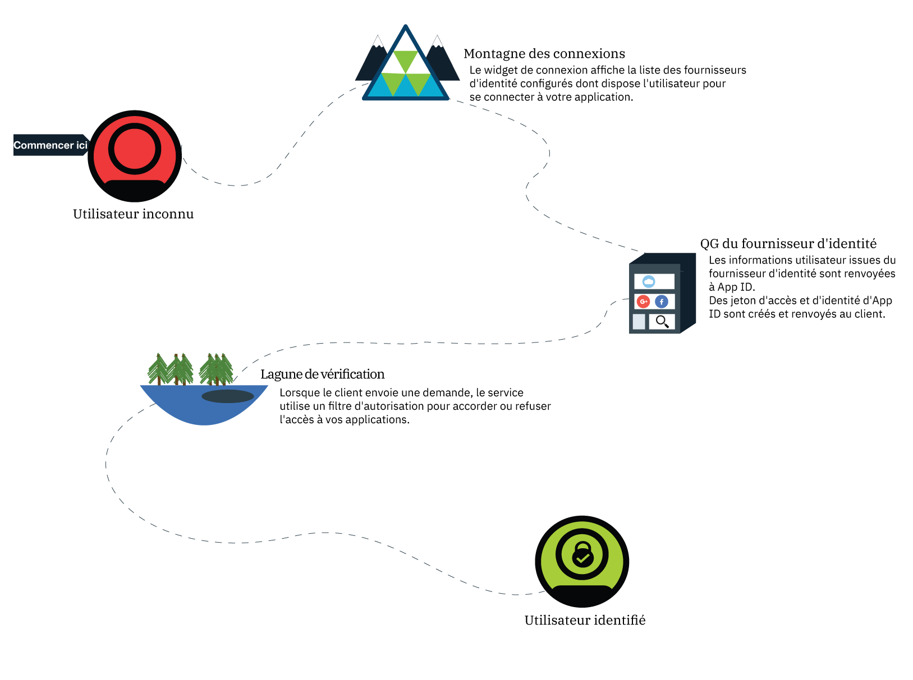
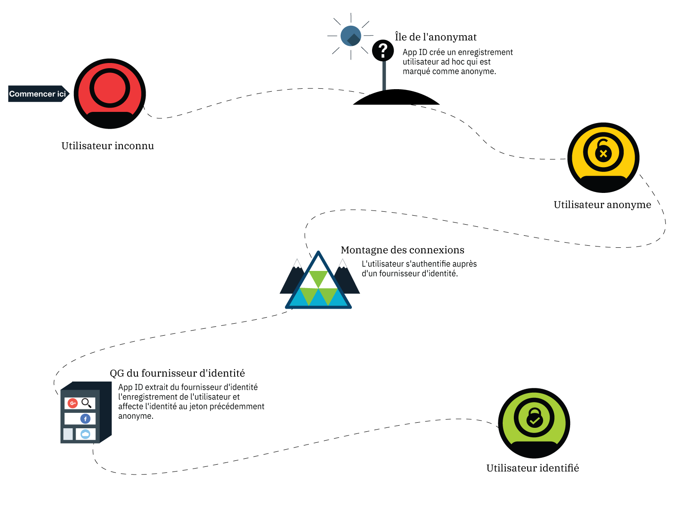

---

copyright:
  years: 2017, 2018
lastupdated: "2018-11-14"

---

{:new_window: target="_blank"}
{:shortdesc: .shortdesc}
{:pre: .pre}
{:tip: .tip}
{:screen: .screen}

# Authentification anonyme
{: #anonymous}

Lors du développement d'applications, la principale préoccupation est la sécurité. Comment garantir que seuls les utilisateurs dotés de l'accès requis utilisent votre application ? Vous devez faire appel à un processus d'autorisation. Dans la plupart des processus, l'autorisation et l'authentification sont couplées, ce qui peut compliquer les modifications au niveau de vos politiques de sécurité et fournisseurs d'identité. Avec {{site.data.keyword.appid_full}}, autorisation et authentification sont des processus séparés.
{: shortdesc}

Lorsqu'un utilisateur se connecte avec succès, il devient un utilisateur identifié. Le fournisseur d'identité renvoie des jetons d'accès et d'identité contenant ces informations sur l'utilisateur à {{site.data.keyword.appid_short}}. Le service prend les jetons fournis et détermine si l'utilisateur détient les données d'identification appropriées pour accéder à une application. Si les jetons sont validés, le service autorise l'accès de l'utilisateur à l'application. Les informations d'authentification sont associées au profil de l'utilisateur une fois qu'elles ont été autorisées. Un nouvel accès à ce profil et à ses attributs peut être effectué par n'importe quel client qui s'authentifie avec le même fournisseur d'identité.

## Authentification progressive
{: #progressive}

Avec {{site.data.keyword.appid_short_notm}}, un utilisateur anonyme peut choisir de devenir un utilisateur identifié.

Lorsqu'un utilisateur choisit de ne pas se connecter immédiatement, il est considéré comme étant un utilisateur anonyme. Ainsi, un utilisateur peut commencer immédiatement à ajouter des articles à un panier sans se connecter. Pour les utilisateurs anonymes, {{site.data.keyword.appid_short_notm}} crée un profil utilisateur ad hoc et appelle l'API de connexion OAuth, qui renvoie des jetons d'accès et d'identité anonymes. Grâce à ces jetons, l'application peut créer, lire, mettre à jour et supprimer les attributs stockés dans le profil utilisateur.

Lorsqu'un utilisateur anonyme se connecte, son jeton d'accès est transmis à l'API de connexion. Le service authentifie l'appel auprès d'un fournisseur d'identité. Le service utilise le jeton d'accès pour trouver le profil d'utilisateur anonyme, puis il lui associe l'identité. Les nouveaux jetons d'accès et d'identité contiennent les informations publiques partagées par le fournisseur d'identité. Une fois l'utilisateur identifié, son jeton d'accès anonyme n'est plus valide. L'utilisateur garde toutefois la faculté d'accéder à ses attributs, car ceux-ci sont accessibles avec le nouveau jeton.

Une identité peut être affectée à un profil anonyme uniquement si elle n'est pas déjà affectée à un autre utilisateur.
{: tip}

Si l'identité est déjà associée à un autre utilisateur {{site.data.keyword.appid_short_notm}}, les jetons contiennent les informations de ce profil utilisateur et donnent accès à ses attributs. Les attributs du précédent utilisateur anonyme ne sont pas accessibles via le nouveau jeton. Jusqu'à l'expiration du jeton, les informations sont toujours accessibles via le jeton d'accès anonyme. Lors du développement de votre application, vous pouvez choisir comment fusionner les attributs de l'utilisateur anonyme avec ceux de l'utilisateur connu.
