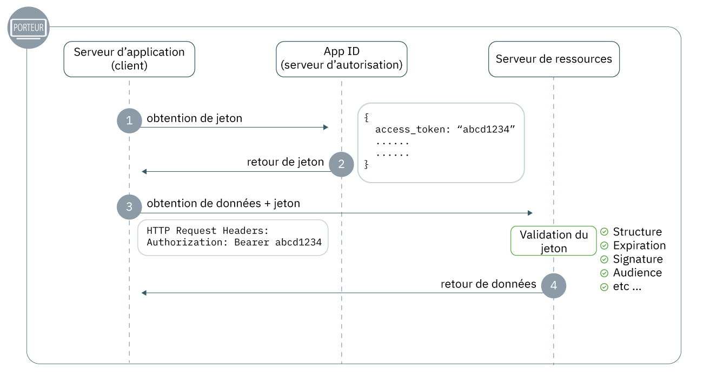

---

copyright:
  years: 2017, 2019
lastupdated: "2019-07-11"

keywords: Authentication, authorization, identity, app security, secure, development, access management, liberty, backend, java, token

subcollection: appid

---

{:external: target="_blank" .external}
{:shortdesc: .shortdesc}
{:screen: .screen}
{:pre: .pre}
{:table: .aria-labeledby="caption"}
{:codeblock: .codeblock}
{:tip: .tip}
{:note: .note}
{:important: .important}
{:deprecated: .deprecated}
{:download: .download}


# Application de back end : Liberty for Java
{: #backend-liberty}

Avec {{site.data.keyword.appid_short_notm}}, vous pouvez facilement protéger vos noeuds finaux d'API et assurer la sécurité de vos applications de back end. En utilisant ce guide, vous pourrez obtenir un flux d'authentification simple, opérationnel en moins de 20 minutes.
{: shortdesc}




1. Pour envoyer une demande à une ressource protégée, un client doit disposer d'un jeton d'accès. Dans l'étape 1, le client envoie une demande à {{site.data.keyword.appid_short_notm}} pour obtenir un jeton. Pour en savoir plus sur comment obtenir des jetons d'accès, voir [Obtention de jetons](/docs/services/appid?topic=appid-obtain-tokens).
2. {{site.data.keyword.appid_short_notm}} renvoie les jetons
3. A l'aide du jeton d'accès, le client effectue une demande d'accès à la ressource protégée.
4. La ressource valide le jeton, notamment, la structure, la date d'expiration, la signature, les utilisateurs concernés et toutes les autres zones présentes. Si le jeton n'est pas valide, le serveur de ressources refuse l'accès. Si la validation du jeton est concluante, il renvoie les données.


## Tutoriel vidéo
{: #backend-liberty-video}

Consultez la vidéo suivante pour voir comment utiliser {{site.data.keyword.appid_short_notm}} pour protéger une application Liberty for Java simple. Toutes les informations abordées dans cette vidéo sont également consultables sous forme écrite sur cette page.

<iframe class="embed-responsive-item" id="appid-liberty-backend-app" title="A propos de {{site.data.keyword.appid_short_notm}}" type="text/html" width="640" height="390" src="//www.youtube.com/embed/QA6DY2qqLaw?rel=0" frameborder="0" webkitallowfullscreen mozallowfullscreen allowfullscreen></iframe>

Vous n'avez pas d'application avec laquelle vous pouvez expérimenter le flux ? Pas de problème ! {{site.data.keyword.appid_short_notm}} fournit un [modèle d'application Liberty for Java simple](https://github.com/ibm-cloud-security/appid-video-tutorials/tree/master/02d-simple-liberty-backend-app).


## Avant de commencer
{: #liberty-before}

Avant de vous initier à {{site.data.keyword.appid_short_notm}} dans votre application de back end Liberty for Java, vous devez disposer des prérequis suivants :


* Une instance [du service {{site.data.keyword.appid_short_notm}}](https://cloud.ibm.com/catalog/services/app-id){: external}
* [L'interface de ligne de commande d'IBM Cloud](/docs/cli?topic=cloud-cli-getting-started)
* [Apache Maven 3.5+](https://maven.apache.org/download.cgi){: external}
* [Java 8+](https://www.java.com/download/){: external}
* La [collection Postman d'{{site.data.keyword.appid_short_notm}}](https://github.com/ibm-cloud-security/appid-postman){: external} pour effectuer des tests

## Etape 1 : Obtenir vos données d'identification
{: #liberty-obtain-credentials}

Vous pouvez obtenir vos données d'identification de deux manières au choix.

  * Accédez à l'onglet **Applications** du tableau de bord {{site.data.keyword.appid_short_notm}}. Si aucune application n'est encore répertoriée, cliquez sur **Ajouter une application** pour en créer une.

  * Envoyez une demande POST au [noeud final `/management/v4/{tenantId}/applications`](https://us-south.appid.cloud.ibm.com/swagger-ui/#!/Applications/registerApplication){: external}.

    Format de la demande :
    ```
    curl -X POST \  https://us-south.appid.cloud.ibm.com/management/v4/<tenantID>/applications/ \
    -H 'Content-Type: application/json' \
    -H 'Authorization: Bearer IAM_TOKEN' \
    -d '{"name": "ApplicationName"}'
    ```
    {: codeblock}

    Exemple de réponse :
    ```
    {
      "clientId": "xxxxx-34a4-4c5e-b34d-d12cc811c86d",
      "tenantId": "xxxxx-9b1f-433e-9d46-0a5521f2b1c4",
      "secret": "ZDk5YWZkYmYt*******",
      "name": "app1",
      "oAuthServerUrl": "https://us-south.appid.cloud.ibm.com/oauth/v4/xxxxx-9b1f-433e-9d46-0a5521f2b1c4",
      "profilesUrl": "https://us-south.appid.cloud.ibm.com",
      "discoveryEndpoint": "https://us-south.appid.cloud.ibm.com/oauth/v4/xxxxxx-9b1f-433e-9d46-0a5521f2b1c4/.well-known/openid-configuration"
    }
    ```
    {: screen}


## Etape 2 : Configurer votre fichier `server.xml`
{: #liberty-configure-server}
 
1. Ouvrez votre fichier `server.xml`.
2. Ajoutez les fonctions suivantes dans la section `featureManager`. Certaines fonctions peuvent être intégrées à Liberty. Si vous obtenez une erreur lors de l'exécution du serveur, vous pouvez les installer en exécutant `.installUtility install <name_of_server>` depuis le répertoire bin de votre installation Liberty.

    ```xml
    <featureManager>
        <feature>appSecurity-2.0</feature>
        <feature>openidConnectClient-1.0</feature>
        <feature>ssl-1.0</feature>
        <feature>servlet-3.1</feature>
    </featureManager>
    ```
    {: codeblock}

3. Configurez SSL en ajoutant ce qui suit à votre fichier `server.xml`. 

    ```xml
    <keyStore id="defaultKeyStore" password="{password}"/>
    <keyStore id="RootCA" password="{password}" location="${server.config.dir}/resources/security/{myTrustStore}"/>
    <ssl id="{sslID}" keyStoreRef="defaultKeyStore" trustStoreRef="{truststore-ref}"/>
    ```
    {: codeblock}

4. Créez une fonction Open ID Connect Client et définissez les espaces réservés suivants. Avec les données d'identification que vous avez obtenues, remplissez les espaces réservés.

    ```xml
    <openidConnectClient 
        id="oidc-client-simple-liberty-backend-app" 		
        inboundPropagation="required"
        jwkEndpointUrl="{region}.appid.cloud.ibm.com/oauth/v4/{tenantID}/publickeys"
        issuerIdentifier="{region).appid.cloud.ibm.com/oauth/v4/{tenantID}"
        signatureAlgorithm="RS256"
        audiences="{client-id}"
        sslRef="oidcClientSSL"
    /> 	
    ```
    {: codeblock}

    <table>
    <caption>Tableau. Variables d'élément OIDC pour les applications Liberty for Java</caption>
        <tr>
            <th colspan="2"> Description des variables d'élément OIDC </th>
        </tr>
        <tr>
            <td><code>id</code></td>
            <td>Nom de votre application.</td>
        </tr>
        <tr>
            <td><code>inboundPropagation</code></td>
            <td>Pour propager les informations reçues dans le jeton, la valeur doit être définie avec "required".</td>
        </tr>
        <tr>
            <td><code> jwkEndpointUrl </code></td>
            <td>Noeud final utilisé pour obtenir les clés permettant de valider le jeton. Les options de la région incluent : <code>au-syd</code>, <code>eu-de</code>, <code>eu-gb</code>, <code>jp-tok</code> et <code>us-south</code>. Vous pouvez rechercher votre ID titulaire dans les données d'identification que vous avez créées précédemment.</td>
        </tr>
        <tr>
            <td><code> issuerIdentifier </code></td>
            <td>Identificateur d'émetteur qui définit votre serveur d'autorisation. Les options de la région incluent : <code>au-syd</code>, <code>eu-de</code>, <code>eu-gb</code>, <code>jp-tok</code> et <code>us-south</code>. Vous pouvez rechercher votre ID titulaire dans les données d'identification que vous avez créées précédemment.</td>
        </tr>
        <tr>
            <td><code> signatureAlgorithm </code></td>
            <td>Spécifié en tant que "RS256".</td>
        </tr>
        <tr>
            <td><code>audiences</code></td>
            <td>Par défaut, le jeton est émis pour votre ID client {{site.data.keyword.appid_short_notm}} qui se trouve dans les données d'identification de votre application.</td>
        </tr>
        <tr>
            <td><code>sslRef</code></td>
            <td>Nom de la configuration SSL que vous souhaitez utiliser.</td>
        </tr>
    </table>

5. Définissez votre type de sujet spécial en tant que `ALL_AUTHENTICATED_USERS`.

    ```xml
    <application 
        id="simple-liberty-backend-app" 
        location="location-of-your-war-file" 
        name="simple-liberty-backend-app" 
        type="war">

        <application-bnd>
            <security-role name="myrole">
                <special-subject type="ALL_AUTHENTICATED_USERS"/>
            </security-role>
        </application-bnd>
    </application>
    ```
    {: codeblock}


## Etape 3 : Configurer votre fichier `web.xml`
{: #liberty-configure-web}

Dans votre fichier `web.xml`, définissez les zones de votre application que vous souhaitez sécuriser.

1. Définissez un rôle de sécurité. Il doit correspondre au rôle que vous avez défini dans le fichier `server.xml`.

    ```
    <security-role>
		<role-name>myrole</role-name>
	</security-role>
    ```
    {: codeblock}

2. Définissez une contrainte de sécurité.

    ```
	<security-constraint>
		<display-name>Security Constraints</display-name>
		<web-resource-collection>
			<web-resource-name>ProtectedArea</web-resource-name>
			<url-pattern>/api/*</url-pattern>
		</web-resource-collection>
		<auth-constraint>
			<role-name>myrole</role-name>
		</auth-constraint>
		<user-data-constraint>
			<transport-guarantee>NONE</transport-guarantee>
		</user-data-constraint>
	</security-constraint>
    ```
    {: codeblock}


## Etape 4 : Tester votre application
{: #liberty-test}

Maintenant que vous avez terminé l'installation initiale, générez l'application et testez votre configuration pour vous assurer que tout fonctionne comme prévu.

1. Accédez au répertoire de votre application.

2. Générez votre application.

    ```
    server run
    ```
    {: codeblock}

3. Envoyez une demande au noeud final protégé. Une erreur est renvoyée.

4. [Obtenez un jeton d'accès](/docs/services/appid?topic=appid-obtain-tokens).

5. Avec le jeton d'accès que vous avez obtenu à l'étape précédente, envoyez une demande au noeud final. Vous devez être en mesure d'accéder au noeud final protégé. Vérifiez que la réponse contient ce que vous attendez.


## Etapes suivantes
{: #liberty-next}

Prêt à perfectionner votre expérience d'authentification ? Parcourez [ce blogue](https://www.ibm.com/cloud/blog/perfecting-the-login-experience-with-liberty-oauth2-and-appid){: external} ou essayez d'en savoir plus sur la [communication d'application à application](/docs/services/appid?topic=appid-app).


