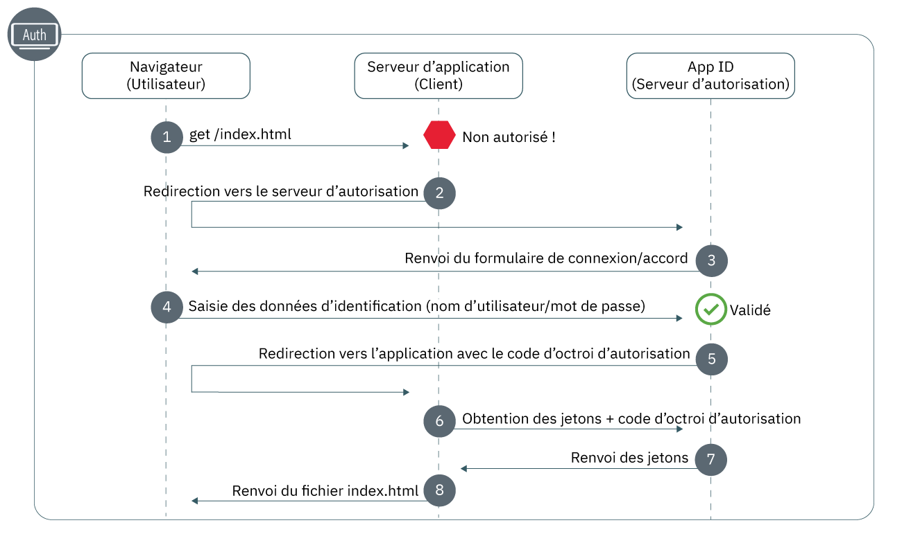

---

copyright:
  years: 2017, 2019
lastupdated: "2019-07-11"

keywords: Authentication, authorization, identity, app security, secure, development, nodejs, frontend, web apps, 

subcollection: appid

---

{:external: target="_blank" .external}
{:shortdesc: .shortdesc}
{:screen: .screen}
{:pre: .pre}
{:table: .aria-labeledby="caption"}
{:codeblock: .codeblock}
{:tip: .tip}
{:note: .note}
{:important: .important}
{:deprecated: .deprecated}
{:download: .download}


# Web : Node.js
{: #web-node}

Avec {{site.data.keyword.appid_short_notm}}, vous pouvez facilement protéger vos applications Web de front end. En utilisant ce guide, vous pourrez obtenir un flux d'authentification simple, opérationnel en moins de 20 minutes.
{: shortdesc}

Consultez le diagramme suivant pour voir le flux de travaux de code d'autorisation OAuth 2.0.



1. Un utilisateur tente d'accéder à votre application Web protégée sans y être autorisé.
2. Votre application redirige l'utilisateur sur {{site.data.keyword.appid_short_notm}}.
3. {{site.data.keyword.appid_short_notm}} affiche un signe à l'écran que l'utilisateur peut utiliser pour s'authentifier.
4. Il saisit ses données d'identification, comme par exemple un nom d'utilisateur et un mot de passe. App ID valide ces données.
5. {{site.data.keyword.appid_short_notm}} redirige l'utilisateur sur votre application avec un code d'octroi d'autorisation.
6. En utilisant ce code, votre application effectue une demande à {{site.data.keyword.appid_short_notm}} pour s'assurer que l'utilisateur est validé. Pour en savoir plus sur comment obtenir des jetons d'accès, voir [Obtention de jetons](/docs/services/appid?topic=appid-obtain-tokens).
7. {{site.data.keyword.appid_short_notm}} renvoie des jetons d'accès et d'identité pour l'utilisateur validé.
8. L'accès à votre application est alors accordé à cet utilisateur.


## Tutoriel vidéo
{: #web-node-video}

Consultez la vidéo suivante pour voir comment utiliser {{site.data.keyword.appid_short_notm}} pour protéger une application Web Node.js simple. Toutes les informations abordées dans cette vidéo sont également consultables sous forme écrite sur cette page.

<iframe class="embed-responsive-item" id="appid-web-node" title="A propos des applications {{site.data.keyword.appid_short_notm}} Node.js" type="text/html" width="640" height="390" src="//www.youtube.com/embed/6roa1ZOvwtw?rel=0" frameborder="0" webkitallowfullscreen mozallowfullscreen allowfullscreen></iframe>

Vous n'avez pas d'application avec laquelle vous pouvez expérimenter le flux ? Pas de problème ! {{site.data.keyword.appid_short_notm}} fournit [un modèle d'application Web Node.js simple](https://github.com/ibm-cloud-security/appid-video-tutorials/tree/master/02a-simple-node-web-app){: external}.

 

## Avant de commencer
{: #web-node-before}

Avant de vous initier à {{site.data.keyword.appid_short_notm}} dans vos applications Web Node.js, vous devez disposer des prérequis suivants.
{: shortdesc}

* Une instance [du service {{site.data.keyword.appid_short_notm}}](https://cloud.ibm.com/catalog/services/app-id){: external}
* [L'interface de ligne de commande d'IBM Cloud](/docs/cli?topic=cloud-cli-getting-started)
* [NPM version 4+](https://www.npmjs.com/get-npm){: external}
* [Node version 6+](https://nodejs.org/en/download/){: external}


## Etape 1 : Enregistrer votre URI de redirection
{: #node-web-redirect-uri}

Un URI de redirection est le noeud final de rappel de votre application. Au cours du flux de connexion, {{site.data.keyword.appid_short_notm}} valide les URI avant d'autoriser les clients à participer au flux de travaux d'autorisation ce qui protège des attaques par hameçonnage et des fuites de code d'octroi d'autorisation. En enregistrant votre URI, vous dites à {{site.data.keyword.appid_short_notm}} que l'URI est fiable et qu'il est possible de rediriger vos utilisateurs.
{: shortdesc}

1. Cliquez sur **Gérer l'authentification > Paramètres d'authentification**.

2. Dans la zone **Ajouter un URI de redirection Web**, entrez l'URI. Chaque URI doit commencer par `http://` ou `https://` et inclure le chemin d'accès complet, y compris les paramètres de requête pour que la redirection aboutisse.

3. Cliquez sur le signe **+** dans la case **Ajouter des URI de redirection Web**.

4. Répétez les étapes 1 à 3 jusqu'à avoir ajouté tous les URI possibles à votre liste.


## Etape 2 : Obtenir vos données d'identification
{: #node-web-credentials}

Vous pouvez obtenir vos données d'identification de deux manières au choix.
{: shortdesc}

  * Accédez à l'onglet **Applications** du tableau de bord {{site.data.keyword.appid_short_notm}}. Si aucune application n'est encore répertoriée, cliquez sur **Ajouter une application** pour en créer une.

  * Envoyez une demande POST au noeud final [`/management/v4/{tenantId}/applications`](https://us-south.appid.cloud.ibm.com/swagger-ui/#!/Applications/registerApplication).

    Format de la demande :
    ```javascript
    curl -X POST \  https://us-south.appid.cloud.ibm.com/management/v4/39a37f57-a227-4bfe-a044-93b6e6060b61/applications/ \
    -H 'Content-Type: application/json' \
    -H 'Authorization: Bearer IAM_TOKEN' \
    -d '{"name": "ApplicationName"}'
    ```
    {: codeblock}

    Exemple de réponse :
    ```javascript
    {
      "clientId": "xxxxx-34a4-4c5e-b34d-d12cc811c86d",
      "tenantId": "xxxxx-9b1f-433e-9d46-0a5521f2b1c4",
      "secret": "ZDk5YWZkYmYt*******",
      "name": "app1",
      "oAuthServerUrl": "https://us-south.appid.cloud.ibm.com/oauth/v4/xxxxx-9b1f-433e-9d46-0a5521f2b1c4",
      "profilesUrl": "https://us-south.appid.cloud.ibm.com",
      "discoveryEndpoint": "https://us-south.appid.cloud.ibm.com/oauth/v4/xxxxxx-9b1f-433e-9d46-0a5521f2b1c4/.well-known/openid-configuration"
    }
    ```
    {: screen}


## Etape 3 : Initialiser le logiciel SDK
{: #web-node-install}

Le moyen le plus facile d'utiliser {{site.data.keyword.appid_short_notm}} est de tirer parti du logiciel SDK Node.JS.
{: shortdesc}


1. A l'aide de la ligne de commande, accédez au répertoire contenant votre application Node.js.

2. Installez les configurations requises NPM suivantes.

    ```javascript
    npm install --save express express-session passport
    ```
    {: codeblock}

3. Installez le service {{site.data.keyword.appid_short_notm}}.

    ```javascript
    npm install --save ibmcloud-appid
    ```
    {: codeblock}

4. Ajoutez les configurations requises suivantes dans votre fichier `server.js`.

    ```javascript
    const express = require('express'); 								// https://www.npmjs.com/package/express
    const session = require('express-session');							// https://www.npmjs.com/package/express-session
    const passport = require('passport');								// https://www.npmjs.com/package/passport
    const WebAppStrategy = require('ibmcloud-appid').WebAppStrategy;	// https://www.npmjs.com/package/ibmcloud-appid
    ```
    {: shortdesc}

5. Configurez votre application pour utiliser le middleware express-session en utilisant les données d'identification que vous avez obtenues à l'étape 1. Vous pouvez choisir de formater votre URI de redirection de deux manières au choix. Manuellement à l'aide d'un nouveau paramètre `WebAppStrategy({redirectUri: "...."})` ou en définissant la valeur sous forme de variable d'environnement dans l'exemple de code.

    ```javascript
    const app = express();
    app.use(session({
        secret: '123456',
        resave: true,
        saveUninitialized: true
    }));
    app.use(passport.initialize());
    app.use(passport.session());
    passport.serializeUser((user, cb) => cb(null, user));
    passport.deserializeUser((user, cb) => cb(null, user));
    passport.use(new WebAppStrategy({
        tenantId: "<tenant_ID>",
        clientId: "<client_ID>",
        secret: "<secret>",
        oauthServerUrl: "<OAuth_Server_URL>",
        redirectUri: "<redirect_URI>"
    }));
    ```
    {: codeblock}

    Vous devez configurer le middleware avec le stockage de session approprié pour les environnements de production. Pour plus d'informations, voir la <a href="https://github.com/expressjs/session" target="_blank">documentation express.js</a>.
    {: note}


## Etape 4 : Protéger votre application
{: #node-web-protect}

Maintenant qu'{{site.data.keyword.appid_short_notm}} est installé, vous êtes prêt à protéger votre application. Vous pouvez choisir de protéger votre application complète ou uniquement des ressources spécifiques en définissant une stratégie d'application Web.
{: shortdesc}


1. Configurez le noeud final de rappel. Le rappel termine le processus d'autorisation en récupérant des jetons d'accès et d'identité auprès d'App ID et en redirigeant l'utilisateur vers l'un des emplacements suivants :<ul><li>L'URL d'origine de la demande ayant déclenché l'authentification, telle qu'elle a été conservée dans la session HTTP : `WebAppStrategy.ORIGINAL_URL`.</li><li>Indiquer une URL de redirection dans l'éventualité d'une authentification réussie.</li><li>La racine de l'application (`/`) comme illustré dans l'étape suivante.</li></ul>

    ```javascript
    app.get(CALLBACK_URL, passport.authenticate(WebAppStrategy.STRATEGY_NAME));
    ```
    {: codeblock}

2. Définissez un noeud final de connexion qui redirige toujours un navigateur vers le widget de connexion. Veillez à ajouter une option de redirection réussie pour ne pas tomber dans une boucle d'authentification sans fin.

    ```javascript
    app.get('/appid/login', passport.authenticate(WebAppStrategy.STRATEGY_NAME, {
        successRedirect: '/',
        forceLogin: true
    }));
    ```
    {: codeblock}

3. Configurez la déconnexion. Lorsqu'un utilisateur se déconnecte de votre application, toutes ses informations d'authentification sont effacées de cette session. Pour interagir avec votre application, il faudra qu'il se reconnecte.

    ```javascript
    app.get('/appid/logout', function(req, res){
        webappstrategy.logout(req);
        res.redirect('/');
    });
    ```
    {: shortdesc}

## Etape 5 : Personnaliser votre application
{: #node-web-user-info}

Vous pouvez extraire des informations fournies par vos fournisseurs d'identité pour personnaliser votre expérience de l'application.
{: shortdesc}

1. Configurez votre application pour obtenir des informations utilisateur. `protected` est une variable d'espace réservé que vous pouvez remplacer pour qu'elle corresponde au noeud final de votre application.

    ```javascript
    app.get("/protected", passport.authenticate(WebAppStrategy.STRATEGY_NAME), function(req, res){
        res.json(req.user);
    });
    ```
    {: codeblock}

    Par exemple, dans le modèle d'application, vous pouvez voir comment obtenir les noms des utilisateurs pour personnaliser votre application.
    ```javascript
    app.get('/api/user', (req, res) => {
        // console.log(req.session[WebAppStrategy.AUTH_CONTEXT]);
        res.json({
            user: {
                name: req.user.name
            }
        });
    });
    ```
    {: codeblock}


## Etape 6 : Tester votre configuration
{: #node-web-test}

Pour tester votre configuration d'autorisation, accédez à l'URL sur laquelle votre serveur est à l'écoute telle qu'elle est définie dans votre application. Essayez de vous connecter et de vous déconnecter. Vérifiez que la configuration fonctionne comme prévu. 

Lorsque vous êtes prêt à passer à l'étape suivante, vous pouvez essayer d'activer l'[authentification multi-facteur pour Cloud Directory](/docs/services/appid?topic=appid-cd-mfa) ou d'ajouter des [attributs personnalisés](/docs/services/appid?topic=appid-profiles) pour continuer à personnaliser votre application.


