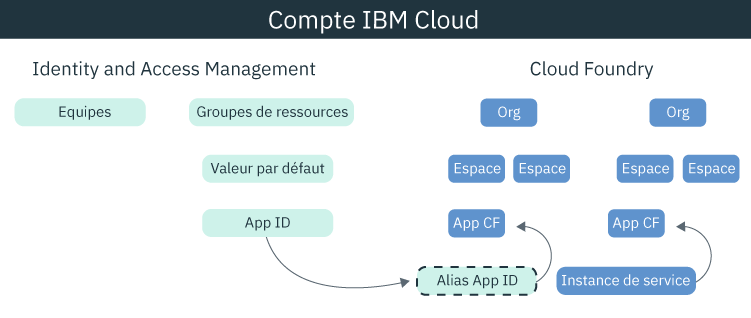

---

copyright:
  years: 2017, 2019
lastupdated: "2019-07-09"

keywords: Authentication, authorization, identity, app security, secure, development, cloud foundry, access management, iam, java, node.js

subcollection: appid

---

{:external: target="_blank" .external}
{:shortdesc: .shortdesc}
{:screen: .screen}
{:pre: .pre}
{:table: .aria-labeledby="caption"}
{:codeblock: .codeblock}
{:tip: .tip}
{:note: .note}
{:important: .important}
{:deprecated: .deprecated}
{:download: .download}


# Tutoriel : Configuration de Cloud Foundry pour utilisation d'{{site.data.keyword.appid_short_notm}}
{: #cloud-foundry}

Avec {{site.data.keyword.cloud_notm}}, vous pouvez protéger vos applications à l'aide de deux types différents de gestion des accès, IAM (Identity and Access Management) et Cloud Foundry. Par défaut, toutes les nouvelles instances {{site.data.keyword.appid_short_notm}} utilisent des groupes de ressources IAM pour gérer les accès. Si vous utilisez Cloud Foundry pour gérer votre application, vous pouvez relier les modèles de gestion en créant un alias de service et en liant le service à l'application.
{: shortdesc}


## Présentation de Cloud Foundry
{: #cf-understand}

Un alias crée une connexion entre votre service géré par IAM tel {{site.data.keyword.appid_short_notm}} et votre application Cloud Foundry. Lorsque vous liez une application, des données d'identification de service sont créées et automatiquement transmises à l'application. Même si la liaison est une étape obligatoire de la configuration, elle présente les avantages suivants :

* Automatisation : les données d'identification du service étant stockées dans la variable d'environnement VCAP_SERVICES, vous n'avez plus besoin de les copier manuellement dans l'application. Les logiciels SDK d'{{site.data.keyword.appid_short_notm}} se chargent de tout pour vous automatiquement.
* Sûreté : le processus de configuration est infaillible car il est automatique.
* Sécurité : rien de ce qui est lié à l'accès n'est codé en dur dans votre application car les informations d'identification du service n'existent que dans les variables d'environnement.

Votre application Cloud Foundry est hébergée sur une autre plateforme ? Pas de problème. Vous pouvez définir des droits d'accès à l'application dans votre application pour la lier au service. Vous trouverez les droits d'accès de l'application dans le tableau de bord {{site.data.keyword.appid_short_notm}} ou en envoyant une demande au [/noeuds final des applications](https://us-south.appid.cloud.ibm.com/swagger-ui/#!/Applications/registerApplication).
{: tip}

Découvrez dans le diagramme suivant comment les modèles s'assemblent :



## Avant de commencer
{: #cf-before}

Avant de commencer, assurez-vous de disposer des prérequis suivants :

* Un compte {{site.data.keyword.cloud_notm}}
* Une instance d'{{site.data.keyword.appid_short_notm}}
* L'[interface de ligne de commande d'{{site.data.keyword.cloud_notm}}](/docs/cli?topic=cloud-cli-getting-started) installée localement

## Déploiement d'une application Node.js
{: #cf-node}


1. Accédez à votre instance {{site.data.keyword.appid_short_notm}}.

2. Cliquez sur **Télécharger un exemple** dans l'onglet **Présentation** du tableau de bord du service.

3. Cliquez sur **Node.js**. Téléchargez et décompressez le fichier d'exemple d'application.

4. Vérifiez que vous disposez de tous les prérequis nécessaires à Node.js.

5. Ouvrez le terminal et accédez au dossier de l'exemple.

6. Connectez-vous à l'interface de ligne de commande {{site.data.keyword.cloud_notm}}. L'interface de ligne de commande vous invite à sélectionner un compte et une région si vous ne l'avez pas indiquée.

  ```
  ibmcloud login -a cloud.ibm.com -r <region>
  ```
  {: codeblock}

  <table>
    <tr>
      <th>Région</th>
      <th>Noeud final</th>
    </tr>
    <tr>
      <td>Dallas</td>
      <td><code>us-south</code></td>
    </tr>
    <tr>
      <td>Francfort</td>
      <td><code>eu-de</code></td>
    </tr>
    <tr>
      <td>Sydney</td>
      <td><code>au-syd</code></td>
    </tr>
    <tr>
      <td>Londres</td>
      <td><code>eu-gb</code></td>
    </tr>
    <tr>
      <td>Tokyo</td>
      <td><code>jp-tok</code></td>
    </tr>
  </table>

7. Ciblez l'espace et l'organisation Cloud Foundry dans lesquels vous voulez travailler et suivez les invites pour cibler une organisation et un espace.

  ```
  ibmcloud target --cf
  ```
  {: codeblock}

8. Créez un alias de l'instance de service {{site.data.keyword.appid_short_notm}}.

  ```
  ibmcloud resource service-alias-create {ALIAS_NAME} --instance-name {SERVICE_INSTANCE_NAME}
  ```
  {: codeblock}

9. Ajoutez l'alias que vous avez créé dans vos services dans le fichier `manifest.yml`.

10. Liez les services répertoriés dans le fichier `manifest.yml` en déployant l'exemple d'application.

  ```
  ibmcloud app push
  ```
  {: codeblock}

## Déploiement d'une application Java
{: #java}

1. Accédez à votre instance {{site.data.keyword.appid_short_notm}}.

2. Cliquez sur **Télécharger un exemple** dans l'onglet **Présentation** du tableau de bord du service.

3. Cliquez sur **Java**. Téléchargez et décompressez le fichier d'exemple d'application.

4. Vérifiez que vous disposez de tous les prérequis nécessaires à Java.

5. Ouvrez le terminal et accédez au dossier de l'exemple.

6. Générez votre fichier `war` et téléchargez-le.

  ```
  mvn clean install
  ```
  {: codeblock}

7. Accédez au dossier Liberty.

8. Connectez-vous à l'interface de ligne de commande {{site.data.keyword.cloud_notm}}. L'interface de ligne de commande vous invite à sélectionner un compte et une région si vous ne l'avez pas indiquée.

  ```
  ibmcloud login -a cloud.ibm.com -r <region>
  ```
  {: codeblock}

8. Ciblez l'espace et l'organisation Cloud Foundry dans lesquels vous voulez travailler et suivez les invites pour cibler une organisation et un espace.

  ```
  ibmcloud target --cf
  ```
  {: codeblock}

10. Créez un alias de l'instance de service {{site.data.keyword.appid_short_notm}}.

  ```
  ibmcloud resource service-alias-create {ALIAS_NAME} --instance-name {SERVICE_INSTANCE_NAME}
  ```
  {: codeblock}

11. Ajoutez l'alias que vous avez créé dans vos services dans le fichier `manifest.yml`.

  Exemple :
  ```
    applications:
  - name: ApplicationName
    memory: 512M
    services:
    - AppID-alias
  ```
  {: screen}

13. Liez les services répertoriés dans le fichier `manifest.yml` en déployant l'exemple d'application.

  ```
  ibmcloud app push
  ```
  {: codeblock}

