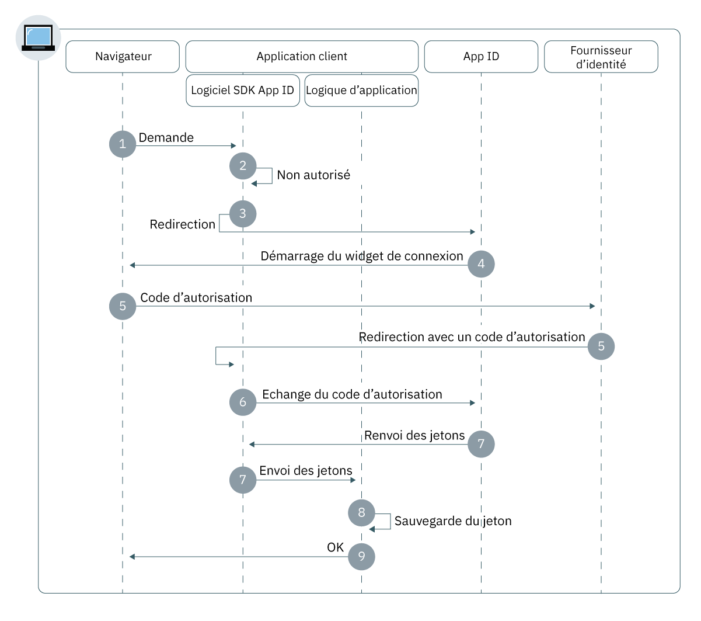

---

copyright:
  years: 2017, 2019
lastupdated: "2019-04-04"

keywords: authentication, authorization, identity, app security, secure, web apps, client, server

subcollection: appid

---

{:new_window: target="_blank"}
{:shortdesc: .shortdesc}
{:screen: .screen}
{:pre: .pre}
{:table: .aria-labeledby="caption"}
{:codeblock: .codeblock}
{:tip: .tip}
{:note: .note}
{:important: .important}
{:deprecated: .deprecated}
{:download: .download}


# Applications Web
{: #web-apps}

Avec {{site.data.keyword.appid_full}}, vous pouvez rapidement construire une couche d'authentification pour vos applications Web.
{: shortdesc}

## Comprendre le flux
{: #web-understanding}

**Dans quelles circonstances ce flux est-il utile ?**

Lorsque vous développez une application Web, vous pouvez utiliser le flux Web {{site.data.keyword.appid_short_notm}} pour authentifier les utilisateurs en toute sécurité. Les utilisateurs peuvent ensuite accéder au contenu protégé côté serveur de vos applications Web.

**Quelle est la base technique du flux ?**

Les applications Web exigent souvent que les utilisateurs s'authentifient pour pouvoir accéder au contenu protégé. {{site.data.keyword.appid_short_notm}} utilise le flux de code d'autorisation OIDC pour authentifier les utilisateurs de manière sécurisée. Avec ce flux, l'application reçoit un code d'autorisation lorsqu'un utilisateur est authentifié. Ce code est ensuite échangé contre des jetons d'accès, d'identité et d'actualisation. Lors de l'étape d'échange de code, les jetons sont toujours envoyés via un canal de retour sécurisé entre l'application et le serveur OIDC. Cela permet d'avoir une couche de sécurité supplémentaire et empêche les pirates d'intercepter les jetons. Ces jetons peuvent être envoyés directement à l'application d'hébergement du serveur Web pour l'authentification d'utilisateur.

**Comment fonctionne ce flux ?**



1. Un utilisateur lance le flux d'autorisation en envoyant une demande au noeud final `/authorization` via le logiciel SDK ou l'API {{site.data.keyword.appid_short_notm}}.

2. Si l'utilisateur n'est pas autorisé, le flux d'authentification est démarré et redirigé vers {{site.data.keyword.appid_short_notm}}.

3. Selon les paramètres de demande `/authorization` de l'utilisateur ou la configuration du fournisseur d'identité, il lance le widget de connexion dans le navigateur de l'utilisateur.

4. L'utilisateur choisit un fournisseur d'identité pour l'authentification et effectue le processus de connexion.

5. Le fournisseur d'identité redirige vers l'application client avec le code d'autorisation.

6. Le logiciel SDK {{site.data.keyword.appid_short_notm}} échange le code d'autorisation contre des jetons d'accès et d'identité ainsi que des jetons d'actualisation facultatifs à partir du service {{site.data.keyword.appid_short_notm}}.

7. Les jetons sont sauvegardés par le logiciel SDK {{site.data.keyword.appid_short_notm}} et redirigés vers l'application client.

8. L'utilisateur est autorisé à accéder à l'application.


## Configuration du logiciel SDK Node.js
{: #web-configuring-nodejs}

Vous pouvez configurer {{site.data.keyword.appid_short_notm}} pour qu'il fonctionne avec vos applications Web Node.js.
{: shortdesc}

**Avant de commencer**

Vous devez disposer des prérequis suivants :

* Une instance du service {{site.data.keyword.appid_short_notm}}
* Un ensemble de données d'identification du service
* NPM version 4 ou ultérieure
* Noeud version 6 ou ultérieure
* Votre URI de redirection défini dans le tableau de bord du service {{site.data.keyword.appid_short_notm}}


### Installation du logiciel SDK Node.js
{: #web-nodejs-install}

1. A l'aide de la ligne de commande, accédez au répertoire contenant votre application Node.js.

2. Installez le service {{site.data.keyword.appid_short_notm}}.

  ```bash
  npm install --save ibmcloud-appid
  ```
  {: pre}

### Initialisation du logiciel SDK Node.js
{: #web-nodejs-initialize}

1. Ajoutez les définitions `require` suivantes à votre fichier `server.js` :

  ```javascript
  const express = require('express');
    const session = require('express-session')
    const passport = require('passport');
    const WebAppStrategy = require("ibmcloud-appid").WebAppStrategy;
    const CALLBACK_URL = "/ibm/cloud/appid/callback";
  ```
  {: pre}

2. Configurez votre application Express pour qu'elle utilise le middleware express-session.

  ```javascript
  const app = express();
    app.use(session({
        secret: "123456",
        resave: true,
        saveUninitialized: true
        }));
    app.use(passport.initialize());
    app.use(passport.session());
  ```
  {: pre}

  Vous devez configurer le middleware avec le stockage de session approprié pour les environnements de production. Pour plus d'informations, voir la <a href="https://github.com/expressjs/session" target="_blank">documentation express.js</a>.
  {: note}

3. Procurez-vous vos données d'identification de l'une des manières suivantes :

  * Accédez à l'onglet **Applications** du tableau de bord {{site.data.keyword.appid_short_notm}}. Si aucune application n'est répertoriée, cliquez sur **Ajouter une application** pour en créer une.

  * Envoyez une requête POST au noeud final [`/management/v4/{tenantId}/applications`](https://us-south.appid.cloud.ibm.com/swagger-ui/#/Management%20API%20-%20Applications/mgmt.registerApplication).

    Format de la requête :
    ```
    curl -X POST \  https://us-south.appid.cloud.ibm.com/management/v4/39a37f57-a227-4bfe-a044-93b6e6060b61/applications/ \
    -H 'Content-Type: application/json' \
    -H 'Authorization: Bearer IAM_TOKEN' \
    -d '{"name": "ApplicationName"}'
    ```
    {: pre}

    Exemple de réponse :
    ```
    {
    "clientId": "111c22c3-38ea-4de8-b5d4-338744d83b0f",
    "tenantId": "39a37f57-a227-4bfe-a044-93b6e6060b61",
    "secret": "ZmE5ZDQ5ODctMmA1ZS00OGRiLWExZDMtZTA1MjkyZTc4MDB4",
    "name": "ApplicationName",
    "oAuthServerUrl": "https://us-south.appid.cloud.ibm.com/oauth/v4/39a37f57-a227-4bfe-a044-93b6e6060b61"
    }
    ```
    {: screen}

4. Facultatif : déterminez comment formater votre URI de redirection. La redirection peut être formatée de deux manières différentes :

  * Manuellement, dans la nouvelle valeur `WebAppStrategy({redirectUri: "...."})`
  * En tant que variable d'environnement nommée `redirectUri`

  Si aucune de ces options n'est fournie, le logiciel SDK {{site.data.keyword.appid_short_notm}} tente d'extraire l'URI `application_uri` de l'application s'exécutant sous {{site.data.keyword.cloud_notm}} et d'ajouter le suffixe par défaut `/ibm/cloud/appid/callback`.

5. En utilisant les informations obtenues aux étapes précédentes, initialiser le logiciel SDK.

  ```javascript
    passport.use(new WebAppStrategy({
    	  tenantId: "{tenant-id}",
   	    clientId: "{client-id}",
      	secret: "{secret}",
      	oauthServerUrl: "{oauth-server-url}",
      	redirectUri: "{app-url}" + CALLBACK_URL
      }));
  ```
  {: pre}

6. Configurez passport avec la sérialisation et la désérialisation. Cette étape de configuration est requise pour la persistance de session authentifiée dans les demandes HTTP. Pour plus d'informations, voir la <a href="http://passportjs.org/docs" target="_blank">documentation de passport </a>.

  ```javascript
  passport.serializeUser(function(user, cb) {
    cb(null, user);
    });

  passport.deserializeUser(function(obj, cb) {
    cb(null, obj);
    });
  ```
  {: pre}

5. Ajoutez le code suivant à votre fichier `server.js` pour émettre les redirections de service.

   ```javascript
   app.get(CALLBACK_URL, passport.authenticate(WebAppStrategy.STRATEGY_NAME));
   ```
   {: pre}

6. Enregistrez votre noeud final protégé.

   ```javascript
   app.get(‘/protected’, passport.authenticate(WebAppStrategy.STRATEGY_NAME), function(req, res) {res.json(req.user); });
   ```
   {: pre}

Pour plus d'informations, voir le <a href="https://github.com/ibm-cloud-security/appid-serversdk-nodejs" target="_blank">référentiel GitHub Node.js pour {{site.data.keyword.appid_short_notm}} </a>.


## Configuration du logiciel SDK Liberty for Java
{: #web-configuring-liberty}

Vous pouvez configurer {{site.data.keyword.appid_short_notm}} pour qu'il fonctionne avec vos applications Web Liberty for Java.
{:shortdesc}

**Avant de commencer**

Vous devez disposer des prérequis suivants :
* Une instance du service {{site.data.keyword.appid_short_notm}}
* Un ensemble de données d'identification du service
* Apache Maven version 3.5 ou ultérieure
* Java 1.8
* Application Web Liberty for Java

### Installation du logiciel SDK Liberty for Java
{: #web-liberty-install}

1. Ajoutez une fonction OpenID Connect à votre fichier `server.xml`.

  ```xml
  <featureManager>
      <feature>ssl-1.0</feature>
      <feature>appSecurity-2.0</feature>
      <feature>openidConnectClient-1.0</feature>
  </featureManager>
  ```
  {: pre}

2. Procurez-vous vos données d'identification de l'une des manières suivantes :

  * Accédez à l'onglet **Applications** du tableau de bord {{site.data.keyword.appid_short_notm}}. Si aucune application n'est encore répertoriée, cliquez sur **Ajouter une application** pour en créer une.

  * Envoyez une requête POST au noeud final [`/management/v4/{tenantId}/applications`](https://us-south.appid.cloud.ibm.com/swagger-ui/#!/Applications/registerApplication).

    Format de la requête :
    ```
    curl -X POST \  https://us-south.appid.cloud.ibm.com/management/v4/39a37f57-a227-4bfe-a044-93b6e6060b61/applications/ \
    -H 'Content-Type: application/json' \
    -H 'Authorization: Bearer IAM_TOKEN' \
    -d '{"name": "ApplicationName"}'
    ```
    {: pre}

    Exemple de réponse :
    ```
    {
    "clientId": "111c22c3-38ea-4de8-b5d4-338744d83b0f",
    "tenantId": "39a37f57-a227-4bfe-a044-93b6e6060b61",
    "secret": "ZmE5ZDQ5ODctMmA1ZS00OGRiLWExZDMtZTA1MjkyZTc4MDB4",
    "name": "ApplicationName",
    "oAuthServerUrl": "https://us-south.appid.cloud.ibm.com/oauth/v4/39a37f57-a227-4bfe-a044-93b6e6060b61"
    }
    ```
    {: screen}

3. Créez une fonction Open ID Connect Client et définissez les espaces réservés suivants. Utilisez les données d'identification du service pour remplir les espaces réservés.

  ```xml
  <openidConnectClient
    clientId='{{site.data.keyword.appid_short_notm}} client_ID'
    clientSecret='{{site.data.keyword.appid_short_notm}} Secret'
    authorizationEndpointUrl='oauthServerUrl/authorization'
    tokenEndpointUrl='oauthServerUrl/token'
    jwkEndpointUrl='oauthServerUrl/publickeys'
    issuerIdentifier='Changed according to the region'
    tokenEndpointAuthMethod="basic"
    signatureAlgorithm="RS256"
    authFilterid="myAuthFilter"
    trustAliasName="ibm.com"
  />
  ```
  {: pre}

  <table>
  <caption>Tableau. Variables d'élément OIDC pour les applications Liberty for Java</caption>
    <tr>
      <th> Composant </th>
      <th> Description </th>
    </tr>
    <tr>
    <td><code>clientID</code> </br> <code>secret</code> </br> <code>oauth-server-url</code> </br></td>
    <td>Effectuez l'étape 2 pour obtenir vos données d'identification du service.</td>
    </tr>
    <tr>
      <td><code> authorizationEndpointURL </code></td>
      <td> Ajoutez <code>/authorization</code> à la fin de <code>oauthServerURL</code>.</td>
    </tr>
    <tr>
      <td><code> tokenEndpointUrl </code></td>
      <td>Ajoutez <code>/token</code> à la fin de <code>oauthServerURL</code>.</td>
    </tr>
    <tr>
      <td><code> jwkEndpointUrl </code></td>
      <td>Ajoutez <code>/publickeys</code> à la fin de <code>oauthServerURL</code>.</td>
    </tr>
    <tr>
      <td><code> issuerIdentifier </code></td>
      <td>L'identificateur d'émetteur est au format suivant : <code>&lt;region>&gt;.cloud.ibm.com</code>. Les options de la région incluent : <code>au-syd</code>, <code>eu-de</code>, <code>eu-gb</code>, <code>jp-tok</code> et <code>us-south</code>.</td>
    </tr>
    <tr>
      <td><code> tokenEndpointAuthMethod </code></td>
      <td>Spécifié en tant que "basic".</td>
    </tr>
    <tr>
      <td><code> signatureAlgorithm </code></td>
      <td>Spécifié en tant que "RS256".</td>
    </tr>
    <tr>
      <td><code> authFilterid </code></td>
      <td>Liste des ressources à protéger.</td>
    </tr>
    <tr>
      <td><code> trustAliasName </code></td>
      <td>Nom de votre certificat dans le magasin de clés de confiance.</td>
    </tr>
  </table>

### Initialisation du logiciel SDK Liberty for Java
{: #web-liberty-initialize}

1. Dans votre fichier `server.xml`, définissez un filtre d'autorisation pour spécifier des ressources protégées. Si aucun filtre n'est <a href="https://www.ibm.com/support/knowledgecenter/en/SSD28V_8.5.5/com.ibm.websphere.wlp.core.doc/ae/rwlp_auth_filter.html" target="_blank">défini </a>, le service protège toutes les ressources.

  ```xml
  <authFilter id="myAuthFilter">
             <requestUrl id="myRequestUrl" urlPattern="/protected" matchType="contains"/>
    </authFilter>
  ```
  {: pre}

2. Définissez votre type de sujet spécial en tant que `ALL_AUTHENTICATED_USERS`.

  ```xml
  <application type="war" id="ProtectedServlet" context-root="/appidSample"
  location="${server.config.dir}/apps/libertySample-1.0.0.war">
    <application-bnd>
        <security-role name="myrole">
        <special-subject type="ALL_AUTHENTICATED_USERS"/>
        </security-role>
            </application-bnd>
        </application>
  ```
  {: pre}

3. Téléchargez le fichier `libertySample-1.0.0.war` depuis <a href="https://github.com/ibm-cloud-security/appid-sample-code-snippets/tree/master/liberty-for-java" target="_blank">GitHub </a> et placez-le dans le dossier des applications de votre serveur. Par exemple, si votre serveur se nomme `defaultServer`, le fichier war se trouve ici `target/liberty/wlp/usr/servers/defaultServer/apps/`.

4. Configurez SSL en ajoutant ce qui suit à votre fichier `server.xml`. Vous devez également créer un magasin de clés de confiance.

  ```xml
    <keyStore id="defaultKeyStore" password="myPassword"/>
  <keyStore id="appidtruststore" password="Liberty" location="${server.config.dir}/mytruststore.jks"/>
  <ssl id="defaultSSLConfig" keyStoreRef="defaultKeyStore" trustStoreRef="appidtruststore"/>
  ```
  {: pre}

Par défaut, la configuration SSL nécessite que le magasin de clés de confiance soit configuré pour OpenID Connect. En savoir plus sur la <a href="https://www.ibm.com/support/knowledgecenter/en/SSEQTP_liberty/com.ibm.websphere.wlp.doc/ae/twlp_config_oidc_rp.html" target="_blank">configuration d'un client OpenID Connect dans Liberty </a>
{: tip}


## Configuration du logiciel SDK Spring Boot for Java
{: #web-configuring-spring-boot}

Vous pouvez configurer {{site.data.keyword.appid_short_notm}} pour qu'il fonctionne avec vos applications Spring Boot.
{:shortdesc}

**Avant de commencer**

Vous devez disposer des prérequis suivants :

* Une instance du service {{site.data.keyword.appid_short_notm}}
* Un ensemble de données d'identification du service
* Un projet Java + Maven
* Apache Maven version 3.5 ou ultérieure
* Java 1.8
* Spring Boot version 2.0 et Security OAuth version 2.0 ou ultérieure


### Initialisation de l'infrastructure Spring Boot
{: #web-spring-boot-initialize}

1. Ajoutez les éléments suivants entre les balises `<project> </project>` de votre fichier Maven `pom.xml`.

  ```xml
  <parent>
      <groupId>org.springframework.boot</groupId>
      <artifactId>spring-boot-starter-parent</artifactId>
      <version>2.0.2.RELEASE</version>
      <relativePath/>
  </parent>
  ```
  {: pre}

2. Ajoutez les dépendances suivantes à votre fichier Maven `pom.xml`.

  ```xml
  <dependencies>
      <dependency>
          <groupId>org.springframework.boot</groupId>
          <artifactId>spring-boot-starter-web</artifactId>
      </dependency>
      <dependency>
          <groupId>org.springframework.boot</groupId>
          <artifactId>spring-boot-starter-security</artifactId>
      </dependency>
      <dependency>
          <groupId>org.springframework.security.oauth.boot</groupId>
          <artifactId>spring-security-oauth2-autoconfigure</artifactId>
          <version>2.0.0.RELEASE</version>
      </dependency>
  </dependencies>
  ```
  {: pre}

3. Dans le même fichier, incluez le plug-in Maven.

  ```xml
  <plugin>
      <groupId>org.springframework.boot</groupId>
      <artifactId>spring-boot-maven-plugin</artifactId>
  </plugin>
  ```
  {: pre}

### Initialisation d'OAuth2
{: #web-oauth-initialize}

1. Ajoutez les annotations suivantes à votre fichier Java.

  ```java
  @SpringBootApplication
  @EnableOAuth2Sso
  ```
  {: pre}

2. Etendez la classe avec `WebSecurityConfigurerAdapter`.
3. Remplacez toutes les configurations de sécurité et enregistrez votre noeud final protégé.

  ```java
    @Override
    protected void configure(HttpSecurity http) throws Exception {
        http.authorizeRequests()
                .antMatchers("/protectedResource").authenticated()
                .and().logout().logoutSuccessUrl("/").permitAll();
    }
  ```
  {: pre}


### Ajout de données d'identification
{: #web-spring-boot-credentials}

1. Procurez-vous vos données d'identification de l'une des manières suivantes :

  * Accédez à l'onglet **Applications** du tableau de bord {{site.data.keyword.appid_short_notm}}. Si aucune application n'est encore répertoriée, cliquez sur **Ajouter une application** pour en créer une.

  * Envoyez une requête POST au noeud final [`/management/v4/{tenantId}/applications`](https://us-south.appid.cloud.ibm.com/swagger-ui/#!/Applications/registerApplication).

    Format de la requête :
    ```
    curl -X POST \  https://us-south.appid.cloud.ibm.com/management/v4/39a37f57-a227-4bfe-a044-93b6e6060b61/applications/ \
    -H 'Content-Type: application/json' \
    -H 'Authorization: Bearer IAM_TOKEN' \
    -d '{"name": "ApplicationName"}'
    ```
    {: pre}

    Exemple de réponse :
    ```
    {
    "clientId": "111c22c3-38ea-4de8-b5d4-338744d83b0f",
    "tenantId": "39a37f57-a227-4bfe-a044-93b6e6060b61",
    "secret": "ZmE5ZDQ5ODctMmA1ZS00OGRiLWExZDMtZTA1MjkyZTc4MDB4",
    "name": "ApplicationName",
    "oAuthServerUrl": "https://us-south.appid.cloud.ibm.com/oauth/v4/39a37f57-a227-4bfe-a044-93b6e6060b61"
    }
    ```
    {: screen}

2. Ajoutez un fichier de configuration `application.yml` au répertoire `/springbootsample/src/main/resources/`. Vous pouvez compléter votre configuration avec les informations provenant de vos données d'identification du service.

  ```
  security:
  oauth2:
    client:
      clientId: {client ID}
      clientSecret: {client Secret}
      accessTokenUri: {oauthServerUrl}/token
      userAuthorizationUri: {oauthServerUrl}/authorization
    resource:
      userInfoUri: {oauthServerUrl}/userinfo
  ```
  {: pre}

Pour un exemple étape par étape, consultez <a href="https://www.ibm.com/blogs/bluemix/2018/06/creating-spring-boot-applications-app-id/" target="_blank">ce blogue </a>!


## Utilisation d'{{site.data.keyword.appid_short_notm}} dans d'autres langues
{: #web-other-languages}

Avec un logiciel SDK client compatible OIDC, vous pouvez utiliser {{site.data.keyword.appid_short_notm}} dans d'autres langues. Pour plus d'informations, consultez la liste des <a href="https://openid.net/developers/certified/">bibliothèques certifiées</a>.

## Etapes suivantes
{: #web-next}

{{site.data.keyword.appid_short_notm}} est installé dans votre application ? Vous êtes pratiquement prêt à commencer l'authentification des utilisateurs ! Essayez d'effectuer l'une des activités suivantes :

* Configurer vos [fournisseurs d'identité](/docs/services/appid?topic=appid-social)
* Personnaliser et configurer [le widget de connexion](/docs/services/appid?topic=appid-login-widget)
* En savoir plus sur le <a href="https://github.com/ibm-cloud-security/appid-serversdk-nodejs" target="_blank">logiciel SDK Node.js</a>
