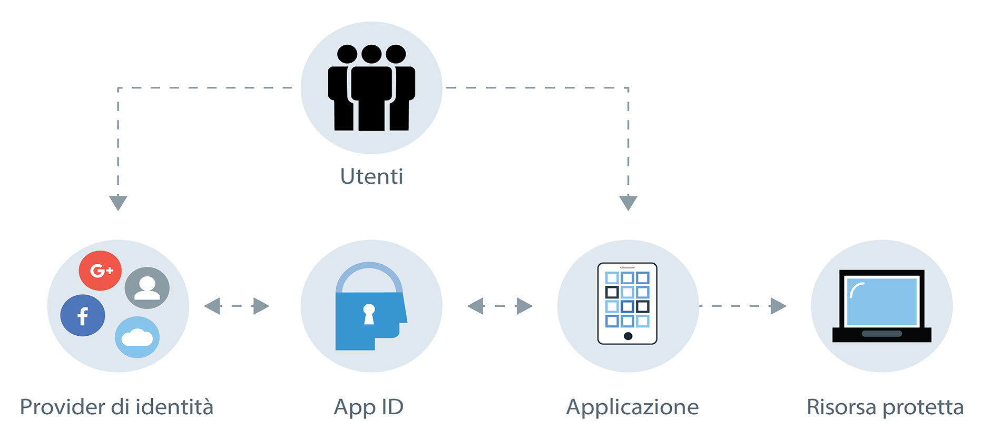

---

copyright:
  years: 2017, 2019
lastupdated: "2019-06-18"

keywords: Authentication, authorization, identity, app security, secure, compliance, high availability, ha, disaster recover, dr, protocols, oauth, oidc

subcollection: appid

---

{:external: target="_blank" .external}
{:shortdesc: .shortdesc}
{:screen: .screen}
{:pre: .pre}
{:table: .aria-labeledby="caption"}
{:codeblock: .codeblock}
{:tip: .tip}
{:note: .note}
{:important: .important}
{:deprecated: .deprecated}
{:download: .download}

# Informazioni su {{site.data.keyword.appid_short_notm}}
{: #about}

La sicurezza delle applicazioni può essere incredibilmente complicata. Per la maggior parte degli sviluppatori, è una delle parti più difficili nella creazione di un'applicazione. Come puoi essere sicuro di proteggere le informazioni dell'utente? Integrando {{site.data.keyword.appid_full}} nelle tue applicazioni, puoi proteggere le risorse e aggiungere l'autenticazione, anche quando non hai molta esperienza in materia di sicurezza.
{: shortdesc}

## Motivi per usare il servizio
{: #about-reasons}

{{site.data.keyword.appid_short_notm}} consente agli sviluppatori di aggiungere facilmente l'autenticazione alle loro applicazioni mobile e web con poche righe di codice e di proteggere i loro servizi e applicazioni native cloud su {{site.data.keyword.cloud_notm}}. Richiedendo agli utenti di accedere alla tua applicazione, puoi memorizzare i dati utente come le preferenze dell'applicazione o le informazioni dai profili sociali pubblici e quindi utilizzare tali dati per personalizzare ogni esperienza utente nella tua applicazione. {{site.data.keyword.appid_short_notm}} fornisce per te un framework di accesso, ma puoi anche portare le tue schermate personalizzate da utilizzare con Cloud Directory.
{: shortdesc}

Cosa può fare Cloud Directory per te? Guarda questo video per saperne di più sui diversi modi in cui puoi usare il servizio e, nella seguente tabella, leggi ulteriori informazioni sugli altri scenari.

<iframe class="embed-responsive-item" id="about-appid" title="Informazioni su {{site.data.keyword.appid_short_notm}}" type="text/html" width="640" height="390" src="//www.youtube.com/embed/XlrCjHdK43Q?rel=0" frameborder="0" webkitallowfullscreen mozallowfullscreen allowfullscreen> </iframe>

<table>
  <tr>
    <th>Scenario</th>
    <th>Soluzione</th>
  </tr>
  <tr>
    <td>Devi aggiungere [autorizzazione e autenticazione](/docs/services/appid?topic=appid-key-concepts) alle tue applicazioni mobile e web ma non hai esperienza in fatto di sicurezza.</td>
    <td>{{site.data.keyword.appid_short_notm}} rende semplice aggiungere una fase di autenticazione alle tue applicazioni. Puoi aggiungere l'accesso email o nome utente, social o aziendale alle tue applicazioni con API, SDK, IU pregenerate o personalizzate.</td>
  </tr>
  <tr>
    <td>Desideri limitare l'accesso alle tue applicazioni e alle risorse di backend.</td>
    <td>Puoi proteggere facilmente le tue applicazioni, risorse di backend e API utilizzando l'autenticazione basata sugli standard fornita da {{site.data.keyword.appid_short_notm}}.</td>
  </tr>
  <tr>
    <td>Desideri creare esperienze dell'applicazione personalizzate per i tuoi utenti.</td>
    <td>Con {{site.data.keyword.appid_short_notm}}, puoi [archiviare i dati utente](/docs/services/appid?topic=appid-profiles) come le preferenze dell'applicazione o le informazioni dai loro profili sociali pubblici e poi utilizzare quei dati per personalizzare ogni esperienza della tua applicazione.</td>
  </tr>
  <tr>
    <td>Vuoi gestire gli utenti in un modo scalabile.</td>
    <td> Con {{site.data.keyword.appid_short_notm}} puoi creare una [Cloud Directory](/docs/services/appid?topic=appid-cloud-directory), che ti consente di aggiungere la registrazione e l'accesso utente alle tue applicazioni. Cloud Directory ti viene fornito con il framework per conservare un registro utenti che può ridimensionarsi con la tua base di utenti. Con la funzionalità precostruita per il self-service, come ad esempio una verifica dell'email e le reimpostazioni della password, puoi assicurarti che la tua applicazione stia autenticando gli utenti in modo sicuro.</td>
  </tr>
</table>

## Come funziona
{: #about-how-it-works}

Con {{site.data.keyword.appid_short_notm}}, puoi aggiungere un livello di sicurezza alle tue applicazioni richiedendo agli utenti di effettuare l'accesso. Puoi anche utilizzare le API o l'SDK server per proteggere le tue risorse di backend.
{: shortdesc}

<dl>
  <dt>Applicazione</dt>
    <dd><strong>SDK server</strong>: puoi proteggere le tue risorse di backend ospitate in {{site.data.keyword.cloud_notm}} e le tue applicazioni web utilizzando l'SDK server. Estrae il token di accesso da una richiesta e lo convalida con {{site.data.keyword.appid_short_notm}}.  
    <strong>SDK client</strong>: puoi proteggere le tue applicazioni mobili con l'SDK client per Android o iOS. L'SDK client comunica con le tue risorse cloud per avviare automaticamente il processo di autenticazione quando individua una verifica dell'autorizzazione.</dd>
  <dt>{{site.data.keyword.cloud_notm}}</dt>
    <dd><strong>{{site.data.keyword.appid_short_notm}}</strong>: dopo una corretta autenticazione, {{site.data.keyword.appid_short_notm}} restituisce i token di identità e accesso alla tua applicazione. 
    <strong>Cloud Directory</strong>: gli utenti possono registrarsi per il tuo servizio con la loro email e una password. Puoi quindi gestire i tuoi utenti in una vista elenco tramite la IU. Con Cloud Directory, {{site.data.keyword.appid_short_notm}} funziona come provider di identità.</dd>
  <dt>Esterna (terze parti)</dt>
    <dd><strong>Provider di identità sociali e aziendali</strong>:{{site.data.keyword.appid_short_notm}} supporta Facebook, Google+ e  SAML 2.0 Federation come opzioni del provider di identità. Il servizio stabilisce un reindirizzamento al provider di identità e verifica i token di autenticazione restituiti. Se i token sono validi, il servizio concede l'accesso alla tua applicazione senza mai avere accesso alla reale passphrase.</dd>
</dl>

## Integrazioni
{: #about-integrations}

Puoi utilizzare {{site.data.keyword.appid_short_notm}} con le altre offerte {{site.data.keyword.cloud_notm}}.
{:shortdesc}

<dl>
  <dt>{{site.data.keyword.containershort_notm}}</dt>
    <dd>Configurando Ingress in un cluster standard, puoi proteggere le tue applicazioni a livello di cluster. Per iniziare, consulta <a href="/docs/containers?topic=containers-ingress_annotation#appid-auth">l'annotazione di Ingress per l'autenticazione {{site.data.keyword.appid_short_notm}}</a> o il post di blog <a href="https://www.ibm.com/cloud/blog/announcing-app-id-integration-ibm-cloud-kubernetes-service">Announcing {{site.data.keyword.appid_short_notm}} integration to {{site.data.keyword.containerlong_notm}} </a>.</dd>
  <dt>{{site.data.keyword.openwhisk_short}} e {site.data.keyword.apiconnect_short}}</dt>
    <dd>Quando crei le tue API con [{{site.data.keyword.openwhisk_short}}](/docs/openwhisk?topic=cloud-functions-getting-started) e [API Connect](/docs/services/apiconnect?topic=apiconnect-getting-started), puoi proteggere le tue applicazioni a livello di gateway anziché a livello di codice della tua applicazione. Per vedere l'integrazione in azione, guarda <a href="https://www.youtube.com/watch?v=Fa9YD2NGZiE" target="_blank">Simple and fast social login OAuth with API Connect and {{site.data.keyword.appid_short_notm}} </a>.</dd>
  <dt>Cloud Foundry</dt>
    <dd>Prova una delle applicazioni Cloud Foundry di esempio per scoprire come integrare {{site.data.keyword.appid_short_notm}} nelle tue applicazioni.</dd>
  <dt>{{site.data.keyword.cloudaccesstrailshort}}</dt>
    <dd>Puoi anche monitorare l'attività amministrativa effettuata in {{site.data.keyword.appid_short_notm}} come le modifiche alla configurazione del dashboard, utilizzando la [documentazione {{site.data.keyword.cloudaccesstrailshort}}](/docs/services/cloud-activity-tracker?topic=cloud-activity-tracker-getting-started).</dd>
  <dt>Guida alla programmazione iOS</dt>
    <dd>Sviluppi applicazioni per Apple? Prova la [Guida alla programmazione iOS](/docs/swift?topic=swift-getting-started) per conoscere, sperimentare e migliorare le tue applicazioni iOS esistenti con {{site.data.keyword.cloud_notm}}.</dd>
  <dt>Guida alla programmazione Node.js</dt>
    <dd>Sviluppi applicazioni in Node.js? Prova la [Guida alla programmazione Node.js](/docs/node?topic=nodejs-getting-started) per conoscere, sperimentare e migliorare le tue applicazioni Node.js esistenti con {{site.data.keyword.cloud_notm}}.</dd>
</dl>

## Conformità e standard
{: #about-compliance}

{{site.data.keyword.appid_short_notm}} ha completato correttamente diverse certificazioni e diversi controlli e standard. 
{: shortdesc}

{{site.data.keyword.appid_short_notm}} è basato su una serie di specifiche e protocolli standard del settore ben noti spesso rilevati sia nelle applicazioni rivolte ai consumatori che in quelle aziendali, il framework di autorizzazione OAuth 2.0 e Open ID Connect. OAuth 2.0 viene utilizzato per ottenere e verificare l'autorizzazione per l'accesso alle risorse protette. In aggiunta a ciò, Open ID Connect aggiunge un livello di protezione identità e autenticazione alla tua applicazione.

Vedi la sezione 5.4 del report di compatibilità dei prodotti software {{site.data.keyword.appid_short_notm}} per esaminare un elenco completo di [certificazioni](https://www.ibm.com/software/reports/compatibility/clarity-reports/report/html/softwareReqsForProduct?deliverableId=BF31C8008D7C11E59F9AD7336D7D0FFB){: external}. Oltre ai certificati, {{site.data.keyword.appid_short_notm}} è anche conforme alle seguenti specifiche: OAuth 2.0, OpenID Connect, JWT (JSON Web Token), JWS (JSON Web Signature), SCIM (System for Cross-domain Identity Management). 

## Alta disponibilità regionale
{: #ha-dr}

{{site.data.keyword.appid_short_notm}} è un servizio regionale altamente disponibile che viene eseguito in più zone.
{: shortdesc}

In ogni regione multizona supportata, ogni zona ha un suo cluster {{site.data.keyword.containerlong_notm}} con diversi nodi di lavoro. Ogni nodo di lavoro esegue diverse istanze di componenti {{site.data.keyword.appid_short_notm}}. Ogni regione presenta un programma di bilanciamento del carico globale e un WAF (Web Application Firewall).

I dati archiviati in {{site.data.keyword.appid_short_notm}} sono crittografati e resi persistenti in un cluster di database diffuso tra le zone di disponibilità. Dei dati viene anche eseguito un backup in un'archiviazione oggetti crittografata separata.

Poiché {{site.data.keyword.appid_short_notm}} è un servizio regionale, non fornisce un failover inter-regionale automatizzato o un ripristino di emergenza inter-regionale. Tuttavia, {{site.data.keyword.appid_short_notm}} fornisce un'[ampia API](https://us-south.appid.cloud.ibm.com/swagger-ui/#/){: external} che gli sviluppatori possono utilizzare per sincronizzare manualmente la loro configurazione del servizio con un'altra istanza o con diverse istanze di {{site.data.keyword.appid_short_notm}}.

