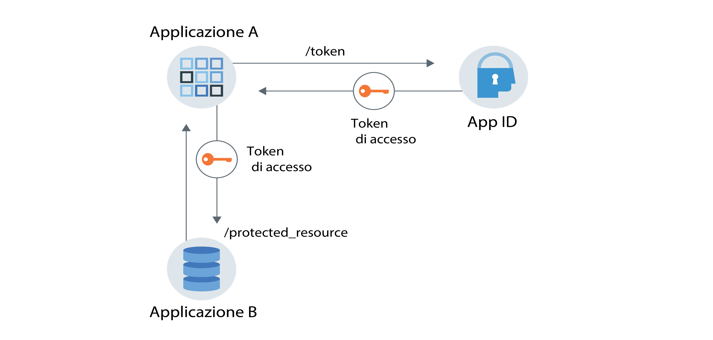

---

copyright:
  years: 2017, 2019
lastupdated: "2019-04-04"

keywords: authentication, authorization, identity, app security, secure, application identity, app to app, access token

subcollection: appid

---

{:new_window: target="_blank"}
{:shortdesc: .shortdesc}
{:screen: .screen}
{:pre: .pre}
{:table: .aria-labeledby="caption"}
{:codeblock: .codeblock}
{:tip: .tip}
{:note: .note}
{:important: .important}
{:deprecated: .deprecated}
{:download: .download}

# Identità e autorizzazione dell'applicazione
{: #app}

Con {{site.data.keyword.appid_short_notm}}, puoi proteggere le applicazioni utilizzando il flusso di identità e autorizzazione dell'applicazione tramite le funzionalità OAuth2.0.
{: shortdesc}

## Descrizione del flusso di comunicazione
{: #app-understanding}

Esistono diversi motivi per cui potresti volere che un'applicazione comunichi con un altro servizio o applicazione senza alcun intervento da parte dell'utente. Ad esempio, un'applicazione non interattiva che deve accedere a un'altra applicazione per eseguire il proprio lavoro. Questo potrebbe includere processi, CLI, daemon o un dispositivo IoT che monitora e segnala le variabili di ambiente a un server upstream. Il caso di utilizzo specifico è univoco per ogni applicazione, ma la cosa più importante da ricordare è che le richieste vengono scambiate per conto dell'applicazione, non dell'utente finale, ed è l'applicazione che viene autenticata e autorizzata.

Consulta questo esempio <a href="https://www.ibm.com/blogs/bluemix/2018/02/using-app-id-secure-docker-kubernetes-applications/" target="_blank">Using {{site.data.keyword.appid_short_notm}} to secure Docker and Kubernetes applications </a>.

### Come funziona il flusso?
{: #app-flow-how}

{{site.data.keyword.appid_short_notm}} utilizza il flusso di credenziali client OAuth2.0 per proteggere la comunicazione. Dopo aver registrato un'applicazione con {{site.data.keyword.appid_short_notm}}, l'applicazione ottiene un segreto e un ID client. Con queste informazioni, l'applicazione può richiedere un token di accesso da {{site.data.keyword.appid_short_notm}} ed essere autorizzata ad accedere a un'API o una risorsa protetta. Nel flusso di identità e autorizzazione dell'applicazione, all'applicazione viene concesso solo un token di accesso. Non ottiene un token di identità o un token di aggiornamento. Per ulteriori informazioni sui token, consulta [Descrizione dei token](/docs/services/appid?topic=appid-tokens#tokens).

Questo flusso di lavoro è pensato per essere utilizzato solo con applicazioni affidabili in cui non esiste alcun rischio che il segreto venga utilizzato in modo improprio o fatto trapelare. L'applicazione ospita sempre il segreto client. Non funzionerà per le applicazioni mobili.
{: tip}

### Come si presenta il flusso?
{: #app-flow-what}

Nella seguente immagine, puoi vedere la direzione della comunicazione tra il servizio e la tua applicazione.


Figura. Flusso di identità e autorizzazione dell'applicazione

1. L'applicazione A viene registrata con {{site.data.keyword.appid_short_notm}} per ottenere un segreto e un ID client.
2. L'applicazione A effettua una richiesta a {{site.data.keyword.appid_short_notm}} inviando le credenziali richiamate nel passo precedente.
3. {{site.data.keyword.appid_short_notm}} convalida la richiesta, autentica l'applicazione e restituisce una risposta all'applicazione A che contiene un token di accesso.
4. L'applicazione A può ora utilizzare il token di accesso per inviare delle richieste all'applicazione B come ad esempio una risorsa protetta.

## Registrazione della tua applicazione
{: #app-register}

### Con la GUI
{: #app-register-gui}

1. Nella scheda **Application** del dashboard {{site.data.keyword.appid_short_notm}}, fai clic su **Add Application**.
2. Aggiungi il tuo nome dell'applicazione a fai clic su **Save** per ritornare a un elenco di tue applicazioni registrate. Il nome della tua applicazione non può superare i 50 caratteri.
3. Dall'elenco delle applicazioni registrate, seleziona l'applicazione che hai aggiunto nel passo precedente. La riga si espande per mostrare le tue credenziali.

### Con l'API
{: #app-register-api}

1. Esegui una richiesta POST all'endpoint [`/management/v4/{tenantId}/applications`](https://us-south.appid.cloud.ibm.com/swagger-ui/#/Management%20API%20-%20Applications/mgmt.registerApplication).

  Richiesta:

  ```
  curl -X POST \  https://us-south.appid.cloud.ibm.com/management/v4/39a37f57-a227-4bfe-a044-93b6e6060b61/applications/ \
  -H 'Content-Type: application/json' \
  -H 'Authorization: Bearer IAM_TOKEN' \
  -d '{"name": "ApplicationName"}'
  ```
  {: pre}

  Risposta di esempio:

  ```
  {
    "clientId": "c90830bf-11b0-4b44-bffe-9773f8703bad",
    "tenantId": "b42f7429-fc24-48fa-b4f9-616bcc31cfd5",
    "secret": "YWQyNjdkZjMtMGRhZC00ZWRkLThiOTQtN2E3ODEyZjhkOWQz",
    "name": "testing",
    "oAuthServerUrl": "https://us-south.appid.cloud.ibm.com/oauth/v4/b42f7429-fc24-48fa-b4f9-616bcb31cfd5",
    "profilesUrl": "https://us-south.appid.cloud.ibm.com",
    "discoveryEndpoint": "https://us-south.appid.cloud.ibm.com/oauth/v4/b42f7429-fc24-48fa-b4f9-616bcb31cfd5/.well-known/openid-configuration"
  }
  ```
  {: screen}

## Ottenimento di un token di accesso
{: #obtain-token}

Dopo aver registrato la tua applicazione con {{site.data.keyword.appid_short_notm}} e aver ottenuto le tue credenziali, puoi effettuare una richiesta al server di autorizzazione {{site.data.keyword.appid_short_notm}} per ottenere un token di accesso.

1. Esegui una richiesta HTTP POST all'[endpoint `/token`](https://us-south.appid.cloud.ibm.com/swagger-ui/#/Authorization%20Server%20-%20Authorization%20Server%20V4/oauth-server.token). L'autorizzazione per la richiesta è `Basic auth` con il segreto e l'ID client utilizzati come la password e il nome utente codificati base64.

  Richiesta:
  ```
  curl -X POST \
    http://localhost:6002/oauth/v4/39a37f57-a227-4bfe-a044-93b6e6060b61/token \
    -H 'Authorization: Basic base64Encoded{clientId:secret}' \
    -H 'Content-Type: application/x-www-form-urlencoded' \
    -d grant_type=client_credentials
  ```
  {: pre}

  Risposta di esempio:
  ```
  {
  "access_token": "eyJhbGciOiJS...F9A",
  "expires_in": "3600",
  "token_type": "Bearer"
  }
  ```
  {: pre}


## Esercitazione: flusso end-to-end con l'SDK Node.js
{: tutorial-node}

1. Ottieni un [token di accesso](/docs/services/appid?topic=appid-tokens#tokens) in uno dei seguenti modi:

  * Dall'SDK server {{site.data.keyword.appid_short_notm}} [Node.js](https://github.com/ibm-cloud-security/appid-serversdk-nodejs) utilizzando il gestore dei token. Inizializza il gestore dei token con le tue credenziali dell'applicazione ed esegui una chiamata al metodo `getApplicationIdentityToken()` per ottenere il token.

    ```
    const TokenManager = require('ibmcloud-appid').TokenManager;
    const config = {
     clientId: "29a19759-aafb-41c7-9ef7-ee7b0ca88818",
     tenantId: "39a37f57-a227-4bfe-a044-93b6e6060b61",
     secret: "ZTEzZTA2MDAtMjljZS00MWNlLTk5NTktZDliMjY3YzUxZTYx",
     oauthServerUrl: "https://eu-gb.appid.cloud.ibm.com/oauth/v4/39a37f57-a227-4bfe-a044-93b6e6060b61"
    };

    const tokenManager = new TokenManager(config);

    tokenManager.getApplicationIdentityToken().then((appIdAuthContext) => {
     console.log(' Access tokens from SDK : ' + JSON.stringify(appIdAuthContext));
    }).catch((err) => {
     //console.error('Error retrieving tokens : ' + err);
    });
    ```
    {: pre}

  * Dal server di autorizzazione {{site.data.keyword.appid_short_notm}}.
  
    L'`oauthServerUrl` nella richiesta si ottiene quando registri la tua applicazione. Se hai registrato la tua applicazione con le API di gestione, l'URL del server si trova nel corpo della risposta. Se hai registrato la tua applicazione eseguendone il bind alla console IBM Cloud, è possibile trovare l'URL nel tuo oggetto JSON VCAP_SERVICES o tramite i tuoi segreti Kubernetes.
    {: note}

    ```
    var request = require('request');

    function getAccessToken() {
      let options = {
          method: 'POST',
          url: oauthServerUrl + '/token',
          headers: { 'content-type': 'application/x-www-form-urlencoded',
              'Authorization': 'Basic ' +Buffer.from('clientId: secret').toString('base64')
          },
          form: {
              grant_type: 'client_credentials'
          }
      };

      return new Promise((resolve, reject) => {
          request(options, function (error, response, body) {
              if (error) {
                  return reject(error);
              }

              let data = JSON.parse(body);
              if(data.access_token) {
                  resolve(data.access_token);
              } else {
                  reject(data);
              }
          })
      });
    }
    ```
    {: pre}

2. Esegui una richiesta alla tua risorsa protetta utilizzando il token di accesso che hai ottenuto nel passo precedente.

  ```
  let options = {
      method: 'GET',
      url: 'http://localhost:8081/protected_resource',
      headers: { authorization : 'Bearer ' + accessToken}
  }

  request(options, function (error, response, body) {
      if (error) {
       console.log(error)
      } else {
          res.status(response.statusCode).send({
      console.log(JSON.stringify(body));
          });
      }
  });
  ```
  {: pre}

3. Proteggi le tue risorse protette utilizzando la strategia API dall'SDK {{site.data.keyword.appid_short_notm}} Node.js.

  ```
  const express = require('express'),
    passport = require('passport');

  var app = express();
  app.use(passport.initialize());

  passport.use(new APIStrategy({
      oauthServerUrl: "https://us-south.appid.cloud.ibm.com/oauth/v4/398ec248-5e93-48b8-a122-ccabc714fe85",
      tenantId:"398ec248-5e93-48b8-a122-ccabc714fe85"
  }));

  app.get('/protected_resource',
      passport.authenticate(APIStrategy.STRATEGY_NAME, {session: false}),
      (req, res) => {
          res.send("Hello from protected resource");
  });
  ```
  {: pre}
