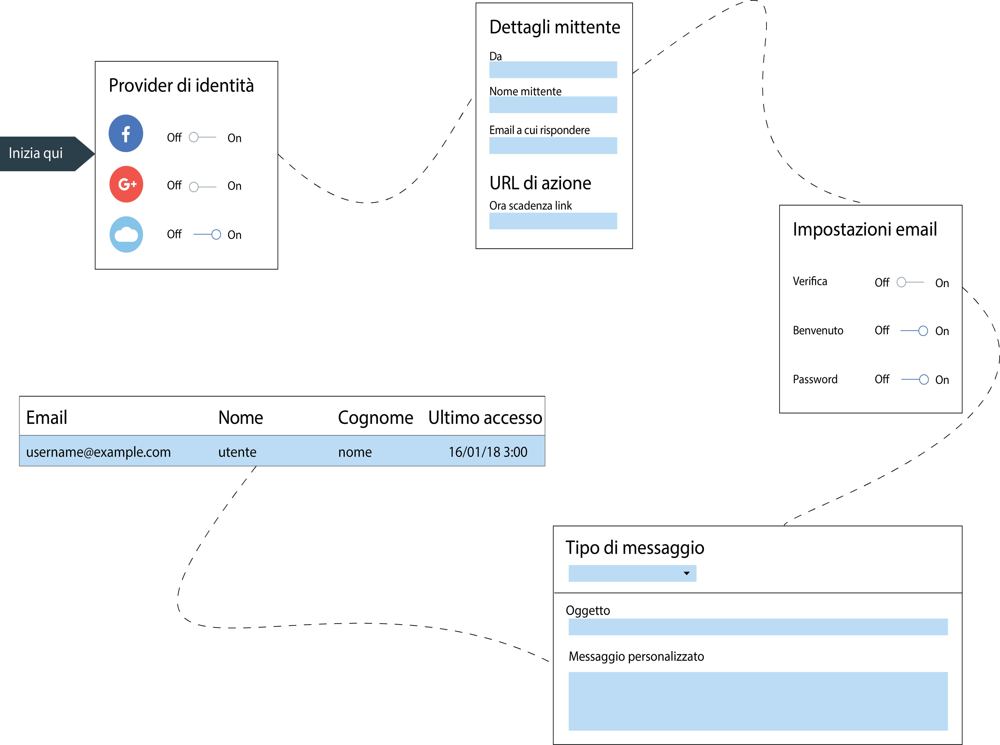

---

copyright:
  years: 2017, 2018
lastupdated: "2018-12-19"

---

{:new_window: target="_blank"}
{:shortdesc: .shortdesc}
{:screen: .screen}
{:codeblock: .codeblock}
{:pre: .pre}
{:tip: .tip}

# Cloud Directory
{: #cd}

Con {{site.data.keyword.appid_full}}, gli utenti possono registrarsi e accedere alle tue applicazioni mobili e web utilizzando un'email o il nome utente e una password. Una directory cloud è un registro utenti che viene conservato nel cloud. Quando un utente si registra alla tua applicazione, viene aggiunto alla tua directory di utenti. Con questa funzione, gli utenti hanno la libertà di gestire il proprio account all'interno della tua applicazione.
{: shortdesc}

</br>

## Gestione delle impostazioni della directory
{: #cd-settings}

Puoi configurare le notifiche e il livello di controllo utente per la tua applicazione. La configurazione di Cloud Directory può essere eseguita velocemente, come mostrato nella seguente immagine. Queste impostazioni possono essere aggiornate in qualsiasi momento dal dashboard del servizio.
{: shortdesc}



Figura. Il percorso di configurazione per Cloud Directory

1. Nella scheda **Manage** del dashboard {{site.data.keyword.appid_short_notm}}, assicurati che Cloud Directory sia impostato su **On**.

2. Configura le tue impostazioni generali.
  1. Decidi se vuoi che i tuoi utenti creino un nome utente o utilizzino la propria email quando accedono. Entrambe le opzioni richiedono una password. Dopo aver aggiunto gli utenti alla tua directory, non puoi più passare da un'opzione all'altra.
  2. Fai clic su **Edit** nella riga dei criteri della password per specificare tutti i requisiti che vuoi mettere in atto. I criteri della password sono forniti come regex. Per aiuto nel determinare la complessità della password o per vedere degli esempi comuni, consulta [Gestione della complessità della password](#strength). Fai clic su **Save** per mettere in atto i tuoi requisiti.
  3. Imposta **Allow users to sign up to your app** su **Yes**. Puoi ancora aggiungere gli utenti tramite la console se è impostato su **No**. Tuttavia, dovresti aggiungere gli utenti tramite la console solo per scopi di sviluppo.
  4. Imposta **Allow users to manage their account from your app** su **Yes** se vuoi che i tuoi utenti possano reimpostare e modificare le proprie password oppure ripristinare i propri dettagli. Se vuoi limitare la modalità self-service dei tuoi utenti, imposta il valore su **No**.
  5. Fai clic su **Edit** nella riga **Sender details** per aggiornare le tue impostazioni dell'email. Le impostazioni dell'email si applicano a tutta la comunicazione inviata tramite {{site.data.keyword.appid_short_notm}}. Specifica l'indirizzo email che deve inviare l'email, il loro nome e lascia un'email separata per gli utenti in modo da inviare una risposta.
  6. Abilita **Advanced password policy** per creare delle limitazioni e dei requisiti temporali per le tue password. Questa funzione comporta un'ulteriore fatturazione. Per ulteriori informazioni sulle tue opzioni, consulta [Politica della password avanzata](#advanced-password).
  6. Fai clic su **Save**.

3. Configura le tue impostazioni dell'email di verifica.
  1. Per fare in modo che gli utenti verifichino il proprio indirizzo email imposta **Email verification** su **On**. Quando un utente si registra alla tua applicazione, riceve un'email che gli chiede di confermare di essersi registrato per l'applicazione.
  2. Se hai deciso che vuoi che i tuoi utenti verifichino la propria email, la tua prossima decisione è se vuoi consentire degli utenti nella tua applicazione prima della verifica dell'indirizzo email. A seconda della tua preferenza, imposta **Allow users to sign in to your app without first verifying their email address** su **Yes** o su **No**.
  3. Personalizza il contenuto e il design dell'aspetto del tuo messaggio. È presente un template per il messaggio, ma puoi aggiornare il testo con il tuo messaggio. Puoi utilizzare una [lingua](/docs/services/appid/cloud-directory.html#languages) diversa dall'inglese, ma sei responsabile della traduzione del testo. Per scegliere un'altra lingua, utilizza le <a href="https://appid-management.ng.bluemix.net/swagger-ui/#!/Config/updateLocalization" target="_blank">API di gestione della lingua </a>.
  4. Fornisci all'URL di verifica un limite di tempo per la scadenza, specificato in minuti. Quando viene impostato questo tempo, viene influenzato anche per quanto tempo è valido il link del ripristino della password.
  5. Immetti il tuo URL della pagina di verifica se hai una pagina specifica che vuoi che i tuoi utenti visualizzino quando fanno clic sul link. Se lasci vuoto il campo **Custom verification page URL**, viene fornita una pagina di verifica predefinita da {{site.data.keyword.appid_short_notm}}.
  6. Fai clic su **Save**.

4. Configura le tue impostazioni dell'email di benvenuto.
  1. Per dare il benvenuto agli utenti tramite email quando si registrano per la tua applicazione, imposta **Welcome email** su **On**.
  2. Personalizza il contenuto e il design dell'aspetto del tuo messaggio. È presente un messaggio di esempio che puoi utilizzare, ma puoi aggiornare il testo con il tuo messaggio. Puoi utilizzare una [lingua](#languages) diversa dall'inglese, ma sei responsabile della traduzione del testo. Per scegliere un'altra lingua, utilizza le <a href="https://appid-management.ng.bluemix.net/swagger-ui/#!/Config/updateLocalization" target="_blank">API di gestione della lingua </a>.
  3. Fai clic su **Save**.

5. Configura le tue impostazioni di ripristino della password.
  1. Per consentire agli utenti di richiedere un ripristino della propria password, imposta **Forgot password email** su **On**. **Nota**: un utente deve aver convalidato la propria email prima di ripristinare la propria password. Questo significa che devi richiedere la verifica dell'email per consentire dei ripristini della password.
  2. Personalizza il contenuto e il design dell'aspetto del tuo messaggio. È presente un messaggio di esempio che puoi utilizzare, ma puoi aggiornare il testo con il tuo messaggio. Puoi utilizzare una [lingua](#languages) diversa dall'inglese, ma sei responsabile della traduzione del testo. Per scegliere un'altra lingua, utilizza le <a href="https://appid-management.ng.bluemix.net/swagger-ui/#!/Config/updateLocalization" target="_blank">API di gestione della lingua </a>.
  3. Fornisci all'URL del ripristino della password un limite di tempo per la scadenza, specificato in minuti. Quando viene impostato questo tempo, viene influenzato anche per quanto tempo è valido il link di verifica dell'email.
  4. Immetti il tuo URL del ripristino della password se hai una pagina specifica che vuoi che i tuoi utenti visualizzino quando fanno clic sul link. Se lasci vuoto il campo **Reset password page URL**, viene fornita una pagina di ripristino della password predefinita da {{site.data.keyword.appid_short_notm}}.
  5. Fai clic su **Save**.

6. Configura le tue impostazioni di modifica della password
  1. Per inviare una notifica agli utenti su tutte le modifiche apportate alle proprie password, imposta **Password changed email** su **On**.
  2. Personalizza il contenuto e il design dell'aspetto del tuo messaggio. È presente un messaggio di esempio che puoi utilizzare, ma puoi aggiornare il testo con il tuo messaggio. Puoi utilizzare una [lingua](#languages) diversa dall'inglese, ma sei responsabile della traduzione del testo. Per scegliere un'altra lingua, utilizza le <a href="https://appid-management.ng.bluemix.net/swagger-ui/#!/Config/updateLocalization" target="_blank">API di gestione della lingua </a>.
  3. Fai clic su **Save**.

7. Configura l'autenticazione multifattore.
  1. Per richiedere l'autenticazione multifattore all'accesso degli utenti, imposta **Enable Email Multi-Factor Authentication** su **On**.
  2. Personalizza il contenuto e il design della tua email utilizzando il seguente template. Puoi utilizzare una [lingua](#languages) diversa dall'inglese, ma sei responsabile della traduzione del testo. Per scegliere un'altra lingua, utilizza le <a href="https://appid-management.ng.bluemix.net/swagger-ui/#!/Config/updateLocalization" target="_blank">API di gestione della lingua </a>.
  3. Fai clic su **Save**.

8. Nella scheda **Users** puoi vedere chi si è registrato per la tua applicazione. Nota: un singolo utente può tentare di accedere fino a 5 volte in 60 secondi. Se viene effettuato un sesto tentativo, viene visualizzato un errore.

</br>
</br>

## Tipi di messaggi
{: #types}

Puoi inviare diversi tipi di messaggi ai tuoi utenti. Puoi scegliere di inviare il messaggio di esempio fornito dal servizio o puoi personalizzare il contenuto per un'esperienza con l'applicazione più personale. {{site.data.keyword.appid_short_notm}} utilizza <a href="https://www.sendgrid.com" target="_blank">SendGrid </a> come servizio di recapito email. Tutte le email vengono inviate con un unico account SendGrid.
{: shortdesc}

Se un utente non fornisce le informazioni estratte dal parametro, questi campi saranno vuoti.
{: tip}

<dl>
  <dt>Benvenuto</dt>
    <dd><p>Una volta registrato, puoi dare il benvenuto a un utente nella tua applicazione tramite email. Per dare il benvenuto e trattenere i tuoi utenti, rendi il tuo messaggio il più interessante possibile.</p>
    <table>
      <thead>
        <th colspan=2> Tutti i parametri del messaggio </th>
      </thead>
      <tbody>
        <tr>
          <td><code>%{display.logo}</code></td>
          <td> Visualizza l'immagine che hai configurato per il tuo widget di accesso. </td>
        </tr>
        <tr>
          <td><code>%{user.displayName}</code></td>
          <td> Visualizza il nome della schermata che un utente ha scelto di utilizzare durante l'interazione con l'applicazione. </td>
        </tr>
        <tr>
          <td><code>%{user.email}</code></td>
          <td> Visualizza l'indirizzo email registrato dell'utente. </td>
        </tr>
        <tr>
          <td><code>%{user.username}</code></td>
          <td> Visualizza il nome utente specificato dall'utente quando il metodo di autenticazione è impostato su nome utente e password. </td>
        </tr>
        <tr>
          <td><code>%{user.firstName}</code></td>
          <td> Visualizza il nome specificato dall'utente. </td>
        </tr>
        <tr>
          <td><code>%{user.formattedName}</code></td>
          <td> Visualizza il nome completo dell'utente. </td>
        </tr>
        <tr>
          <td><code>%{user.lastName}</code></td>
          <td> Visualizza il cognome specificato dall'utente. </td>
        </tr>
      </tbody>
    </table></dd>
  <dt>Password dimenticata</dt>
    <dd><p>Un utente può chiedere di reimpostare la propria password se la dimentica o deve aggiornarla per un qualsiasi motivo. Puoi personalizzare la risposta dell'email alla loro richiesta. Quando un utente richiede una modifica, la sua password rimane non modificata finché non fa clic sul link in questa email.</p>
    <table>
      <tr>
        <th colspan=2> Parametri della password dimenticata </th>
      </tr>
      <tr>
        <td><code>%{linkExpiration.hours}</code></td>
        <td> Visualizza il numero di ore in cui il link è valido.</td>
      </tr>
      <tr>
        <td><code>%{linkExpiration.minutes}</code></td>
        <td>Visualizza il numero di minuti in cui il link è valido.</td>
      </tr>
      <tr>
        <td><code>%{resetPassword.code}</code></td>
        <td> Visualizza il passcode monouso come parte dell'URL. Ciò significa che ogni persona ha un codice diverso. Esempio: <code>https://appid.cloud.ibm.com/wfm/verify/6574839563478</code> </td>
      </tr>
      <tr>
        <td><code>%{resetPassword.link}</code></td>
        <td> Visualizza il link su cui può fare clic un utente per reimpostare la propria password. </td>
      </tr>
     </tbody>
  </table></dd>
  <dt>Verifica</dt>
    <dd><p>Puoi richiedere che un utente verifichi il proprio account tramite email. Richiedendo una verifica, limiti il numero di account falsi che possono registrarsi alla tua applicazione. Puoi limitare l'accesso alla tua applicazione finché un utente verifica la propria email o utilizzarla come un modo per gestire per quali utenti crei i profili. Tieni presente che gli utenti che vengono aggiunti manualmente tramite il dashboard {{site.data.keyword.appid_short_notm}} o l'API utente di creazione, non ricevono automaticamente questa email.</p>
    <table>
      <thead>
        <th colspan=2> Parametri del messaggio di verifica </th>
      </thead>
      <tbody>
        <tr>
          <td><code>%{linkExpiration.hours}</code></td>
          <td> Visualizza il numero di ore in cui il link è valido. </td>
        </tr>
        <tr>
          <td><code>%{linkExpiration.minutes}</code></td>
          <td> Visualizza il numero di minuti in cui il link è valido. </td>
        </tr>
        <tr>
          <td><code>%{verify.code}</code></td>
          <td> Verifica l'URL di verifica monouso. </td>
        </tr>
        <tr>
          <td><code>%{verify.link}</code></td>
          <td> Verifica l'URL di azione che hai specificato nelle impostazioni. </td>
        </tr>
      </tbody>
    </table></dd>
  <dt>Modifica della password</dt>
    <dd><p>Puoi far sapere a un utente quando la propria password è stata aggiornata. Ciò è utile se non ha richiesto che la sua password venga modificata. Gli utenti possono prendere le misure appropriate per riproteggere i propri account.</p>
    <table>
      <thead>
        <th colspan=2> Parametri di modifica della password</th>
      </thead>
      <tbody>
        <tr>
          <td><code>%{passwordChangeInfo.time}</code></td>
          <td> Visualizza l'ora in cui una nuova password entra in vigore. </td>
        </tr>
        <tr>
          <td><code>%{passwordChangeInfo.ipAddress}</code></td>
          <td> Visualizza l'indirizzo IP da cui è stata richiesta la modifica della password. </td>
        </tr>
      </tbody>
    </table></dd>
    </dd>
    <dt>Codice di verifica MFA</dt>
      <dd><p>Quando è abilitata l'autenticazione multifattore, gli utenti possono ricevere dei codici di autenticazione come mezzo di autenticazione secondario.</p>
      <table>
        <thead>
          <th colspan=2> Tutti i parametri del messaggio </th>
        </thead>
        <tbody>
          <tr>
            <td><code>%{mfa.code}</code></td>
            <td> Visualizza il codice di verifica MFA monouso. </td>
          </tr>
        </tbody>
      </table></dd></dl>

</br>
</br>

## Gestione della complessità della password
{: #strength}

Puoi configurare i requisiti delle password che possono essere utilizzati con Cloud Directory.
{: shortdesc}

Una password complessa rende difficile o persino improbabile, che qualcuno la indovini in modo manuale o automatizzato. La complessità della password viene impostata come una stringa regex.

Alcuni esempi di complessità password comuni:

- Deve avere una lunghezza di almeno otto caratteri. Regex di esempio: `^.{8,}$`
- Deve contenere un numero, una lettera minuscola e una lettera maiuscola. Regex di esempio: `^(?:(?=.*\d)(?=.*[a-z])(?=.*[A-Z]).*)$`
- Deve contenere solo lettere e numeri inglesi. Regex di esempio: `^[A-Za-z0-9]*$`
- Deve avere almeno un carattere univoco. Regex di esempio: `^(\w)\w*?(?!\1)\w+$`

La complessità della password può essere impostata nella pagina delle impostazioni di Cloud Directory nella console App ID o utilizzando <a href="https://appid-management.ng.bluemix.net/swagger-ui/#!/Config/set_cloud_directory_password_regex" target="_blank">le API di gestione </a>.

</br>


## Politica della password avanzata
{: #advanced-password}


Puoi migliorare la sicurezza della tua applicazione mediante l'applicazione di ulteriori vincoli della password.
{: shortdesc}


La politica della password avanzata è formata da 5 funzioni ognuna delle quali può essere attivata separatamente.

 - Blocco dopo la ripetizione di credenziali non corrette
 - Evitare il riutilizzo della password
 - Scadenza della password
 - Periodo minimo tra le modifiche alla password
 - Accertarsi che la password non includa il nome utente


 Se abiliti questa funzione, viene attivata un ulteriore fatturazione per le funzionalità di sicurezza avanzate. Per ulteriori informazioni consulta il [Calcolatore del prezzo](faq.html#pricing).

</br>

### Evitare il riutilizzo della password
{: #avoid-reuse}

Quando i tuoi utenti stanno modificando le proprie password, potresti volergli impedire di scegliere una password utilizzata recentemente.
{: shortdesc}

Utilizzando la GUI o l'API, puoi scegliere il numero di password che un utente deve utilizzare prima di poter ripetere una password utilizzata precedentemente. Puoi selezionare qualsiasi valore intero compreso tra 1 e 10.

Se è stata attivata questa opzione e uno degli utenti tenta di impostare la propria password su una di quelle utilizzate recentemente, viene visualizzato un errore nell'IU del widget di accesso predefinita e gli viene richiesto di immettere una password diversa.

Le password precedenti sono memorizzate in modo sicuro nello stesso modo in cui viene memorizzata la password corrente di un utente.

</br>

### Blocco dopo la ripetizione di credenziali non corrette
{: #lockout}

Puoi voler proteggere gli account dei tuoi utenti bloccando temporaneamente la capacità di accedere quando viene rilevato un comportamento sospetto, come ad esempio più tentativi di accesso consecutivi con una password non corretta. Questa misura può aiutare ad evitare che dei malintenzionati ottengano l'accesso all'account di un utente indovinandone la password.
{: shortdesc}

Utilizzando la GUI o l'API, puoi impostare il numero massimo di tentativi di accesso non riusciti che un utente può tentare prima che il proprio account venga bloccato temporaneamente. Puoi inoltre impostare la quantità di tempo in cui l'account viene bloccato. Hai le seguenti opzioni:

* Numero di tentativi: qualsiasi valore intero compreso tra 1 e 10.
* Periodo di blocco: qualsiasi valore intero compreso tra 1 minuto e 24 ore, specificato in minuti.

Se un account viene bloccato, gli utenti non possono accedere o eseguire una qualsiasi altra operazione self service, come ad esempio la modifica della propria password finché non trascorre il periodo di blocco specificato. Quando termina il periodo di blocco, l'utente viene sbloccato automaticamente.

Puoi sbloccare un utente prima del termine del periodo di blocco. Per vedere se gli utenti sono bloccati, controlla se il campo `active` è impostato su `false`. Puoi anche controllare se il loro stato sulla scheda **Users** del dashboard del servizio è impostato su `disabled`. Per sbloccare un utente, devi utilizzare [l'API](https://appid-management.ng.bluemix.net/swagger-ui/#!/Cloud_Directory_Users/updateCloudDirectoryUser) per impostare il campo `active` su `true`.

</br>

### Periodo minimo tra le modifiche alla password
{: #minimum-time}

Potresti voler impedire ai tuoi utenti di modificare velocemente le password impostando un periodo minimo di tempo in cui un utente deve attendere tra le modifiche alla password.
{: shortdesc}

Questa funzione è particolarmente utile quando utilizzata insieme alla politica "Evitare il riutilizzo della password". Senza questa limitazione, un utente potrebbe semplicemente modificare la propria password più volte in rapida successione in modo da eludere la limitazione di riutilizzo delle password recenti. Puoi selezionare un qualsiasi valore compreso tra 1 ora e 30 giorni, specificato in ore.

</br>

### Scadenza della password
{: #expiration}

Per motivi di sicurezza, potresti voler applicare una politica di rotazione della password, come ad esempio che i tuoi utenti debbano modificare le proprie password dopo un periodo di tempo.
{: shortdesc}

Utilizzando la GUI o l'API, puoi impostare un periodo di tempo in cui le password del tuo utente rimarranno valide. Dopo la scadenza della password di un utente, sono costretti a reimpostare la propria password al successivo accesso. Puoi selezionare un qualsiasi numero di giorni completi compreso tra 1 e 90.

Il servizio fornisce una GUI predefinita e un'esperienza preconfigurata con il widget di accesso. All'utente viene richiesto di fornire una nuova password prima del completamento dell'accesso.

Se stai utilizzando un'esperienza di accesso personalizzata, viene attivato un errore quando un utente tenta di accedere con una password scaduta. È tua responsabilità configurare la tua applicazione in modo da fornire l'esperienza utente necessaria. Puoi richiamare l'API di modifica della password per impostare la nuova password.

La risposta endpoint del token è simile alla seguente:

```javascript
{
  "error" : "invalid_grant",
  "error_description" : "Password expired",
  "user_id" : "356e065e-49da-45f6-afa3-091a7b464f51"
}
```
{: screen}

Quando questa opzione viene attivata per la prima volta, tutte le password utente esistenti non avranno una data di scadenza. Il periodo di scadenza inizia per tali utenti quando viene modificata la loro password. Potresti voler incoraggiare gli utenti ad aggiornare la propria password dopo che hai attivato questa funzione.
{: note}

</br>

### Accertarsi che la password non includa il nome utente
{: #no-username}

Per delle password più sicure, potresti voler impedire agli utenti di includere il loro nome utente o la prima parte del loro indirizzo email.
{: shortdesc}

Questo vincolo non è sensibile al maiuscolo/minuscolo, il che significa che gli utenti non possono modificare il maiuscolo/minuscolo di alcuni o di tutti i caratteri in modo da utilizzare delle informazioni personali. Per configurare questa opzione, imposta lo switch su **on**.

</br>

## Utilizzo di un mittente email personalizzato
{: #custom-email}

Con {{site.data.keyword.appid_short_notm}}, puoi definire un punto di estensione personalizzato per inviare i tuoi messaggi email Cloud Directory. Definendo un punto di estensione, hai il controllo completo su come vengono inviate le email e puoi utilizzare il tuo nome di dominio.
 {: shortdesc}

**Perché dovrei voler utilizzare un mittente email personalizzato?**

Per impostazione predefinita, {{site.data.keyword.appid_short_notm}} utilizza SendGrid per consegnare i messaggi per tuo conto. Configurando il tuo mittente email personalizzato, puoi migliorare ulteriormente l'esperienza personalizzata per i tuoi utenti dell'applicazione.

Alcuni esempi più specifici:
- **Dominio personalizzato**
Configurando un dispatcher email personalizzato, hai il controllo completo su come vengono inviati i messaggi email. Questa opzione include la personalizzazione del dominio email che potrebbe ridurre ulteriormente le possibilità che le email vengano filtrate come spam.
- **Informazioni approfondite e risoluzione dei problemi**
Ottieni delle informazioni approfondite dal tuo provider email, come ad esempio: il numero di persone che ha aperto le email o a cui i messaggi non sono stati recapitati. Poiché puoi tenere traccia di messaggi individuali e visualizzare le statistiche generali, questo può essere utile a risolvere dei problemi.

</br>

**Come funziona?**

Dopo aver configurato il punto di estensione, viene richiamato da {{site.data.keyword.appid_short_notm}} ogni volta che un messaggio email deve essere inviato. Il punto di estensione contiene tutte le informazioni sul messaggio, incluso il contenuto finale del corpo dell'email.

</br>

**Per creare un mittente email personalizzato:**

1. Per configurare l'istanza {{site.data.keyword.appid_short_notm}} in modo che utilizzi il dispatcher personalizzato, utilizza <a href="https://appid-management.ng.bluemix.net/swagger-ui/#!/Config/set_cloud_directory_email_dispatcher" target="_blank">l'API di gestione</a>.</br>
Devi fornire l'URL. Inoltre puoi fornire le informazioni sull'autorizzazione. I tipi di autorizzazione supportati sono: `Basic authorization` o `constant authorization header value`.

  Esempi di configurazione validi:
  ```
  {
    "custom": {
      "url": "https://example.com/send_mail"
    }
  }
  ```
  {: screen}

  ```
  {
    "custom": {
      "url": "https://example.com/send_mail",
      "authorization": {
        "type": "basic",
        "username": "username",
        "password": "password"
      }
    }
  }
  ```
  {: screen}

  ```
  {
    "custom": {
      "url": "https://example.com/send_mail",
      "authorization": {
        "type": "value",
        "value": "myApiKey"
      }
    }
  }
  ```
  {: screen}

2. Configura un punto di estensione che possa ascoltare la richiesta post. Questo endpoint dovrebbe essere in grado di leggere il payload proveniente da {{site.data.keyword.appid_short_notm}} e di inviare l'email con il tuo mittente email personalizzato.

3. Il corpo inviato da {{site.data.keyword.appid_short_notm}} è nel seguente formato: `{"jws": "jws-format-string"}`. </br> Dopo aver decodificato e verificato il payload, il contenuto è una stringa JSON.</br>
  ```
    {
      "tenant": "tenant-id",
      "iss" : "appid-oauth.ng.bluemix.net",</prod>
      "iat": 1539173126,
      "jti": "uniq-id",
      "message": {
          "to": "your@mail.com",
          "from": {
              "name": "My Awesome Service",
              "address": "no-reply@company.com"
          },
          "replyTo": {
              "name": "My Awesome Service",
              "address": "yes-reply@company.com"
          },
          "subject": "Welcome to My Awesome Service",
          "body": "<p>Hello<p><br/><p>Thanks for signing up John Doe</p>"
      }
    }
  ```
  {: screen}

  - tenant: l'ID tenant dell'istanza App ID
  - iat: la data/ora in cui è stato inviato il messaggio
  - iss: identifica il principal che ha emesso il JWS.
  - jti: l'ID della transazione univoco
  - message: il messaggio da inviare, formato dai seguenti campi:
    - to: indirizzo email del ricevente
    - from: informazioni sul mittente, formate dai seguenti campi:
      - name: facoltativo, il nome del mittente
      - address: l'indirizzo del mittente
    - reply to: facoltativo, formato dai seguenti campi:
      - name: facoltativo, il nome del mittente
      - address: facoltativo, l'indirizzo del mittente
    - subject: l'oggetto dell'email
    - body: il corpo dell'email, in formato HTML

  Puoi verificare che la tua richiesta ha avuto esito positivo controllando il codice di stato della risposta. Qualsiasi valore compreso nell'intervallo 200 - 299 viene considerato un esito positivo. Se ricevi una qualsiasi altra risposta, riprova ad eseguire la tua richiesta
  {: tip}

4. Ogni payload HTTP inviato da {{site.data.keyword.appid_short_notm}} viene automaticamente firmato in base allo standard JWS utilizzando una coppia di chiavi asimmetriche.
Per ogni istanza {{site.data.keyword.appid_short_notm}}, viene generata una chiave pubblica e una privata che non vengono condivise con le altre istanze. La chiave privata viene utilizzata per firmare il payload HTTP e puoi utilizzare la chiave pubblica per verificare che payload sia generato da {{site.data.keyword.appid_short_notm}} e non sia stato modificato da terze parti, <a href="https://us-south.appid.cloud.ibm.com/swagger-ui/#!/Authorization_Server_V3/publicKeys" target="_blank">Endpoint chiavi pubbliche</a>.

5. Codice di esempio per il punto di estensione (JavaScript)
  ```
  const sgMail = require('@sendgrid/mail');
  const {promisify} = require('bluebird');
  const request = promisify(require('request'));
  const jwtVerify = promisify(require('jsonwebtoken').verify);
  const jwtDecode = require('jsonwebtoken').decode;
  const jwkToPem = require('jwk-to-pem');

  async function obtainPublicKeys() {
  	// Your App ID instance tenant ID
  	const tenantId = '<TENANT-ID>';

  	// Send request to App ID's public keys endpoint
  	const keysOptions = {
  		method: 'GET',
  		url: `https://appid-oauth.<REGION>.bluemix.net/oauth/v3/${tenantId}/publickeys`
  	};
  	const keysResponse = await request(keysOptions);
  	return JSON.parse(keysResponse.body).keys;
  }

  async function verifySignature(keysArray, kid, jws) {
  	const keyJson = keysArray.find(key => key.kid === kid);
  	if (keyJson) {
  		const pem = jwkToPem(keyJson);
  		await jwtVerify(jws, pem);
  		return;
  	}
  	throw new Error ("Unable to verify signature");
  }

  async function verifyAndSendMail(jws) {
  	// The API key for Sendgrid
  	const sgApiKey = '<SENDGRID-API-KEY>';

  	// Init Sendgrind
  	sgMail.setApiKey(sgApiKey);

  	// Decode message to get information
  	const data = jwtDecode(jws, {complete: true});

  	// Extract kid from header
  	const kid = data.header.kid;

  	const keysArray = await obtainPublicKeys();

  	// Verify the signature of the payload with the public keys
  	await verifySignature(keysArray, kid ,jws);

  	// Send the email with Your Sendgrid account
  	const message = data.payload.message;
  	const msg = {
  		to: message.to,
  		from: message.from.address,
  		subject: message.subject,
  		html: message.body,
  	};
  	console.log(`Sending email to ${message.to}`);
  	let sendgridResponse = await sgMail.send(msg);

  	return {result : 'email_sent',sendgridResponse};
  }
  ```
  {: codeblock}

6. Verifica che la tua configurazione sia impostata correttamente verificando il tuo dispatcher email. Utilizza l'<a href="https://appid-management.ng.bluemix.net/swagger-ui/#!/Config/post_email_dispatcher_test" target="_blank">API di test</a> per attivare una richiesta al tuo mittente email personalizzato configurato.

Per un esempio funzionante completo, consulta <a href="https://www.ibm.com/blogs/bluemix/2018/10/use-ibm-cloud-app-id-and-your-email-provider-to-brand-mails-sent-to-app-users/" target="_blank">Use your own provider for mail sent with {{site.data.keyword.appid_full}}</a>.

</br>
</br>


## Migrazione di utenti
{: #user-migration}

Occasionalmente potresti dover configurare una nuova istanza di {{site.data.keyword.appid_short_notm}}. Se stai utilizzando Cloud Directory, questo significa che i tuoi utenti devono essere migrati alla nuova istanza. Puoi utilizzare le API di gestione per aiutarti con la migrazione.
{: shortdesc}

### Prima di cominciare

Devi avere il [ruolo IAM](/docs/iam/quickstart.html) di `Manager` per entrambe le istanze di {{site.data.keyword.appid_short_notm}}.

</br>

**Esportazione**

Prima di poter aggiungere i tuoi utenti alla nuova istanza, devi esportarli dalla tua istanza corrente. Per farlo, puoi utilizzare l'<a href="https://appid-management.ng.bluemix.net/swagger-ui/#!/Cloud_Directory_Users/cloudDirectoryExport" target="_blank">API di gestione dell'esportazione </a>.

Comando cURL di esempio:

```
curl -X GET --header ‘Accept: application/json’ --header ‘Authorization: Bearer <iam-token>’ ’https://eu-gb.appid.cloud.ibm.com/management/v4/111c9bj3-xxxx-4b5b-zzzz-24ad9440k8j9/cloud_directory/export?encryption_secret=myCoolSecret'
```
{: codeblock}

<table>
  <tr>
    <th>Variabile</th>
    <th>Descrizione</th>
  </tr>
  <tr>
    <td><code>encryption_secret</code></td>
    <td>Una stringa personalizzata utilizzata per codificare e decodificare una password con hash degli utenti.</td>
  </tr>
  <tr>
    <td><code>tenantID</code></td>
    <td>L'ID tenant del servizio può essere trovato nelle tue credenziali del servizio. Puoi trovare le tue credenziali del servizio nel dashboard App ID.</td>
  </tr>
</table>

Vengono restituiti solo i tuoi utenti Cloud Directory e i loro profili. Gli utenti da altri provider di identità non vengono restituiti.
{: note}

</br>

**Importazione**

Ora che i tuoi utenti sono pronti, puoi importare le loro informazioni nella nuova istanza. Per farlo, puoi utilizzare l'<a href="https://appid-management.ng.bluemix.net/swagger-ui/#!/Cloud_Directory_Users/cloudDirectoryImport" target="_blank">API di gestione dell'importazione </a>.

Comando cURL di esempio:

```
curl -X POST --header ‘Content-Type: application/json’ --header ‘Accept: application/json’ --header ‘Authorization: Bearer <iam-token>’ -d ‘{“users”: [
    {
      “scimUser”: {
        “originalId”: “3f3f6779-7978-4383-926f-a43aef3b724b”,
        “name”: {
          “givenName”: “<first-name>”,
          “familyName”: “<last-name>”,
          “formatted”: “<first-name> <last-name>”
        },
        “displayName”: “<first-name>”,
        “emails”: [
          {
            “value”: “<user>@gmail.com”,
            “primary”: true
          }
        ],
        “status”: “PENDING”
      },
      “passwordHash”: “<password hash here>“,
      “passwordHashAlg”: “<password hash algorithm>",
      “profile”: {
        “attributes”: {}
      }
    }
]}’ ‘https://eu-gb.appid.cloud.ibm.com/management/v4/111c9bj3-xxxx-4b5b-zzzz-24ad9440k8j9/cloud_directory/import?encryption_secret=myCoolSecret’
```
{: codeblock}

</br>

### Utilizzo dello script di migrazione

{{site.data.keyword.appid_short_notm}} fornisce uno script di migrazione che puoi utilizzare tramite la CLI per velocizzare il processo di migrazione.

Prima di iniziare, assicurati di avere le seguenti informazioni sui parametri:

<table>
  <tr>
    <th>Parametro</th>
    <th>Descrizione</th>
  </tr>
  <tr>
    <td><code>sourceTenantId</code></td>
    <td>L'ID tenant dell'istanza di {{site.data.keyword.appid_short_notm}} da cui vuoi esportare gli utenti.</td>
  </tr>
  <tr>
    <td><code>destinationTenantId</code></td>
    <td>L'ID tenant dell'istanza di {{site.data.keyword.appid_short_notm}} in cui vuoi importare gli utenti.</td>
  </tr>
  <tr>
    <td>Regione</td>
    <td>Le opzioni correnti includono: Stati Uniti Sud: <code>ng</code>, Londra: <code>eu-gb</code>,  Sydney: <code>au-syd</code>, Washington: <code>us-east</code> e Germania: <code>eu-de</code>.</td>
  </tr>
  <tr>
    <td>Token IAM</td>
    <td>Assicurati di avere le autorizzazioni da <code>manager</code> prima di ottenere il token. Per un aiuto sull'ottenimento del token IAM, consulta <a href="https://console.bluemix.net/docs/iam/apikey_iamtoken.html#iamtoken_from_apikey" target="_blank">la documentazione </a>.</td>
  </tr>
</table>

Per eseguire lo script:

1. Clona il <a href="https://github.com/ibm-cloud-security/appid-sample-code-snippets/tree/master/export-import-cloud-directory-users" target="_blank">repository </a>.
2. Apri il terminale e passa alla cartella in cui hai clonato il repository.
3. Immetti il seguente comando.

  ```
  npm install
  ```
  {: codeblock}

4. Con i tuoi parametri, immetti il seguente comando:

  ```
  users_export_import 'sourceTenantId' 'destinationTenantId' 'region' 'iamToken'
  ```
  {: codeblock}

  Comando di esempio:

  ```
  users_export_import e00a0366-53c5-4fcf-8fef-ab3e66b2ced8 73321c2b-d35a-497a-9845-15c580fdf58c ng eyJraWQiOiIyMDE3MTAyNS0xNjoyNzoxMCIsImFsZyI6IlJTMjU2In0.eyJpYW1faWQiOiJJQk1pZC0zMTAwMDBUNkZTIiwiaWQiOiJJQk1pZC0zMTAwMDBUNkZTIiwicmVhbG1pZCI6IklCTWlkIiwiaWRlbnRpZmllciI6IjMxMDAwMFQ2RlMiLCJnaXZlbl9uYW1lIjoiUm90ZW0iLCJmYW1pbHlfbmFtZSI6IkJyb3NoIiwibmFtZSI6IlJvdGVtIEJyb3NoIiwiZW1haWwiOiJyb3RlbWJyQGlsLmlibS5jb20iLCJzdWIiOiJyb3RlbWJyQGlsLmlibS5jb20iLCJhY2NvdW50Ijp7ImJzcyI6ImQ3OWM5YTk5NjJkYzc2Y2JkMDZlYTVhNzhjMjY0YzE5In0sImlhdCI6MTUzNzE3Mjg4NCwiZXhwIjoxNTM3MTc2NDg0LCJpc3MiOiJodHRwczovL2lhbS5zdGFnZTEuYmx1ZW1peC5uZXQvaWRlbnRpdHkiLCJncmFudF90eXBlIjoidXJuOmlibTpwYXJhbXM6b2F1dGg6Z3JhbnQtdHlwZTpwYXNzY29kZSIsInNjb3BlIjoiaWJtIG9wZW5pZCIsImNsaWVudF9pZCI6ImJ4IiwiYWNyIjoxLCJhbXIiOlsicHdkIl19.c4vLPzhvvNZLjaLy7znDa37qV4o-yuGmSKmJoQKrEQNZU8IC0NIjxwSo7W9kb0pDi3Yf_03_9ufTTGNfjtltzNWycSXjkNgoL-b9_nU61oHdgn0stY1KmNicqyBWfgUU--4xa904QN_QjRHBaUBeJf3XWEphPIMoF7mZeOxEZLnCMcQXSz9pImCMiP4SNT38cHLiI90Yx01rM7hpteepWULh5MYh-B2V03Gkgxfqvv951HF1LDg6eT4Q9in11laTQKtKuomripUju_4GIIjORVYw9NaAVKIJ9lKrPX0SKPhStsa59qGsC_7Uersms5EY1W1VbZVqOZPJbtp6tVf-Lw
  ```
  {: codeblock}

</br>
</br>


## Lingue supportate
{: #languages}

Puoi utilizzare <a href="https://appid-management.ng.bluemix.net/swagger-ui/#!/Config/updateLocalization" target="_blank">le API di gestione della lingua </a> per configurare la lingua in cui può essere scritta la comunicazione del tuo utente. Tuttavia per impostazione predefinita è disponibile solo l'inglese. Sei responsabile della traduzione dei messaggi. Dopo aver impostato la configurazione con l'API, la GUI viene aggiornata in modo che puoi modificare il testo del modello.
{: shortdesc}

<table>
  <col width="20%">
  <col width="25%">
  <col width="35%">
  <tr>
    <th>Codice</th>
    <th>Lingua</th>
    <th>regione</th>
  </tr>
  <tr>
    <td><code>af-ZA</code></td>
    <td>Afrikaans</td>
    <td>Sudafrica</td>
  </tr>
  <tr>
    <td><code>sq-AL</code></td>
    <td>Albanese</td>
    <td>Albania</td>
  </tr>
  <tr>
    <td><code>am-ET</code></td>
    <td>Amarico</td>
    <td>Etiopia</td>
  </tr>
  <tr>
    <td><code>ar-DZ</code></td>
    <td>Arabo</td>
    <td>Algeria</td>
  </tr>
  <tr>
    <td><code>ar-BH</code></td>
    <td>Arabo</td>
    <td>Bahrain</td>
  </tr>
  <tr>
    <td><code>ar-EG</code></td>
    <td>Arabo</td>
    <td>Egitto</td>
  </tr>
  <tr>
    <td><code>ar-IQ</code></td>
    <td>Arabo</td>
    <td>Iraq</td>
  </tr>
  <tr>
    <td><code>ar-JO</code></td>
    <td>Arabo</td>
    <td>Giordania</td>
  </tr>
  <tr>
    <td><code>ar-KW</code></td>
    <td>Arabo</td>
    <td>Kuwait</td>
  </tr>
  <tr>
    <td><code>ar-LB</code></td>
    <td>Arabo</td>
    <td>Libano</td>
  </tr>
  <tr>
    <td><code>ar-LY</code></td>
    <td>Arabo</td>
    <td>Libia</td>
  </tr>
  <tr>
    <td><code>ar-MR</code></td>
    <td>Arabo</td>
    <td>Mauritania</td>
  </tr>
  <tr>
    <td><code>ar-MA</code></td>
    <td>Arabo</td>
    <td>Marocco</td>
  </tr>
  <tr>
    <td><code>ar-OM</code></td>
    <td>Arabo</td>
    <td>Oman</td>
  </tr>
  <tr>
    <td><code>ar-QA</code></td>
    <td>Arabo</td>
    <td>Qatar</td>
  </tr>
  <tr>
    <td><code>ar-SA</code></td>
    <td>Arabo</td>
    <td>Arabia Saudita</td>
  </tr>
  <tr>
    <td><code>ar-SY</code></td>
    <td>Arabo</td>
    <td>Siria</td>
  </tr>
  <tr>
    <td><code>ar-YE</code></td>
    <td>Arabo</td>
    <td>Tunisia</td>
  </tr>
  <tr>
    <td><code>ar-AE</code></td>
    <td>Arabo</td>
    <td>Emirati Arabi Uniti</td>
  </tr>
  <tr>
    <td><code>ar-YE</code></td>
    <td>Arabo</td>
    <td>Yemen</td>
  </tr>
  <tr>
    <td><code>hy-AM</code></td>
    <td>Armeno</td>
    <td>Armenia</td>
  </tr>
  <tr>
    <td><code>as-IN</code></td>
    <td>Assamese</td>
    <td>India</td>
  </tr>
  <tr>
    <td><code>az-AZ</code></td>
    <td>Azero</td>
    <td>Azerbaijan</td>
  </tr>
  <tr>
    <td><code>eu-ES</code></td>
    <td>Basco</td>
    <td>Spagna</td>
  </tr>
  <tr>
    <td><code>be-BY</code></td>
    <td>Bielorusso</td>
    <td>Bielorussia</td>
  </tr>
  <tr>
    <td><code>bn-BD</code></td>
    <td>Bengalese</td>
    <td>Bangladesh</td>
  </tr>
  <tr>
    <td><code>be-BY</code></td>
    <td>Bielorusso</td>
    <td>Bielorussia</td>
  </tr>
  <tr>
    <td><code>bn-BD</code></td>
    <td>Bengalese</td>
    <td>Bangladesh</td>
  </tr>
  <tr>
    <td><code>bn-IN</code></td>
    <td>Bengalese</td>
    <td>India</td>
  </tr>
  <tr>
    <td><code>bs-Latn-BA</code></td>
    <td>Bosniaco</td>
    <td>Bosnia</td>
  </tr>
  <tr>
    <td><code>bg-BG</code></td>
    <td>Bulgaro</td>
    <td>Bulgaria</td>
  </tr>
  <tr>
    <td><code>my-MM</code></td>
    <td>Birmano</td>
    <td>Myanmar</td>
  </tr>
  <tr>
    <td><code>ca-ES</code></td>
    <td>Catalano</td>
    <td>Spagna</td>
  </tr>
  <tr>
    <td><code>zh-Hans-CN</code></td>
    <td>Cinese semplificato</td>
    <td>Cina</td>
  </tr>
  <tr>
    <td><code>zh-Hans-SG</code></td>
    <td>Cinese semplificato</td>
    <td>Singapore</td>
  </tr>
  <tr>
    <td><code>zh-Hant-HK</code></td>
    <td>Cinese tradizionale</td>
    <td>Hong Kong R.A.S. della Cina</td>
  </tr>
  <tr>
    <td><code>zh-Hant-MO</code></td>
    <td>Cinese tradizionale</td>
    <td>Macao</td>
  </tr>
  <tr>
    <td><code>zh-Hant-TW</code></td>
    <td>Cinese tradizionale</td>
    <td>Taiwan</td>
  </tr>
  <tr>
    <td><code>hr-HR</code></td>
    <td>Croato</td>
    <td>Croazia</td>
  </tr>
  <tr>
    <td><code>cs-CZ</code></td>
    <td>Ceco</td>
    <td>Repubblica ceca</td>
  </tr>
  <tr>
    <td><code>da-DK</code></td>
    <td>Danese</td>
    <td>Danimarca</td>
  </tr>
  <tr>
    <td><code>nl-BE</code></td>
    <td>Olandese</td>
    <td>Belgio</td>
  </tr>
  <tr>
    <td><code>nl-NL</code></td>
    <td>Olandese</td>
    <td>Paesi Bassi</td>
  </tr>
  <tr>
    <td><code>en-AU</code></td>
    <td>Inglese</td>
    <td>Australia</td>
  </tr>
  <tr>
    <td><code>eu-BE</code></td>
    <td>Inglese</td>
    <td>Belgio</td>
  </tr>
  <tr>
    <td><code>en-CM</code></td>
    <td>Inglese</td>
    <td>Camerun</td>
  </tr>
  <tr>
    <td><code>eu-CA</code></td>
    <td>Inglese</td>
    <td>Canada</td>
  </tr>
  <tr>
    <td><code>en-GH</code></td>
    <td>Inglese</td>
    <td>Ghana</td>
  </tr>
  <tr>
    <td><code>eu-HK</code></td>
    <td>Inglese</td>
    <td>Hong Kong R.A.S. della Cina</td>
  </tr>
  <tr>
    <td><code>en-IN</code></td>
    <td>Inglese</td>
    <td>India</td>
  </tr>
  <tr>
    <td><code>en-IE</code></td>
    <td>Inglese</td>
    <td>Irlanda</td>
  </tr>
  <tr>
    <td><code>en-KE</code></td>
    <td>Inglese</td>
    <td>Kenia</td>
  </tr>
  <tr>
    <td><code>en-MU</code></td>
    <td>Inglese</td>
    <td>Mauritius</td>
  </tr>
  <tr>
    <td><code>en-NZ</code></td>
    <td>Inglese</td>
    <td>Nuova Zelanda</td>
  </tr>
  <tr>
    <td><code>en-NG</code></td>
    <td>Inglese</td>
    <td>Nigeria</td>
  </tr>
  <tr>
    <td><code>en-PH</code></td>
    <td>Inglese</td>
    <td>Filippine</td>
  </tr>
  <tr>
    <td><code>en-SG</code></td>
    <td>Inglese</td>
    <td>Singapore</td>
  </tr>
  <tr>
    <td><code>en-ZA</code></td>
    <td>Inglese</td>
    <td>Sudafrica</td>
  </tr>
  <tr>
    <td><code>en-TZ</code></td>
    <td>Inglese</td>
    <td>Tanzania</td>
  </tr>
  <tr>
    <td><code>en-GB</code></td>
    <td>Inglese</td>
    <td>Regno Unito</td>
  </tr>
  <tr>
    <td><code>en-US</code></td>
    <td>Inglese</td>
    <td>Stati uniti</td>
  </tr>
  <tr>
    <td><code>en-ZM</code></td>
    <td>Inglese</td>
    <td>Zambia</td>
  </tr>
  <tr>
    <td><code>en</code></td>
    <td>Inglese</td>
    <td> </td>
  </tr>
  <tr>
    <td><code>et-EE</code></td>
    <td>Estone</td>
    <td>Estonia</td>
  </tr>
  <tr>
    <td><code>fil-PH</code></td>
    <td>Filippino</td>
    <td>Filippine</td>
  </tr>
  <tr>
    <td><code>fi-FI</code></td>
    <td>Finlandese</td>
    <td>Finlandia</td>
  </tr>
  <tr>
    <td><code>fr-DZ</code></td>
    <td>Francese</td>
    <td>Algeria</td>
  </tr>
  <tr>
    <td><code>fr-CM</code></td>
    <td>Francese</td>
    <td>Camerun</td>
  </tr>
  <tr>
    <td><code>fr-CD</code></td>
    <td>Francese</td>
    <td>Repubblica democratica del Congo</td>
  </tr>
  <tr>
    <td><code>fr-BE</code></td>
    <td>Francese</td>
    <td>Belgio</td>
  </tr>
  <tr>
    <td><code>fr-CA</code></td>
    <td>Francese</td>
    <td>Canada</td>
  </tr>
  <tr>
    <td><code>fr-FR</code></td>
    <td>Francese</td>
    <td>Francia</td>
  </tr>
  <tr>
    <td><code>fr-CI</code></td>
    <td>Francese</td>
    <td>Costa d'Avorio (Côte d'Ivoire)</td>
  </tr>
  <tr>
    <td><code>fr-LU</code></td>
    <td>Francese</td>
    <td>Lussemburgo</td>
  </tr>
  <tr>
    <td><code>fr-MR</code></td>
    <td>Francese</td>
    <td>Mauritania</td>
  </tr>
  <tr>
    <td><code>fr-MU</code></td>
    <td>Francese</td>
    <td>Mauritius</td>
  </tr>
  <tr>
    <td><code>fr-MA</code></td>
    <td>Francese</td>
    <td>Marocco</td>
  </tr>
  <tr>
    <td><code>fr-SN</code></td>
    <td>Francese</td>
    <td>Senegal</td>
  </tr>
  <tr>
    <td><code>fr-CH</code></td>
    <td>Francese</td>
    <td>Svizzera</td>
  </tr>
  <tr>
    <td><code>fr-TN</code></td>
    <td>Francese</td>
    <td>Tunisia</td>
  </tr>
  <tr>
    <td><code>gl-ES</code></td>
    <td>Gallego</td>
    <td>Spagna</td>
  </tr>
  <tr>
    <td><code>lg-UG</code></td>
    <td>Ganda</td>
    <td>Uganda</td>
  </tr>
  <tr>
    <td><code>ka-GE</code></td>
    <td>Georgiano</td>
    <td>Georgia</td>
  </tr>
  <tr>
    <td><code>de-AT</code></td>
    <td>Tedesco</td>
    <td>Austria</td>
  </tr>
  <tr>
    <td><code>de-DE</code></td>
    <td>Tedesco</td>
    <td>Germania</td>
  </tr>
  <tr>
    <td><code>de-LU</code></td>
    <td>Tedesco</td>
    <td>Lussemburgo</td>
  </tr>
  <tr>
    <td><code>de-CH</code></td>
    <td>Tedesco</td>
    <td>Svizzera</td>
  </tr>
  <tr>
    <td><code>el-GR</code></td>
    <td>Greco</td>
    <td>Grecia</td>
  </tr>
  <tr>
    <td><code>gu-IN</code></td>
    <td>Gujarati</td>
    <td>India</td>
  </tr>
  <tr>
    <td><code>ha-NG</code></td>
    <td>Hausa</td>
    <td>Nigeria</td>
  </tr>
  <tr>
    <td><code>he-IL</code></td>
    <td>Ebraico</td>
    <td>Israele</td>
  </tr>
  <tr>
    <td><code>hi-IN</code></td>
    <td>Hindi</td>
    <td>India</td>
  </tr>
  <tr>
    <td><code>hu-HU</code></td>
    <td>Ungherese</td>
    <td>Ungheria</td>
  </tr>
  <tr>
    <td><code>is-IS</code></td>
    <td>Islandese</td>
    <td>Islanda</td>
  </tr>
  <tr>
    <td><code>ig-NG</code></td>
    <td>Igbo</td>
    <td>Nigeria</td>
  </tr>
  <tr>
    <td><code>id-ID</code></td>
    <td>Indonesiano</td>
    <td>Indonesia</td>
  </tr>
  <tr>
    <td><code>it-IT</code></td>
    <td>Italiano</td>
    <td>Italia</td>
  </tr>
  <tr>
    <td><code>it-CH</code></td>
    <td>Italiano</td>
    <td>Svizzera</td>
  </tr>
  <tr>
    <td><code>ja-JP</code></td>
    <td>Giapponese</td>
    <td>Giappone</td>
  </tr>
  <tr>
    <td><code>kn-IN</code></td>
    <td>Kannada</td>
    <td>India</td>
  </tr>
  <tr>
    <td><code>kk-KZ</code></td>
    <td>Kazaco</td>
    <td>Kazakistan</td>
  </tr>
  <tr>
    <td><code>km-KH</code></td>
    <td>Khmer</td>
    <td>Cambogia</td>
  </tr>
  <tr>
    <td><code>rw-RW</code></td>
    <td>Kinyarwanda</td>
    <td>Rwanda</td>
  </tr>
  <tr>
    <td><code>kok-IN</code></td>
    <td>Konkani</td>
    <td>India</td>
  </tr>
  <tr>
    <td><code>ko-KR</code></td>
    <td>Coreano</td>
    <td>Corea del Sud</td>
  </tr>
  <tr>
    <td><code>lo-LA</code></td>
    <td>Lituano</td>
    <td>Lituania</td>
  </tr>
  <tr>
    <td><code>lv-LV</code></td>
    <td>Lettone</td>
    <td>Lettonia</td>
  </tr>
  <tr>
    <td><code>lt-LT</code></td>
    <td>Khmer</td>
    <td>Cambogia</td>
  </tr>
  <tr>
    <td><code>mk-MK</code></td>
    <td>Macedone</td>
    <td>Macedonia</td>
  </tr>
  <tr>
    <td><code>ms-Latn-MY</code></td>
    <td>Malese (alfabeto latino)</td>
    <td>Malesia</td>
  </tr>
  <tr>
    <td><code>ml-IN</code></td>
    <td>Malayalam</td>
    <td>India</td>
  </tr>
  <tr>
    <td><code>mt-MT</code></td>
    <td>Maltese</td>
    <td>Malta</td>
  </tr>
  <tr>
    <td><code>mr-IN</code></td>
    <td>Marathi</td>
    <td>India</td>
  </tr>
  <tr>
    <td><code>mn-Cyrl-MN</code></td>
    <td>Mongolo (alfabeto cirillico)</td>
    <td>Mongolia</td>
  </tr>
  <tr>
    <td><code>ne-IN</code></td>
    <td>Nepalese</td>
    <td>India</td>
  </tr>
  <tr>
    <td><code>ne-NP</code></td>
    <td>Nepalese</td>
    <td>Nepal</td>
  </tr>
  <tr>
    <td><code>nb-NO</code></td>
    <td>Norvegese (Bokmål)</td>
    <td>Norvegia</td>
  </tr>
  <tr>
    <td><code>nn-NO</code></td>
    <td>Norvegese (Nynorsk)</td>
    <td>Norvegia</td>
  </tr>
  <tr>
    <td><code>or-IN</code></td>
    <td>Oriya (Odia)</td>
    <td>India</td>
  </tr>
  <tr>
    <td><code>om-ET</code></td>
    <td>Oromo</td>
    <td>Etiopia</td>
  </tr>
  <tr>
    <td><code>pl-PL</code></td>
    <td>Polacco</td>
    <td>Polonia</td>
  </tr>
  <tr>
    <td><code>pt-AO</code></td>
    <td>Portoghese</td>
    <td>Angola</td>
  </tr>
  <tr>
    <td><code>pt-BR</code></td>
    <td>Portoghese</td>
    <td>Brasile</td>
  </tr>
  <tr>
    <td><code>pt-MO</code></td>
    <td>Portoghese</td>
    <td>Macao</td>
  </tr>
  <tr>
    <td><code>pt-MZ</code></td>
    <td>Portoghese</td>
    <td>Mozambico</td>
  </tr>
  <tr>
    <td><code>pt-PT</code></td>
    <td>Portoghese</td>
    <td>Portogallo</td>
  </tr>
  <tr>
    <td><code>pa-IN</code></td>
    <td>Punjabi</td>
    <td>India</td>
  </tr>
  <tr>
    <td><code>ro-RO</code></td>
    <td>Romeno</td>
    <td>Romania</td>
  </tr>
  <tr>
    <td><code>ru-RU</code></td>
    <td>Russo</td>
    <td>Russia</td>
  </tr>
  <tr>
    <td><code>sr-Cyrl-RS</code></td>
    <td>Serbo (alfabeto cirillico)</td>
    <td>Serbia</td>
  </tr>
  <tr>
    <td><code>sr-Latn-ME</code></td>
    <td>Serbo (alfabeto latino)</td>
    <td>Montenegro</td>
  </tr>
  <tr>
    <td><code>sr-Latn-RS</code></td>
    <td>Serbo (alfabeto latino)</td>
    <td>Serbia</td>
  </tr>
  <tr>
    <td><code>si-LK</code></td>
    <td>Singalese</td>
    <td>Sri Lanka</td>
  </tr>
  <tr>
    <td><code>sk-SK</code></td>
    <td>Slovacco</td>
    <td>Slovacchia</td>
  </tr>
  <tr>
    <td><code>sl-SI</code></td>
    <td>Sloveno</td>
    <td>Slovenia</td>
  </tr>
  <tr>
    <td><code>es-AR</code></td>
    <td>Spagnolo</td>
    <td>Argentina</td>
  </tr>
  <tr>
    <td><code>es-BO</code></td>
    <td>Spagnolo</td>
    <td>Bolivia</td>
  </tr>
  <tr>
    <td><code>es-CL</code></td>
    <td>Spagnolo</td>
    <td>Cile</td>
  </tr>
  <tr>
    <td><code>es-CO</code></td>
    <td>Spagnolo</td>
    <td>Colombia</td>
  </tr>
  <tr>
    <td><code>es-CR</code></td>
    <td>Spagnolo</td>
    <td>Costa Rica</td>
  </tr>
  <tr>
    <td><code>es-DO</code></td>
    <td>Spagnolo</td>
    <td>Repubblica Dominicana</td>
  </tr>
  <tr>
    <td><code>es-EC</code></td>
    <td>Spagnolo</td>
    <td>Ecuador</td>
  </tr>
  <tr>
    <td><code>es-SV</code></td>
    <td>Spagnolo</td>
    <td>El Salvador</td>
  </tr>
  <tr>
    <td><code>es-GT</code></td>
    <td>Spagnolo</td>
    <td>Guatemala</td>
  </tr>
  <tr>
    <td><code>es-HN</code></td>
    <td>Spagnolo</td>
    <td>Honduras</td>
  </tr>
  <tr>
    <td><code>es-MX</code></td>
    <td>Spagnolo</td>
    <td>Messico</td>
  </tr>
  <tr>
    <td><code>es-NI</code></td>
    <td>Spagnolo</td>
    <td>Nicaragua</td>
  </tr>
  <tr>
    <td><code>es-PA</code></td>
    <td>Spagnolo</td>
    <td>Panama</td>
  </tr>
  <tr>
    <td><code>es-PY</code></td>
    <td>Spagnolo</td>
    <td>Paraguay</td>
  </tr>
  <tr>
    <td><code>es-PE</code></td>
    <td>Spagnolo</td>
    <td>Perù</td>
  </tr>
  <tr>
    <td><code>es-PR</code></td>
    <td>Spagnolo</td>
    <td>Portorico</td>
  </tr>
  <tr>
    <td><code>es-ES</code></td>
    <td>Spagnolo</td>
    <td>Spagna</td>
  </tr>
  <tr>
    <td><code>es-US</code></td>
    <td>Spagnolo</td>
    <td>Stati uniti</td>
  </tr>
  <tr>
    <td><code>es-UY</code></td>
    <td>Spagnolo</td>
    <td>Uruguay</td>
  </tr>
  <tr>
    <td><code>es-VE</code></td>
    <td>Spagnolo</td>
    <td>Venezuela</td>
  </tr>
  <tr>
    <td><code>sw-KE</code></td>
    <td>Swahili</td>
    <td>Kenia</td>
  </tr>
  <tr>
    <td><code>sw-TZ</code></td>
    <td>Swahili</td>
    <td>Tanzania</td>
  </tr>
  <tr>
    <td><code>sv-SE</code></td>
    <td>Svedese</td>
    <td>Svezia</td>
  </tr>
  <tr>
    <td><code>ta-IN</code></td>
    <td>Tamil</td>
    <td>India</td>
  </tr>
  <tr>
    <td><code>te-IN</code></td>
    <td>Telugu</td>
    <td>India</td>
  </tr>
  <tr>
    <td><code>th-TH</code></td>
    <td>Tailandese</td>
    <td>Thailandia</td>
  </tr>
  <tr>
    <td><code>tr-TR</code></td>
    <td>Turco</td>
    <td>Turchia</td>
  </tr>
  <tr>
    <td><code>uk-UA</code></td>
    <td>Ucraino</td>
    <td>Ucraina</td>
  </tr>
  <tr>
    <td><code>ur-IN</code></td>
    <td>Urdu</td>
    <td>India</td>
  </tr>
  <tr>
    <td><code>ur-PK</code></td>
    <td>Urdu</td>
    <td>Pakistan</td>
  </tr>
  <tr>
    <td><code>uz-Cyrl-UZ</code></td>
    <td>Uzbeco (Alfabeto cirillico)</td>
    <td>Uzbekistan</td>
  </tr>
  <tr>
    <td><code>uz-Latn-UZ</code></td>
    <td>Uzbeco (alfabeto latino)</td>
    <td>Uzbekistan</td>
  </tr>
  <tr>
    <td><code>vi-VN</code></td>
    <td>Vietnamita</td>
    <td>Vietnam</td>
  </tr>
  <tr>
    <td><code>cy-GB</code></td>
    <td>Gallese</td>
    <td>Regno Unito</td>
  </tr>
  <tr>
    <td><code>yo-NG</code></td>
    <td>Yoruba</td>
    <td>Nigeria</td>
  </tr>
  <tr>
    <td><code>zu-ZA</code></td>
    <td>Zulu</td>
    <td>Sudafrica</td>
  </tr>
</table>
