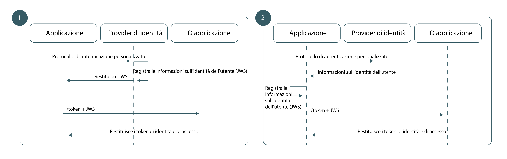

---

copyright:
  years: 2017, 2018
lastupdated: "2018-11-19"

---

{:new_window: target="_blank"}
{:shortdesc: .shortdesc}
{:pre: .pre}
{:tip: .tip}
{:screen: .screen}
{:codeblock: .codeblock}

# Utilizzo dell'identità personalizzata nella tua applicazione
{: #custom-identity}

Puoi utilizzare il tuo provider di identità personalizzato quando esegui l'autenticazione. Il tuo provider di identità può conformarsi a qualsiasi meccanismo di autenticazione alternativo a quelli supportati da {{site.data.keyword.appid_full}}, inclusi proprietà o legacy.
{: shortdesc}

## Panoramica
{: #overview}

Utilizzando il tuo provider di identità, puoi creare un flusso di autenticazione personalizzato che utilizza i tuoi protocolli. Hai maggiore controllo, ad esempio sulle informazioni che vuoi condividere o che sono archiviate.
{: shortdesc}

Assicurati di [configurare il tuo provider personalizzato](/docs/services/appid/custom.html) prima di aggiungerlo alla tua applicazione.
{: tip}

</br>

**Quando dovrei utilizzare questo flusso?**

Quando {{site.data.keyword.appid_short_notm}} non fornisce il supporto diretto per un particolare provider di identità, puoi utilizzare il flusso di identità personalizzato per collegare il protocollo di autenticazione al flusso di autenticazione esistente di {{site.data.keyword.appid_short_notm}}. Ad esempio, vuoi utilizzare GitHub o LinkedIn per consentire agli utenti di accedere. Puoi utilizzare l'SDK esistente del provider di identità per facilitare le informazioni sull'autenticazione utente prima di impacchettarle e scambiarle con {{site.data.keyword.appid_short_notm}}. 

Esistono molti scenari in cui è necessario un flusso di autenticazione differente:

 - Di proprietà, provider di identità interni
 - Provider di identità di terze parti
 - Flussi di autenticazione complessi, che possono includere dei meccanismi multifattore di proprietà

Occasionalmente, un provider legacy potrebbe utilizzare il proprio protocollo di autenticazione personalizzato. Poiché il flusso di identità personalizzato disaccoppia completamente l'autenticazione dall'autorizzazione, puoi utilizzare un qualsiasi meccanismo di autenticazione di tua scelta e fornire le informazioni sull'autenticazione risultanti a {{site.data.keyword.appid_short_notm}}. Tutto questo senza esporre le credenziali utente.

</br>

**Qual è la base tecnica di questo flusso?**

Il flusso di lavoro di identità personalizzato viene creato sul tipo di concessione dell'estensione di connessione JWT definito nel framework di asserzione per OAuth 2.0 Authorization Grants [[RFC7521]](https://tools.ietf.org/html/rfc7523#section-2.1). Per scambiare le informazioni sull'utente con i token {{site.data.keyword.appid_short_notm}}, la tua architettura di autenticazione crea una relazione affidabile con {{site.data.keyword.appid_short_notm}} utilizzando una coppia di chiavi RSA asimmetriche. Una volta stabilita l'affidabilità, puoi utilizzare il tipo di concessione di connessione JWT per scambiare delle informazioni utente verificate all'interno del JWT firmato con i token {{site.data.keyword.appid_short_notm}}.

</br>

**A cosa assomiglia il flusso?**

Come per tutti i flussi di autenticazione, l'identità personalizzata richiede che l'applicazione sia in grado di stabilire un livello di fiducia con {{site.data.keyword.appid_short_notm}} per garantire l'integrità delle informazioni utente del provider di identità. L'identità personalizzata utilizza una coppia di chiavi privata e pubblica RSA asimmetriche per stabilire il proprio livello di fiducia. A seconda dei tuoi requisiti dell'architettura, l'identità personalizzata supporta due modelli di attendibilità che differiscono solo nell'ubicazione di archiviazione e nell'utilizzo della chiave privata.



Figura. I flussi della richiesta per l'autenticazione personalizzata

<dl>
  <dt>1. Provider di identità firmato</dt>
    <dd>Proprio come con i flussi OAuth 2.0 tradizionali, il modello di attendibilità altamente sicuro crea una relazione tra il tuo provider di identità e il server di autorizzazione; in questo caso direttamente {{site.data.keyword.appid_short_notm}}. In questo modello, il tuo provider di identità è responsabile dell'archiviazione della chiave privata e della firma delle asserzioni JWT. Quando passate a {{site.data.keyword.appid_short_notm}}, queste asserzioni vengono convalidate con la chiave pubblica corrispondente, che garantisce che le informazioni utente dal tuo provider di identità non vengano modificate dolosamente durante il trasporto.</dd>
  <dt>2. Applicazione firmata</dt>
    <dd>In alternativa, puoi basare il tuo modello di attendibilità sulla relazione tra la tua applicazione e {{site.data.keyword.appid_short_notm}}. In questo flusso di lavoro, la tua chiave privata viene archiviata nella tua applicazione lato server. Dopo aver eseguito correttamente l'autenticazione, la tua applicazione è responsabile della conversione della risposta dei provider di identità in un JWT e della sua firma con la propria chiave privata prima che l'applicazione invii il token a {{site.data.keyword.appid_short_notm}}. Poiché questo provider di identità non ha alcuna relazione con {{site.data.keyword.appid_short_notm}}, questa architettura crea un modello di attendibilità meno sicuro. Sebbene {{site.data.keyword.appid_short_notm}} possa fidarsi delle informazioni inviate dall'applicazione lato server, non può essere certo dei dati che erano stati inviati in origine dal provider di identità.</dd>
</dl>

</br>

## Generazione di un JWT (JSON web token)
{: #creating-jwts}

Puoi convertire i tuoi dati utente verificati in un JWT di identità personalizzato generando un <a href="https://tools.ietf.org/html/rfc7515" target="blank">JWT (JSON web token) </a>. Il token deve essere firmato con la chiave privata che corrisponde alla tua chiave pubblica preconfigurata. Per un elenco di librerie di firma del token, consulta <a href="https://jwt.io/" target="blank">jwt.io </a>.
{: shortdesc}

### Formato JWT di esempio

Intestazione token:
  ```
  {
  "alg": "RS256",
  "typ": "JOSE"
  }
  ```
  {: screen}

Payload del token:
  ```
  {
    // Required
    iss: String, // Should reference your identity provider
    aud: String, // Must be the OAuth server host name
    exp: Int,    // Should be a value with a short lifespan
    sub: String, // Must be the unique user ID provided by your identity provider

    // Normalized claims (optional)
    name: String
    email: String
    locale: String
    picture: String
    gender: String

    // Custom Scopes to add to access token (optional)
    scope="custom_scope1 custom_scope2"

    // Other custom claims (optional)
    role="admin"
  }
  ```
  {: screen}

  <table>
  <thead>
    <th colspan=2> Campi JWS</th>
  </thead>
  <tbody>
    <tr>
      <td><code>iss</code></td>
      <td>Dovrebbe contenere un riferimento al tuo provider di identità.</td>
    </tr>
    <tr>
      <td><code>aud</code></td>
      <td>L'host server OAuth.</td>
    </tr>
    <tr>
      <td><code>exp</code></td>
      <td>Per quanto tempo è valido il token. Per motivi di sicurezza, dovrebbe avere una durata breve ed essere specifico.</td>
    </tr>
    <tr>
      <td><code>sub</code></td>
      <td>L'ID utente univoco fornito dal provider di identità.</td>
    </tr>
    <tr>
      <td>Attestazioni normalizzate </td>
      <td>Tutte le [attestazioni normalizzate](/docs/services/appid/authorization.html#tokens) vengono fornite nel token di identità restituito nella risposta a questa richiesta. Possono essere trovate delle ulteriori attestazioni personalizzate utilizzando l'[endpoint sulle informazioni utente](/docs/services/appid/custom-attributes.html).</td>
    </tr>
    <tr>
      <td>Ambito </td>
      <td>Per impostazione predefinita, tutti i token {{site.data.keyword.appid_short_notm}} contengono un gruppo di ambiti preimpostati. Puoi richiedere ulteriori ambiti in uno dei seguenti modi:<ul><li> Specifica l'ambito nel campo dell'ambito del tuo token JWS.</li> <li>Specifica l'ambito tramite il parametro url-form scopes della richiesta `/token`.</li></ul></td>
    </tr>
  </tbody>
  </table>

## Richiamo dei token {{site.data.keyword.appid_short_notm}} 
{: #exchanging-jwts}

Per creare il bridge tra il tuo provider personalizzato e {{site.data.keyword.appid_short_notm}}, devi avere dei token {{site.data.keyword.appid_short_notm}}. Per ottenere i token del servizio, scambia le tue informazioni utente verificate utilizzando l'endpoint [`/token`](https://appid-oauth.ng.bluemix.net/swagger-ui/#!/Authorization_Server_V3/token).
{: shortdesc}

  ```
  Post /token
  Content-Type: application/x-www-from-urlencoded
  grant_type=urn:ietf:params:oauth:grant-type:jwt-bearer
  assertion=<payload>
  scope="<space separated scope array>"
  ```
  {: codeblock}
  <table>
    <thead>
      <th colspan=2> Costruzione della richiesta</th>
    </thead>
    <tbody>
      <tr>
        <td>Tipo di contenuto</td>
        <td><code>applications/x-www-from-urlencoded</code></td>
      </tr>
      <tr>
        <td>tipo di concessione</td>
        <td><code>urn:ietf:params:oauth:grant-type:jwt-bearer</code></td>
      </tr>
      <tr>
        <td>asserzione</td>
        <td>Una stringa del payload JWS.</td>
      </tr>
      <tr>
        <td>ambito</td>
        <td>Un elenco separato da spazi vuoti dei tuoi ambiti personalizzati.</td>
      </tr>
    </tbody>
  </table>
