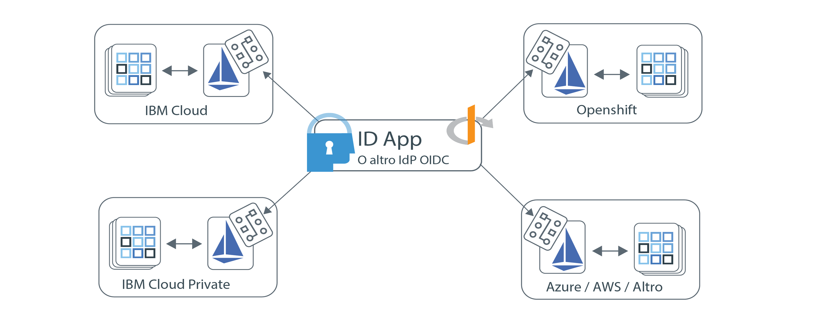

---

copyright:
  years: 2017, 2019
lastupdated: "2019-07-11"

keywords: Authentication, authorization, identity, app security, access, secure, development, any kube, kubernetes, icp, openshift, iks

subcollection: appid

---

{:external: target="_blank" .external}
{:shortdesc: .shortdesc}
{:screen: .screen}
{:pre: .pre}
{:table: .aria-labeledby="caption"}
{:codeblock: .codeblock}
{:tip: .tip}
{:note: .note}
{:important: .important}
{:deprecated: .deprecated}
{:download: .download}

# Protezione delle applicazioni multicloud con Istio
{: #istio-adapter}

Utilizzando l'adattatore App Identity and Access, puoi centralizzare tutta la tua gestione dell'identità in un unico punto. Poiché le aziende utilizzano i cloud da più fornitori o una combinazione di soluzioni on-premises e off-premises, dei modelli di distribuzione eterogenei possono aiutarti a preservare l'infrastruttura esistente ed evitare condizioni di dipendenza da uno specifico fornitore (vendor lock-in). L'adattatore può essere configurato per funzionare con qualsiasi provider di identità conforme a IODC, come ad esempio {{site.data.keyword.appid_short_notm}}, che gli consente di controllare le politiche di autenticazione e autorizzazione in tutti gli ambienti che includono applicazioni front-end e backend. Inoltre, **esegue tutto ciò senza alcuna modifica al tuo codice o che occorra ridistribuire la tua applicazione**.
{: shortdesc}


## Architettura multicloud
{: #istio-multicloud}

Un ambiente di calcolo multicloud combina più ambienti di calcolo cloud e/o privati in una singola architettura di rete. Distribuendo carichi di lavoro a più ambienti, potresti trovare una resilienza e una flessibilità migliorati e una maggiore efficienza in termini di costi. Per ottenere i vantaggi, è prassi comune utilizzare applicazioni basate sui contenitori con un livello di orchestrazione, come ad esempio Kubernetes.


Figura. Distribuzione multicloud - ottenuta con l'adattatore App Identity and Access.


## Descrizione di Istio e dell'adattatore
{: #istio-architecure}

[Istio](https://istio.io) è una rete di servizi open source che si dispone in modo trasparente sulle applicazioni distribuite esistenti che possono integrarsi con Kubernetes. Per ridurre la complessità delle distribuzioni, Istio fornisce informazioni comportamentali e un controllo operativo sulla rete di servizi nel suo insieme. Quando l'ID applicazione viene combinato con Istio, diventa una soluzione di identità integrata e scalabile per architetture multicloud che non richiede modifiche del codice applicativo personalizzate. Per ulteriori informazioni, consulta ["What is Istio?"](https://www.ibm.com/cloud/learn/istio?cm_mmc=OSocial_Youtube-_-Hybrid+Cloud_Cloud+Platform+Digital-_-WW_WW-_-IstioYTDescription&cm_mmca1=000023UA&cm_mmca2=10010608){: external}.

Istio utilizza un sidecar proxy Envoy per mediare tutto il traffico in entrata e in uscita per tutti i servizi nella rete di servizi. Utilizzando il proxy, Istio estrae le informazioni sul traffico (la cosiddetta telemetria) che vengono inviate al componente Istio chiamato Mixer per implementare le decisioni delle politiche. L'adattatore Identità and Access estende la funzionalità Mixer analizzando la telemetria (attributi) rispetto alle politiche personalizzate per controllare la gestione di identità e accesso all'interno e nell'ambito della rete di servizi. Le politiche di gestione dell'accesso sono collegate a specifici servizi Kubernetes e possono essere regolate con precisione a specifici endpoint del servizio. Per ulteriori informazioni sulle politiche e sulla telemetria, consulta la [documentazione di Istio](https://istio.io/docs/concepts/observability/){: external}. 

A causa di una limitazione di Istio, l'adattatore App Identity and Access attualmente archivia le informazioni sulla sessione utente internamente e *non* rende persistenti le informazioni nelle repliche o sulle configurazioni di failover. Quando utilizzi l'adattatore, limita i tuoi carichi di lavoro a una singola replica finché la limitazione non verrà risolta.
{: note}

### Protezione delle applicazioni front-end
{: #istio-frontend}

Se stai utilizzando un'applicazione basata sul browser, puoi utilizzare il flusso [OIDC (Open ID Connect)](https://openid.net/specs/openid-connect-core-1_0.html){: external} / OAuth 2.0 `authorization_grant` per autenticare i tuoi utenti. Quando viene rilevato, un utente non autenticato viene reindirizzato automaticamente alla pagina di autenticazione. Quando l'autenticazione viene completata, il browser viene reindirizzato ad un endpoint `/oidc/callback` implicito dove l'adattatore intercetta la richiesta. A questo punto, l'adattatore ottiene i token dal provider di identità e quindi reindirizza l'utente al suo URL richiesto in origine.

Per visualizzare le informazioni sulla sessione utente, inclusi i token di sessione, puoi consultare l'intestazione `Autorization`.

```
Authorization: Bearer <access_token> <id_token>
```
{: screen}

Puoi anche disconnettere gli utenti autenticati. Quando un utente autenticato accede a qualsiasi endpoint protetto con `oidc/logout` accodato come mostrato nel seguente esempio, viene disconnesso.

```
https://myhost/path/oidc/logout
```
{: screen}

Se necessario, può essere utilizzato un token di aggiornamento per automatizzare l'acquisizione di nuovi token di accesso e identità senza che il tuo utente debba rieseguire l'autenticazione. Se il provider di identità configurato restituisce un token di aggiornamento, viene reso persistente nella sessione e utilizzato per richiamare i nuovi token quando il token di identità scade.


### Protezione delle applicazioni di backend
{: #istio-backend}

L'adattatore può essere utilizzato in collaborazione con il [flusso di connessione JWT](https://tools.ietf.org/html/rfc6750){: external} OAuth 2.0 per proteggere le API di servizio convalidando i token di connessione JWT. Il flusso di autorizzazione di autenticazione prevede che una richiesta contenga un'intestazione di autorizzazione con un token di accesso valido e un token di identità facoltativo. La struttura di intestazione prevista è `Authorization=Bearer {access_token} [{id_token}]`. Ai client non autenticati viene restituito uno stato della risposta HTTP 401 con un elenco degli ambiti necessari per ottenere l'autorizzazione. Se i token non sono validi o sono scaduti, la strategia API restituisce una risposta HTTP 401 con un componente di errore facoltativo che indica `Www-Authenticate=Bearer scope="{scope}" error="{error}"`.


Per ulteriori informazioni sui token e sul modo in cui vengono utilizzati, vedi [descrizione dei token](/docs/services/appid?topic=appid-tokens).


## Prima di cominciare
{: #istio-before}

Prima di iniziare, assicurati di avere installato i seguenti prerequisiti.

- [Cluster Kubernetes](https://kubernetes.io/){: external}
- [Helm](https://helm.sh/){: external}
- [Istio v1.1+](https://istio.io/docs/setup/kubernetes/install/){: external}
  
  Puoi anche utilizzare [IBM Cloud Kubernetes Service Managed Istio](/docs/containers?topic=containers-istio).
  {: note}


## Installazione dell'adattatore
{: #istio-install-adapter}

Per installare il grafico, inizializza Helm nel tuo cluster, definisci le opzioni che vuoi utilizzare ed esegui quindi il comando di installazione.

1. Se stai lavorando con il servizio IBM Cloud Kubernetes, assicurati di eseguire l'accesso e di impostare il contesto per il tuo cluster.

2. Installa Helm nel tuo cluster.

    ```bash
    helm init
    ```
    {: codeblock}

    Potresti voler configurare Helm per utilizzare la modalità `--tls`. Per assistenza nell'abilitazione di TLS, vedi il [repository Helm](https://github.com/helm/helm/blob/master/docs/tiller_ssl.md){: external}. Se abiliti TLS, assicurati di accodare `--tls` a ogni comando Helm che esegui. Per ulteriori informazioni sull'utilizzo di Helm con il servizio IBM Cloud Kubernetes, vedi [Aggiunta di servizi utilizzando i grafici Helm](/docs/containers?topic=containers-helm#public_helm_install).
    {: tip}

3. Installa il grafico.

    ```bash
    helm install ./helm/appidentityandaccessadapter --name appidentityandaccessadapter
    ```
    {: codeblock}

## Applicazione di una politica di autorizzazione e di autenticazione
{: #istio-apply-policy}

Una politica di autenticazione o di autorizzazione è una serie di condizioni che deve essere soddisfatta prima che una richiesta possa accedere a una risorsa. Definendo la configurazione del servizio di un provider di identità e una politica che indica quando deve essere utilizzato uno specifico flusso, puoi controllare l'accesso a qualsiasi risorsa nella tua rete di servizi. Per vedere delle CRD di esempio, vedi la [directory samples](https://github.com/ibm-cloud-security/app-identity-and-access-adapter/tree/master/samples/crds){: external}.

Per creare una politica:

1. Definisci una configurazione.
2. Registra l'endpoint.

### Definizione di una configurazione
{: #istio-apply-define}

A seconda del fatto che tu stia proteggendo applicazioni front-end o backend, crea una configurazione della politica con una delle seguenti opzioni.

* Per le applicazioni front-end: le applicazioni basate sul browser che richiedono l'autenticazione utente possono essere configurate per utilizzare il flusso di autenticazione OIDC / OAuth 2.0. Per definire una CRD `OidcConfig` che contiene il client utilizzato per facilitare il flusso di autenticazione con il provider di identità, utilizza il seguente esempio come una guida.

    ```yaml
    apiVersion: "security.cloud.ibm.com/v1"
    kind: OidcConfig
    metadata:
        name:      oidc-provider-config
        namespace: sample-namespace
    spec:
        discoveryUrl: https://us-south.appid.cloud.ibm.com/oauth/v4/<tenant-ID>/oidc-discovery/.well-known
        clientId:     <client-ID>
        clientSecret: <randomlyGeneratedClientSecret>
        clientSecretRef:
            name: <name-of-my-kube-secret>
            key: <key-in-my-kube-secret>
    ```
    {: screen}

    <table>
        <thead>
        <tr>
            <th>Campo</th>
            <th style="text-align:center">Tipo</th>
            <th style="text-align:center">Valore obbligatorio</th>
            <th style="text-align:center">Descrizione</th>
        </tr>
        </thead>
        <tbody>
        <tr>
            <td><code>discoveryUrl</code></td>
            <td style="text-align:center">stringa</td>
            <td style="text-align:center">Sì</td>
            <td style="text-align:center">Un endpoint ben noto che fornisce un documento JSON di informazioni sulla configurazione di OIDC/OAuth 2.0.</td>
        </tr>
        <tr>
            <td><code>clientId</code></td>
            <td style="text-align:center">stringa</td>
            <td style="text-align:center">Sì</td>
            <td style="text-align:center">Un identificativo per il client che viene utilizzato per l'autenticazione.</td>
        </tr>
        <tr>
            <td><code>clientSecret</code></td>
            <td style="text-align:center">stringa</td>
            <td style="text-align:center">*No</td>
            <td style="text-align:center">Un segreto in testo semplice che viene utilizzato per autenticare il client. Se non viene fornito, deve esistere un <code>clientSecretRef</code>.</td>
        </tr>
        <tr>
            <td><code>clientSecretRef</code></td>
            <td style="text-align:center">oggetto</td>
            <td style="text-align:center">No</td>
            <td style="text-align:center">Un segreto di riferimento che viene utilizzato per autenticare il client. Il riferimento può essere utilizzato al posto di <code>clientSecret</code>.</td>
        </tr>
        <tr>
            <td><code>clientSecretRef.name</code></td>
            <td style="text-align:center">stringa</td>
            <td style="text-align:center">Sì</td>
            <td style="text-align:center">Il nome del segreto Kubernetes che contiene il <code>clientSecret</code>.</td>
        </tr>
        <tr>
            <td><code>clientSecretRef.key</code></td>
            <td style="text-align:center">stringa</td>
            <td style="text-align:center">Sì</td>
            <td style="text-align:center">Il campo all'interno del segreto Kubernetes che detiene il <code>clientSecret</code>.</td>
        </tr>
        </tbody>
    </table>

* Per le applicazioni backend: la specifica del token di connessione OAuth 2.0 definisce un modello per la protezione delle API utilizzando i [JWT (JSON Web Token)](https://tools.ietf.org/html/rfc7519.html){: external}. Utilizzando la seguente configurazione come esempio, definisci una CRD `JwtConfig` che contiene la risorsa chiave pubblica, che viene utilizzata per convalidare le firme dei token.

    ```yaml
    apiVersion: "security.cloud.ibm.com/v1"
    kind: JwtConfig
    metadata:
      name:      jwt-config
      namespace: sample-app
    spec:
        jwksUrl: https://us-south.appid.cloud.ibm.com/oauth/v4/<tenant-ID>/publickeys
    ```
    {: screen}

### Registrazione degli endpoint dell'applicazione
{: #istio-register-endpoints}

Registra gli endpoint dell'applicazione all'interno di una CRD `Policy` per convalidare le richieste in entrata e implementare le regole di autenticazione. Ogni `Policy` si applica esclusivamente allo spazio dei nomi Kubernetes in cui risiede l'oggetto e può specificare i servizi, i percorsi e i metodi che vuoi proteggere.

```yaml
apiVersion: "security.cloud.ibm.com/v1"
kind: Policy
metadata:
  name:      samplepolicy
  namespace: sample-app
spec:
  targets:
    -
      serviceName: <svc-sample-app>
      paths:
        - exact: /web/home
          method: ALL
          policies:
            - policyType: oidc
              config: <oidc-provider-config>
              rules:
                - claim: scope
                  match: ALL
                  source: access_token
                  values:
                    - appid_default
                    - openid
                - claim: amr
                  match: ANY
                  source: id_token
                  values:
                    - cloud_directory
                    - google

        - exact: /web/user
          method: GET
          policies:
            - policyType: oidc
              config: <oidc-provider-config>
              redirectUri: https://github.com/ibm-cloud-security/app-identity-and-access-adapter
        - prefix: /
          method: ALL
          policies:
            -
              policyType: jwt
              config: <jwt-config>
```
{: screen}


| Oggetto servizio | Tipo | Valore obbligatorio | Descrizione   |
|:----------------:|:----:|:--------:| :-----------: |
| `service` | `string` | Sì | Il nome del servizio Kubernetes nello spazio dei nomi Policy che vuoi proteggere. |
| `paths` | `array[Path Object]` | Sì | Un elenco di oggetti percorso che definiscono gli endpoint che vuoi proteggere. Se lasciato vuoto, tutti i percorsi sono protetti. |
{: class="simple-tab-table"}
{: caption="Tabella 1. Descrizione dei componenti oggetto servizio" caption-side="top"}
{: #service-object}
{: tab-title="Service object"}
{: tab-group="objects"}

| Oggetto percorso    | Tipo | Valore obbligatorio | Descrizione   |
|:----------------:|:----:|:--------:|:-----------:|
| `exact or prefix` | `string` | Sì | Il percorso su cui vuoi applicare le politiche. Le opzioni includono `exact` e `prefix`. `exact` esegue la messa in corrispondenza degli endpoint forniti esattamente con l'ultimo `/` tagliato. `prefix` esegue la messa in corrispondenza degli endpoint che iniziano con il prefisso di instradamento da te fornito. |
| `method` | `enum` | No | Il metodo HTTP protetto. Opzioni valide ALL, GET, PUT, POST, DELETE, PATCH - Il valore predefinito è ALL:  |
| `policies` | `array[Policy]` | No | Le politiche OIDC/JWT che vuoi applicare.  |
{: class="simple-tab-table"}
{: caption="Tabella 2. Descrizione dei componenti oggetto percorso" caption-side="top"}
{: #path-object}
{: tab-title="Path object"}
{: tab-group="objects"}

| Oggetto politica  | Tipo | Valore obbligatorio | Descrizione   |
|:----------------:|:----:|:--------:| :-----------: |
| `policyType` | `enum` | Sì | Il tipo di politica OIDC. Le opzioni includono: `jwt` o `oidc`. |
| `config` | `string` | Sì |Il nome della configurazione provider che vuoi utilizzare.|
| `redirectUri` | `string` | No | L'URL a cui vuoi che venga reindirizzato l'utente dopo un'autenticazione eseguita correttamente: il valore predefinito è l'URL della richiesta originale. |
| `rules` | `array[Rule]` | No | La serie di regole che vuoi utilizzare per la convalida del token. |
{: class="simple-tab-table"}
{: caption="Tabella 3. Descrizione dei componenti oggetto politica" caption-side="top"}
{: #policy-object}
{: tab-title="Policy object"}
{: tab-group="objects"}

| Oggetto regola  | Tipo | Valore obbligatorio | Descrizione   |
|:----------------:|:----:|:--------:| :-----------: |
| `claim` | `string` | Sì | L'attestazione che vuoi convalidare. |
| `match` | `enum` | No | I criteri richiesti per la convalida dell'attestazione. Le opzioni includono: `ALL`, `ANY` o `NOT`. Il valore predefinito è impostato su `ALL`. |
| `source` | `enum` | No | Il token dove vuoi applicare la regola. Le opzioni includono: `access_token` o `id_token`. Il valore predefinito è impostato su `access_token`. |
| `values` | `array[string]` | Sì | La serie richiesta di valori per la convalida. |
{: class="simple-tab-table"}
{: caption="Tabella 4. Descrizione dei componenti oggetto politica" caption-side="top"}
{: #rule-object}
{: tab-title="Rule object"}
{: tab-group="objects"}


## Eliminazione dell'adattatore
{: #istio-remove}

Per rimuovere l'adattatore e tutte le CRD associate, devi eliminare il grafico Helm e le chiavi di firma e crittografia associate.

```bash
helm delete --purge appidentityandaccessadapter
kubectl delete secret appidentityandaccessadapter-keys -n istio-system
```
{: codeblock}


## Domande frequenti e risoluzione dei problemi
{: #istio-faq}

Se riscontri un problema mentre lavori con l'adattatore App Identity and Access, tieni conto delle seguenti domande frequenti e tecniche di risoluzione dei problemi. Per un ulteriore aiuto, puoi fare domande tramite un forum oppure aprire un ticket di supporto. Quando utilizzi i forum per fare una domanda, contrassegna con tag la tua domanda in modo che sia vista dal team di sviluppo {{site.data.keyword.appid_short_notm}}.

  * Se hai domande tecniche su {{site.data.keyword.appid_short_notm}}, inserisci la tua domanda in <a href="https://stackoverflow.com/" target="_blank">Stack Overflow </a> e contrassegnala con la tag "ibm-appid".
  * Per domande sul servizio e sulle istruzioni per l'utilizzo iniziale, utilizza il forum <a href="https://developer.ibm.com/" target="_blank">dW Answers </a>. Includi la tag `appid`.

Per ulteriori informazioni su come ottenere supporto, consulta [Come posso ottenere il supporto di cui ho bisogno?](/docs/get-support?topic=get-support-getting-customer-support#getting-customer-support).


### Risoluzione dei problemi: Registrazione
{: #istio-logging}

Per impostazione predefinita, i log sono in formato JSON e hanno un livello di visibilità `info` per provvedere a facilitare l'integrazione con i sistemi di registrazione esterni. Per aggiornare la configurazione della registrazione, puoi utilizzare il grafico Helm. I livelli di registrazione supportati includono l'intervallo [-1, 7] come mostrato in Zap core. Per ulteriori informazioni sui livelli, vedi la [documentazione di Zap core](https://godoc.org/go.uber.org/zap/zapcore#Level).

Quando stai visualizzando in modo manuale i log JSON, potresti voler scrivere i log in un formato standard e generarli in output in un formato JSON leggibile utilizzando [`jq`](https://brewinstall.org/install-jq-on-mac-with-brew/).
{: note}

**Adattatore**

Per visualizzare i log dell'adattatore, puoi utilizzare `kubectl` oppure accedere al pod `appidentityandaccessadapter` dalla console Kubernetes.

```bash
$ alias adapter_logs="kubectl -n istio-system logs -f $(kubectl -n istio-system get pods -lapp=appidentityandaccessadapter -o jsonpath='{.items[0].metadata.name}')"
$ adapter_logs | jq
```
{: codeblock}

**Mixer**

Se sembra che l'adattatore non riceva richieste, controlla i log di Mixer per assicurarti che sia correttamente connesso all'adattatore.

```bash
$ alias mixer_logs="kubectl -n istio-system logs -f $(kubectl -n istio-system get pods -lapp=telemetry -o jsonpath='{.items[0].metadata.name}') -c mixer"
$ mixer_logs | jq
```
{: codeblock}

