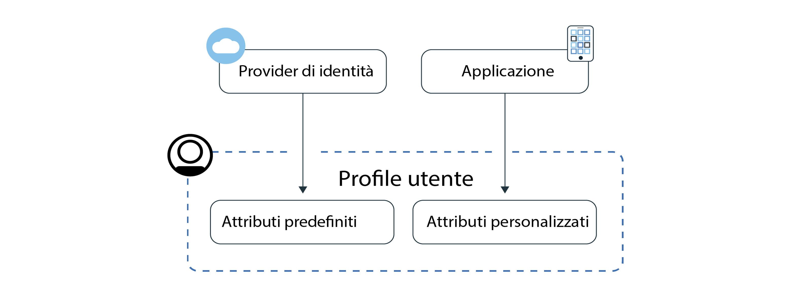
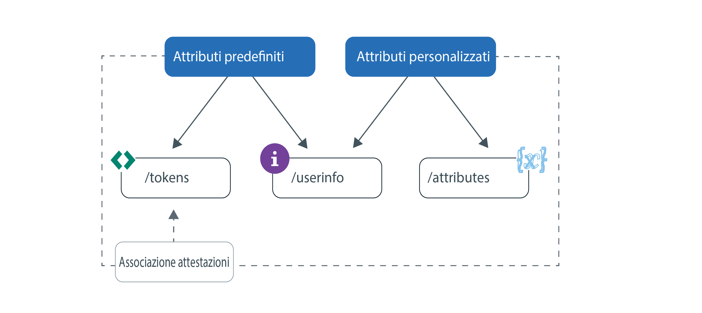

---

copyright:
  years: 2017, 2019
lastupdated: "2019-06-06"

keywords: Authentication, authorization, identity, app security, secure, attributes, user information, storing, accessing

subcollection: appid

---

{:new_window: target="_blank"}
{:shortdesc: .shortdesc}
{:screen: .screen}
{:pre: .pre}
{:table: .aria-labeledby="caption"}
{:codeblock: .codeblock}
{:tip: .tip}
{:note: .note}
{:important: .important}
{:deprecated: .deprecated}
{:download: .download}
{:java: .ph data-hd-programlang='java'}
{:javascript: .ph data-hd-programlang='javascript'}
{:swift: .ph data-hd-programlang='swift'}
{:curl: .ph data-hd-programlang='curl'}


# Memorizzazione e accesso ai profili 
{: #profiles}

Un profilo utente contiene tutte le informazioni note su uno specifico utente compilate in un oggetto e memorizzate da {{site.data.keyword.appid_full}}. Le informazioni possono essere predefinite, assegnate o acquisite dai tuoi utenti mentre interagiscono con la tua applicazione. Per avvalerti della funzione profili, puoi creare delle esperienze dell'applicazione personalizzate per ogni utente.
{: shortdesc}


Cerchi le informazioni sui tuoi utenti Cloud Directory? Consulta [gestione utenti](/docs/services/appid?topic=appid-cd-users).
{: tip}

Esistono due tipi di informazioni che possono essere ottenute e archiviate da App ID: attributi predefiniti e personalizzati. Gli attributi predefiniti sono specifici per l'identità dei tuoi utenti e sono restituiti da un provider di identità quando il tuo utente accede alla tua applicazione e possono includere delle informazioni come nome ed età. Gli attributi personalizzati sono utilizzati per archiviare ulteriori informazioni sui tuoi utenti. Li puoi impostare tu stesso oppure vengono acquisiti quando l'utente interagisce con la tua applicazione. Gli attributi personalizzati possono includere un ruolo assegnato, una preferenza alimentare o una preferenza di posto accanto al corridoio su un aeroplano.



Figura. Flusso di informazioni del profilo utente


Puoi archiviare 100 KB di informazioni per ogni utente.
{: note}


## Accesso ai profili utente
{: #profile-access}

Esistono diversi modi con cui puoi accedere agli attributi. Dopo una corretta autenticazione utente, la tua applicazione riceve i token di accesso e identità da {{site.data.keyword.appid_short_notm}}. Sia le informazioni utente che gli endpoint degli attributi personalizzati sono protetti da un token di accesso generato da {{site.data.keyword.appid_short_notm}} alla fine del processo di autenticazione. Il token di identità contiene un sottoinsieme normalizzato di attributi utente (informazioni) che viene restituito da un provider di identità. Per ottenere l'elenco completo degli attributi utente, puoi utilizzare l'endpoint [`/userinfo` OIDC](https://us-south.appid.cloud.ibm.com/swagger-ui/#/Authorization_Server_V4/userInfo). 
{: shortdesc}


Per ulteriori informazioni sui token di identità e accesso, vedi [Descrizione](/docs/services/appid?topic=appid-tokens#tokens) e [Convalida dei token](/docs/services/appid?topic=appid-token-validation).


Controlla la seguente immagine per vedere i diversi modi in cui puoi ottenere le informazioni sull'utente.


Figura. Accesso alle opzioni del profilo utente


App ID inserisce automaticamente un sottoinsieme di attributi nei tuoi token di accesso e identità. Puoi avvalerti dell'associazione delle attestazioni personalizzate e associare altre attestazioni predefinite e personalizzate nei tuoi token. Per ulteriori dettagli sul modo consigliato di accedere alle informazioni sull'utente, vedi [personalizzazione dei token](/docs/services/appid?topic=appid-customizing-tokens).
{: note}


### Accesso all'endpoint /userinfo con un SDK
{: #profile-predefined-access}

Per visualizzare le informazioni sui tuoi utenti fornite dai tuoi provider di identità configurati, puoi accedere ai tuoi attributi predefiniti.
{: shortdesc}

**iOS Swift**
{: ph data-hd-programlang='swift'}

Se i nuovi token non vengono inoltrati esplicitamente al SDK, {{site.data.keyword.appid_short_notm}} utilizza gli ultimi token ricevuti per richiamare e convalidare la risposta. Ad esempio, puoi eseguire il seguente codice dopo un'autenticazione riuscita e l'SDK richiama ulteriori informazioni sull'utente.
{: ph data-hd-programlang='swift'}

```
AppID.sharedInstance.userProfileManager.getUserInfo { (error: Error?, userInfo: [String: Any]?) in
	guard let userInfo = userInfo, err == nil {
		return // si è verificato un errore
	}
	// informazioni utente richiamate correttamente
}
```
{: codeblock}
{: ph data-hd-programlang='swift'}

In alternativa, puoi inoltrare esplicitamente i token di accesso e di identità. Il token di identità è facoltativo, ma quando viene passato, viene utilizzato per convalidare la risposta delle informazioni utente.
{: ph data-hd-programlang='swift'}

```
AppID.sharedInstance.userProfileManager.getUserInfo(accessToken: String, identityToken: String?) { (error: Error?, userInfo: [String: Any]?) in
	guard let userInfo = userInfo, err == nil {
		return // si è verificato un errore
	}
	// informazioni utente richiamate correttamente
}
```
{: codeblock}
{: ph data-hd-programlang='swift'}

**Java**
{: ph data-hd-programlang='java'}

Se i nuovi token non vengono inoltrati esplicitamente al SDK, {{site.data.keyword.appid_short_notm}} utilizza gli ultimi token ricevuti per richiamare e convalidare la risposta. Ad esempio, puoi eseguire il seguente codice dopo un'autenticazione riuscita e l'SDK richiama ulteriori informazioni sull'utente.
{: ph data-hd-programlang='java'}

```
AppID appId = AppID.getInstance();

appId.getUserProfileManager().getUserInfo(new UserProfileResponseListener() {
	@Override
	public void onSuccess(JSONObject userInfo) {
		// informazioni utente richiamate correttamente
	}

	@Override
	public void onFailure(UserInfoException e) {
		// si è verificata un'eccezione
	}
});
```
{: codeblock}
{: ph data-hd-programlang='java'}

In alternativa, puoi inoltrare esplicitamente i token di accesso e di identità. Il token di identità è facoltativo. Ma quando viene passato, viene utilizzato per convalidare la risposta.
{: ph data-hd-programlang='java'}

```
AppID appId = AppID.getInstance();

appId.getUserProfileManager().getUserInfo(accessToken, identityToken, new UserProfileResponseListener() {
	@Override
	public void onSuccess(JSONObject userInfo) {
		// attributo "name" richiamato correttamente
	}

	@Override
	public void onFailure(UserInfoException e) {
		// si è verificata un'eccezione
	}
});
```
{: codeblock}
{: ph data-hd-programlang='java'}

**Node.js**
{: ph data-hd-programlang='javascript'}

Utilizzando un SDK lato server, puoi richiamare ulteriori informazioni sui tuoi utenti. Puoi richiamare il seguente metodo utilizzando i token di identità e di accesso memorizzati oppure puoi inoltrare esplicitamente i token. Il token di identità è facoltativo, ma quando viene passato, viene utilizzato per convalidare la risposta delle informazioni utente.
{: ph data-hd-programlang='javascript'}

```javascript
let userProfileManager = UserProfileManager(options: options)

let accessToken = req.session[WebAppStrategy.AUTH_CONTEXT].accessToken;
let identityToken = req.session[WebAppStrategy.AUTH_CONTEXT].identityToken;


// Richiama la informazioni utente e le convalida con il token di identità fornito
userProfileManager.getUserInfo(accessToken, identityToken).then(function (profile) {
	// informazioni utente richiamate correttamente
});

// Richiama la informazioni utente senza convalida
userProfileManager.getUserInfo(accessToken).then(function (profile) {
	// informazioni utente richiamate correttamente
});
```
{: codeblock}
{: ph data-hd-programlang='javascript'}


**Swift lato server**
{: ph data-hd-programlang='swift'}

Utilizzando un SDK lato server, puoi richiamare ulteriori informazioni sui tuoi utenti. Puoi richiamare il seguente metodo utilizzando i token di identità e di accesso memorizzati oppure puoi inoltrare esplicitamente i token. Il token di identità è facoltativo, ma quando viene passato, viene utilizzato per convalidare la risposta delle informazioni utente.
{: ph data-hd-programlang='swift'}


```swift
let userProfileManager = UserProfileManager(options: options)

let accessToken = "<access token>"
let identityToken = "<identity token>"

// Se viene fornito il token di identità (metodo consigliato), la risposta viene convalidata con il token
userProfileManager.getUserInfo(accessToken: accessToken, identityToken: identityToken) { (err, userInfo) in
	guard let userInfo = userInfo, err == nil {
		return // si è verificato un errore
	}
	// informazioni utente richiamate correttamente
}

// Richiama le informazioni utente senza convalida
userProfileManager.getUserInfo(accessToken: accessToken) { (err, userInfo) in
	guard let userInfo = userInfo, err == nil {
		return // si è verificato un errore
	}
	// informazioni utente richiamate correttamente
}
```
{: codeblock}
{: ph data-hd-programlang='swift'}


### Accesso all'endpoint /userinfo con l'API
{: #profile-predefined-api}


Puoi visualizzare ulteriori informazioni tramite l'endpoint `/userinfo`.

1. Assicurarti di disporre di un token di accesso valido con un ambito `openid`. Puoi verificare che il token è valido utilizzando l'endpoint `/introspect`.

2. Esegui una richiesta all'endpoint [`/userinfo`](https://us-south.appid.cloud.ibm.com/swagger-ui/#/Authorization_Server_V4/userInfo).
  ```
  GET [POST] https://{oauth-server-endpoint}/userinfo
  Authorization: 'Bearer {ACCESS_TOKEN}'
  ```
  {: codeblock}

  Output di esempio:
  ```
  "sub": "cad9f1d4-e23b-3683-b81b-d1c4c4fd7d4c",
  "name": "John Doe",
  "email": "john.doe@gmail.com",
  "picture": "https://lh3.googleusercontent.com/-XdUIqdbhg/AAAAAAAAI/AAAAAAA/42rbcbv5M/photo.jpg",
  "gender": "male",
  "locale": "en",
  "identities": [
      {
          "provider": "google",
          "id": "104560903311317789798",
          "profile": {
              "id": "104560903311317789798",
              "email": "john.doe@gmail.com",
              "verified_email": true,
              "name": "John Doe",
              "given_name": "John",
              "family_name": "Doe",
              "link": "https://plus.google.com/104560903311317789798",
              "picture": "https://lh3.googleusercontent.com/-XdUIqdbhg/AAAAAAAAI/AAAAAAA/42rbcbv5M/photo.jpg",
              "gender": "male",
              "locale": "en",
              "idpType": "google"
          }
      }
  ]
  ```
  {: screen}

3. Verificare che l'attestazione `sub` corrisponda esattamente all'attestazione `sub` nel token di identità. Se non corrispondono, non utilizzare le informazioni restituite. Per ulteriori informazioni sulla sostituzione dei token, consulta la <a href="https://openid.net/specs/openid-connect-core-1_0.html#TokenSubstitution" target="__blank">specifica OIDC </a>.

Se le modifiche vengono apportate da un provider di identità esterno, puoi ottenere le informazioni aggiornate quando gli utenti accedono nuovamente. I tuoi nuovi token richiamano i dati più aggiornati.
{: tip}


### Accesso all'endpoint `/attributes` 
{: #profile-attributes-access}

A seconda della tua configurazione, gli attributi sono codificati e salvati come parte di un profilo utente quando un utente interagisce con la tua applicazione. L'interazione potrebbe essere un accesso utente o l'impostazione di una preferenza nella tua applicazione. Per accedere agli attributi, passa un token di accesso tramite un metodo API.
{: shortdesc}

**iOS Swift**
{: ph data-hd-programlang='swift'}

  ```
  func setAttribute(key: String, value: String, completionHandler: @escaping(Error?, [String:Any]?) -> Void)
  func setAttribute(key: String, value: String, accessTokenString: String, completionHandler: @escaping(Error?, [String:Any]?) -> Void)

  func getAttribute(key: String, completionHandler: @escaping(Error?, [String:Any]?) -> Void)
  func getAttribute(key: String, accessTokenString: String, completionHandler: @escaping(Error?, [String:Any]?) -> Void)

  func getAttributes(completionHandler: @escaping(Error?, [String:Any]?) -> Void)
  func getAttributes(accessTokenString: String, completionHandler: @escaping(Error?, [String:Any]?) -> Void)

  func deleteAttribute(key: String, completionHandler: @escaping(Error?, [String:Any]?) -> Void)
  func deleteAttribute(key: String, accessTokenString: String, completionHandler: @escaping(Error?, [String:Any]?) -> Void)
  ```
  {: codeblock}
  {: ph data-hd-programlang='swift'}

  **Java**
  {: ph data-hd-programlang='java'}

  ```
  void setAttribute(@NonNull String name, @NonNull String value, UserAttributeResponseListener listener);
  void setAttribute(@NonNull String name, @NonNull String value, @NonNull AccessToken accessToken, UserAttributeResponseListener listener);

  void getAttribute(@NonNull String name, UserAttributeResponseListener listener);
  void getAttribute(@NonNull String name, @NonNull AccessToken accessToken, UserAttributeResponseListener listener);

  void deleteAttribute(@NonNull String name, UserAttributeResponseListener listener);
  void deleteAttribute(@NonNull String name, @NonNull AccessToken accessToken, UserAttributeResponseListener listener);

  void getAllAttributes(@NonNull UserAttributeResponseListener listener);
  void getAllAttributes(@NonNull AccessToken accessToken, @NonNull UserAttributeResponseListener listener);
  ```
  {: codeblock}
  {: ph data-hd-programlang='java'}

  **Node.js**
  {: ph data-hd-programlang='javascript'}

  ```
  function getAllAttributes(accessTokenString) {}
	function getAttribute(accessTokenString, key) {}
	function setAttribute(accessTokenString, key, value) {}
	function deleteAttribute(accessTokenString, name) {}
  ```
  {: codeblock}
  {: ph data-hd-programlang='javascript'}

  **Swift lato server**
  {: ph data-hd-programlang='swift'}

  ```
  func getAllAttributes(accessToken: String, completionHandler: (Swift.Error?, [String: Any]?) -> Void)
  func getAttribute(accessToken: String, attributeName: String, completionHandler: (Swift.Error?, [String: Any]?) -> Void)
  func setAttribute(accessToken: String, attributeName: String, attributeValue : "abc", completionHandler: (Swift.Error?, [String: Any]?) -> Void)
  func deleteAllAttributes(accessToken: String, completionHandler: (Swift.Error?, [String: Any]?) -> Void)
  ```
  {: codeblock}
  {: ph data-hd-programlang='swift'}


## Configurazione degli attributi personalizzati
{: #profile-set-custom}

Puoi aggiungere delle informazioni sui tuoi utenti nel loro profilo, ad esempio un ruolo o una preferenza, configurando un attributo personalizzato.
{: shortdesc}

Per impostazione predefinita, gli attributi personalizzati sono modificabili e possono essere aggiornati utilizzando un token di accesso App ID da un'applicazione client. Questo significa che senza prendere delle precauzioni appropriate, l'utente o l'applicazione può aggiornare gli attributi personalizzati immediatamente dopo il primo accesso utente, a condizione che abbiano accesso a un token di accesso. Questo può potenzialmente portare a delle conseguenze non volute. Ad esempio, un utente potrebbe modificare il suo ruolo da utente ad amministratore e questo potrebbe esporre i privilegi di amministrazione a utenti malintenzionati.
{: important}

1. Passa alla scheda **Profiles** del dashboard App ID e attiva gli attributi personalizzati selezionando **Enabled**.
2. [Ottieni un token di accesso](/docs/services/appid?topic=appid-obtain-tokens). Tutte le richieste in entrata alla tua applicazione hanno un'intestazione di autorizzazione, con `access_token`. 
3. Effettua una richiesta alle [API degli attributi](https://us-south.appid.cloud.ibm.com/swagger-ui/#/Attributes) o aggiungi uno dei seguenti frammenti al tuo codice per utilizzare uno degli SDK forniti.

  **iOS Swift**
  {: ph data-hd-programlang='swift'}

  ```
	AppID.sharedInstance.userProfileManager?.setAttribute("key", "value") { (error, result) in
		guard let result = result, error == nil else {
	  		return // si è verificato un errore
		}
		// attributi ricevuti come un dizionario
	})
  ```
  {: codeblock}
  {: ph data-hd-programlang='swift'}

  **Java**
  {: ph data-hd-programlang='java'}

  ```
  appId.getUserProfileManager().setAttribute(name, value, useThisToken, new UserProfileResponseListener() {
  	@Override
		public void onSuccess(JSONObject attributes) {
  		//attributi ricevuti nel formato JSON per una risposta positiva
		}

  	@Override
		public void onFailure(UserAttributesException e) {
  		// si è verificata un'eccezione
	}
  });
  ```
  {: codeblock}
  {: ph data-hd-programlang='java'}

  **Node.js**
  {: ph data-hd-programlang='javascript'}

  ```
	const userProfileManager = require("ibmcloud-appid").UserProfileManager;
	userProfileManager.init();

	var accessToken = req.session[WebAppStrategy.AUTH_CONTEXT].accessToken;

	userProfileManager.setAttribute(accessToken, name, value).then(function (attributes) {
		// attributi restituiti come un dizionario
	});
  ```
  {: codeblock}
  {: ph data-hd-programlang='javascript'}

**Swift lato server**
{: ph data-hd-programlang='swift'}

  ```
  let userProfileManager = UserProfileManager(options: options)
	let accesstoken = "access token"

  userProfileManager.setAttribute(accessToken: accessToken, attributeName: "name", attributeValue : "abc") { (error, response) in
		guard let response = response, error == error else {
      return // si è verificato un errore
		}
    // attributi ricevuti come un dizionario
  }
  ```
  {: codeblock}
  {: ph data-hd-programlang='swift'}


## Passi successivi
{: #next-custom-attributes}

Per ulteriori informazioni sull'utilizzo di uno specifico linguaggio SDK, consulta i seguenti repository GitHub:

* <a href="https://github.com/ibm-cloud-security/appid-clientsdk-android" target="_blank">SDK Android </a>
* <a href="https://github.com/ibm-cloud-security/appid-clientsdk-swift" target="_blank">SDK iOS Swift </a>
* <a href="https://github.com/ibm-cloud-security/appid-serversdk-nodejs" target="_blank">SDK Node.js </a>
* <a href="https://github.com/ibm-cloud-security/appid-serversdk-swift" target="_blank">SDK Server Swift </a>

