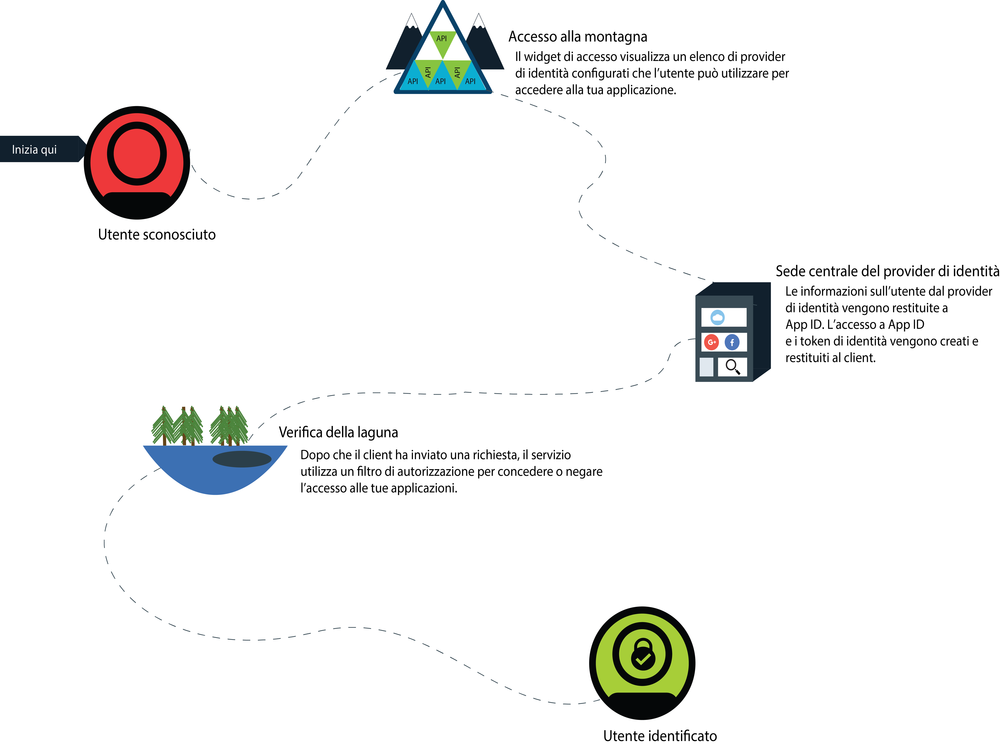
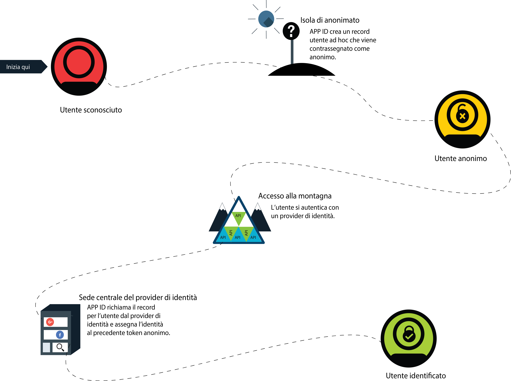

---

copyright:
  years: 2017, 2018
lastupdated: "2018-11-14"

---

{:new_window: target="_blank"}
{:shortdesc: .shortdesc}
{:pre: .pre}
{:tip: .tip}
{:screen: .screen}

# Autenticazione anonima
{: #anonymous}

Quando sviluppi le applicazioni, una delle preoccupazioni più grandi è la sicurezza. Come puoi garantire che solo gli utenti con l'accesso adeguato utilizzino la tua applicazione? Devi utilizzare un processo di autorizzazione. Nella maggior parte dei processi, l'autorizzazione e l'autenticazione sono legate tra loro, il che può complicare la modifica delle tue politiche di sicurezza e dei provider di identità. Con {{site.data.keyword.appid_full}}, l'autorizzazione e l'autenticazione sono processi separati.
{: shortdesc}

Quando un utente esegue l'accesso correttamente, diventa un utente identificato. Il provider di identità restituisce i token di accesso e di identità che contengono le informazioni sull'utente a {{site.data.keyword.appid_short}}. Il servizio prende i token forniti e determina se un utente dispone delle credenziali corrette per accedere a un'applicazione. Se i token vengono convalidati, il servizio autorizza gli utenti ad accedere all'applicazione. Le informazioni di autenticazione vengono associate al profilo dell'utente dopo che è stato autorizzato. È possibile ancora accedere al profilo utente e ai relativi attributi da qualsiasi client che si autentica con lo stesso provider di identità.

## Autenticazione progressiva
{: #progressive}

Con {{site.data.keyword.appid_short_notm}}, un utente anonimo può scegliere di diventare un utente identificato.

Quando un utente sceglie di non accedere immediatamente, viene considerato un utente anonimo. Ad esempio, un utente potrebbe iniziare immediatamente ad aggiungere articoli a un carrello d'acquisto senza effettuare l'accesso. Per gli utenti anonimi, {{site.data.keyword.appid_short_notm}} crea un profilo utente ad hoc e richiama l'API di accesso OAuth che restituisce token di accesso e identità anonimi. Utilizzando questi token, l'applicazione può creare, leggere, aggiornare ed eliminare gli attributi che sono archiviati nel profilo utente.

Quando un utente anonimo accede, il suo token di accesso viene passato all'API di accesso. Il servizio autentica la chiamata con un provider di identità. Il servizio utilizza il token di accesso per trovare il profilo anonimo e allega l'identità dell'utente ad esso. I nuovi token di identità e di accesso contengono le informazioni pubbliche condivise dal provider di identità. Dopo che un utente è stato identificato, il suo token anonimo non è più valido. Tuttavia, un utente è ancora in grado di accedere ai propri attributi perché sono accessibili con il nuovo token.

Un'identità può essere assegnata a un profilo anonimo solo se non è già stata assegnata a un altro utente.
{: tip}

Se l'identità è già associata a un altro utente {{site.data.keyword.appid_short_notm}}, i token contengono le informazioni di tale profilo utente e forniscono l'accesso a suoi attributi. I precedenti attributi dell'utente anonimo non sono accessibili tramite il nuovo token. Finché il token non scade, le informazioni possono ancora essere associate tramite il token di accesso anonimo. Quando sviluppi la tua applicazione, puoi scegliere come unire gli attributi anonimi all'utente conosciuto.
