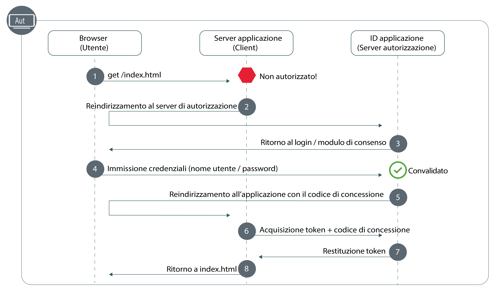

---

copyright:
  years: 2017, 2019
lastupdated: "2019-07-11"

keywords: Authentication, authorization, identity, app security, secure, development, nodejs, frontend, web apps, 

subcollection: appid

---

{:external: target="_blank" .external}
{:shortdesc: .shortdesc}
{:screen: .screen}
{:pre: .pre}
{:table: .aria-labeledby="caption"}
{:codeblock: .codeblock}
{:tip: .tip}
{:note: .note}
{:important: .important}
{:deprecated: .deprecated}
{:download: .download}


# Web: Node.js
{: #web-node}

Con {{site.data.keyword.appid_short_notm}}, puoi facilmente proteggere le applicazioni web front-end di Node.js. Con questa guida, puoi ottenere rapidamente un semplice flusso di autenticazione operativo in meno di 20 minuti.
{: shortdesc}

Consulta il seguente diagramma per visualizzare il flusso di lavoro del codice di autorizzazione OAuth 2.0.



1. Un utente prova a ottenere l'accesso alla tua applicazione web protetta ma non è autorizzato.
2. La tua applicazione reindirizza l'utente a {{site.data.keyword.appid_short_notm}}.
3. {{site.data.keyword.appid_short_notm}} mostra una schermata di accesso che l'utente può utilizzare per eseguire l'autenticazione.
4. Immette le sue credenziali, come un nome utente e una password. L'ID applicazione convalida le credenziali.
5. {{site.data.keyword.appid_short_notm}} reindirizza nuovamente l'utente alla tua applicazione con un codice di concessione.
6. Utilizzando il codice di concessione, la tua applicazione effettua una richiesta a {{site.data.keyword.appid_short_notm}} per garantire che l'utente sia convalidato. Per ulteriori informazioni sull'ottenimento di token di accesso, vedi [Ottenimento dei token](/docs/services/appid?topic=appid-obtain-tokens).
7. {{site.data.keyword.appid_short_notm}} restituisce i token di accesso e identità per l'utente convalidato.
8. All'utente viene quindi concesso l'accesso alla tua applicazione.


## Esercitazione video
{: #web-node-video}

Guarda il seguente video per vedere come puoi utilizzare {{site.data.keyword.appid_short_notm}} per proteggere una semplice applicazione web Node.js. Tutte le informazioni trattate nel video possono essere trovate anche in forma scritta in questa pagina.

<iframe class="embed-responsive-item" id="appid-web-node" title="Informazioni sulle applicazioni {{site.data.keyword.appid_short_notm}} Node.js" type="text/html" width="640" height="390" src="//www.youtube.com/embed/6roa1ZOvwtw?rel=0" frameborder="0" webkitallowfullscreen mozallowfullscreen allowfullscreen></iframe>

Non hai un'applicazione con cui puoi provare il flusso? Nessun problema! {{site.data.keyword.appid_short_notm}} fornisce una [semplice applicazione di esempio web Node.js](https://github.com/ibm-cloud-security/appid-video-tutorials/tree/master/02a-simple-node-web-app){: external}.

 

## Prima di cominciare
{: #web-node-before}

Prima di iniziare con {{site.data.keyword.appid_short_notm}} nelle tue applicazioni web Node.js, devi disporre dei seguenti prerequisiti.
{: shortdesc}

* Un'istanza del [servizio {{site.data.keyword.appid_short_notm}}](https://cloud.ibm.com/catalog/services/app-id){: external}
* [La CLI di IBM Cloud](/docs/cli?topic=cloud-cli-getting-started)
* [NPM versione 4+](https://www.npmjs.com/get-npm){: external}
* [Node versione 6+](https://nodejs.org/en/download/){: external}


## Passo 1: Registra il tuo URI di reindirizzamento
{: #node-web-redirect-uri}

Un URI di reindirizzamento è l'endpoint di callback della tua applicazione. Durante il flusso di accesso, {{site.data.keyword.appid_short_notm}} convalida gli URI prima di consentire ai client di partecipare al flusso di lavoro di autorizzazione, e questo aiuta a impedire attacchi di phishing e di concedere perdite di codice. Registrando il tuo URI, stai indicando a {{site.data.keyword.appid_short_notm}} che l'URI è attendibile ed è valido per il reindirizzamento dei tuoi utenti.
{: shortdesc}

1. Fai clic su **Manage Authentications > Authentication Settings**.

2. Nel campo **Add web redirect URI**, immetti l'URI. Ogni URI deve iniziare con `http://` o `https://` e deve includere il percorso completo, compresi gli eventuali parametri di query, perché il reindirizzamento venga eseguito correttamente.

3. Fai clic sul simbolo **+** nella casella **Add web redirect URIs**.

4. Ripetere i passi da uno a tre fino a che al tuo elenco non vengono aggiunti tutti gli URI possibili.


## Passo 2: Ottieni le tue credenziali
{: #node-web-credentials}

Puoi ottenere le tue credenziali in uno dei due modi di seguito indicati.
{: shortdesc}

  * Passando alla scheda **Applications** del dashboard {{site.data.keyword.appid_short_notm}}. Se non ne hai già una, puoi fare clic su **Add application** per crearne una nuova.

  * Eseguendo una richiesta POST all'[endpoint `/management/v4/{tenantId}/applications`](https://us-south.appid.cloud.ibm.com/swagger-ui/#!/Applications/registerApplication).

    Formato della richiesta:
    ```javascript
    curl -X POST \  https://us-south.appid.cloud.ibm.com/management/v4/39a37f57-a227-4bfe-a044-93b6e6060b61/applications/ \
    -H 'Content-Type: application/json' \
    -H 'Authorization: Bearer IAM_TOKEN' \
    -d '{"name": "ApplicationName"}'
    ```
    {: codeblock}

    Risposta di esempio:
    ```javascript
    {
      "clientId": "xxxxx-34a4-4c5e-b34d-d12cc811c86d",
      "tenantId": "xxxxx-9b1f-433e-9d46-0a5521f2b1c4",
      "secret": "ZDk5YWZkYmYt*******",
      "name": "app1",
      "oAuthServerUrl": "https://us-south.appid.cloud.ibm.com/oauth/v4/xxxxx-9b1f-433e-9d46-0a5521f2b1c4",
      "profilesUrl": "https://us-south.appid.cloud.ibm.com",
      "discoveryEndpoint": "https://us-south.appid.cloud.ibm.com/oauth/v4/xxxxxx-9b1f-433e-9d46-0a5521f2b1c4/.well-known/openid-configuration"
    }
    ```
    {: screen}


## Passo 3: Inizializza l'SDK
{: #web-node-install}

Il modo più facile per lavorare con {{site.data.keyword.appid_short_notm}} è avvalersi dell'SDK Node.JS.
{: shortdesc}


1. Utilizzando la riga di comando, passa alla directory che contiene la tua applicazione Node.js.

2. Installa i seguenti requisiti NPM.

    ```javascript
    npm install --save express express-session passport
    ```
    {: codeblock}

3. Installa il servizio {{site.data.keyword.appid_short_notm}}.

    ```javascript
    npm install --save ibmcloud-appid
    ```
    {: codeblock}

4. Aggiungi i seguenti requisiti al tuo file `server.js`.

    ```javascript
    const express = require('express'); 								// https://www.npmjs.com/package/express
    const session = require('express-session');							// https://www.npmjs.com/package/express-session
    const passport = require('passport');								// https://www.npmjs.com/package/passport
    const WebAppStrategy = require('ibmcloud-appid').WebAppStrategy;	// https://www.npmjs.com/package/ibmcloud-appid
    ```
    {: shortdesc}

5. Imposta la tua applicazione per utilizzare il middleware express-session servendoti delle credenziali che hai ottenuto nel passo 1. Puoi scegliere di formattare il tuo URI di reindirizzamento in uno dei due modi di seguito indicati. Manualmente, utilizzando un nuovo `WebAppStrategy({redirectUri: "...."})` oppure impostando il valore come una variabile di ambiente, come mostrato nel codice di esempio.

    ```javascript
    const app = express();
    app.use(session({
        secret: '123456',
        resave: true,
        saveUninitialized: true
    }));
    app.use(passport.initialize());
    app.use(passport.session());
    passport.serializeUser((user, cb) => cb(null, user));
    passport.deserializeUser((user, cb) => cb(null, user));
    passport.use(new WebAppStrategy({
        tenantId: "<tenant_ID>",
        clientId: "<client_ID>",
        secret: "<secret>",
        oauthServerUrl: "<OAuth_Server_URL>",
        redirectUri: "<redirect_URI>"
    }));
    ```
    {: codeblock}

    Devi configurare il middleware con l'archivio della sessione appropriato per gli ambienti di produzione. Per ulteriori informazioni consulta la <a href="https://github.com/expressjs/session" target="_blank">documentazione di express.js </a>.
    {: note}


## Passo 4: Proteggi la tua applicazione
{: #node-web-protect}

Ora che hai {{site.data.keyword.appid_short_notm}} installato, sei pronto a proteggere la tua applicazione. Puoi scegliere di proteggere la tua intera applicazione o solo delle specifiche risorse definendo una strategia di applicazione web.
{: shortdesc}


1. Configura l'endpoint di callback. Il callback termina il processo di autorizzazione richiamando i token di accesso e identità dall'ID applicazione e reindirizzando l'utente a una delle seguenti ubicazioni:<ul><li>L'URL originale della richiesta che ha attivato l'autenticazione, come reso persistente nella sessione HTTP come `WebAppStrategy.ORIGINAL_URL`.</li><li>Specificando un reindirizzamento in caso di un'autenticazione riuscita.</li><li>La root dell'applicazione (`/`) come mostrato nel passo successivo.</li></ul>

    ```javascript
    app.get(CALLBACK_URL, passport.authenticate(WebAppStrategy.STRATEGY_NAME));
    ```
    {: codeblock}

2. Imposta un endpoint di accesso che reindirizza sempre un browser a un widget di accesso. Assicurati di aggiungere un'opzione di reindirizzamento riuscito in modo da non finire in un loop di autenticazione infinito.

    ```javascript
    app.get('/appid/login', passport.authenticate(WebAppStrategy.STRATEGY_NAME, {
        successRedirect: '/',
        forceLogin: true
    }));
    ```
    {: codeblock}

3. Configura la disconnessione. Quando un utente si disconnette dalla tua applicazione, tutte le sue informazioni di autenticazione vengono cancellate da tale sessione. Per interagire con la tua applicazione, dovrà eseguire nuovamente l'accesso.

    ```javascript
    app.get('/appid/logout', function(req, res){
        webappstrategy.logout(req);
        res.redirect('/');
    });
    ```
    {: shortdesc}

## Passo 5: Personalizza la tua applicazione
{: #node-web-user-info}

Puoi estrarre le informazioni fornite dai tuoi provider di identità per personalizzare la tua esperienza dell'applicazione.
{: shortdesc}

1. Configura la tua applicazione per ottenere informazioni sull'utente. `protected` è una variabile segnaposto che puoi modificare in modo che corrisponda all'endpoint per la tua applicazione.

    ```javascript
    app.get("/protected", passport.authenticate(WebAppStrategy.STRATEGY_NAME), function(req, res){
        res.json(req.user);
    });
    ```
    {: codeblock}

    Ad esempio, nell'applicazione di esempio puoi vedere come ottenere il nome dell'utente per personalizzare la tua applicazione.
    ```javascript
    app.get('/api/user', (req, res) => {
        // console.log(req.session[WebAppStrategy.AUTH_CONTEXT]);
        res.json({
            user: {
                name: req.user.name
            }
        });
    });
    ```
    {: codeblock}


## Passo 6: Verifica la tua configurazione
{: #node-web-test}

Per verificare la tua configurazione dell'autorizzazione, vai all'URL su cui il tuo server è in ascolto, come definito nella tua applicazione. Prova ad accedere e prova a disconnetterti. Assicurati che la configurazione stia funzionando come previsto. 

Quando sei pronto a procedere al passo successivo, puoi provare ad abilitare l'[autenticazione multifattore per Cloud Directory](/docs/services/appid?topic=appid-cd-mfa) o ad aggiungere degli [attributi personalizzati](/docs/services/appid?topic=appid-profiles) per personalizzare ulteriormente la tua applicazione.


