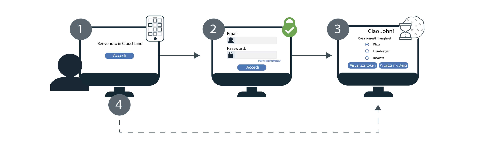

---

copyright:
  years: 2017, 2019
lastupdated: "2019-07-09"

keywords: Authentication, authorization, identity, app security, secure, development, sso, directory, users, registry, multiple apps

subcollection: appid

---

{:external: target="_blank" .external}
{:shortdesc: .shortdesc}
{:screen: .screen}
{:pre: .pre}
{:table: .aria-labeledby="caption"}
{:codeblock: .codeblock}
{:tip: .tip}
{:note: .note}
{:important: .important}
{:deprecated: .deprecated}
{:download: .download}


# SSO (single sign-on)
{: #cd-sso}

Con SSO (single sign-on) per Cloud Foundry, puoi fornire un'esperienza di autenticazione senza problemi tra più applicazioni web. Se SSO è attivo quando un utente esegue inizialmente l'accesso, non gli verrà richiesto di reimmettere le sue credenziali la volta successiva che eseguirà l'accesso. Accederà invece automaticamente l'accesso alle tue applicazioni protette dalla stessa istanza {{site.data.keyword.appid_short_notm}}.


## Come funziona
{: #cd-sso-how-it-works}

Consulta il seguente diagramma per vedere SSO in azione.



1. Un utente Cloud Directory esegue l'accesso alla tua applicazione per la prima volta.
2. Gli viene chiesto di eseguire l'autenticazione fornendo un nome utente oppure una email e una password.
3. Se le credenziali sono valide, un utente accede alla tua applicazione. Allo stesso tempo, {{site.data.keyword.appid_short_notm}}, crea una sessione e imposta un cookie sul browser dell'utente.
4. Se un utente prova ad eseguire l'accesso a una delle tue altre applicazioni, {{site.data.keyword.appid_short_notm}} rileva il cookie di sessione e all'utente viene consentito l'accesso alla tua applicazione in modo automatico. I cookie di sessione di {{site.data.keyword.appid_short_notm}} sono specifici per l'istanza e sono firmati dalla chiave privata univoca dell'istanza.

Attualmente, SSO è configurato per funzionare quando Cloud Directory è l'unico provider di identità abilitato. Se la tua istanza di {{site.data.keyword.appid_short_notm}} è configurata per utilizzare più provider di identità, l'abilitazione di SSO non ha alcun effetto sul flusso di accesso. Agli utenti viene richiesto di immettere le loro credenziali Cloud Foundry o di scegliere uno degli altri provider a ogni accesso.
{: note}


## Configurazione di SSO
{: #cd-sso-configure}

Puoi configurare SSO (single sign-on) utilizzando il dashboard {{site.data.keyword.appid_short_notm}} oppure utilizzando le API.
{: shortdesc}


### Con la GUI
{: #cd-sso-configure-gui}


Puoi configurare l'SSO mediante la GUI.

1. Passa alla scheda **Cloud Directory > Single Sign-on** del dashboard {{site.data.keyword.appid_short_notm}}.

2. Nella casella **Enable single sign-on**, passa SSO a **Enabled**.

3. Imposta la quantità di tempo per cui un utente può essere inattivo prima che la sessione SSO scada. Quando scade, l'utente deve eseguire nuovamente l'accesso. Il tempo è specificato in minuti e il tempo massimo consentito per l'inattività è 10.080 minuti (7 giorni). Il tempo predefinito è 1440 minuti, che è l'equivalente di 1 giorno.

4. Aggiungi i tuoi URI di reindirizzamento alla casella **Logout redirect URI** e fai clic sul segno **+**. Assicurati di registrare solo applicazioni che ritieni attendibili. Registrando l'URI, stai autorizzando {{site.data.keyword.appid_short_notm}} a eseguirne l'inclusione nel flusso di lavoro di autorizzazione.

5. Fai clic su **Save**.


### Con l'API
{: #cd-sso-configure-api}

Utilizzando l'API di amministrazione della configurazione di SSO per definire tre impostazioni, puoi attivare la funzione.

Una chiamata di esempio:

```json
{
  "isActive": true,
  "inactivityTimeoutSeconds": 86400,
  "logoutRedirectUris": [
    "http://my-first-app.com/after_logout",
    "http://my-second-app.com/after_logout"
  ]
}
```
{: screen}

<table>
  <tr>
    <th>Impostazione</th>
    <th>Definizione</th>
  </tr>
  <tr>
    <td><code>isActive</code></td>
    <td>Per abilitare SSO, imposta questo valore su <code>true</code>. L'impostazione predefinita è <code>false</code>.</td>
  </tr>
  <tr>
    <td><code>inactivityTimeoutSeconds</code></td>
    <td>Il periodo di tempo più lungo che può trascorrere senza alcuna attività dell'utente prima che a quest'ultimo venga richiesto di reimmettere le sue credenziali. Questo valore è specificato in secondi e può essere un massimo di <code>604800 seconds</code> (7 giorni). L'impostazione predefinita è <code>86400 seconds</code> (1 giorno).</td>
  </tr>
  <tr>
    <td><code>logoutRedirectUris</code></td>
    <td>Un elenco separato da virgole di URI consentiti a cui {{site.data.keyword.appid_short_notm}} può reindirizzare i tuoi utenti dopo che si sono disconnessi.</td>
  </tr>
</table>


## Configurazione della disconnessione
{: #cd-sso-log-out}

Con {{site.data.keyword.appid_short_notm}} puoi terminare la sessione SSO di un utente per il suo browser corrente. Se l'utente accede all'endpoint API dal suo browser, la sua sessione viene terminata e all'utente viene richiesto di immettere le sue credenziali al suo successivo tentativo di accesso in tale browser per una qualsiasi delle tue applicazioni.
{: shortdesc}


Quando viene avviato uno dei flussi di modifica, reimpostazione o rinnovo della password, le sessioni in tutti i client vengono terminate automaticamente per l'utente.
{: note}


### Utilizzando l'API
{: #cd-sso-log-out-api}

Per disconnettere un utente, reindirizzane il browser utilizzando le tue informazioni per completare la seguente chiamata API.

```
https://<region>.appid.cloud.ibm.com/oauth/v4/<tenant-id>/cloud_directory/sso/logout?redirect_uri=<redirect_uri>&client_id=<clientId>
```
{: codeblock}

<table>
  <tr>
    <th>Variabile</th>
    <th>Valore</th>
  </tr>
  <tr>
    <td><code>region</code></td>
    <td>La regione in cui viene eseguito il provisioning della tua istanza di {{site.data.keyword.appid_short_notm}}. Le opzioni includono: <code>au-syd</code>, <code>eu-de</code>, <code>eu-gb</code>, <code>jp-tok</code> e <code>us-south</code>.</td>
  </tr>
  <tr>
    <td><code>tenant-id</code></td>
    <td>L'identificativo univoco per la tua istanza di {{site.data.keyword.appid_short_notm}}. Puoi trovare questo valore nella scheda <em>Service Credentials</em> del dashboard {{site.data.keyword.appid_short_notm}}. Se non disponi di una serie di credenziali di servizio, puoi crearne una e prendere il valore da essa.</td>
  </tr>
  <tr>
    <td><code>redirect_uri</code></td>
    <td>Un URI che è stato specificato nella configurazione SSO mediante il dashboard {{site.data.keyword.appid_short_notm}}. Per motivi di sicurezza, se non specifichi un valore, non è possibile eseguire un reindirizzamento e viene visualizzato un errore.</td>
  </tr>
</table>

Anche se la sessione SSO viene terminata, a un utente con un token di accesso valido memorizzato nella sua sessione potrebbe non essere richiesto di immettere nuovamente le sue credenziali finché non scade il suo token. Per impostazione predefinita il token scade dopo un'ora.
{: note}


### Utilizzando l'SDK server Node.js
{: #cd-sso-log-out-nodejs}

Puoi anche utilizzare l'SDK server Node.js {{site.data.keyword.appid_short_notm}} per gestire automaticamente il reindirizzamento per tuo conto.

Esempio:

```javascript
app.get('/logoutSSO', (req, res) => {
  res.clearCookie("refreshToken");
  webAppStrategy.logoutSSO(req,res, { "redirect_uri": "https://my-app.com/after_logout" });
  });
```
{: screen}


## Terminazione di tutte le sessioni per un utente
{: cd-sso-ending-all-sessions}

In quanto amministratore, puoi terminare tutte le sessioni SSO per uno specifico utente utilizzando le API di amministrazione di {{site.data.keyword.appid_short_notm}}. Le API sono protette da un token Cloud IAM.

Richiesta API di esempio:

```
POST https://<region>.appid.cloud.ibm.com/management/v4/{tenant-id}/cloud_directory/Users/{user-id}/sso/logout
Headers:
Authorization: <IAM TOKEN>
```
{: codeblock}

<table>
  <tr>
    <th>Variabile</th>
    <th>Valore</th>
  </tr>
  <tr>
    <td><code>region</code></td>
    <td>La regione in cui viene eseguito il provisioning della tua istanza di {{site.data.keyword.appid_short_notm}}. Le opzioni includono: <code>us-south</code>, <code>eu-gb</code> e <code>eu-de</code>.</td>
  </tr>
  <tr>
    <td><code>tenant-id</code></td>
    <td>L'identificativo univoco per la tua istanza di {{site.data.keyword.appid_short_notm}}. Puoi trovare questo valore nella scheda <em>Service Credentials</em> del dashboard {{site.data.keyword.appid_short_notm}}. Se non disponi di una serie di credenziali di servizio, puoi crearne una e prendere il valore da essa.</td>
  </tr>
  <tr>
    <td><code>user-id</code></td>
    <td>L'identificativo univoco per un utente Cloud Directory. Puoi ottenere l'ID utilizzando le [API degli utenti di Cloud Directory](https://us-south.appid.cloud.ibm.com/swagger-ui/#/), oppure visualizzando il token di identità dell'utente.</td>
  </tr>
</table>

Quando richiami questa API, tutte le sessioni SSO dell'utente specificato vengono invalidate. Questo significa che, la prossima volta che l'utente prova ad eseguire l'accesso a una qualsiasi delle tue applicazioni, da un dispositivo o da un browser, gli verrà richiesto di reimmettere le sue credenziali.

