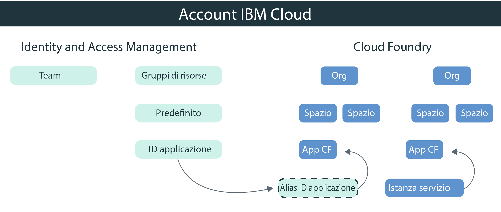

---

copyright:
  years: 2017, 2019
lastupdated: "2019-05-09"

keywords: authentication, authorization, identity, app security, secure, development, cloud foundry, access management, iam, java, node.js

subcollection: appid

---

{:new_window: target="_blank"}
{:shortdesc: .shortdesc}
{:screen: .screen}
{:pre: .pre}
{:table: .aria-labeledby="caption"}
{:codeblock: .codeblock}
{:tip: .tip}
{:note: .note}
{:important: .important}
{:deprecated: .deprecated}
{:download: .download}


# Esercitazione: Configurazione di Cloud Foundry per utilizzare {{site.data.keyword.appid_short_notm}}
{: #cloud-foundry}

Con {{site.data.keyword.cloud_notm}}, puoi proteggere le tue applicazioni con due diversi tipi di gestione dell'accesso, IAM (Identity and Access Management) e Cloud Foundry. Per impostazione predefinita, tutte le nuove istanze di {{site.data.keyword.appid_short_notm}} utilizzano gruppi di risorse IAM per gestire l'accesso. Se stai utilizzando Cloud Foundry per gestire la tua applicazione, puoi collegare mediante bridge i tuoi modelli di gestione creando un alias di servizio e associando mediante bind il servizio all'applicazione.
{: shortdesc}


## Descrizione di Cloud Foundry
{: #cf-understand}

Un alias crea una connessione tra il tuo servizio gestito da IAM come ad esempio {{site.data.keyword.appid_short_notm}} e la tua applicazione Cloud Foundry. Quando associ mediante bind un'applicazione, le credenziali del servizio vengono create e passate automaticamente all'applicazione. Sebbene sia un passo obbligatorio nella configurazione, l'associazione mediante bind presenta i seguenti vantaggi:

* Automazione: con le credenziali del servizio memorizzate nella variabile di ambiente VCAP_SERVICES, non devi più copiarle manualmente nell'applicazione. Viene tutto eseguito automaticamente per tuo conto con gli SDK {{site.data.keyword.appid_short_notm}}.
* Sicurezza: la configurazione diventa a prova di errori perché il processo è automatico.
* Sicurezza: niente che sia correlato all'accesso è codificato in modo permanente nella tua applicazione poiché le credenziali del servizio esistono solo nelle variabili di ambiente.

La tua applicazione Cloud Foundry è ospitata su un'altra piattaforma? Nessun problema. Puoi definire le credenziali dell'applicazione nella tua applicazione per eseguirne l'associazione mediante bind al servizio. Puoi trovare le tue credenziali dell'applicazione mediante il dashboard {{site.data.keyword.appid_short_notm}} oppure eseguendo una richiesta all'[endpoint /applications](https://us-south.appid.cloud.ibm.com/swagger-ui/#!/Applications/registerApplication).
{: tip}

Controlla in che modo i modelli si integrano nel seguente diagramma:



## Prima di cominciare
{: #cf-before}

Prima di iniziare, assicurati di avere i seguenti prerequisiti:

* Un account {{site.data.keyword.cloud_notm}}
* Un'istanza di {{site.data.keyword.appid_short_notm}}
* La [CLI {{site.data.keyword.cloud_notm}}](/docs/cli/reference/ibmcloud?topic=cloud-cli-ibmcloud-cli#ibmcloud-cli) installata localmente

## Distribuzione di un'applicazione Node.js
{: #cf-node}


1. Vai alla tua istanza di {{site.data.keyword.appid_short_notm}}.

2. Fai clic su **Download Sample** nella scheda **Overview** del dashboard del servizio.

3. Fai clic su **Node.js**. Scarica ed estrai l'applicazione di esempio.

4. Verifica di avere tutti i prerequisiti Node.js.

5. Apri il terminale e passa alla cartella di esempio.

6. Esegui l'accesso alla CLI {{site.data.keyword.cloud_notm}}. La CLI ti richiede di selezionare un account e una regione, se non ne esegui la specifica.

  ```
  ibmcloud login -a cloud.ibm.com -r <region>
  ```
  {: codeblock}

  <table>
    <tr>
      <th>Regione</th>
      <th>Endpoint</th>
    </tr>
    <tr>
      <td>Dallas</td>
      <td><code>us-south</code></td>
    </tr>
    <tr>
      <td>Francoforte</td>
      <td><code>eu-de</code></td>
    </tr>
    <tr>
      <td>Sydney</td>
      <td><code>au-syd</code></td>
    </tr>
    <tr>
      <td>Londra</td>
      <td><code>eu-gb</code></td>
    </tr>
    <tr>
      <td>Tokyo</td>
      <td><code>jp-tok</code></td>
    </tr>
  </table>

7. Indica come destinazione l'organizzazione e lo spazio Cloud Foundry in cui desideri lavorare e attieniti ai prompt per indicare come destinazione un'organizzazione e uno spazio.

  ```
  ibmcloud target --cf
  ```
  {: codeblock}

8. Crea un alias dell'istanza del servizio {{site.data.keyword.appid_short_notm}}.

  ```
  ibmcloud resource service-alias-create {ALIAS_NAME} --instance-name {SERVICE_INSTANCE_NAME}
  ```
  {: codeblock}

9. Aggiungi l'alias che hai creato ai tuoi servizi in `manifest.yml`.

10. Associa mediante bind i servizi elencati nel file `manifest.yml` distribuendo l'applicazione di esempio.

  ```
  ibmcloud app push
  ```
  {: codeblock}

## Distribuzione di un'applicazione Java
{: #java}

1. Vai alla tua istanza di {{site.data.keyword.appid_short_notm}}.

2. Fai clic su **Download Sample** nella scheda **Overview** del dashboard del servizio.

3. Fai clic su **Java**. Scarica ed estrai l'applicazione di esempio.

4. Verifica di avere tutti i prerequisiti Java.

5. Apri il terminale e passa alla cartella di esempio.

6. Genera il tuo file `war` e caricalo.

  ```
  mvn clean install
  ```
  {: codeblock}

7. Passa alla cartella Liberty.

8. Esegui l'accesso alla CLI {{site.data.keyword.cloud_notm}}. La CLI ti richiede di selezionare un account e una regione, se non ne esegui la specifica.

  ```
  ibmcloud login -a cloud.ibm.com -r <region>
  ```
  {: codeblock}

8. Indica come destinazione l'organizzazione e lo spazio Cloud Foundry in cui desideri lavorare e attieniti ai prompt per indicare come destinazione un'organizzazione e uno spazio.

  ```
  ibmcloud target --cf
  ```
  {: codeblock}

10. Crea un alias dell'istanza del servizio {{site.data.keyword.appid_short_notm}}.

  ```
  ibmcloud resource service-alias-create {ALIAS_NAME} --instance-name {SERVICE_INSTANCE_NAME}
  ```
  {: codeblock}

11. Aggiungi l'alias che hai creato ai tuoi servizi in `manifest.yml`.

  Esempio:
  ```
    applications:
  - name: ApplicationName
    memory: 512M
    services:
    - AppID-alias
  ```
  {: screen}

13. Associa mediante bind i servizi elencati nel file `manifest.yml` distribuendo l'applicazione di esempio.

  ```
  ibmcloud app push
  ```
  {: codeblock}

