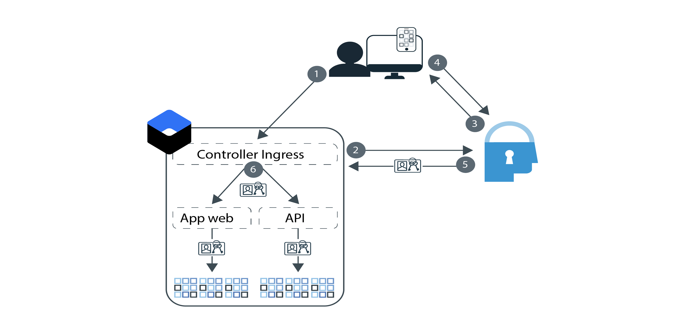

---

copyright:
  years: 2017, 2019
lastupdated: "2019-05-20"

keywords: authentication, authorization, identity, app security, secure, development, ingress, policy, networking, containers, kubernetes

subcollection: appid

---

{:new_window: target="_blank"}
{:shortdesc: .shortdesc}
{:screen: .screen}
{:pre: .pre}
{:table: .aria-labeledby="caption"}
{:codeblock: .codeblock}
{:tip: .tip}
{:note: .note}
{:important: .important}
{:deprecated: .deprecated}
{:download: .download}


# Esercitazione: Configurazione di Ingress per utilizzare {{site.data.keyword.appid_short_notm}}
{: #kube-auth}

Puoi implementare in modo congruente una sicurezza controllata dalle politiche utilizzando la funzionalità di rete Ingress in {{site.data.keyword.containerlong}}. Con questo approccio, puoi abilitare l'autorizzazione e l'autenticazione per tutte le applicazioni nel tuo cluster contemporaneamente, senza mai modificare il tuo codice applicativo Con questa guida dettagliata, puoi imparare come configurare il tuo controller Ingress per utilizzare {{site.data.keyword.appid_short_notm}}.
{: shortdesc}

Consulta il seguente diagramma per visualizzare il flusso di autenticazione:



1. Un utente apre la tua applicazione e attiva una richiesta all'API o all'applicazione web.
2. Per il flusso API, il controller Ingress prova a convalidare i token forniti. Se viene utilizzato il flusso web, attiva un processo di autenticazione OIDC che si articola in tre fasi.
3. {{site.data.keyword.appid_short_notm}} inizia il processo di autenticazione visualizzando il Widget di accesso.
4. L'utente fornisce un nome utente oppure una mail e una password.
5. Il controller Ingress ottiene i token di accesso e di identità da {{site.data.keyword.appid_short_notm}} per l'autorizzazione.
6. Ogni richiesta convalidata e inoltrata dal controller Ingress alle tue applicazioni ha un'intestazione di autorizzazione che contiene i token.

L'integrazione del controller Ingress con {{site.data.keyword.appid_short_notm}} attualmente non supporta i token di aggiornamento. Quando i token di accesso e di identità scadono, l'utente deve rieseguire l'autenticazione.
{: note}


## Prima di cominciare
{: #kube-prereqs}

Prima di poter iniziare, assicurati di avere i seguenti prerequisiti.
{: shortdesc}


* Un'applicazione o un'applicazione di esempio.

* Un cluster di Kubernetes standard con almeno due nodi di lavoro per ogni zona. Se stai utilizzando Ingress nei cluster multizona, esamina i prerequisiti supplementari nella [documentazione del servizio Kubernetes](/docs/containers?topic=containers-ingress#config_prereqs).

* Un'istanza di {{site.data.keyword.appid_short_notm}} nella stessa regione in cui è distribuito il tuo cluster. Assicurati che il nome servizio non contenga spazi.

* I seguenti [ruoli {{site.data.keyword.cloud_notm}} IAM](/docs/containers?topic=containers-access_reference#access_reference):
  * Cluster: ruolo della piattaforma Amministratore
  * Spazi dei nomi Kubernetes: ruolo di servizio Gestore

* Le seguenti CLI:

  * [{{site.data.keyword.cloud_notm}}](/docs/cli?topic=cloud-cli-ibmcloud-cli#ibmcloud-cli)
  * [Kubernetes](https://kubernetes.io/docs/tasks/tools/install-kubectl/)
  * [Docker](https://www.docker.com/products/container-runtime#/download)

* I seguenti [plugin CLI](/docs/cli?topic=cloud-cli-install-devtools-manually#idt-install-kubernetes-cli-plugin):

  * {{site.data.keyword.containershort}}
  * {{site.data.keyword.registryshort_notm}}

Per un aiuto nel download di plugin e CLI e nella configurazione del tuo ambiente del servizio Kubernetes, consulta l'esercitazione di [creazione di cluster Kubernetes](/docs/containers?topic=containers-cs_cluster_tutorial#cs_cluster_tutorial_lesson1).
{: tip}


Cominciamo!

## Passo 1: Associazione mediante bind di {{site.data.keyword.appid_short_notm}} al tuo cluster
{: #kube-create-appid}

Associando la tua istanza di {{site.data.keyword.appid_short_notm}} al tuo cluster, tutte le istanze della tua applicazione ubicate in tale cluster possono essere controllate dalla stessa istanza di {{site.data.keyword.appid_short_notm}}. Inoltre, i tuoi metadati e le tue credenziali {{site.data.keyword.appid_short_notm}} sono disponibili non appena la tua applicazione viene avviata come dei segreti Kubernetes.
{: shortdesc}


1. Esegui l'accesso alla CLI {{site.data.keyword.cloud_notm}}. Attieniti ai prompt nella CLI per completare l'accesso. Se stai utilizzando un ID federato, assicurati di accodare l'indicatore `--sso` alla fine del comando.

  ```
  ibmcloud login -a cloud.ibm.com -r <region>
  ```
  {: codeblock}

  <table>
    <tr>
      <th>Regione</th>
      <th>Endpoint</th>
    </tr>
    <tr>
      <td>Dallas</td>
      <td><code>us-south</code></td>
    </tr>
    <tr>
      <td>Francoforte</td>
      <td><code>eu-de</code></td>
    </tr>
    <tr>
      <td>Sydney</td>
      <td><code>au-syd</code></td>
    </tr>
    <tr>
      <td>Londra</td>
      <td><code>eu-gb</code></td>
    </tr>
    <tr>
      <td>Tokyo</td>
      <td><code>jp-tok</code></td>
    </tr>
  </table>

2. Imposta il contesto per il tuo cluster.

  1. Richiama il comando per impostare la variabile di ambiente e scaricare i file di configurazione Kubernetes.

    ```
    ibmcloud ks cluster-config <cluster_name_or_ID>
    ```
    {: codeblock}

  2. Copie l'output che inizia con `export` e incollalo nel tuo terminale per impostare la variabile di ambiente `KUBECONFIG`.

3. Controlla se già disponi di un controller Ingress nel tuo spazio dei nomi predefinito. Il servizio IBM Cloud Kubernetes supporta un singolo Ingress per ogni spazio dei nomi. Se già ne hai uno, puoi aggiornare la configurazione Ingress esistente oppure utilizzare uno spazio dei nomi differente.

  ```
  kubectl get ingress
  ```
  {: codeblock}

4. Associa la tua istanza di {{site.data.keyword.appid_short_notm}}. L'associazione mediante bind crea una chiave del servizio per l'istanza del servizio. Puoi specificare una chiave del servizio esistente utilizzando l'indicatore `-key`.

  ```
  ibmcloud ks cluster-service-bind --cluster <cluster_name_or_ID> --namespace <namespace> --service <App-ID_instance_name> [--key <service_instance_key>]
  ```
  {: codeblock}

  Se non specifichi uno spazio dei nomi, il segreto viene creato nello spazio dei nomi `default`.
  {: tip}

  Output di esempio:

  ```
  ibmcloud ks cluster-service-bind --cluster mycluster --namespace default --service appid1
  Binding service instance to namespace...
  OK
  Namespace:    default
  Secret name:  binding-appid1
  ```
  {: screen}

Ottimo lavoro!

## Passo 2: Esecuzione del push della tua applicazione al Container Registry
{: #kube-registry}

Perché la tua applicazione venga eseguita in Kubernetes, devi ospitarla in un registro.
{: shortdesc}


1. Esegui l'accesso al plugin della CLI Container Registry.

  ```
  ibmcloud cr login
  ```
  {: codeblock}

2. Crea uno spazio dei nomi Container Registry.

  ```
  ibmcloud cr namespace-add <my_namespace>
  ```
  {: codeblock}

3. Crea, contrassegna con tag ed esegui il push dell'applicazione come un'immagine al tuo spazio dei nomi in Container Registry. Assicurati di includere il punto (.) alla fine del comando.

  ```
  ibmcloud cr build -t registry.{region}.icr.io.net/{namespace}/{app-name}:{tag} .
  ```
  {: codeblock}

Ottimo! Sei quasi pronto ad eseguire la distribuzione.

## Passo 3: Configurazione di Ingress
{: kube-ingress}

Durante la creazione del cluster, vengono creati per te sia un programma di bilanciamento del carico dell'applicazione (ALB) IBM Kubernetes Service pubblico che privato. Per distribuire la tua applicazione e avvalerti del tuo controller Ingress, crea uno script di distribuzione.
{: shortdesc}


Per garantire le migliori prestazioni di integrazione, si consiglia di utilizzare sempre l'ultima versione del programma di bilanciamento del carico dell'applicazione (ALB) IBM Kubernetes Service. Per impostazione predefinita, l'aggiornamento automatico è abilitato per il tuo cluster. Per ulteriori informazioni sugli aggiornamenti automatici, vedi [On-demand ALB update feature on {{site.data.keyword.containershort}}](https://www.ibm.com/cloud/blog/on-demand-alb-update-feature-on-ibm-cloud-kubernetes-service).
{: tip}

1. Ottieni il segreto che era stato creato nel tuo spazio dei nomi del cluster quando hai associato mediante bind {{site.data.keyword.appid_short_notm}} al tuo cluster. Nota: questo **non** è il tuo spazio dei nomi Container Registry.

  ```
  kubectl get secrets --namespace=<namespace>
  ```
  {: codeblock}

  Output di esempio:

  ```
  NAME                       TYPE                                  DATA      AGE
  binding-appid1             Opaque                                1         1m
  bluemix-default-secret     kubernetes.io/dockercfg               1         1h
  default-token-kf97z        kubernetes.io/service-account-token   3         1h
  ```
  {: screen}

2. Utilizza il seguente file `yaml` di esempio per creare la tua configurazione Ingress. Per un aiuto con la definizione del resto della tua distribuzione, seleziona [Distribuzione di applicazioni con la CLI](/docs/containers?topic=containers-app#app_cli).

  ```
  apiVersion: extensions/v1beta1
  kind: Ingress
  metadata:
    name: myingress
    annotations:
      ingress.bluemix.net/appid-auth: "bindSecret=<bind_secret> namespace=<namespace> requestType=<request_type> serviceName=<myservice> [idToken=false]"
  spec:
    tls:
    - hosts:
      - mydomain
      secretName: mytlssecret
    rules:
    - host: mydomain
      http:
        paths:
        - path: /
          backend:
            serviceName: myservice
            servicePort: 8080
  ```
  {: screen}

  <table>
    <tr>
      <th>Variabile</th>
      <th>Descrizione</th>
    </tr>
    <tr>
      <td><code>bindSecret</code></td>
      <td>Il segreto che era stato creato quando hai associato mediante bind la tua istanza del servizio {{site.data.keyword.appid_short_notm}} al tuo cluster.</td>
    </tr>
    <tr>
      <td><code>namespace</code></td>
      <td>Lo spazio dei nomi in cui è stato creato il tuo <code>bindSecret</code>. Se non hai specificato uno spazio dei nomi, viene utilizzato quello <code>default</code>.</td>
    </tr>
    <tr>
      <td><code>requestType</code></td>
      <td><p>Il tipo di richiesta che vuoi inviare a {{site.data.keyword.appid_short_notm}}. Le opzioni includono: <code>web</code> e <code>api</code>. Se imposti il tipo di richiesta su <code>web</code>, viene convalidata una richiesta web che contiene un token di accesso {{site.data.keyword.appid_short_notm}}. Se la convalida del token non riesce, la richiesta web viene rifiutata. Se la richiesta non contiene un token di accesso, verrà reindirizzata alla pagina di accesso di {{site.data.keyword.appid_short_notm}}. Perché l'autenticazione web {{site.data.keyword.appid_short_notm}} funzioni, è necessario abilitare i cookie nel browser dell'utente.</p><p>Se imposti il tipo di richiesta su <code>api</code>, viene convalidata una richiesta API che contiene un token di accesso {{site.data.keyword.appid_short_notm}}. Se la richiesta non contiene un token di accesso, l'utente riceverà il messaggio di errore <code>401: Unauthorized</code>.</p></td>
    </tr>
    <tr>
      <td><code>serviceName</code></td>
      <td><p>Obbligatorio: il nome del servizio Kubernetes che hai creato per la tua applicazione. Se non viene incluso un nome servizio, l'annotazione è abilitata per tutti i servizi.</p> <p>Per utilizzare più tipi di richiesta nello stesso cluster, configura un'istanza di {{site.data.keyword.appid_short_notm}} per utilizzare <code>web</code> e un'altra per utilizzare <code>api</code>.</p></td>
    </tr>
    <tr>
      <td><code>idToken</code></td>
      <td>Facoltativo: il client OIDC Liberty non è in grado di analizzare contemporaneamente sia il token di accesso che quello di identità. Quando lavori con Liberty, imposta questo valore su <code>false</code> in modo che l'identità non venga inviata al server Liberty.</td>
    </tr>
    <tr>
      <td><code>secretName</code></td>
      <td>Il segreto TLS associato al tuo certificato TLS. Se il tuo certificato è ospitato in IBM Cloud Certificate Manager, puoi eseguire <code>ibmcloud ks alb-cert-deploy --secret-name <secret_name> --cluster <cluster_name_or_ID> --cert-crn <certificate_crn></code> per distribuirlo al tuo cluster. Se non hai un certificato, completa il passo 3 di [Esposizione delle applicazioni con Ingress](/docs/containers?topic=containers-ingress#ingress_expose_public).</td>
    </tr>
  </table>

3. Esegui il file di configurazione.

  ```
  kubectl apply -f <file-name>.yaml
  ```
  {: codeblock}

Ottimo lavoro!


## Passo 4: Aggiunta dei tuoi URL di reindirizzamento
{: #kube-add-redirect}

Un URL di reindirizzamento è l'URL per il sito a cui vuoi che {{site.data.keyword.appid_short_notm}} invii i tuoi utenti dopo un'autenticazione eseguita correttamente.
{: shortdesc}

1. Passa alla GUI {{site.data.keyword.cloud_notm}} e apri il tuo dashboard {{site.data.keyword.appid_short_notm}}.

2. In **Identity Providers > Manage**, imposta i provider che vuoi utilizzare su **On**. Se non è abilitato un provider, agli utenti viene rilasciato un token di accesso che fornisce l'accesso anonimo alla tua applicazione.

3. Fai clic su **Authentication Settings**.

4. Fai clic sul simbolo **+** nella casella **Add web redirect URLs**.

  * Dominio personalizzato:

    Un URL registrato presso un dominio personalizzato potrebbe essere simile a questo: `http://mydomain.net/myapp2path/appid_callback`. Se le applicazioni che desideri esporre si trovano nello stesso cluster ma in spazi dei nomi differenti, puoi utilizzare un carattere jolly per specificare tutte le applicazioni nel cluster contemporaneamente. Ciò può essere utile durante lo sviluppo, ma devi fare attenzione quando usi i caratteri jolly in produzione. Ad esempio: `https://custom_domain.net/*`

  * Dominio secondario Ingress:

    Se la tua applicazione è registrata con un dominio secondario IBM Ingress, il tuo URL di callback può essere simile a:
`https://mycluster.us-south.containers.appdomain.cloud/myapp1path/appid_callback`

{{site.data.keyword.appid_short_notm}} offre una funzione di disconnessione: se `/logout` esiste nel tuo percorso {{site.data.keyword.appid_short_notm}}, i cookie vengono rimossi e l'utente viene rimandato alla pagina di accesso. Per utilizzare questa funzione, accoda `/appid_logout` al tuo dominio nel formato `https://mycluster.us-south.containers.appdomain.cloud/myapp1path/appid_logout` e includilo nei tuoi URL di reindirizzamento.
{: note}


Eccellente! Ora puoi verificare che la distribuzione sia stata eseguita correttamente andando al dominio secondario Ingress oppure al dominio personalizzato per provarla.


## Passi successivi
{: #kube-next}

Ora che la tua applicazione è in esecuzione in un cluster Kubernetes e Ingress è configurato, puoi provarla:

* Utilizzando gli attributi personalizzati per [impostare i ruoli](/docs/services/appid?topic=appid-tutorial-roles)
* Configurando la [MFA (multi-factor authentication, autenticazione multifattore)](/docs/services/appid?topic=appid-cd-mfa)
* Personalizzando il [Widget di accesso](/docs/services/appid?topic=appid-login-widget)


