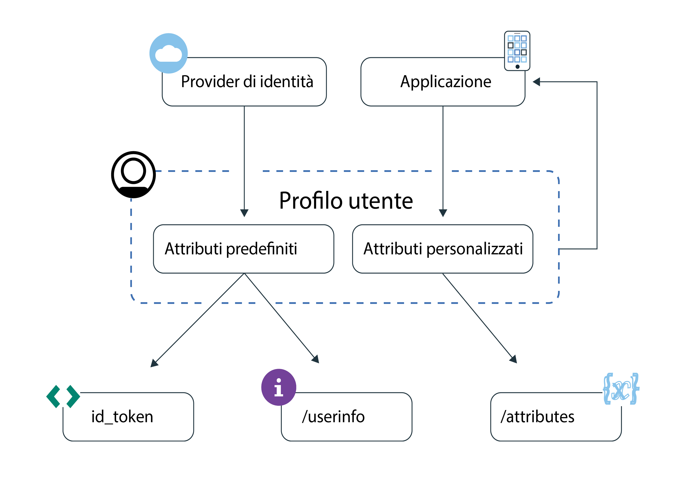

---

copyright:
  years: 2017, 2018
lastupdated: "2018-11-19"

---

{:new_window: target="_blank"}
{:shortdesc: .shortdesc}
{:pre: .pre}
{:tip: .tip}
{:screen: .screen}

# Descrizione dei profili utente
{: #user-profile}

Con {{site.data.keyword.appid_full}}, puoi creare delle esperienze personalizzate per le applicazioni accedendo alle informazioni sugli utenti memorizzate da {{site.data.keyword.appid_short_notm}}.
{: shortdesc}

## Concetti chiave
{: #key-concepts}

**Cos'è un profilo utente??**

Un profilo utente è una raccolta di attributi memorizzati da {{site.data.keyword.appid_short_notm}}. Gli attributi sono parti di informazioni relative agli utenti che interagiscono con la tua applicazione. Puoi ottenere due tipi di attributi: `predefined` e `custom`.

 

**Quali sono gli attributi predefiniti?**

Gli attributi predefiniti vengono restituiti dal provider di identità quando il tuo utente accede alla tua applicazione. Gli attributi potrebbero includere il nome utente, l'età o il sesso.

 

**Quali sono gli attributi personalizzati?**

Gli attributi personalizzati vengono acquisiti dai tuoi utenti mentre interagiscono con la tua applicazione. Puoi anche impostare gli attributi personalizzati prima che l'utente acceda alla tua applicazione per la prima volta. Un esempio potrebbe essere la dimensione del carattere preferita o gli elementi che hanno inserito in un carrello degli acquisti. Gli attributi personalizzati possono essere modificati. Assicurati di controllare le [implicazioni sulla sicurezza](custom-attributes.html) che possono verificarsi consentendo agli utenti di modificare i propri attributi prima di modificare il valore predefinito.

 
 

## Accesso agli attributi dell'utente
{: #access}

Esistono diversi modi con cui puoi accedere agli attributi [predefiniti](predefined.html) e [personalizzati](custom-attributes.html). Dopo un'autenticazione utente con esito positivo, la tua applicazione riceve i token di accesso e di identità. Il token di identità contiene un sottoinsieme normalizzato di attributi utente che vengono restituiti da un provider di identità. Per ottenere l'elenco completo degli attributi utente, puoi utilizzare l'endpoint [`/userinfo` OIDC](https://appid-oauth.ng.bluemix.net/swagger-ui/#!/Authorization_Server_V3/userInfo). Per gestire gli attributi personalizzati, è possibile utilizzare `REST API`. Sia le informazioni utente che gli endpoint degli attributi personalizzati sono protetti dal token di accesso generato da {{site.data.keyword.appid_short_notm}} alla fine del processo di autenticazione.

Per ulteriori informazioni sui token di identità e accesso, consulta [Descrizione dei token](/docs/services/appid/authorization.html#tokens) o [Convalida dei token](/docs/services/appid/tokens.html).

Figura. Flusso di informazioni del profilo utente

Per visualizzare gli attributi personalizzati, puoi utilizzare <a href="https://appid-profiles.ng.bluemix.net/swagger-ui/index.html#/Attributes" target="_blank">REST API </a>.

 
 
