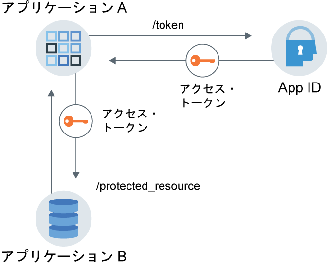

---

copyright:
  years: 2017, 2019
lastupdated: "2019-04-04"

keywords: authentication, authorization, identity, app security, secure, application identity, app to app, access token

subcollection: appid

---

{:new_window: target="_blank"}
{:shortdesc: .shortdesc}
{:screen: .screen}
{:pre: .pre}
{:table: .aria-labeledby="caption"}
{:codeblock: .codeblock}
{:tip: .tip}
{:note: .note}
{:important: .important}
{:deprecated: .deprecated}
{:download: .download}

# アプリケーション識別および許可
{: #app}

{{site.data.keyword.appid_short_notm}} を導入すると、OAuth2.0 機能を利用したアプリケーション識別および許可フローを使用して、アプリケーションを保護することができます。
{: shortdesc}

## 通信フローについて
{: #app-understanding}

さまざまな場面で、あるアプリケーションがユーザー介入なしで別のサービスまたはアプリと通信できると便利です。 例えば、非対話式アプリが作業を実行するために、別のアプリケーションへのアクセスが必要になる場合があります。 これが必要になる発信元としては、プロセス、CLI、デーモンなどが含まれます。また、モニターを行ってアップストリーム・サーバーに環境変数を報告する IoT デバイスも含まれます。 具体的なユース・ケースはアプリケーションごとに異なりますが、留意すべき最も重要な点は、要求がエンド・ユーザーではなくアプリのために交換されること、また認証と許可の対象がアプリであることです。

<a href="https://www.ibm.com/blogs/bluemix/2018/02/using-app-id-secure-docker-kubernetes-applications/" target="_blank">Using {{site.data.keyword.appid_short_notm}} to secure Docker and Kubernetes applications </a> にある例を参照してください。

### フローはどのような仕組みになっているのか
{: #app-flow-how}

{{site.data.keyword.appid_short_notm}} は、OAuth2.0 クライアント資格情報フローを利用して通信を保護します。 アプリが {{site.data.keyword.appid_short_notm}} に登録されると、そのアプリはクライアント ID とシークレットを取得します。 アプリは、これらの情報を使用して {{site.data.keyword.appid_short_notm}} にアクセス・トークンを要求し、保護リソースまたは保護 API へのアクセスが許可されます。 アプリケーション識別および許可フローでは、アプリケーションに与えられるのはアクセス・トークンのみです。 識別トークンやリフレッシュ・トークンは取得しません。 トークンについて詳しくは、[トークンについて](/docs/services/appid?topic=appid-tokens#tokens)を参照してください。

このワークフローは、シークレットの誤用または漏えいのリスクがない、信頼できるアプリケーションでのみ使用することを想定しています。 アプリケーションは常にクライアント・シークレットを保持します。 モバイル・アプリには向いていません。
{: tip}

### フローの概要
{: #app-flow-what}

以下のイメージは、サービスとアプリケーションの間の通信の方向を示しています。


図. アプリケーション識別および許可フロー

1. アプリケーション A は、{{site.data.keyword.appid_short_notm}} に登録され、クライアント ID とシークレットを取得します。
2. アプリケーション A は、直前のステップで取得した資格情報を送信して、{{site.data.keyword.appid_short_notm}} に要求を行います。
3. {{site.data.keyword.appid_short_notm}} は要求を検証し、アプリを認証し、アクセス・トークンを入れた応答をアプリケーション A に返します。
4. アプリケーション A は、そのアクセス・トークンを使用して、要求をアプリケーション B (保護リソースなど) に送信できます。

## アプリの登録
{: #app-register}

### GUI を使用する場合
{: #app-register-gui}

1. {{site.data.keyword.appid_short_notm}} ダッシュボードの**「アプリケーション」**タブで、**「アプリケーションの追加」**をクリックします。
2. アプリケーション名を追加し、**「保存」**をクリックして、登録済みアプリのリストに戻ります。 アプリケーションの名前は 50 文字を超えてはなりません。
3. 登録済みアプリのリストから、前のステップで追加したアプリケーションを選択します。 行が展開され、資格情報が表示されます。

### API を使用する場合
{: #app-register-api}

1. [`/management/v4/{tenantId}/applications` エンドポイント](https://us-south.appid.cloud.ibm.com/swagger-ui/#/Management%20API%20-%20Applications/mgmt.registerApplication)に対して POST 要求を行います。

  要求:

  ```
  curl -X POST \  https://us-south.appid.cloud.ibm.com/management/v4/39a37f57-a227-4bfe-a044-93b6e6060b61/applications/ \
  -H 'Content-Type: application/json' \
  -H 'Authorization: Bearer IAM_TOKEN' \
  -d '{"name": "ApplicationName"}'
  ```
  {: pre}

  応答例:

  ```
  {
    "clientId": "c90830bf-11b0-4b44-bffe-9773f8703bad",
    "tenantId": "b42f7429-fc24-48fa-b4f9-616bcc31cfd5",
    "secret": "YWQyNjdkZjMtMGRhZC00ZWRkLThiOTQtN2E3ODEyZjhkOWQz",
    "name": "testing",
    "oAuthServerUrl": "https://us-south.appid.cloud.ibm.com/oauth/v4/b42f7429-fc24-48fa-b4f9-616bcb31cfd5",
    "profilesUrl": "https://us-south.appid.cloud.ibm.com",
    "discoveryEndpoint": "https://us-south.appid.cloud.ibm.com/oauth/v4/b42f7429-fc24-48fa-b4f9-616bcb31cfd5/.well-known/openid-configuration"
  }
  ```
  {: screen}

## アクセス・トークンの取得
{: #obtain-token}

アプリが {{site.data.keyword.appid_short_notm}} に登録され、資格情報を取得したら、{{site.data.keyword.appid_short_notm}} 許可サーバーに要求を行ってアクセス・トークンを取得することができます。

1. [`/token` エンドポイント](https://us-south.appid.cloud.ibm.com/swagger-ui/#/Authorization%20Server%20-%20Authorization%20Server%20V4/oauth-server.token)に対して HTTP POST 要求を行います。 要求の許可は `Basic auth` であり、クライアント ID とシークレットを Base64 でエンコードしたユーザー名およびパスワードとして使用します。

  要求:
  ```
  curl -X POST \
    http://localhost:6002/oauth/v4/39a37f57-a227-4bfe-a044-93b6e6060b61/token \
    -H 'Authorization: Basic base64Encoded{clientId:secret}' \
    -H 'Content-Type: application/x-www-form-urlencoded' \
    -d grant_type=client_credentials
  ```
  {: pre}

  応答例:
  ```
  {
  "access_token": "eyJhbGciOiJS...F9A",
  "expires_in": "3600",
  "token_type": "Bearer"
  }
  ```
  {: pre}


## チュートリアル: Node.js SDK を使用したエンドツーエンドのフロー
{: tutorial-node}

1. 以下のいずれかの方法で[アクセス・トークン](/docs/services/appid?topic=appid-tokens#tokens)を取得します。

  * トークン・マネージャーを使用して {{site.data.keyword.appid_short_notm}} [Node.js server SDK](https://github.com/ibm-cloud-security/appid-serversdk-nodejs) から取得する。 アプリの資格情報を使用してトークン・マネージャーを初期化し、`getApplicationIdentityToken()` メソッドを呼び出してトークンを取得します。

    ```
    const TokenManager = require('ibmcloud-appid').TokenManager;
    const config = {
     clientId: "29a19759-aafb-41c7-9ef7-ee7b0ca88818",
     tenantId: "39a37f57-a227-4bfe-a044-93b6e6060b61",
     secret: "ZTEzZTA2MDAtMjljZS00MWNlLTk5NTktZDliMjY3YzUxZTYx",
     oauthServerUrl: "https://eu-gb.appid.cloud.ibm.com/oauth/v4/39a37f57-a227-4bfe-a044-93b6e6060b61"
    };

    const tokenManager = new TokenManager(config);

    tokenManager.getApplicationIdentityToken().then((appIdAuthContext) => {
     console.log(' Access tokens from SDK : ' + JSON.stringify(appIdAuthContext));
    }).catch((err) => {
     //console.error('Error retrieving tokens : ' + err);
    });
    ```
    {: pre}

  * {{site.data.keyword.appid_short_notm}} 許可サーバーから取得する。
  
    要求内の `oauthServerUrl` は、アプリケーションの登録時に取得します。 管理 API を使用してアプリを登録した場合、このサーバー URL は応答本文に含まれています。 IBM Cloud コンソールでアプリをバインドして登録した場合、URL は VCAP_SERVICES JSON オブジェクトまたは Kubernetes シークレットで見つけることができます。
    {: note}

    ```
    var request = require('request');

    function getAccessToken() {
      let options = {
          method: 'POST',
          url: oauthServerUrl + '/token',
          headers: { 'content-type': 'application/x-www-form-urlencoded',
              'Authorization': 'Basic ' +Buffer.from('clientId: secret').toString('base64')
          },
          form: {
              grant_type: 'client_credentials'
          }
      };

      return new Promise((resolve, reject) => {
          request(options, function (error, response, body) {
              if (error) {
                  return reject(error);
              }

              let data = JSON.parse(body);
              if(data.access_token) {
                  resolve(data.access_token);
              } else {
                  reject(data);
              }
          })
      });
    }
    ```
    {: pre}

2. 前のステップで取得したアクセス・トークンを使用して、保護リソースへの要求を行います。

  ```
  let options = {
      method: 'GET',
      url: 'http://localhost:8081/protected_resource',
      headers: { authorization : 'Bearer ' + accessToken}
  }

  request(options, function (error, response, body) {
      if (error) {
       console.log(error)
      } else {
          res.status(response.statusCode).send({
      console.log(JSON.stringify(body));
          });
      }
  });
  ```
  {: pre}

3. {{site.data.keyword.appid_short_notm}} Node.js SDK に用意されている API 戦略を使用して、保護リソースをセキュアにします。

  ```
  const express = require('express'),
    passport = require('passport');

  var app = express();
app.use(passport.initialize());

  passport.use(new APIStrategy({
      oauthServerUrl: "https://us-south.appid.cloud.ibm.com/oauth/v4/398ec248-5e93-48b8-a122-ccabc714fe85",
      tenantId:"398ec248-5e93-48b8-a122-ccabc714fe85"
  }));

  app.get('/protected_resource',
      passport.authenticate(APIStrategy.STRATEGY_NAME, {session: false}),
      (req, res) => {
          res.send("Hello from protected resource");
  });
  ```
  {: pre}
