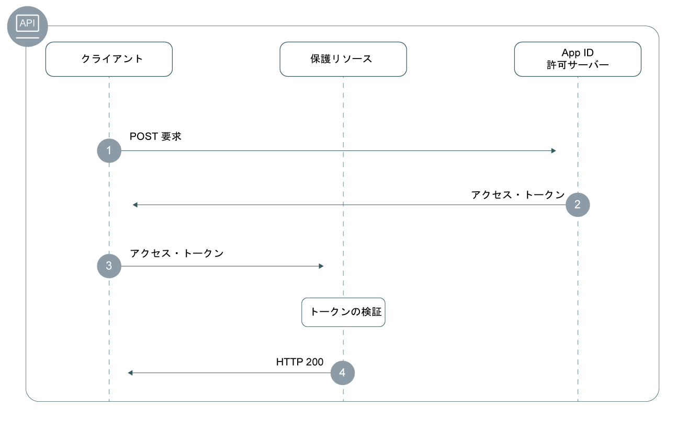

---

copyright:
  years: 2017, 2019
lastupdated: "2019-04-10"

keywords: authentication, authorization, identity, app security, secure, backend, back-end, oauth, 

subcollection: appid

---

{:new_window: target="_blank"}
{:shortdesc: .shortdesc}
{:screen: .screen}
{:pre: .pre}
{:table: .aria-labeledby="caption"}
{:codeblock: .codeblock}
{:tip: .tip}
{:note: .note}
{:important: .important}
{:deprecated: .deprecated}
{:download: .download}
{:java: .ph data-hd-programlang='java'}
{:javascript: .ph data-hd-programlang='javascript'}
{:swift: .ph data-hd-programlang='swift'}
{:curl: .ph data-hd-programlang='curl'}

# バックエンド・アプリ
{: #backend}

{{site.data.keyword.appid_full}} SDK および API を使用して、バックエンド・アプリケーション・エンドポイントおよび API を保護できます。
{: shortdesc}


## フローについて
{: #backend-understanding}

バックエンド・アプリの開発には、API を無許可アクセスから確実に保護することが含まれます。 {{site.data.keyword.appid_short_notm}} SDK を利用すると、容易に API エンドポイントを保護することができるので、アプリのセキュリティーを確保できます。


### このフローの技術基盤
{: #backend-technical-flow}

{{site.data.keyword.appid_short_notm}} は、認証と許可にベアラー・トークンを使用する、[OAuth 2.0](https://tools.ietf.org/html/rfc6749) および OIDC 仕様を実装します。 このトークンは [JSON Web トークン](https://tools.ietf.org/html/rfc7519)としてフォーマットされ、デジタル署名されます。そのトークンには、認証されているサブジェクトと ID プロバイダーを記述するクレームが格納されます。 アプリケーションの API は、アクセス・トークンと識別トークンによって保護されます。 API にアクセスする必要があるクライアントは、それらのトークンを交換することによって、{{site.data.keyword.appid_short_notm}} を介して ID プロバイダーで認証されます。 トークン内のクレームの検証に合格すると、保護 API へのアクセスが許可されます。

{{site.data.keyword.appid_short_notm}} でのトークンの使用方法について詳しくは、[トークンについて](/docs/services/appid?topic=appid-tokens#tokens)を参照してください。
{: tip}


### このフローの概要
{: #backend-flow}



1. クライアントは {{site.data.keyword.appid_short_notm}} 許可サーバーに対して POST 要求を行い、アクセス・トークンを取得します。 通常、POST 要求の形式は以下のとおりです。

  ```
  POST/oauth/v4/{tenantId}/token HTTP/1.1
  Content_type: application/x-www-form-urlencoded
  Authorization header = "Basic" + base64encode({clientId}:{secret})
  FormData = {grant_type}
  ```
  {: screen}

2. クライアントが資格を満たしている場合、許可サーバーはアクセス・トークンを返します。

3. クライアントが保護リソースに要求を送信します。 使用する HTTP クライアント・ライブラリーによって複数の方法で要求を送信できますが、要求には一般に次の形式を使用します。

  ```
  curl -H 'Authorization: Bearer {access_token}' {https://my-protected-resource.com}
  ```
  {: screen}

4. 保護リソースまたは保護 API がトークンを検証します。 トークンが有効である場合、クライアントによるリソースへのアクセスが許可されます。 トークンを検証できない場合、アクセスは拒否されます。


## SDK を使用したリソースの保護
{: #backend-secure}

{{site.data.keyword.appid_short_notm}} SDK を使用して、サーバー・サイドのアプリケーションのための認証と許可を実施できます。`ApiStrategy` はバックエンド・リソースを保護するために機能し、アクセス・トークンと識別トークンを検証することを要求の一部として求めます。
{: shortdesc}

{{site.data.keyword.appid_short_notm}} Node.js SDK は、[Passport フレームワーク](http://www.passportjs.org/)と連動して機能します。
{: ph data-hd-programlang='javascript'}

{{site.data.keyword.appid_short_notm}} サーバー・サイド Swift SDK には、バックエンド・アプリの保護に使用する API 保護ミドルウェア・プラグインが用意されています。API をミドルウェアと関連付けることで、アプリを不正アクセスから保護することができます。 API を保護した後、{{site.data.keyword.appid_short_notm}} が生成したトークンがこのミドルウェアによって確実に検証されます。 その検証結果に応じて API の動作を変更できます。
{: ph data-hd-programlang='swift'}

`/protectedendpoint` API を保護する方法の例について、以下のコード・スニペットを参照してください。
{: ph data-hd-programlang='swift'}

```Swift
import Foundation
import Kitura              // server
import Credentials         // middleware
import IBMCloudAppID       // SDK

// setup routes
let router = Router()

// mandatory option to be passed in if app not deployed on IBM Cloud
let options = [
    "oauthServerUrl": "https://us-south.appid.cloud.ibm.com/oauth/v4/d8438de6-c325-4956-ad34-abd49194affd",
]
let apiCreds = Credentials()

// Minimum macOS version required
if #available(OSX 10.12, *) {

    // setup API protection
    let apiKituraCredentialsPlugin = APIKituraCredentialsPlugin(options: options)
    apiCreds.register(plugin: apiKituraCredentialsPlugin)

    // associate route with API protection
    router.all(middleware: apiCreds)

    // create protected API
    router.get("/protectedendpoint") { request, response, next in

        response.headers["Content-Type"] = "text/html; charset=utf-8"
        do {
            if let userProfile = request.userProfile  {
                try response.status(.OK).send(
                    "<!DOCTYPE html><html><body>" +
                        "Welcome " + userProfile.displayName  +
                        "! You are logged in with " + userProfile.provider + "." +
                    "</body></html>\n\n").end()
                next()
                return
            }
            try response.status(.unauthorized).send(
                "<!DOCTYPE html><html><body>” + “You are not authorized!" +
                "</body></html>\n\n").end()
        }
        catch {}
        next()
    }

    // Start server
    Kitura.addHTTPServer(onPort: 8090, with: router)

    Kitura.run()  
}
```
{: pre}
{: ph data-hd-programlang='swift'}


### 開始する前に
{: #backend-secure-before}
{: ph data-hd-programlang='javascript'}

開始する前に、以下の前提条件を満たしておく必要があります。
{: ph data-hd-programlang='javascript'}
  * {{site.data.keyword.appid_short_notm}} のインスタンス
  * NPM バージョン 4 以上
  * Node バージョン 6 以上
  {: ph data-hd-programlang='javascript'}

### SDK のインストール
{: #backend-secure-install}
{: ph data-hd-programlang='javascript'}

1. {{site.data.keyword.appid_short_notm}} Node.js SDK をアプリの `package.json` ファイルに追加します。
{: ph data-hd-programlang='javascript'}
  ```
  "dependencies": {
      "ibmcloud-appid": "^6.0.0"
  }
  ```
  {: pre}
  {: ph data-hd-programlang='javascript'}

2. 以下のコマンドを実行します。
{: ph data-hd-programlang='javascript'}

  ```
  npm install
  ```
  {: pre}
  {: ph data-hd-programlang='javascript'}

### SDK の初期化
{: #backend-secure-initialize}
{: ph data-hd-programlang='javascript'}

1. `oauth server url` を取得します。
  1. {{site.data.keyword.appid_short_notm}} ダッシュボードの**「サービス資格情報」**タブに移動します。
  2. 資格情報のセットがまだない場合は、**「新規資格情報」**をクリックし、**「追加」**をクリックして新規セットを作成します。 ある場合は、このステップをスキップしてください。
  3. **「資格情報の表示」**トグルをクリックして情報を表示します。
  4. 次のステップで使用する `oauth server url` をコピーします。
  {: ph data-hd-programlang='javascript'}

2. 以下の例に示すように、{{site.data.keyword.appid_short_notm}} の passport 戦略を初期化します。
{: ph data-hd-programlang='javascript'}
  ```javascript
  var express = require('express'); 
  var passport = require('passport');
  var APIStrategy = require('ibmcloud-appid').APIStrategy; 
  passport.use(new APIStrategy({ oauthServerUrl: "{oauth-server-url}" })); 
  var app = express();
  app.use(passport.initialize());
  ```
  {: pre}
  {: ph data-hd-programlang='javascript'}


Node.js アプリが {{site.data.keyword.cloud_notm}} 上で実行され、{{site.data.keyword.appid_short_notm}} のインスタンスにバインドされている場合、API 戦略構成を指定する必要はありません。 {{site.data.keyword.appid_short_notm}} 構成で、VCAP_SERVICES 環境変数を使用することによって情報を取得します。
{: tip}
{: ph data-hd-programlang='javascript'}


### API の保護
{: #backend-secure-api-strategy}
{: ph data-hd-programlang='javascript'}

以下のスニペットは、`/protected` GET API を保護するために Express アプリで `ApiStrategy` を使用する方法を示しています。
{: ph data-hd-programlang='javascript'}

  ```javascript
   app.get('/protected', passport.authenticate('APIStrategy.STRATEGY_NAME', { session: false }), function(request, response){
      console.log("Security context", request.appIdAuthorizationContext);
      response.send(200, "Success!");
      }
   );
   ```
  {: pre}
  {: ph data-hd-programlang='javascript'}

トークンが有効である場合、要求チェーンの中で次の順番のミドルウェアが呼び出され、`appIdAuthorizationContext` プロパティーが要求オブジェクトに追加されます。 このプロパティーには、元のアクセス・トークンと識別トークン、およびトークンのデコード済みペイロード情報が格納されます。
{: ph data-hd-programlang='javascript'}


## 手動でのリソースの保護
{: #backend-secure-api}

バックエンド・アプリと保護リソースを保護するには、トークンを検証する必要があります。クライアントがリソースに要求を送信するとき、定義された仕様をトークンが満たしているかどうかを検査できます。識別情報やスコープなど、設定した構成がトークンに含まれている可能性があります。{{site.data.keyword.appid_short_notm}} のアクセス・トークンと識別トークンは、いくつかの方法で検証できます。 ヘルプ情報が必要な場合は、[トークンの検証](/docs/services/appid?topic=appid-token-validation#token-validation)を確認してください。


## 次のステップ
{: #backend-next}

{{site.data.keyword.appid_short_notm}} がアプリケーションにインストールされたので、ユーザーの認証を開始する準備がほとんどできています。 次に、以下のいずれかの作業を行ってください。

* [ID プロバイダー](/docs/services/appid?topic=appid-social)を構成します
* [ログイン・ウィジェット](/docs/services/appid?topic=appid-login-widget)のカスタマイズと構成を行います
* <a href="https://github.com/ibm-cloud-security/appid-serversdk-nodejs" target="_blank">Node.js SDK </a> について学習します
* <a href="https://github.com/ibm-cloud-security/appid-serversdk-swift" target="_blank">Swift SDK </a> について学習します
