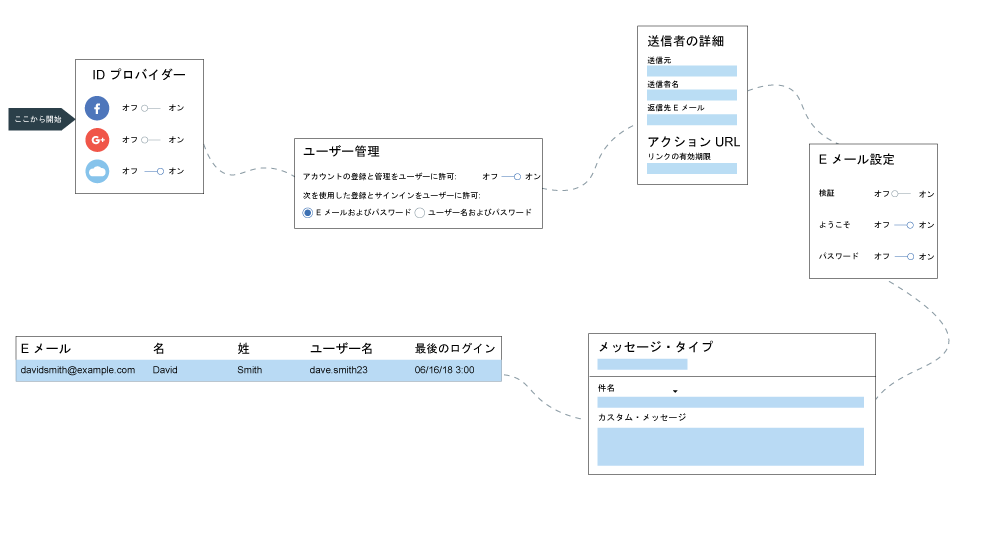

---

copyright:
  years: 2017, 2019
lastupdated: "2019-04-04"

keywords: authentication, authorization, identity, app security, secure, directory, registry, passwords, languages, lockout

subcollection: appid

---

{:new_window: target="_blank"}
{:shortdesc: .shortdesc}
{:screen: .screen}
{:pre: .pre}
{:table: .aria-labeledby="caption"}
{:codeblock: .codeblock}
{:tip: .tip}
{:note: .note}
{:important: .important}
{:deprecated: .deprecated}
{:download: .download}

# Cloud Directory の構成
{: #cloud-directory}

{{site.data.keyword.appid_full}} を利用すると、ユーザーは E メールまたはユーザー名とパスワードを使用して、モバイル・アプリや Web アプリに登録し、サインインすることができます。 クラウド・ディレクトリーは、クラウド内で管理されるユーザー・レジストリーです。 ユーザーがアプリに登録すると、ユーザーのディレクトリーに追加されます。 この機能により、ユーザーはアプリ内で自分のアカウントを自由に管理できます。
{: shortdesc}

## ディレクトリー設定の管理
{: #cd-settings}

アプリでの通知とユーザー制御レベルを構成することができます。 以下の図に示すように、Cloud Directory は簡単にセットアップできます。これらの設定は、サービス・ダッシュボードからいつでも更新でき、コード変更の必要なしにアプリに反映されます。
{: shortdesc}

図. Cloud Directory の構成手順

1. {{site.data.keyword.appid_short_notm}} ダッシュボードの**「認証の管理 (Manage authentications)」**タブにナビゲートし、Cloud Directory を**「オン」**に設定しておきます。

2. **「Cloud Directory」>「設定」**タブで、**「登録とサインインをユーザーに許可 (Allow users to sign up and sign in)」**を**「E メールとパスワード (Email and password)」**または**「ユーザー名とパスワード (User name and password)」**のいずれかに設定します。ユーザーは既に所有している E メールを指定してサインインするか、アプリと対話するときに使用するユーザー名を作成することができます。

  ディレクトリーにユーザーが追加される前に、これらのオプションを切り替えることができます。最初のユーザーが追加されたら、その後のユーザーでも同じ構成を使用する必要があります。
  {: note}

2. ユーザーがサインインするときにユーザー名を作成してもらうか、それとも E メールを使用してもらうかを決定します。 どちらのオプションでもパスワードが必要です。 ユーザーがディレクトリーに追加された後は、オプションを切り替えることができません。

3. パスワード基準の行で**「編集」**をクリックして、適用する要件を指定します。 パスワード基準は、正規表現で指定します。 強度を決定する指針や、一般的な例については、[パスワード・ストレングスの管理](/docs/services/appid?topic=appid-cd-strength#cd-strength)を参照してください。 **「保存」**をクリックして、要件を有効にします。

4. **「ユーザーがアプリケーションにサインアップできるようにする」**を**「はい」**に設定します。 **「いいえ」**に設定されている場合でもコンソールでユーザーを追加できます。ただし、コンソールでユーザーを追加するのは開発目的に限定するのが最も一般的です。

5. ユーザーがパスワードをリセットしたり、パスワードを変更したり、自分の詳細情報をリセットしたりできるようにするには、**「ユーザーがアプリケーションからアカウントを管理できるようにする」**を**「はい」**に設定します。 ユーザーがセルフサービスを行えることを制限する場合は、この値を**「いいえ」**に設定します。

6. E メール設定を構成します。 **「送信者の詳細」**行にある**「編集」**をクリックして、E メール設定を更新します。 この E メール設定は、{{site.data.keyword.appid_short_notm}} によって送信されるすべての通信に適用されます。

    1. E メールの送信元となる E メール・アドレスを指定します。 デフォルトを変更することを選択した場合、E メールはユーザーのスパム・フォルダーに送信される可能性があります。

    2. 送信者の名前を追加します。

    3. 応答の送信に使用できる E メールを入力します。

    4. **「保存」**をクリックします。
