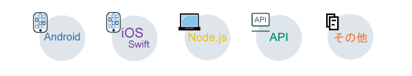

---

copyright:
  years: 2017, 2018
lastupdated: "2018-4-24"

---

{:new_window: target="_blank"}
{:shortdesc: .shortdesc}
{:screen: .screen}
{:codeblock: .codeblock}
{:pre: .pre}
{:tip: .tip}

# クラウド・ディレクトリーの構成
{: #cd}

ユーザーは、E メールとパスワードを使用して、モバイル・アプリや Web アプリに登録し、サインインすることができます。クラウド・ディレクトリーは、クラウド内で管理されるユーザー・レジストリーです。 ユーザーは、E メールとパスワードを使用してアプリに登録すると、ユーザーのディレクトリーに追加されます。この機能により、ユーザーはアプリ内で自分のアカウントを自由に管理できます。
{: shortdesc}

 

## ディレクトリー設定の管理
{: #cd-settings}

アプリでの通知とユーザー制御レベルを構成することができます。 以下の図に示すように、クラウド・ディレクトリーは簡単にセットアップできます。 これらの設定は、いつでもサービス・ダッシュボードから更新できます。
{: shortdesc}

1. ID プロバイダーとしてクラウド・ディレクトリーをオンにしたことを確認し、**「登録とパスワード・リセットをユーザーに許可する (Allow users to sign up and reset their password)」**を**「オン (On)」**に設定します。 **「オフ (Off)」**に設定されている場合でも、開発目的であれば、コンソールでユーザーを追加できます。
2. 送信者の詳細を構成します。 メッセージの送信元として表示される E メール・アドレス、送信者、ユーザーの返信先を指定します。
  アクション URL を構成するときは、ユーザーがリンクをクリックできるだけの十分な時間を確保してください。ユーザーは、自分の E メールが特定のオプション (パスワードの再設定を要求する機能など) を備えていることを検証する必要があります。
  {: tip}
3. ユーザーが受信する E メールのタイプと、送信者情報を決定します。
4. 用意されているテンプレートを使用して、ユーザーのブランドを表すメッセージや個人別に設定したメッセージでメッセージをカスタマイズします。詳しくは、[メッセージの管理](/docs/services/appid/cloud-directory.html#cd-messages)を参照してください。
5. GUI の「**ユーザー**」タブで、アプリに登録したユーザーを参照します。

 

## メッセージの管理
{: #cd-messages}

テンプレートとは、ユーザーに送信する E メール・メッセージのサンプルです。テンプレートは、メッセージの内容やレイアウトを更新してカスタマイズできます。 それらのメッセージは、ディレクトリー設定タブで**「オン (On)」**または**「オフ (Off)」**に設定できます。
{: shortdesc}

1. **「メッセージ・タイプ (Message type)」**を選択します。
2. メッセージの内容やデザインを変更して、メッセージをカスタマイズします。 パラメーターを使用して、メッセージをパーソナライズすることができます。 変更後は必ず保存してください。

### メッセージのタイプ

いくつかのタイプのメッセージをユーザーに送信できます。UI 内にプログラムされているサンプル・メッセージを送信することも、個人に合わせたアプリ操作環境にするためにコンテンツをカスタマイズすることもできます。

<dl>
  <dt>ようこそ</dt>
    <dd>
ユーザーが登録されたら、アプリケーションのウェルカム・メッセージを E メールでユーザーに送信できます。ユーザーを歓迎してアプリを長く使ってもらうために、できるだけ魅力的なメッセージを作成します。

    <table>
      <thead>
        <th colspan=2> すべてのメッセージ・パラメーター</th>
      </thead>
      <tbody>
        <tr>
          <td> %{display.logo} </td>
          <td> ログイン・ウィジェットのために構成したイメージを表示します。 </td>
        </tr>
        <tr>
          <td> %{user.displayName} </td>
          <td> アプリとやり取りするときに使用する、ユーザーが選択した画面名を表示します。</td>
        </tr>
        <tr>
          <td> %{user.email} </td>
          <td> ユーザーが登録した E メール・アドレスを表示します。 </td>
        </tr>
        <tr>
          <td> %{user.firstName} </td>
          <td> ユーザーが指定した名を表示します。</td>
        </tr>
        <tr>
          <td> %{user.formattedName} </td>
          <td> ユーザーのフルネームを表示します。 </td>
        </tr>
        <tr>
          <td> %{user.lastName} </td>
          <td> ユーザーが指定した姓を表示します。</td>
        </tr>
      </tbody>
    </table>
    
**注**: パラメーターによってプルされた情報をユーザーが指定していない場合は、ブランクとして表示されます。
</dd>
  <dt>パスワードを忘れた場合</dt>
    <dd>
ユーザーは、パスワードを忘れた場合や、何らかの理由でパスワードを更新する必要がある場合に、パスワードの再設定を要求することができます。その要求に対する E メール応答をカスタマイズすることができます。 ユーザーが変更を要求しても、ユーザーがこのメール内のリンクをクリックするまでパスワードは変更されません。

    <table>
      <thead>
        <th colspan=2> パスワード変更パラメーター </th>
      </thead>
      <tbody>
        <tr>
          <td> %{linkExpiration.hours} </td>
          <td> リンクが有効な時間数を表示します。 </td>
        </tr>
        <tr>
          <td> %{linkExpiration.minutes} </td>
          <td> リンクが有効な分数を表示します。 </td>
        </tr>
        <tr>
          <td> %{resetPassword.code} </td>
          <td> URL の一部としてワンタイム・パスコードを表示します。 ユーザーごとに異なるコードになります。例: <code>https://appid-wfm.bluemix.net/verify/6574839563478 </code> </td>
        </tr>
        <tr>
          <td> %{resetPassword.link} </td>
          <td> パスワードをリセットするためにユーザーがクリックするリンクを表示します。 </td>
        </tr>
       </tbody>
    </table>
    </dd>
  <dt>検証</dt>
    <dd>
E メールによってアカウントを検証するようユーザーに要求することができます。 検証を要求することで、アプリに登録されるおそれのある偽アカウントの数を抑制します。 ユーザーが E メールを検証するまでアプリへのアクセスを制限したり、プロファイルの作成対象ユーザーを管理する手段として利用したりできます。

    <table>
      <thead>
        <th colspan=2> 検証メッセージ・パラメーター </th>
      </thead>
      <tbody>
        <tr>
          <td> %{linkExpiration.hours} </td>
          <td> リンクが有効な時間数を表示します。 </td>
        </tr>
        <tr>
          <td> %{linkExpiration.minutes} </td>
          <td> リンクが有効な分数を表示します。 </td>
        </tr>
        <tr>
          <td> %{verify.code} </td>
          <td> ワンタイム検証 URL を表示します。 </td>
        </tr>
        <tr>
          <td> %{verify.link} </td>
          <td> 設定で指定したアクション URL を表示します。 </td>
        </tr>
      </tbody>
    </table>
    </dd>
  <dt>パスワード変更</dt>
    <dd>
パスワードが更新されたときにユーザーに通知することができます。 これは、ユーザーがパスワードの変更を要求しなかった場合に役立ちます。ユーザーは適切な手順に沿って、アカウントを再びセキュアにすることができます。

    <table>
      <thead>
        <th colspan=2> パスワード変更パラメーター </th>
      </thead>
      <tbody>
        <tr>
          <td> %{passwordChangeInfo.time} </td>
          <td> 新規パスワードが有効になった時刻を表示します。 </td>
        </tr>
        <tr>
          <td> %{passwordChangeInfo.ipAddress} </td>
          <td> パスワード変更の要求元となった IP アドレスを表示します。 </td>
        </tr>
      </tbody>
    </table>
    </dd>
</dl>
 
**注**: {{site.data.keyword.appid_short_notm}} は <a href="https://www.sendgrid.com" target="_blank">SendGrid </a> をメール配信サービスとして使用します。 すべての E メールは、単一の SendGrid アカウントを使用して送信されます。

 
## 次のステップ
クラウド・ディレクトリーを構成したので、ログイン・ウィジェットのコードをアプリのコードに追加する準備が整いました。以下の画像内の SDK 言語アイコンをクリックして、必要な作業を参照してください。
{: shortdesc}

<map name="options-map" id="options-map">
<area href="login-widget.html#branded-ui-android" alt="Android SDK によるサインイン操作環境の管理" shape="rect" coords="187, 6, 305, 120" />
<area href="login-widget.html#branded-ui-ios-swift" alt="iOS Swift SDK によるサインイン操作環境の管理" shape="rect" coords="333, 6, 448, 125" />
<area href="login-widget.html#branded-ui-nodejs" alt="Node.js SDK によるサインイン操作環境の管理" shape="rect" coords="472, 7, 590, 121" />
</map>
