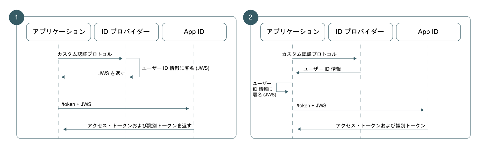

---

copyright:
  years: 2017, 2019
lastupdated: "2019-04-04"

keywords: authentication, authorization, identity, app security, secure, custom, proprietary, 

subcollection: appid

---

{:new_window: target="_blank"}
{:shortdesc: .shortdesc}
{:screen: .screen}
{:pre: .pre}
{:table: .aria-labeledby="caption"}
{:codeblock: .codeblock}
{:tip: .tip}
{:note: .note}
{:important: .important}
{:deprecated: .deprecated}
{:download: .download}

# アプリでのカスタム ID の使用
{: #custom-auth}

認証時に独自のカスタム ID プロバイダーを使用できます。 {{site.data.keyword.appid_full}} でサポートされている認証メカニズムの代替となる、任意の認証メカニズムに準拠した ID プロバイダーを使用できます (専有またはレガシーのものを含む)。
{: shortdesc}

## 概要
{: #custom-auth-overview}

独自の ID プロバイダーを導入することで、独自のプロトコルを使用したカスタム認証フローを作成できます。 共有する情報や保管する情報など、さらに自由に制御できます。
{: shortdesc}

[カスタム・プロバイダーを構成](/docs/services/appid?topic=appid-custom-identity)した後で、それをアプリケーションに追加するようにしてください。
{: tip}

### このフローを使用できる状況
{: #custom-auth-when}

{{site.data.keyword.appid_short_notm}} が特定の ID プロバイダーを直接サポートしていない場合、{{site.data.keyword.appid_short_notm}} の既存の認証フローと認証プロトコルの間のブリッジとして、カスタム識別フローを使用することができます。 例えば、GitHub または LinkedIn を使用してユーザーにサインインを許可するとします。 ユーザー認証情報を容易に扱えるように ID プロバイダーの既存の SDK を使用してから、その情報をパッケージして {{site.data.keyword.appid_short_notm}} と交換することができます。

別の認証フローが必要になるシナリオは、以下のように多数あります。

 - 専有の社内 ID プロバイダー
 - サード・パーティーの ID プロバイダー
 - 複雑な認証フロー (独自の多要素メカニズムが組み込まれていることがあります)

場合によっては、レガシー・プロバイダーで独自のカスタム認証プロトコルが使用されていることがあります。 カスタム識別フローによって認証が許可から完全に分離されるため、任意の認証メカニズムを採用し、それから得られる認証情報を {{site.data.keyword.appid_short_notm}} に提供することができます。 これらの処理はすべて、ユーザー資格情報を露出せずに実行できます。

</br>

### このフローの技術的な仕組み
{: #custom-auth-tech}

カスタム識別ワークフローは、Assertion Framework for OAuth 2.0 Authorization Grants [[RFC7521]](https://tools.ietf.org/html/rfc7523#section-2.1) で定義されている、JWT-Bearer 拡張付与タイプに基づいて構築されています。 {{site.data.keyword.appid_short_notm}} のトークンのユーザー情報を交換するため、ご使用の認証アーキテクチャーで非対称 RSA 鍵ペアを使用して、{{site.data.keyword.appid_short_notm}} との信頼関係を確立します。 信頼関係が確立されたら、JWT-Bearer 付与タイプを使用することで、{{site.data.keyword.appid_short_notm}} のトークンの署名付き JWT 内にある、検証済みユーザー情報を交換できます。

### フローの概要
{: #custom-auth-flow}

あらゆる認証フローの場合と同様に、カスタム識別を使用する場合も、ID プロバイダーのユーザー情報の整合性を確保するため、アプリケーションが {{site.data.keyword.appid_short_notm}} との一定レベルの信頼関係を確立できるようにする必要があります。 カスタム識別の場合、非対称 RSA 公開鍵/秘密鍵ペアを使用して、信頼関係を確立します。 カスタム識別は、アーキテクチャーの要件に基づいて 2 種類の信頼モデルをサポートします。2 つの違いはストレージ・ロケーションと秘密鍵の使用法のみです。


図. カスタム認証の要求フロー

<dl>
  <dt>1. ID プロバイダーによる署名</dt>
    <dd>従来の OAuth 2.0 フローと同様に、最もセキュアな信頼モデルでは、ID プロバイダーと許可サーバー (この場合は {{site.data.keyword.appid_short_notm}}) との間の直接の関係が作成されます。 このモデルでは、ID プロバイダーが秘密鍵の保管と JWT アサーションの署名を実行します。 これらのアサーションは、{{site.data.keyword.appid_short_notm}} に渡されると、対応する公開鍵を使用して検証されます。これにより、ID プロバイダーからのユーザー情報が転送中に故意に改ざんされていないことを確認できます。</dd>
  <dt>2. アプリケーションによる署名</dt>
    <dd>別の方式として、アプリと {{site.data.keyword.appid_short_notm}} との間の関係に基づいた信頼モデルを採用することもできます。 このワークフローでは、秘密鍵はサーバー・サイドのアプリケーションに保管されます。 認証が成功すると、アプリは、ID プロバイダーの応答を JWT に変換し、その秘密鍵を使用して JWT に署名します。その後、アプリはトークンを {{site.data.keyword.appid_short_notm}} に送信します。 このアーキテクチャーでは、この ID プロバイダーに {{site.data.keyword.appid_short_notm}} との関係がないため、信頼モデルは前者の方法より弱くなります。 {{site.data.keyword.appid_short_notm}} は、サーバー・サイドのアプリケーションによって送信された情報を信頼できますが、データが ID プロバイダーによって送信されたオリジナル・データであることを確証できません。</dd>
</dl>


## JSON Web トークンの生成
{: #generating-jwts}

検証済みユーザー・データをカスタム識別 JWT に変換するには、<a href="https://tools.ietf.org/html/rfc7515" target="blank">JSON Web トークン </a> を生成します。 このトークンを、事前構成された公開鍵に対応する秘密鍵で署名する必要があります。 トークン署名ライブラリーのリストについては、<a href="https://jwt.io/" target="blank">jwt.io </a> を参照してください。
{: shortdesc}

### JWT フォーマットの例
{: #jwts-example}

トークン・ヘッダー:
  ```
  {
  "alg": "RS256",
  "typ": "JOSE"
  }
  ```
  {: screen}

トークン・ペイロード:
  ```
  {
    // Required
    iss: String, // Should reference your identity provider
    aud: String, // Must be the OAuth server URL name
    exp: Int,    // Should be a value with a short lifespan
    sub: String, // Must be the unique user ID provided by your identity provider

    // Normalized claims (optional)
    name: String
    email: String
    locale: String
    picture: String
    gender: String

    // Custom Scopes to add to access token (optional)
    scope="custom_scope1 custom_scope2"

    // Other custom claims (optional)
    role="admin"
  }
  ```
  {: screen}

  <table>
  <thead>
    <th colspan=2> JWS フィールド</th>
  </thead>
  <tbody>
    <tr>
      <td><code> iss </code></td>
      <td>ID プロバイダーへの参照を含める必要があります。</td>
    </tr>
    <tr>
      <td><code> aud </code></td>
      <td>OAuth サーバー URL。 形式は https://{region}.appid.cloud.ibm.com/oauth/v4/{tenantId} です。</td>
    </tr>
    <tr>
      <td><code> exp </code></td>
      <td>トークンが有効である時間の長さ。 セキュリティー上の理由から、短い存続期間を具体的に指定する必要があります。</td>
    </tr>
    <tr>
      <td><code> sub </code></td>
      <td>ID プロバイダーによって提供される固有のユーザー ID。</td>
    </tr>
    <tr>
      <td>正規化クレーム</td>
      <td>すべての[正規化クレーム](/docs/services/appid?topic=appid-tokens#tokens)は、この要求に対する応答として返される、識別トークンで提供されます。 [`/userinfo` エンドポイント](/docs/services/appid?topic=appid-custom-attributes#custom-attributes)を使用して、さらにカスタム・クレームを検出することができます。</td>
    </tr>
    <tr>
      <td>スコープ</td>
      <td>デフォルトでは、すべての {{site.data.keyword.appid_short_notm}} トークンに事前設定スコープのグループが含まれています。 以下のいずれかを実行すると、追加のスコープを要求することができます。<ul><li> JWS トークンのスコープ・フィールドでスコープを指定します。</li> <li>`/token` 要求の url-form スコープ・パラメーターを使用してスコープを指定します。</li></ul></td>
    </tr>
  </tbody>
  </table>

## {{site.data.keyword.appid_short_notm}} トークンの取得
{: #exchanging-jwts}

カスタム・プロバイダーと {{site.data.keyword.appid_short_notm}} との間のブリッジを作成するには、{{site.data.keyword.appid_short_notm}} のトークンが必要です。 サービス・トークンを取得するには、[`/token` エンドポイント](https://us-south.appid.cloud.ibm.com/swagger-ui/#/Authorization_Server_V4/token)を使用して、検証済みユーザー情報を交換します。
{: shortdesc}

  ```
  Post /token
  Content-Type: application/x-www-from-urlencoded
  grant_type=urn:ietf:params:oauth:grant-type:jwt-bearer
  assertion=<payload>
  scope="<space separated scope array>"
  ```
  {: codeblock}
  <table>
    <thead>
      <th colspan=2> 要求の構造</th>
    </thead>
    <tbody>
      <tr>
        <td>Content-type</td>
        <td><code>applications/x-www-from-urlencoded</code></td>
      </tr>
      <tr>
        <td>grant_type</td>
        <td><code>urn:ietf:params:oauth:grant-type:jwt-bearer</code></td>
      </tr>
      <tr>
        <td>assertion</td>
        <td>JWS ペイロード・ストリング。</td>
      </tr>
      <tr>
        <td>scope</td>
        <td>カスタム・スコープの空白文字区切りリスト。</td>
      </tr>
    </tbody>
  </table>
