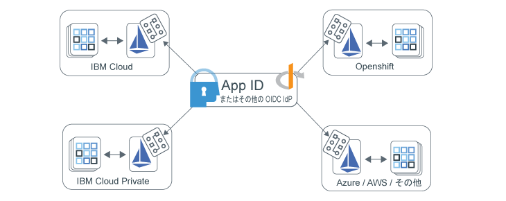

---

copyright:
  years: 2017, 2019
lastupdated: "2019-07-11"

keywords: Authentication, authorization, identity, app security, access, secure, development, any kube, kubernetes, icp, openshift, iks

subcollection: appid

---

{:external: target="_blank" .external}
{:shortdesc: .shortdesc}
{:screen: .screen}
{:pre: .pre}
{:table: .aria-labeledby="caption"}
{:codeblock: .codeblock}
{:tip: .tip}
{:note: .note}
{:important: .important}
{:deprecated: .deprecated}
{:download: .download}

# Istio によるマルチクラウド・アプリの保護
{: #istio-adapter}

App Identity and Access アダプターを使用すると、すべての ID 管理を一カ所でまとめて行うことができます。企業では複数のプロバイダーのクラウドを利用したり、オンプレミス・ソリューションとオフプレミス・ソリューションを組み合わせて利用したりするので、異機種混合のデプロイメント・モデルがあれば、既存のインフラストラクチャーを保持してベンダーのロックインを回避することができます。このアダプターは、{{site.data.keyword.appid_short_notm}} などの OIDC 準拠の ID プロバイダーと連携するように構成できるので、フロントエンド・アプリケーションもバックエンド・アプリケーションも含め、あらゆる環境の認証および許可ポリシーを制御することができます。そのうえ、**コードを変更したりアプリケーションを再デプロイしたりする必要が一切ありません**。
{: shortdesc}


## マルチクラウド・アーキテクチャー
{: #istio-multicloud}

マルチクラウド・コンピューティング環境とは、複数のクラウドやプライベートのコンピューティング環境を結合して単一のネットワーク・アーキテクチャーにしたものです。複数の環境にワークロードを分散させることで、耐障害性、柔軟性、およびコスト効率を高めることができます。これらのメリットを実現するために、Kubernetes などのオーケストレーション層とコンテナー・ベースのアプリケーションを使用することが一般的です。


図. マルチクラウド・デプロイメント - App Identity and Access アダプターによって実現。


## Istio とアダプターについて
{: #istio-architecure}

[Istio](https://istio.io) は、Kubernetes と統合できる既存の分散アプリケーションの上層に透過的に構成されるオープン・ソースのサービス・メッシュです。デプロイメントの複雑さを緩和するために、Istio は、サービス・メッシュ全体の動作の分析情報を提供し、操作を制御できるようにします。
App ID を Istio と組み合わせると、カスタム・アプリケーションのコード変更を必要としない、マルチクラウド・アーキテクチャー対応のスケーラブルな統合 ID ソリューションになります。詳しくは、[What is Istio?](https://www.ibm.com/cloud/learn/istio?cm_mmc=OSocial_Youtube-_-Hybrid+Cloud_Cloud+Platform+Digital-_-WW_WW-_-IstioYTDescription&cm_mmca1=000023UA&cm_mmca2=10010608){: external} を参照してください。

Istio は Envoy プロキシーのサイドカーを使用して、サービス・メッシュ内のすべてのサービスのインバウンドとアウトバウンドのすべてのトラフィックを仲介します。プロキシーを使用して、Istio はトラフィックに関する情報 (テレメトリー) を抽出します。テレメトリーは、ポリシー決定を適用するために、Mixer という Istio コンポーネントに送信されます。App Identity and Access アダプターは、このテレメトリー (属性) をカスタム・ポリシーに照らして分析し、サービス・メッシュ全体の ID およびアクセス管理を制御することで Mixer 機能を拡張します。アクセス管理ポリシーは特定の Kubernetes サービスにリンクされ、特定のサービス・エンドポイントに合わせて微調整することができます。ポリシーおよびテレメトリーについて詳しくは、[Istio の資料](https://istio.io/docs/concepts/observability/){: external}を参照してください。 

Istio の制限により、現在、App Identity and Access アダプターはユーザー・セッション情報を内部に保管します。複数のレプリカやフェイルオーバー構成で情報を保持することは*ありません*。アダプターを使用する場合は、この制限がなくなるまで、ワークロードを単一のレプリカに限定してください。
{: note}

### フロントエンド・アプリの保護
{: #istio-frontend}

ブラウザー・ベースのアプリケーションを使用している場合は、[Open ID Connect (OIDC)](https://openid.net/specs/openid-connect-core-1_0.html){: external} / OAuth 2.0 `authorization_grant` フローを使用してユーザーを認証できます。認証されていないユーザーは、検出されると自動的に認証ページにリダイレクトされます。認証が完了すると、ブラウザーが、アダプターが要求を代行受信する暗黙の `/oidc/callback` エンドポイントにリダイレクトされます。この時点で、アダプターは ID プロバイダーからトークンを取得し、最初にユーザーから要求された URL にユーザーをリダイレクトします。

セッション・トークンなどのユーザー・セッション情報は、`Authorization` ヘッダーで確認できます。

```
Authorization: Bearer <access_token> <id_token>
```
{: screen}

認証済みユーザーをログアウトさせることもできます。以下の例に示すように `oidc/logout` が付加された保護エンドポイントにアクセスした認証済みユーザーは、ログアウトされます。

```
https://myhost/path/oidc/logout
```
{: screen}

必要な場合は、リフレッシュ・トークンを使用して、ユーザーの再認証なしで新規アクセス・トークンおよび ID トークンを自動的に取得することができます。構成した ID プロバイダーがリフレッシュ・トークンを返す場合は、そのトークンがセッション内に保持され、ID トークンの有効期限が切れたときに新規トークンを取得するために使用されます。


### バックエンド・アプリの保護
{: #istio-backend}

このアダプターを OAuth 2.0 の [JWT ベアラー・フロー](https://tools.ietf.org/html/rfc6750){: external}と一緒に使用すると、JWT ベアラー・トークンを検証してサービス API を保護することができます。ベアラー許可フローでは、有効なアクセス・トークンとオプションの ID トークンを指定した許可ヘッダーが要求に含まれていなければなりません。予期されるヘッダー構造は `Authorization=Bearer {access_token} [{id_token}]` です。認証されていないクライアントには、HTTP 401 応答ステータスと一緒に、許可を取得するために必要な範囲のリストが返されます。トークンが無効または期限切れの場合、API 戦略は HTTP 401 応答と一緒に `Www-Authenticate=Bearer scope="{scope}" error="{error}"` というオプションのエラー・コンポーネントを返します。


トークンの詳細および使用方法について詳しくは、[トークンについて](/docs/services/appid?topic=appid-tokens)を参照してください。


## 開始する前に
{: #istio-before}

開始する前に、以下の前提条件がインストールされていることを確認してください。

- [Kubernetes クラスター](https://kubernetes.io/){: external}
- [Helm](https://helm.sh/){: external}
- [Istio v1.1+](https://istio.io/docs/setup/kubernetes/install/){: external}
  
  [IBM Cloud Kubernetes Service のマネージド Istio](/docs/containers?topic=containers-istio) を使用することもできます。
  {: note}


## アダプターのインストール
{: #istio-install-adapter}

チャートをインストールするために、クラスター内で Helm を初期化し、使用するオプションを定義して、インストール・コマンドを実行します。

1. IBM Cloud Kubernetes Service を使用している場合は、必ずログインし、クラスターのコンテキストを設定してください。

2. Helm をクラスターにインストールします。

    ```bash
    helm init
    ```
    {: codeblock}

    `--tls` モードを使用するように Helm を構成することもできます。TLS の有効化については、[Helm リポジトリー](https://github.com/helm/helm/blob/master/docs/tiller_ssl.md){: external}を参照してください。TLS を有効にした場合、実行する Helm コマンドごとに `--tls` を付加してください。IBM Cloud Kubernetes Service で Helm を使用する方法について詳しくは、[Helm チャートを使用したサービスの追加](/docs/containers?topic=containers-helm#public_helm_install)を参照してください。
    {: tip}

3. チャートをインストールします。

    ```bash
    helm install ./helm/appidentityandaccessadapter --name appidentityandaccessadapter
    ```
    {: codeblock}

## 許可ポリシーと認証ポリシーの適用
{: #istio-apply-policy}

認証ポリシーまたは許可ポリシーは、要求がリソース・アクセスにアクセスするために満たす必要がある一連の条件です。ID プロバイダーのサービス構成および特定のフローを使用すべき状況を示すポリシーを定義して、サービス・メッシュ内の任意のリソースへのアクセスを制御できます。サンプル CRD については、[サンプル・ディレクトリー](https://github.com/ibm-cloud-security/app-identity-and-access-adapter/tree/master/samples/crds){: external}を確認してください。

ポリシーを作成するには、次のようにします。

1. 構成を定義します。
2. エンドポイントを登録します。

### 構成の定義
{: #istio-apply-define}

フロントエンド・アプリケーションとバックエンド・アプリケーションのどちらを保護するかに応じて、以下のいずれかの方法でポリシー構成を作成します。

* フロントエンド・アプリケーションの場合: ユーザー認証を必要とするブラウザー・ベースのアプリケーションは、OIDC / OAuth 2.0 認証フローを使用するように構成できます。ID プロバイダーとの認証フローを簡単にするために使用するクライアントを指定した `OidcConfig` CRD を定義するには、以下の例を参考にしてください。

    ```yaml
    apiVersion: "security.cloud.ibm.com/v1"
    kind: OidcConfig
    metadata:
        name:      oidc-provider-config
        namespace: sample-namespace
    spec:
        discoveryUrl: https://us-south.appid.cloud.ibm.com/oauth/v4/<tenant-ID>/oidc-discovery/.well-known
        clientId:     <client-ID>
        clientSecret: <randomlyGeneratedClientSecret>
        clientSecretRef:
            name: <name-of-my-kube-secret>
            key: <key-in-my-kube-secret>
    ```
    {: screen}

    <table>
        <thead>
        <tr>
            <th>フィールド</th>
            <th style="text-align:center">タイプ</th>
            <th style="text-align:center">必須</th>
            <th style="text-align:center">説明</th>
        </tr>
        </thead>
        <tbody>
        <tr>
            <td><code>discoveryUrl</code></td>
            <td style="text-align:center">文字列</td>
            <td style="text-align:center">はい</td>
            <td style="text-align:center">OIDC/OAuth 2.0 構成情報の JSON 文書を提供する既知のエンドポイント。</td>
        </tr>
        <tr>
            <td><code>clientId</code></td>
            <td style="text-align:center">文字列</td>
            <td style="text-align:center">はい</td>
            <td style="text-align:center">認証に使用するクライアントの ID。</td>
        </tr>
        <tr>
            <td><code>clientSecret</code></td>
            <td style="text-align:center">文字列</td>
            <td style="text-align:center">*いいえ</td>
            <td style="text-align:center">クライアントの認証に使用するプレーン・テキストのシークレット。指定しない場合は、<code>clientSecretRef</code> が存在している必要があります。</td>
        </tr>
        <tr>
            <td><code>clientSecretRef</code></td>
            <td style="text-align:center">オブジェクト</td>
            <td style="text-align:center">いいえ</td>
            <td style="text-align:center">クライアントの認証に使用する参照シークレット。参照は <code>clientSecret</code> の代わりに使用することができます。</td>
        </tr>
        <tr>
            <td><code>clientSecretRef.name</code></td>
            <td style="text-align:center">文字列</td>
            <td style="text-align:center">はい</td>
            <td style="text-align:center"><code>clientSecret</code> を含む Kubernetes シークレットの名前。</td>
        </tr>
        <tr>
            <td><code>clientSecretRef.key</code></td>
            <td style="text-align:center">文字列</td>
            <td style="text-align:center">はい</td>
            <td style="text-align:center"><code>clientSecret</code> を含む Kubernetes シークレット内のフィールド。</td>
        </tr>
        </tbody>
    </table>

* バックエンド・アプリケーションの場合: OAuth 2.0 ベアラー・トークン仕様は、[JSON Web トークン (JWT)](https://tools.ietf.org/html/rfc7519.html){: external} を使用して API を保護するためのパターンを定義します。以下の構成を例として使用して、トークンの署名の検証に使用する公開鍵リソースを含む `JwtConfig` CRD を定義します。

    ```yaml
    apiVersion: "security.cloud.ibm.com/v1"
    kind: JwtConfig
    metadata:
      name:      jwt-config
      namespace: sample-app
    spec:
        jwksUrl: https://us-south.appid.cloud.ibm.com/oauth/v4/<tenant-ID>/publickeys
    ```
    {: screen}

### アプリケーション・エンドポイントの登録
{: #istio-register-endpoints}

`Policy` CRD 内に、着信要求を検証して認証ルールを適用するためのアプリケーション・エンドポイントを登録します。各 `Policy` は、オブジェクトが存在する Kubernetes 名前空間に排他的に適用されます。それぞれに、保護するサービス、パス、およびメソッドを指定できます。

```yaml
apiVersion: "security.cloud.ibm.com/v1"
kind: Policy
metadata:
  name:      samplepolicy
  namespace: sample-app
spec:
  targets:
    -
      serviceName: <svc-sample-app>
      paths:
        - exact: /web/home
          method: ALL
          policies:
            - policyType: oidc
              config: <oidc-provider-config>
              rules:
                - claim: scope
                  match: ALL
                  source: access_token
                  values:
                    - appid_default
                    - openid
                - claim: amr
                  match: ANY
                  source: id_token
                  values:
                    - cloud_directory
                    - google

        - exact: /web/user
          method: GET
          policies:
            - policyType: oidc
              config: <oidc-provider-config>
              redirectUri: https://github.com/ibm-cloud-security/app-identity-and-access-adapter
        - prefix: /
          method: ALL
          policies:
            -
              policyType: jwt
              config: <jwt-config>
```
{: screen}


| サービス・オブジェクト | タイプ | 必須 | 説明   |
|:----------------:|:----:|:--------:| :-----------: |
| `service` | `文字列` | はい | 保護するポリシー名前空間内の Kubernetes サービスの名前。|
| `paths` | `配列[パス・オブジェクト]` | はい | 保護するエンドポイントを定義するパス・オブジェクトのリスト。空のままにした場合、すべてのパスが保護されます。|
{: class="simple-tab-table"}
{: caption="表 1. サービス・オブジェクトのコンポーネントについて" caption-side="top"}
{: #service-object}
{: tab-title="Service object"}
{: tab-group="objects"}

| パス・オブジェクト    | タイプ | 必須 | 説明   |
|:----------------:|:----:|:--------:|:-----------:|
| `exact または prefix` | `文字列` | はい | ポリシーを適用するパス。オプションには、`exact` と `prefix` があります。`exact` では、最後の `/` を除く、指定されたエンドポイントとの完全一致が適用対象になります。`prefix` では、指定された経路接頭部で始まるエンドポイントが適用対象になります。|
| `method` | `列挙型` | いいえ | 保護する HTTP メソッド。有効なオプションは、ALL、GET、PUT、POST、DELETE、PATCH です。デフォルトは ALL です。|
| `policies` | `配列[ポリシー]` | いいえ | 適用する OIDC/JWT ポリシー。|
{: class="simple-tab-table"}
{: caption="表 2. パス・オブジェクトのコンポーネントについて" caption-side="top"}
{: #path-object}
{: tab-title="Path object"}
{: tab-group="objects"}

| ポリシー・オブジェクト | タイプ | 必須 | 説明   |
|:----------------:|:----:|:--------:| :-----------: |
| `policyType` | `列挙型` | はい | OIDC ポリシーのタイプ。オプションには `jwt` または `oidc` があります。|
| `config` | `文字列` | はい | 使用するプロバイダー構成の名前。|
| `redirectUri` | `文字列` | いいえ | 認証が成功した後にユーザーをリダイレクトする URL。デフォルト: 元の要求 URL。|
| `rules` | `配列[ルール]` | いいえ | トークン検証に使用する一連のルール。|
{: class="simple-tab-table"}
{: caption="表 3. ポリシー・オブジェクトのコンポーネントについて" caption-side="top"}
{: #policy-object}
{: tab-title="Policy object"}
{: tab-group="objects"}

| ルール・オブジェクト  | タイプ | 必須 | 説明   |
|:----------------:|:----:|:--------:| :-----------: |
| `claim` | `文字列` | はい | 検証するクレーム。|
| `match` | `列挙型` | いいえ | クレームの検証に必要な基準。オプションには、`ALL`、`ANY`、または `NOT` があります。デフォルトでは、`ALL` に設定されます。|
| `source` | `列挙型` | いいえ | ルールを適用するトークン。オプションには `access_token` または `id_token` があります。デフォルトでは、`access_token` に設定されます。|
| `values` | `配列[文字列]` | はい | 検証に必要な一連の値。|
{: class="simple-tab-table"}
{: caption="表 4. ポリシー・オブジェクトのコンポーネントについて" caption-side="top"}
{: #rule-object}
{: tab-title="Rule object"}
{: tab-group="objects"}


## アダプターの削除
{: #istio-remove}

アダプターおよび関連するすべての CRD を削除するには、Helm チャートおよび関連する署名鍵と暗号鍵を削除する必要があります。

```bash
helm delete --purge appidentityandaccessadapter
kubectl delete secret appidentityandaccessadapter-keys -n istio-system
```
{: codeblock}


## よくある質問とトラブルシューティング
{: #istio-faq}

App Identity and Access アダプターの使用中に問題が発生した場合は、以下の FAQ とトラブルシューティングの手法を検討してください。さらに支援が必要な場合は、フォーラムで質問するか、サポート・チケットを開いてください。フォーラムを使用して質問するときは、{{site.data.keyword.appid_short_notm}} 開発チームの目に留まるように、質問にタグを付けてください。

  * {{site.data.keyword.appid_short_notm}} についての技術的な質問がある場合は、質問を<a href="https://stackoverflow.com/" target="_blank">スタック・オーバーフロー </a>に投稿し、質問に「ibm-appid」のタグを付けてください。
  * サービスや開始手順についての質問は、<a href="https://developer.ibm.com/" target="_blank">dW Answers </a> フォーラムをご利用ください。 `appid` のタグを付けてください。

サポートについて詳しくは、[必要なサポートを利用するには](/docs/get-support?topic=get-support-getting-customer-support#getting-customer-support)を参照してください。


### トラブルシューティング: ロギング
{: #istio-logging}

デフォルトでは、外部ロギング・システムと簡単に統合できるように、ログは JSON 形式で整形され、`info` 可視性レベルで提供されます。ロギング構成を更新するには、Helm チャートを使用します。サポートされるロギング・レベルには、Zap コアで示される範囲 [-1, 7] が含まれます。レベルについて詳しくは、[Zap コアの資料](https://godoc.org/go.uber.org/zap/zapcore#Level)を参照してください。

JSON ログを手動で表示する場合は、ログを tail 表示し、[`jq`](https://brewinstall.org/install-jq-on-mac-with-brew/) を使用して「整形出力」することができます。
{: note}

**アダプター**

アダプター・ログを表示するには、`kubectl` を使用するか、Kubernetes コンソールの `appidentityandaccessadapter` pod からポッドにアクセスできます。

```bash
$ alias adapter_logs="kubectl -n istio-system logs -f $(kubectl -n istio-system get pods -lapp=appidentityandaccessadapter -o jsonpath='{.items[0].metadata.name}')"
$ adapter_logs | jq
```
{: codeblock}

**Mixer**

アダプターが要求を受け取っていないように見える場合は、Mixer ログを調べて、アダプターに正常に接続されていることを確認してください。

```bash
$ alias mixer_logs="kubectl -n istio-system logs -f $(kubectl -n istio-system get pods -lapp=telemetry -o jsonpath='{.items[0].metadata.name}') -c mixer"
$ mixer_logs | jq
```
{: codeblock}

