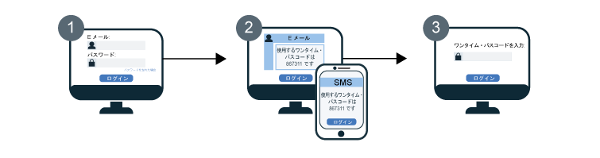

---

copyright:
  years: 2017, 2019
lastupdated: "2019-04-04"

keywords: authentication, authorization, identity, app security, secure, development, two factor, mfa 

subcollection: appid

---

{:new_window: target="_blank"}
{:shortdesc: .shortdesc}
{:screen: .screen}
{:pre: .pre}
{:table: .aria-labeledby="caption"}
{:codeblock: .codeblock}
{:tip: .tip}
{:note: .note}
{:important: .important}
{:deprecated: .deprecated}
{:download: .download}


# 多要素認証
{: #cd-mfa}


サインインのときに複数の要素を要求することによって、アプリに対するユーザー認証のセキュリティーを高めることができます。{{site.data.keyword.appid_full}} の Cloud Directory を使用する場合、最初の要素は Cloud Directory のユーザー・パスワードで、通常はサインインのために使用されます。2 番目の認証要素は、{{site.data.keyword.appid_short_notm}} がユーザーに SMS または E メールで送信するワンタイム・コードです。{{site.data.keyword.appid_short_notm}} では両方の要素を組み合わせて使い、ユーザーの本人確認を行います。
{: shortdesc}

{{site.data.keyword.appid_short_notm}} MFA は、ログイン・ウィジェットを介したクラウド・ディレクトリー・ユーザーの OAuth 2.0 許可コード・フローの一部としてサポートされます。 SAML 2.0 またはソーシャル・ログインでエンタープライズ・サインインを使用している場合は、その ID プロバイダーを通じて MFA を有効にできます。
{: note}

MFA を有効にすると、{{site.data.keyword.appid_short_notm}} のログイン・ウィジェットは、ユーザーがサインインを試行するたびに 2 つ目の検証フォーム (第 2 認証要素) を要求します。ユーザーが資格情報の入力に成功すると、アカウントに登録された E メールか電話番号にワンタイム・コードが送信されます。

MFA のフローがどのように機能するか、次の図で見てみましょう。



1. ユーザーに {{site.data.keyword.appid_short_notm}} のログイン・ウィジェットが表示され、Cloud Directory のユーザー資格情報を入力します。この資格情報は、E メールまたはユーザー名と、それに対応するパスワードです。Cloud Directory のユーザー資格情報が、最初の認証要素となります。

2. 2 番目の資格情報が確認され、2 番目の要素を検証する MFA 画面が返されます。2 番目の要素の構成に基づき、ユーザーはワンタイム・コードの記載された E メールまたは SMS を受け取り、それを検証画面に入力します。

3. MFA コードが確認されると、ユーザーはアプリケーションにリダイレクトされ、サインインできます。


## MFA の概要
{: #cd-mfa-understanding}


MFA とは、複数の要素をユーザーに使用するよう要求することによって、そのユーザーが本人であるかどうかを確認する方式です。こうした要素は、ユーザーが知っていることや本人を表す何かに加えて、所有しているものとすることができます。
{: shortdesc}

最初に MFA が有効にされるときは、デフォルトで E メールを使用するよう設定されています。SMS を使用するように設定を変更できますが、両方を同時に構成することはできません。E メールの場合も SMS の場合も、構成できる設定はごく少数で、変更はできません。


<table>
  <tr>
    <th>設定</th>
    <th>説明</th>
  </tr>
  <tr>
    <td>コード文字</td>
    <td>6 個の数字</td>
  </tr>
  <tr>
    <td>コードの有効期限</td>
    <td>15 分<br> ユーザーが 15 分以内にコードを確認しない場合、認証セッションの有効期限が切れない限り、別のコードの送信を要求できます。認証セッション内であれば、コードは何度でも送信してもらえます。認証セッションの有効期限が切れると、ユーザーは最初からログイン・プロセスをやり直さなければなりません。</td>
  </tr>
</table>

<p>SCIM で <a href="https://tools.ietf.org/html/rfc7643#section-2.4" target="_blank">多値属性 </a> として定義されている場合、Cloud Directory ユーザーの E メールまたは電話番号には次のものを含めることができます。
<ul>
  <li>value: E メール・アドレスや電話番号などの実際の属性値。</li>
  <li>primary : 設定済みの属性の値を示すブール値。primary 属性値が <code>true</code> になるのは 1 回のみです。指定しない場合、<code>primary</code> の値は <code>false</code> と想定されます。</li>
</ul>詳しくは、[Cloud Directory の資料](/docs/services/appid?topic=appid-cloud-directory#cloud-directory)を参照してください。</p>


## MFA E メール・チャネルの構成
{: #cd-mfa-configure-email}

E メールを使ってユーザーに MFA コードを送信するように {{site.data.keyword.appid_short_notm}} を構成できます。
{: shortdesc} 

初めて MFA を有効にするときに、次の 2 つのことが起こります。

- デフォルトでは E メール・チャネルが選択されています。これを [SMS チャネル](/docs/services/appid?topic=appid-cd-mfa#cd-mfa-configure-sms)に切り替えることができます。
- Cloud Directory のユーザー・プロファイルにアタッチされているプライマリー E メールが、{{site.data.keyword.appid_short_notm}} によって自動的に登録されます。

ユーザーの E メールがまだ確認されていない場合は、[管理 API](https://us-south.appid.cloud.ibm.com/swagger-ui/#/)または登録時の E メール検証によって、MFA コード検証に成功したときに本人確認が行われます。

開始する前に、{{site.data.keyword.appid_short_notm}} のインスタンスが [累進階層方式の価格プラン](/docs/services/appid?topic=appid-faq#faq-pricing)であることを確認してください。
{: note}

### GUI を使用する場合
{: #cd-mfa-configure-email-gui}

GUI を使用して MFA E メール・チャネルを構成できます。

1. {{site.data.keyword.appid_short_notm}} ダッシュボードの**「Cloud Directory」>「多要素認証」**タブに移動します。

2. **「設定」**タブの**「多要素認証の有効化」**ボックスで MFA を **「有効」**に切り替えます。MFA が[拡張セキュリティー・イベント](/docs/services/appid?topic=appid-faq#faq-pricing)として課金されることを承認する確認を行います。デフォルトでは、**「E メール」**が**「認証方式」**として選択されています。

3. **「E メール・チャネル (Email channel)」**タブで、**「E メール・テンプレート (Email template)」**を確認します。用意された文言のテンプレートを送信するか、独自のメッセージを作成するかを選択できます。HTML が正しくタグ付けされていることを確認してください。GUI ではパラメーターの追加と画像の挿入ができます。メッセージの[言語](/docs/services/appid?topic=appid-cd-messages#cd-languages)を変更するには、<a href="https://us-south.appid.cloud.ibm.com/swagger-ui/#/Management%20API%20-%20Config/mgmt.updateLocalization" target="_blank">API </a> を使用して言語を設定します。ただし、メッセージの内容と翻訳については、ご自身の責任になります。次の表を参照して、このメッセージで使用できる表および送信できる他のすべてのメッセージのリストを確認してください。パラメーターによってプルされた情報をユーザーが指定していない場合は、ブランクとして表示されます。

  <table>
    <thead>
      <tr>
        <th colspan=2> MFA メッセージ・パラメーター</th>
      </tr>
    </thead>
    <tbody>
      <tr>
        <td><code>%{display.logo}</code></td>
        <td> ログイン・ウィジェットのために構成したイメージを表示します。 </td>
      </tr>
      <tr>
        <td><code>%{user.displayName}</code></td>
        <td> アプリとやり取りするときに使用する、ユーザーが選択した画面名を表示します。 </td>
      </tr>
      <tr>
        <td><code>%{user.email}</code></td>
        <td> ユーザーが登録した E メール・アドレスを表示します。 </td>
      </tr>
      <tr>
        <td><code>%{user.username}</code></td>
        <td> 認証方式がユーザー名とパスワードに設定されているとき、ユーザーが指定したユーザー名を表示します。 </td>
      </tr>
      <tr>
        <td><code>%{user.firstName}</code></td>
        <td> ユーザーが指定した名を表示します。 </td>
      </tr>
      <tr>
        <td><code>%{user.formattedName}</code></td>
        <td> ユーザーのフルネームを表示します。 </td>
      </tr>
      <tr>
        <td><code>%{user.lastName}</code></td>
        <td> ユーザーが指定した姓を表示します。 </td>
      </tr>
      <tr>
        <td><code>%{mfa.code}</code></td>
        <td> ワンタイム MFA 検証コードを表示します。 </td>
      </tr>
    </tbody>
  </table>

  パラメーターによってプルされた情報をユーザーが指定していない場合は、ブランクとして表示されます。
  {: tip}


### API を使用する場合
{: #cd-mfa-configure-email-apis}

**始める前に**

以下の前提条件を満たしていることを確認してください。

* {{site.data.keyword.appid_short_notm}} インスタンスのテナント ID。 この ID は、ダッシュボードの**「サービス資格情報」**セクションにあります。
* Identity and Access Management (IAM) トークン。 IAM トークンの取得については、[IAM の資料](/docs/iam?topic=iam-iamtoken_from_apikey#iamtoken_from_apikey)を参照してください。


1. `isActive` を `true` に設定した MFA 構成を使用して `/config/mfa` エンドポイントへの PUT 要求を行うことによって、MFA を有効にします。

  ヘッダー:
  ```
  PUT {management-url}/management/v4/{tenantId}/config/mfa
       Host: <management-server-url>
       Authorization: Bearer <IAM_TOKEN>
       Content-Type: application/json
  ```
  {: pre}

  本体:
  ```
   {
       "isActive": true
   }
  ```
  {: pre}

  要求例:
  ```
  $ curl -X PUT
    --header 'Content-Type: application/json'
    --header 'Accept: application/json'
    --header 'Authorization: Bearer <IAM_TOKEN>'
    -d '{
          "isActive": true
      }'
    }'
    '{management-url}/management/v4/{tenantId}/config/mfa'
  ```
  {: screen}

2. MFA 構成を使用して `/mfa/channels/{channel}` エンドポイントに PUT 要求を行うことによって、MFA チャネルを有効にします。 `isActive` を `true` に設定すると、MFA チャネルが有効になります。

  ヘッダー:
  ```
  PUT /management/v4/{tenantId}/mfa/channels/{channel}
       Host: <management-server-url>
       Authorization: Bearer <IAM_TOKEN>
       Content-Type: application/json
  ```
  {: pre}

  本体:
  ```
   {
       "isActive": true
   }
  ```
  {: pre}

  要求例:

  ```
  $ curl -X PUT
    --header 'Content-Type: application/json'
    --header 'Accept: application/json'
    --header 'Authorization: Bearer <IAM_TOKEN>'
    -d '{
          "isActive": true
      }'
    }'
    '{management-url}/management/v4/{tenantId}/mfa/channels/email'
  ```
  {: screen}

お使いの {{site.data.keyword.appid_short_notm}} Cloud Directory インスタンスがカスタム E メール・ディスパッチャーと連携するように構成されている場合、MFA は同じディスパッチャーを使用してワンタイム・コードを送信します。カスタム・ディスパッチャーの設定について詳しくは、[Cloud Directory](/docs/services/appid?topic=appid-cd-messages#cd-custom-email) の資料を参照してください。
{: note}


## SMS と連携するように MFA を構成する
{: #cd-mfa-configure-sms}

検証の 2 番目の形式として、ユーザーに SMS メッセージを送信できます。SMS を有効にすると、{{site.data.keyword.appid_short_notm}} は Cloud Directory のユーザー・プロファイルで見つけた最初の[有効な](https://en.wikipedia.org/wiki/E.164)プライマリー電話番号を自動的に登録しようとします。番号が無効である場合、またはユーザー・プロファイルに電話番号が見つからない場合は、ユーザーが番号を追加するための登録ウィジェットが表示されます。その後、その番号はユーザー・プロファイルの一部となり、検証後に MFA に使用されるデフォルトの番号となります。
{: shortdesc}

**始める前に**

{{site.data.keyword.appid_short_notm}} では [Nexmo](https://www.nexmo.com/products/sms) を使用して MFA SMS ワンタイム・コードを送信します。開始する前に、お使いの {{site.data.keyword.appid_short_notm}} のインスタンスが[累進階層方式の価格プラン](/docs/services/appid?topic=appid-faq#faq-pricing)であることと、次の Nexmo 情報を確認してください。

 - Nexmo API 鍵と秘密を取得します。Nexmo API 鍵と秘密は Nexmo ダッシュボードのアカウント設定ページにあります。資格情報の取得方法について詳しくは、[Nexmo の資料](https://developer.nexmo.com/concepts/guides/authentication#api-key-and-secret)を参照してください。

 - 送信者 ID または `「送信者 (from)」`番号を Nexmo に登録します。この`「送信者 (from)」`番号は、SMS の送り主が誰か、ユーザーの電話に表示されるときの番号です。詳しくは、[Nexmo の資料](https://help.nexmo.com/hc/en-us/articles/217571017-What-is-a-Sender-ID)を参照してください。


### GUI を使用する場合
{: #cd-mfa-configure-sms-gui}

GUI を使用して MFA を構成する方法について詳しくは、[Cloud Directory](/docs/services/appid?topic=appid-cloud-directory) を参照してください。
{: note}

1. {{site.data.keyword.appid_short_notm}} ダッシュボードの**「Cloud Directory」>「多要素認証」**タブに移動します。

2. **「設定」**タブの**「多要素認証の有効化」**ボックスで MFA を **「有効」**に切り替えます。MFA が[拡張セキュリティー・イベント](/docs/services/appid?topic=appid-faq#faq-pricing)として課金されることを承認する確認を行います。

3. **「認証方式」**として**「SMS」**を選択します。

4. **「SMS チャネル (SMS channel)」**タブで Nexmo のユーザー・アカウント情報を構成します。

    1. Nexmo にまだアカウントがない場合は、ここで作成してください。

    2. Nexmo ダッシュボードから**「SMS」**をクリックします。

    3. **「自分でコーディングする (Code it yourself)」**セクションで API 鍵をコピーし、それを {{site.data.keyword.appid_short_notm}} ダッシュボードの **「鍵 (key)」**ボックスに貼り付けます。

    4. Nexmo ダッシュボードの**「API 秘密 (API secret)」**をコピーして{{site.data.keyword.appid_short_notm}} ダッシュボードの**「秘密 (Secret)」**ボックスに貼り付けます。

    5. メッセージの送信者として表示される[番号](https://help.nexmo.com/hc/en-us/articles/217571017-What-is-a-Sender-ID)を入力します。有効な番号形式は [E.164 国際電話番号方式](https://en.wikipedia.org/wiki/E.164) (米国の電話番号なら +1 999 888 7777 など) に準拠します。プラス (+) 記号で始まる国別コードと、国内の加入者番号の両方を指定する必要があります。


### API を使用する場合
{: #cd-mfa-configure-sms-api}

**始める前に**

以下の前提条件を満たしていることを確認してください。

* {{site.data.keyword.appid_short_notm}} インスタンスのテナント ID。 この ID は、ダッシュボードの**「サービス資格情報」**セクションにあります。
* Identity and Access Management (IAM) トークン。 IAM トークンの取得については、[IAM の資料](/docs/iam?topic=iam-iamtoken_from_apikey)を参照してください。


1. `isActive` を `true` に設定した MFA 構成を使用して `/config/mfa` エンドポイントへの PUT 要求を行うことによって、MFA を有効にします。

ヘッダー:

  ```
  PUT {management-url}/management/v4/{tenantId}/config/mfa
       Host: <management-server-url>
       Authorization: Bearer <IAM_TOKEN>
       Content-Type: application/json
  ```
  {: pre}

本体:

  ```
  {
   "isActive": true
   }
  ```
  {: pre}


要求例:

  ```
  $ curl -X PUT
    --header 'Content-Type: application/json'
    --header 'Accept: application/json'
    --header 'Authorization: Bearer <IAM_TOKEN>'
    -d '{
    "isActive": true
      }'
  '{management-url}/management/v4/{tenantId}/config/mfa'
  ```
  {: screen}

2. MFA 構成を使用して `/mfa/channels/{channel}` エンドポイントに PUT 要求を行うことによって、MFA チャネルを有効にします。 `isActive` を `true` に設定すると、MFA チャネルが有効になります。
`config` には Nexmo API 鍵と秘密、および`「送信者 (from)」`番号が取り込まれます。

ヘッダー:

  ```
  PUT /management/v4/{tenantId}/mfa/channels/{channel}
       Host: <management-server-url>
       Authorization: Bearer <IAM_TOKEN>
       Content-Type: application/json
  ```
  {: pre}

本体:

  ```
  {
      "isActive": true,
      "config": {
        "key": "nexmo key",
        "secret": "nexmo secret",
        "from": sender-phoneNumber
      }
  }
  ```
  {: pre}

要求例:

  ```
  $ curl -X PUT
    --header 'Content-Type: application/json'
    --header 'Accept: application/json'
    --header 'Authorization: Bearer <IAM_TOKEN>'
    -d '{
         "isActive": true,
    "config": {
          "key": "key",
          "secret": "secret",
          "from": 12345678900
        }
     }'
   '{management-url}/management/v4/{tenantId}/mfa/channels/nexmo'
  ```
  {: screen}


3. チャネルが正常に構成されたら、UI のテスト・ボタンを使って、または管理 API を使って、Nexmo 構成と接続が正しくセットアップされていることを確認します。

ヘッダー:

  ```
  POST /management/v4/{tenantId}/config/cloud_directory/sms_dispatcher/test
     Host: <management-server-url>
     Authorization: Bearer <IAM_TOKEN>
     Content-Type: application/json
  ```
  {: pre}

本体:

  ```
  {
    "phone_number": "phoneNumber-receives-test-message"
  }
  ```
  {: pre}

要求例:

  ```
  $ curl -X POST
  --header 'Content-Type: application/json'
  --header 'Accept: application/json'
  --header 'Authorization: Bearer <IAM_TOKEN>'
  -d '{
        "phone_number": "+1 999 999 9999"
      }'
  '{management-url}/management/v4/{tenantId}/config/cloud_directory/sms_dispatcher/test'
  ```
  {: screen}

  </br>
