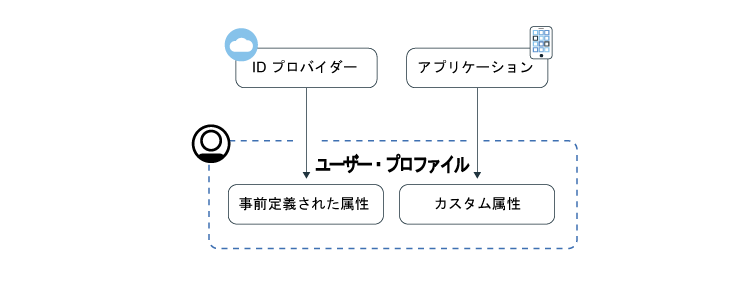
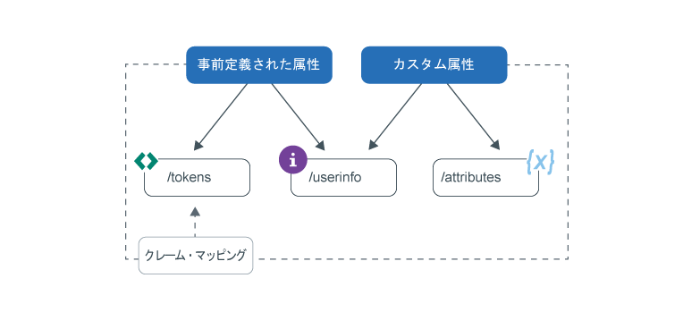

---

copyright:
  years: 2017, 2019
lastupdated: "2019-07-09"

keywords: Authentication, authorization, identity, app security, secure, attributes, user information, storing, accessing

subcollection: appid

---

{:external: target="_blank" .external}
{:shortdesc: .shortdesc}
{:screen: .screen}
{:pre: .pre}
{:table: .aria-labeledby="caption"}
{:codeblock: .codeblock}
{:tip: .tip}
{:note: .note}
{:important: .important}
{:deprecated: .deprecated}
{:download: .download}
{:java: .ph data-hd-programlang='java'}
{:javascript: .ph data-hd-programlang='javascript'}
{:swift: .ph data-hd-programlang='swift'}
{:curl: .ph data-hd-programlang='curl'}


# プロファイルの保管とアクセス
{: #profiles}

ユーザー・プロファイルは、特定のユーザーに関する既知のすべての情報を 1 つのオブジェクトにまとめたものであり、{{site.data.keyword.appid_full}} によって保管されます。 これらの情報は、事前定義したり、割り当てたり、ユーザーとアプリケーションの対話の中で収集したりできます。 プロファイル機能を利用することで、ユーザーごとにパーソナライズされたアプリ・エクスペリエンスを構築できます。
{: shortdesc}


クラウド・ディレクトリーのユーザーについては、 [ユーザーの管理](/docs/services/appid?topic=appid-cd-users)を参照してください。
{: tip}

App ID で取得して保管できる情報には、事前定義属性とカスタム属性という 2 つのタイプがあります。 事前定義属性はユーザーの ID に固有のもので、ユーザーがアプリにサインインするときに ID プロバイダーから返されます。事前定義属性には、名前や年齢などの情報を含めることができます。 カスタム属性は、ユーザーに関する追加情報を保管するために使用します。 管理者が設定することも、ユーザーとアプリの対話の中で収集することもできます。 カスタム属性には、割り当てられた役割、食べ物の好み、機内での通路側座席の好みなどを含めることができます。



図. ユーザー・プロファイル情報のフロー


ユーザーごとに 100 KB の情報を保管できます。
{: note}


## ユーザー・プロファイルへのアクセス
{: #profile-access}

属性にはさまざまな方法でアクセスできます。 ユーザー認証が成功すると、アプリは {{site.data.keyword.appid_short_notm}} からアクセス・トークンと識別トークンを受け取ります。 ユーザー情報エンドポイントとカスタム属性エンドポイントはどちらも、認証プロセスの最後に {{site.data.keyword.appid_short_notm}} によって生成されるアクセス・トークンによって保護されます。 識別トークンには、ID プロバイダーから返されたユーザー属性 (情報) のサブセットが正規化されたものが入っています。 ユーザー属性の完全なリストを取得するときには、OIDC [`/userinfo` エンドポイント](https://us-south.appid.cloud.ibm.com/swagger-ui/#/Authorization_Server_V4/userInfo)を使用できます。 
{: shortdesc}


識別トークンおよびアクセス・トークンについて詳しくは、[トークンについて](/docs/services/appid?topic=appid-tokens#tokens)および[トークンの検証](/docs/services/appid?topic=appid-token-validation)を参照してください。


以下の図を参照して、ユーザー情報を取得するさまざまな方法を確認してください。


図. ユーザー・プロファイルへのアクセス・オプション


App ID は、属性のサブセットをアクセス・トークンと識別トークンに自動的に挿入します。 カスタム・クレーム・マッピングを利用して、他の事前定義クレームおよびカスタム・クレームをトークンにマップすることができます。 ユーザー情報にアクセスする方法としてお勧めする方法について詳しくは、[トークンのカスタマイズ](/docs/services/appid?topic=appid-customizing-tokens)を参照してください。 
{: note}


### SDK を使用した /userinfo エンドポイントへのアクセス
{: #profile-predefined-access}

構成した ID プロバイダーから提供されたユーザーに関する情報を表示するには、事前定義属性にアクセスします。
{: shortdesc}

**iOS Swift**
{: ph data-hd-programlang='swift'}

新しいトークンが SDK に明示的に渡されない場合、{{site.data.keyword.appid_short_notm}} は最後に受信したトークンを使用して応答の取得と検証を行います。 例えば、認証が正常に完了した後に以下のコードを実行して、SDK がユーザーに関する追加情報を取得するようにすることができます。
{: ph data-hd-programlang='swift'}

```
AppID.sharedInstance.userProfileManager.getUserInfo { (error: Error?, userInfo: [String: Any]?) in
	guard let userInfo = userInfo, err == nil {
		return // an error has occurred
	}
	// retrieved user info successfully
}
```
{: codeblock}
{: ph data-hd-programlang='swift'}

代わりに、アクセス権限と識別トークンを明示的に渡すことができます。 識別トークンはオプションですが、渡された場合には、応答の検証に使用されます。
{: ph data-hd-programlang='swift'}

```
AppID.sharedInstance.userProfileManager.getUserInfo(accessToken: String, identityToken: String?) { (error: Error?, userInfo: [String: Any]?) in
	guard let userInfo = userInfo, err == nil {
		return // an error has occurred
	}
	// retrieved user info successfully
}
```
{: codeblock}
{: ph data-hd-programlang='swift'}

**Java**
{: ph data-hd-programlang='java'}

新しいトークンが SDK に明示的に渡されない場合、{{site.data.keyword.appid_short_notm}} は最後に受信したトークンを使用して応答の取得と検証を行います。 例えば、認証が正常に完了した後に以下のコードを実行して、SDK がユーザーに関する追加情報を取得するようにすることができます。
{: ph data-hd-programlang='java'}

```
AppID appId = AppID.getInstance();

appId.getUserProfileManager().getUserInfo(new UserProfileResponseListener() {
	@Override
	public void onSuccess(JSONObject userInfo) {
		// retrieved user info successfully
	}

	@Override
	public void onFailure(UserInfoException e) {
		// exception occurred
	}
});
```
{: codeblock}
{: ph data-hd-programlang='java'}

代わりに、アクセス権限と識別トークンを明示的に渡すことができます。 識別トークンはオプションです。 しかし、渡す場合は、応答の検証に使用されます。
{: ph data-hd-programlang='java'}

```
AppID appId = AppID.getInstance();

appId.getUserProfileManager().getUserInfo(accessToken, identityToken, new UserProfileResponseListener() {
	@Override
	public void onSuccess(JSONObject userInfo) {
		// retrieved attribute "name" successfully
	}

	@Override
	public void onFailure(UserInfoException e) {
		// exception occurred
	}
});
```
{: codeblock}
{: ph data-hd-programlang='java'}

**Node.js**
{: ph data-hd-programlang='javascript'}

サーバー・サイドの SDK を使用すると、ユーザーに関する追加情報を取得できます。 ストアード・アクセスと ID トークンを使用して以下のメソッドを呼び出すことも、トークンを明示的に渡すこともできます。 識別トークンはオプションですが、渡された場合には、応答の検証に使用されます。
{: ph data-hd-programlang='javascript'}

```javascript
let userProfileManager = UserProfileManager(options: options)

let accessToken = req.session[WebAppStrategy.AUTH_CONTEXT].accessToken;
let identityToken = req.session[WebAppStrategy.AUTH_CONTEXT].identityToken;


// Retrieve user info and validate against the given identity token
userProfileManager.getUserInfo(accessToken, identityToken).then(function (profile) {
	// retrieved user info successfully
});

// Retrieve user info without validation
userProfileManager.getUserInfo(accessToken).then(function (profile) {
	// retrieved user info successfully
});
```
{: codeblock}
{: ph data-hd-programlang='javascript'}


**サーバー・サイドの Swift**
{: ph data-hd-programlang='swift'}

サーバー・サイドの SDK を使用すると、ユーザーに関する追加情報を取得できます。 ストアード・アクセスと ID トークンを使用して以下のメソッドを呼び出すことも、トークンを明示的に渡すこともできます。 識別トークンはオプションですが、渡された場合には、応答の検証に使用されます。
{: ph data-hd-programlang='swift'}


```swift
let userProfileManager = UserProfileManager(options: options)

let accessToken = "<access token>"
let identityToken = "<identity token>"

// If identity token is provided (recommended approach), response is validated against the identity token
userProfileManager.getUserInfo(accessToken: accessToken, identityToken: identityToken) { (err, userInfo) in
	guard let userInfo = userInfo, err == nil {
		return // an error has occurred
	}
	// retrieved user info successfully
}

// Retrieve the UserInfo without any validation
userProfileManager.getUserInfo(accessToken: accessToken) { (err, userInfo) in
	guard let userInfo = userInfo, err == nil {
		return // an error has occurred
	}
	// retrieved user info successfully
}
```
{: codeblock}
{: ph data-hd-programlang='swift'}


### API を使用した /userinfo エンドポイントへのアクセス
{: #profile-predefined-api}


`/userinfo` エンドポイントを介して、追加情報を表示できます。

1. `openid` スコープを持つ有効なアクセス・トークンを所有していることを確認してください。 `/introspect` エンドポイントを使用して、トークンが有効であることを確認できます。

2. [`/userinfo` エンドポイント](https://us-south.appid.cloud.ibm.com/swagger-ui/#/Authorization_Server_V4/userInfo)に対して要求を行います。
  ```
  GET [POST] https://{oauth-server-endpoint}/userinfo
  Authorization: 'Bearer {ACCESS_TOKEN}'
  ```
  {: codeblock}

  出力例:
  ```
  "sub": "cad9f1d4-e23b-3683-b81b-d1c4c4fd7d4c",
  "name": "John Doe",
  "email": "john.doe@gmail.com",
  "picture": "https://lh3.googleusercontent.com/-XdUIqdbhg/AAAAAAAAI/AAAAAAA/42rbcbv5M/photo.jpg",
  "gender": "male",
  "locale": "en",
  "identities": [
      {
          "provider": "google",
          "id": "104560903311317789798",
          "profile": {
              "id": "104560903311317789798",
              "email": "john.doe@gmail.com",
              "verified_email": true,
              "name": "John Doe",
              "given_name": "John",
              "family_name": "Doe",
              "link": "https://plus.google.com/104560903311317789798",
              "picture": "https://lh3.googleusercontent.com/-XdUIqdbhg/AAAAAAAAI/AAAAAAA/42rbcbv5M/photo.jpg",
              "gender": "male",
              "locale": "en",
              "idpType": "google"
          }
      }
  ]
  ```
  {: screen}

3. この `sub` クレームが識別トークン内の `sub` クレームと正確に一致することを確認します。 それらが一致しない場合は、返された情報を使用しないでください。 トークンの置換について詳しくは、<a href="https://openid.net/specs/openid-connect-core-1_0.html#TokenSubstitution" target="__blank">OIDC の仕様 </a> を参照してください。

外部の ID プロバイダーによって変更が行われた場合は、ユーザーが再度ログインするときに、更新された情報を取得できます。 新しいトークンにより、最新のデータが取得されます。
{: tip}


### `/attributes` エンドポイントへのアクセス
{: #profile-attributes-access}

構成に応じて、ユーザーがアプリケーションと対話するときに、属性が暗号化され、ユーザー・プロファイルの一部として保存されます。 この対話には、ユーザーによるアプリでのサインインや設定作業が含まれます。 属性にアクセスするには、API メソッドを使用してアクセス・トークンを渡します。
{: shortdesc}

**iOS Swift**
{: ph data-hd-programlang='swift'}

  ```
  func setAttribute(key: String, value: String, completionHandler: @escaping(Error?, [String:Any]?) -> Void)
  func setAttribute(key: String, value: String, accessTokenString: String, completionHandler: @escaping(Error?, [String:Any]?) -> Void)

  func getAttribute(key: String, completionHandler: @escaping(Error?, [String:Any]?) -> Void)
  func getAttribute(key: String, accessTokenString: String, completionHandler: @escaping(Error?, [String:Any]?) -> Void)

  func getAttributes(completionHandler: @escaping(Error?, [String:Any]?) -> Void)
  func getAttributes(accessTokenString: String, completionHandler: @escaping(Error?, [String:Any]?) -> Void)

  func deleteAttribute(key: String, completionHandler: @escaping(Error?, [String:Any]?) -> Void)
  func deleteAttribute(key: String, accessTokenString: String, completionHandler: @escaping(Error?, [String:Any]?) -> Void)
  ```
  {: codeblock}
  {: ph data-hd-programlang='swift'}

  **Java**
  {: ph data-hd-programlang='java'}

  ```
  void setAttribute(@NonNull String name, @NonNull String value, UserAttributeResponseListener listener);
  void setAttribute(@NonNull String name, @NonNull String value, @NonNull AccessToken accessToken, UserAttributeResponseListener listener);

  void getAttribute(@NonNull String name, UserAttributeResponseListener listener);
  void getAttribute(@NonNull String name, @NonNull AccessToken accessToken, UserAttributeResponseListener listener);

  void deleteAttribute(@NonNull String name, UserAttributeResponseListener listener);
  void deleteAttribute(@NonNull String name, @NonNull AccessToken accessToken, UserAttributeResponseListener listener);

  void getAllAttributes(@NonNull UserAttributeResponseListener listener);
  void getAllAttributes(@NonNull AccessToken accessToken, @NonNull UserAttributeResponseListener listener);
  ```
  {: codeblock}
  {: ph data-hd-programlang='java'}

  **Node.js**
  {: ph data-hd-programlang='javascript'}

  ```
  function getAllAttributes(accessTokenString) {}
	function getAttribute(accessTokenString, key) {}
	function setAttribute(accessTokenString, key, value) {}
	function deleteAttribute(accessTokenString, name) {}
  ```
  {: codeblock}
  {: ph data-hd-programlang='javascript'}

  **サーバー・サイドの swift**
  {: ph data-hd-programlang='swift'}

  ```
  func getAllAttributes(accessToken: String, completionHandler: (Swift.Error?, [String: Any]?) -> Void)
  func getAttribute(accessToken: String, attributeName: String, completionHandler: (Swift.Error?, [String: Any]?) -> Void)
  func setAttribute(accessToken: String, attributeName: String, attributeValue : "abc", completionHandler: (Swift.Error?, [String: Any]?) -> Void)
  func deleteAllAttributes(accessToken: String, completionHandler: (Swift.Error?, [String: Any]?) -> Void)
  ```
  {: codeblock}
  {: ph data-hd-programlang='swift'}


## カスタム属性の設定
{: #profile-set-custom}

カスタム属性を設定して、ユーザーに関する情報 (役割や好みなど) をプロファイルに追加できます。
{: shortdesc}

デフォルトでは、カスタム属性は変更可能であり、クライアント・アプリケーションから App ID アクセス・トークンを使用して更新できます。 したがって、適切な予防措置を講じないと、ユーザーまたはアプリケーションは、アクセス・トークンにアクセスできる限り、ユーザーの初回サインインの直後にカスタム属性を更新できます。 このため、意図しない結果が生じる可能性があります。 例えば、ユーザーが役割をユーザーから管理者に変更できてしまうので、管理特権が悪意のあるユーザーに付与される可能性があります。
{: important}

1. App ID ダッシュボードの**「プロファイル」**タブにナビゲートし、カスタム属性を**「有効」**に切り替えます。
2. [アクセス・トークンを取得します](/docs/services/appid?topic=appid-obtain-tokens)。アプリに対するすべての着信要求には許可ヘッダーがあり、そこには `access_token` が含まれています。
3. [属性 API](https://us-south.appid.cloud.ibm.com/swagger-ui/#/Attributes) に要求を発行します。または、以下のいずれかのスニペットをコードに追加して、用意されているいずれかの SDK を使用します。

  **iOS Swift**
  {: ph data-hd-programlang='swift'}

  ```
	AppID.sharedInstance.userProfileManager?.setAttribute("key", "value") { (error, result) in
		guard let result = result, error == nil else {
	  		return // an error has occurred
		}
		// attributes recieved as a Dictionary
	})
  ```
  {: codeblock}
  {: ph data-hd-programlang='swift'}

  **Java**
  {: ph data-hd-programlang='java'}

  ```
  appId.getUserProfileManager().setAttribute(name, value, useThisToken, new UserProfileResponseListener() {
  	@Override
		public void onSuccess(JSONObject attributes) {
  		//正常な応答から受け取った JSON 形式の属性
		}

  	@Override
		public void onFailure(UserAttributesException e) {
  		// exception occurred
	}
  });
  ```
  {: codeblock}
  {: ph data-hd-programlang='java'}

  **Node.js**
  {: ph data-hd-programlang='javascript'}

  ```
	const userProfileManager = require("ibmcloud-appid").UserProfileManager;
	userProfileManager.init();

	var accessToken = req.session[WebAppStrategy.AUTH_CONTEXT].accessToken;

	userProfileManager.setAttribute(accessToken, name, value).then(function (attributes) {
		// attributes returned as dictionary
	});
  ```
  {: codeblock}
  {: ph data-hd-programlang='javascript'}

**サーバー・サイドの Swift**
{: ph data-hd-programlang='swift'}

  ```
  let userProfileManager = UserProfileManager(options: options)
	let accesstoken = "access token"

  userProfileManager.setAttribute(accessToken: accessToken, attributeName: "name", attributeValue : "abc") { (error, response) in
		guard let response = response, error == error else {
      return // an error has occurred
		}
    // attributes received as a Dictionary
  }
  ```
  {: codeblock}
  {: ph data-hd-programlang='swift'}


## 次のステップ
{: #next-custom-attributes}

特定の言語の SDK での作業について詳しくは、以下の GitHub リポジトリーを参照してください。

* <a href="https://github.com/ibm-cloud-security/appid-clientsdk-android" target="_blank">Android SDK </a>
* <a href="https://github.com/ibm-cloud-security/appid-clientsdk-swift" target="_blank">iOS Swift SDK </a>
* <a href="https://github.com/ibm-cloud-security/appid-serversdk-nodejs" target="_blank">Node.js SDK </a>
* <a href="https://github.com/ibm-cloud-security/appid-serversdk-swift" target="_blank">サーバー Swift SDK </a>

