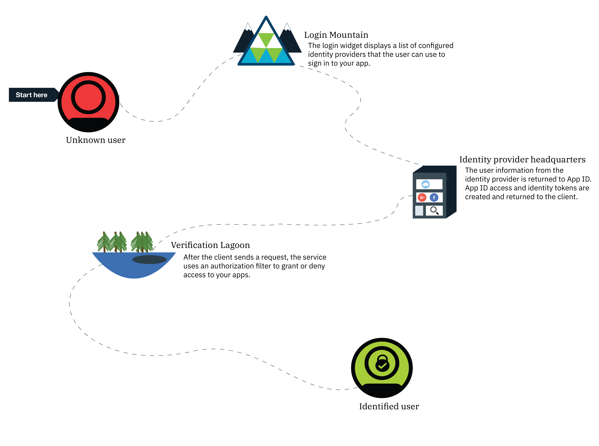
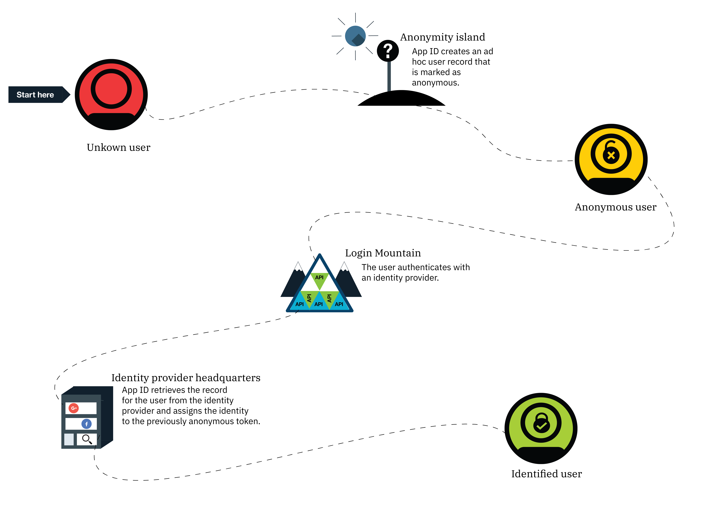

---

copyright:
  years: 2017, 2019
lastupdated: "2019-03-06"

keywords: authentication, authorization, identity, app security, secure, anonymous, progressive, profiles, sign in

subcollection: appid

---

{:new_window: target="_blank"}
{:shortdesc: .shortdesc}
{:screen: .screen}
{:pre: .pre}
{:table: .aria-labeledby="caption"}
{:codeblock: .codeblock}
{:tip: .tip}
{:note: .note}
{:important: .important}
{:deprecated: .deprecated}
{:download: .download}

# 匿名認証
{: #anonymous}

アプリを開発する際の最大の懸念の 1 つはセキュリティーです。 適切な権限を持つユーザーだけがアプリを使用できるようにするには、どうすればよいでしょうか? 許可プロセスを使用する必要があります。 ほとんどのプロセスでは、許可と認証は一体化されるため、セキュリティー・ポリシーと ID プロバイダーの変更が複雑になる場合があります。 {{site.data.keyword.appid_full}} では、許可と認証は別々のプロセスです。
{: shortdesc}

正常にサインインしたユーザーは、識別されたユーザーになります。 ID プロバイダーは、ユーザーに関する情報を格納するアクセス・トークンと識別トークンを {{site.data.keyword.appid_short}} に返します。 サービスは、それらの提供されたトークンを取得し、アプリにアクセスできる適切な資格情報をユーザーが持っているかどうかを判別します。 トークンが有効であることが検証されると、サービスはユーザーにアプリへのアクセスを許可します。 ユーザーが許可されると、ユーザーのプロファイルに認証情報が関連付けられます。 このプロファイルとその属性には、同じ ID プロバイダーで認証されたすべてのクライアントから再びアクセスできます。

## 段階的な認証
{: #progressive}

{{site.data.keyword.appid_short_notm}} では、匿名ユーザーが、識別されたユーザーになることを選択できます。

すぐにサインインしないことを選択したユーザーは、匿名ユーザーと見なされます。 例えば、ユーザーはサインインしなくても、すぐにショッピング・カートにアイテムを追加し始めることができます。 匿名ユーザーの場合、{{site.data.keyword.appid_short_notm}} は一時的なユーザー・プロファイルを作成し、匿名のアクセス・トークンと識別トークンを返す OAuth ログイン API を呼び出します。 これらのトークンを使用して、アプリはユーザー・プロファイルに保管される属性の作成、読み取り、更新、削除を行うことができます。

匿名ユーザーがサインインすると、そのユーザーのアクセス・トークンがログイン API に渡されます。 このサービスは、ID プロバイダーを使用して呼び出しを認証します。 このサービスは、アクセス・トークンを使用して匿名プロファイルを検出し、そこにユーザーの ID を関連付けます。 新しいアクセス・トークンと識別トークンには、ID プロバイダーから提供された公開情報が入っています。 ユーザーが識別されると、そのユーザーの匿名トークンは無効になります。 しかし、引き続きユーザーは自分の属性にアクセスできます。新しいトークンを使用してアクセスできるからです。

匿名プロファイルに ID を割り当てることができるのは、その ID が別のユーザーにまだ割り当てられていない場合に限ります。
{: tip}

ID が既に別の {{site.data.keyword.appid_short_notm}} ユーザーに関連付けられている場合、トークンにはそのユーザーのプロファイルの情報が入っているので、ユーザー属性にアクセスできます。 前の匿名ユーザーの属性に、新しいトークンを使用してアクセスすることはできません。 トークンの有効期限が切れるまでは、匿名アクセス・トークンにより引き続き情報にアクセスできます。 アプリの開発中に、既知のユーザーに匿名属性をマージする方法を選択できます。
