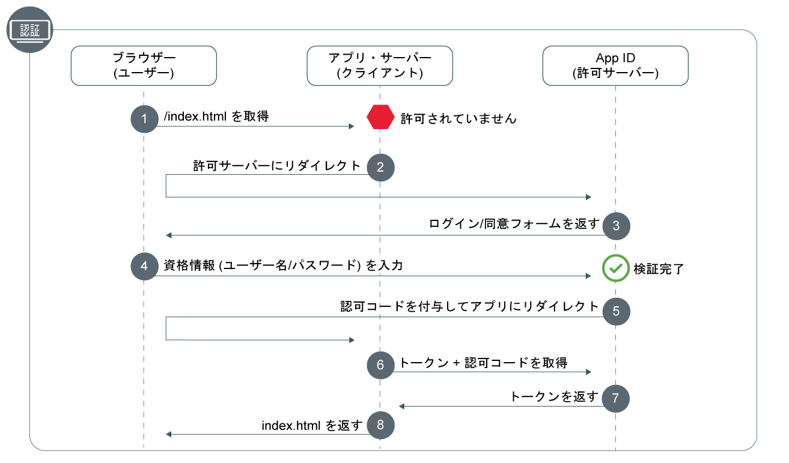

---

copyright:
  years: 2017, 2019
lastupdated: "2019-07-11"

keywords: Authentication, authorization, identity, app security, secure, development, nodejs, frontend, web apps, 

subcollection: appid

---

{:external: target="_blank" .external}
{:shortdesc: .shortdesc}
{:screen: .screen}
{:pre: .pre}
{:table: .aria-labeledby="caption"}
{:codeblock: .codeblock}
{:tip: .tip}
{:note: .note}
{:important: .important}
{:deprecated: .deprecated}
{:download: .download}


# Web: Node.js
{: #web-node}

{{site.data.keyword.appid_short_notm}} を利用すると、Node.js フロントエンド Web アプリケーションを容易に保護できます。このガイドを使用すると、シンプルな認証フローを 20 分足らずで迅速に起ち上げることができます。
{: shortdesc}

以下の図を参照して、許可コード OAuth 2.0 ワークフローを確認してください。



1. ユーザーが、保護されている Web アプリケーションにアクセスしようとしますが、そのユーザーは許可されていません。
2. アプリケーションは、ユーザーを {{site.data.keyword.appid_short_notm}} にリダイレクトします。
3. {{site.data.keyword.appid_short_notm}} が、ユーザーが認証に使用できるサインイン画面を表示します。
4. ユーザーがユーザー名やパスワードなどの資格情報を入力します。App ID がその資格情報を検証します。
5. {{site.data.keyword.appid_short_notm}} は、認可コードを付与してユーザーをアプリケーションにリダイレクトします。
6. アプリケーションが、その認可コードを使用して、ユーザーが検証されていることを確認する要求を {{site.data.keyword.appid_short_notm}} に発行します。アクセス・トークンの取得方法について詳しくは、[トークンの取得](/docs/services/appid?topic=appid-obtain-tokens)を参照してください。
7. {{site.data.keyword.appid_short_notm}} が、検証されたユーザーのアクセス・トークンと識別トークンを返します。
8. ユーザーはアプリケーションへのアクセスを許可されます。


## ビデオのチュートリアル
{: #web-node-video}

以下のビデオを視聴すると、{{site.data.keyword.appid_short_notm}} を使用してシンプルな Node.js Web アプリケーションを保護する方法を確認できます。ビデオで扱われている情報はすべて、このページに記載しています。

<iframe class="embed-responsive-item" id="appid-web-node" title="{{site.data.keyword.appid_short_notm}} Node.js アプリケーションについて" type="text/html" width="640" height="390" src="//www.youtube.com/embed/6roa1ZOvwtw?rel=0" frameborder="0" webkitallowfullscreen mozallowfullscreen allowfullscreen></iframe>

フローを試すことができるアプリがありませんか? 問題ありません。 {{site.data.keyword.appid_short_notm}} には、[シンプルな Node.js Web サンプル・アプリ](https://github.com/ibm-cloud-security/appid-video-tutorials/tree/master/02a-simple-node-web-app){: external}が用意されています。

 

## 開始する前に
{: #web-node-before}

Node.js Web アプリケーションで {{site.data.keyword.appid_short_notm}} の使用を開始する前に、以下の前提条件を満たしている必要があります。
{: shortdesc}

* [{{site.data.keyword.appid_short_notm}} サービス](https://cloud.ibm.com/catalog/services/app-id){: external}のインスタンス
* [IBM Cloud CLI](/docs/cli?topic=cloud-cli-getting-started)
* [NPM バージョン 4+](https://www.npmjs.com/get-npm){: external}
* [Node バージョン 6+](https://nodejs.org/en/download/){: external}


## 手順 1: リダイレクト URI を登録する
{: #node-web-redirect-uri}

リダイレクト URI は、アプリのコールバック・エンドポイントです。 サインイン・フローで、{{site.data.keyword.appid_short_notm}} は、許可ワークフローにクライアントが参加することを許可する前に、URI を検証します。これは、フィッシング攻撃と認可コード漏えいを防ぐのに役立ちます。 URI を登録することで、その URI が信頼できる URI であり、ユーザーをリダイレクトしてよいことを {{site.data.keyword.appid_short_notm}} に認識させます。
{: shortdesc}

1. **「認証の管理 (Manage Authentications)」>「認証設定 (Authentication Settings)」**をクリックします。

2. **「Web リダイレクト URI の追加」**フィールドに URI を入力します。 リダイレクトを成功させるには、どの URI も `http://` または `https://` で始め、照会パラメーターを含めた絶対パスを指定しなければなりません。

3. **「Web リダイレクト URI の追加 (Add web redirect URIs)」**ボックス内の **+** 記号をクリックします。

4. 考えられる URI をすべてリストに追加するまで、ステップ 1 から 3 を繰り返します。


## 手順 2: 資格情報を取得する
{: #node-web-credentials}

次の 2 つの方法のいずれかを利用して、資格情報を取得できます。
{: shortdesc}

  * {{site.data.keyword.appid_short_notm}} ダッシュボードの**「アプリケーション」**タブに移動します。 アプリケーションがまだない場合は、**「アプリケーションの追加 (Add application)」**をクリックして新しいアプリケーションを作成できます。

  * [`/management/v4/{tenantId}/applications` エンドポイント](https://us-south.appid.cloud.ibm.com/swagger-ui/#!/Applications/registerApplication)に対して POST 要求を行います。

    要求の形式:
    ```javascript
    curl -X POST \  https://us-south.appid.cloud.ibm.com/management/v4/39a37f57-a227-4bfe-a044-93b6e6060b61/applications/ \
    -H 'Content-Type: application/json' \
    -H 'Authorization: Bearer IAM_TOKEN' \
    -d '{"name": "ApplicationName"}'
    ```
    {: codeblock}

    応答例:
    ```javascript
    {
      "clientId": "xxxxx-34a4-4c5e-b34d-d12cc811c86d",
      "tenantId": "xxxxx-9b1f-433e-9d46-0a5521f2b1c4",
      "secret": "ZDk5YWZkYmYt*******",
      "name": "app1",
      "oAuthServerUrl": "https://us-south.appid.cloud.ibm.com/oauth/v4/xxxxx-9b1f-433e-9d46-0a5521f2b1c4",
      "profilesUrl": "https://us-south.appid.cloud.ibm.com",
      "discoveryEndpoint": "https://us-south.appid.cloud.ibm.com/oauth/v4/xxxxxx-9b1f-433e-9d46-0a5521f2b1c4/.well-known/openid-configuration"
    }
    ```
    {: screen}


## 手順 3: SDK を初期化する
{: #web-node-install}

{{site.data.keyword.appid_short_notm}} を使用する最も簡単な方法は、Node.JS SDK を利用する方法です。
{: shortdesc}


1. コマンド・ラインを使用して、Node.js アプリケーションが含まれているディレクトリーに移動します。

2. 以下の NPM 要件をインストールします。

    ```javascript
    npm install --save express express-session passport
    ```
    {: codeblock}

3. {{site.data.keyword.appid_short_notm}} サービスをインストールします。

    ```javascript
    npm install --save ibmcloud-appid
    ```
    {: codeblock}

4. 以下の要件を `server.js` ファイルに追加します。

    ```javascript
    const express = require('express'); 								// https://www.npmjs.com/package/express
    const session = require('express-session');							// https://www.npmjs.com/package/express-session
    const passport = require('passport');								// https://www.npmjs.com/package/passport
    const WebAppStrategy = require('ibmcloud-appid').WebAppStrategy;	// https://www.npmjs.com/package/ibmcloud-appid
    ```
    {: shortdesc}

5. 手順 1 で取得した資格情報を使用して、express-session ミドルウェアを使用するようにアプリケーションをセットアップします。リダイレクト URI の形式を設定する方法は 2 つあります。コード例に示すように、手動で新規の `WebAppStrategy({redirectUri: "...."})` を使用する方法と、環境変数として値を設定する方法です。

    ```javascript
    const app = express();
    app.use(session({
        secret: '123456',
        resave: true,
        saveUninitialized: true
    }));
    app.use(passport.initialize());
    app.use(passport.session());
    passport.serializeUser((user, cb) => cb(null, user));
    passport.deserializeUser((user, cb) => cb(null, user));
    passport.use(new WebAppStrategy({
        tenantId: "<tenant_ID>",
        clientId: "<client_ID>",
        secret: "<secret>",
        oauthServerUrl: "<OAuth_Server_URL>",
        redirectUri: "<redirect_URI>"
    }));
    ```
    {: codeblock}

    ミドルウェアには、実稼働環境用の適切なセッション・ストレージを構成する必要があります。 詳細については、<a href="https://github.com/expressjs/session" target="_blank">express.js の資料 </a> を参照してください。
    {: note}


## 手順 4: アプリケーションを保護する
{: #node-web-protect}

{{site.data.keyword.appid_short_notm}} をインストールしたので、アプリケーションを保護する準備はできています。Web アプリ戦略を定義して、アプリケーション全体を保護するか特定のリソースのみを保護するかを選択できます。
{: shortdesc}


1. コールバック・エンドポイントを構成します。コールバックは、App ID からアクセス・トークンと識別トークンを受け取り、ユーザーを次のいずれかの場所にリダイレクトして許可プロセスを完了させます。<ul><li>認証をトリガーした要求の元の URL。これは `WebAppStrategy.ORIGINAL_URL` として HTTP セッションの間保持されます。</li><li>認証が成功した場合のリダイレクトを指定する。</li><li>次の手順に示しているアプリケーション・ルート (`/`)。</li></ul>

    ```javascript
    app.get(CALLBACK_URL, passport.authenticate(WebAppStrategy.STRATEGY_NAME));
    ```
    {: codeblock}

2. 常にブラウザーをログイン・ウィジェットにリダイレクトするサインイン・エンドポイントを設定します。認証の無限ループにならないように、必ず成功リダイレクト・オプションを追加してください。

    ```javascript
    app.get('/appid/login', passport.authenticate(WebAppStrategy.STRATEGY_NAME, {
        successRedirect: '/',
        forceLogin: true
    }));
    ```
    {: codeblock}

3. サインアウトを構成します。ユーザーがアプリケーションからサインアウトすると、そのユーザーの認証情報はそのセッションからすべて消去されます。アプリケーションと対話するには、もう一度サインインする必要があります。

    ```javascript
    app.get('/appid/logout', function(req, res){
        webappstrategy.logout(req);
        res.redirect('/');
    });
    ```
    {: shortdesc}

## 手順 5: アプリをパーソナライズする
{: #node-web-user-info}

ID プロバイダーから提供される情報をプルして、アプリ・エクスペリエンスをパーソナライズすることができます。
{: shortdesc}

1. ユーザー情報を取得するようにアプリケーションを構成します。`protected` は、アプリケーションのエンドポイントに合わせて変更可能なプレースホルダー変数です。

    ```javascript
    app.get("/protected", passport.authenticate(WebAppStrategy.STRATEGY_NAME), function(req, res){
        res.json(req.user);
    });
    ```
    {: codeblock}

    例えば、サンプル・アプリケーションで、アプリケーションをパーソナライズするためにユーザー名を取得する方法を確認できます。
    ```javascript
    app.get('/api/user', (req, res) => {
        // console.log(req.session[WebAppStrategy.AUTH_CONTEXT]);
        res.json({
            user: {
                name: req.user.name
            }
        });
    });
    ```
    {: codeblock}


## 手順 6: 構成をテストする
{: #node-web-test}

許可構成をテストするには、アプリケーションで定義したサーバーの listen URL にナビゲートします。サインインして、サインアウトしてみてください。期待したとおりに構成が機能していることを確認します。 

次のステップに進む準備ができたら、[Cloud Directory の多要素認証](/docs/services/appid?topic=appid-cd-mfa)を有効にしたり、[カスタム属性](/docs/services/appid?topic=appid-profiles)を追加してアプリをさらにパーソナライズしたりしてみてください。


