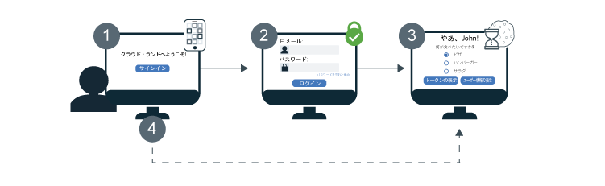

---

copyright:
  years: 2017, 2019
lastupdated: "2019-04-04"

keywords: authentication, authorization, identity, app security, secure, development, sso, directory, users, registry, multiple apps

subcollection: appid

---

{:new_window: target="_blank"}
{:shortdesc: .shortdesc}
{:screen: .screen}
{:pre: .pre}
{:table: .aria-labeledby="caption"}
{:codeblock: .codeblock}
{:tip: .tip}
{:note: .note}
{:important: .important}
{:deprecated: .deprecated}
{:download: .download}


# シングル・サインオン (SSO)
{: #cd-sso}

Cloud Directory のシングル・サインオン (SSO) を使用すれば、複数の Web アプリ間でスムーズな認証を行うことができます。ユーザーの初回サインイン時に SSO がオンになっていれば、次回にサインインするときに資格情報を再入力する必要がありません。代わりに、同じ {{site.data.keyword.appid_short_notm}} インスタンスにより保護されているどのアプリにも自動的にサインインできます。


## 動作の仕組み
{: #cd-sso-how-it-works}

実際には SSO がどのように行われるのかを、次の図で見てみましょう。



1. Cloud Directory ユーザーが初めてアプリにサインインします。
2. ユーザーに対して、ユーザー名または E メール、およびパスワードを入力して認証を行うよう、プロンプトが表示されます。
3. 資格情報が有効であれば、ユーザーはアプリにサインインします。同時に、{{site.data.keyword.appid_short_notm}} はセッションを作成し、ユーザーのブラウザーに Cookie を設定します。
4. ユーザーが他のアプリケーションのいずれかにサインインを試みると、{{site.data.keyword.appid_short_notm}} はセッション Cookie を検出し、そのユーザーを自動的にアプリにサインインさせます。{{site.data.keyword.appid_short_notm}} のセッション Cookie はインスタンス固有であり、インスタンスの固有の秘密鍵によって署名されます。

Cloud Directory のほかに SAML や Facebook などの ID プロバイダーを使用するようにインスタンスが構成されている場合、ログイン・ウィジェットはまだ表示されています。ユーザーに対して、Cloud Directory の資格情報を入力するか、または、有効な SSO セッションを持っていても、他のプロバイダーのいずれかを選択するかを尋ねるプロンプトが表示されます。
{: note}


## SSO の構成
{: #cd-sso-configure}

{{site.data.keyword.appid_short_notm}} ダッシュボードまたは API を使用して、シングル・サインオンを構成できます。
{: shortdesc}


### GUI を使用する場合
{: #cd-sso-configure-gui}


GUI を使用して SSO を構成できます。

1. {{site.data.keyword.appid_short_notm}} ダッシュボードの**「Cloud Directory」>「シングル・サインオン」**タブに移動します。

2. **「シングル・サインオンを有効にする (Enable single sign-on)」**ボックスで SSO を**「有効 (Enabled)」**に切り替えます。

3. ユーザーが活動状態にない時間がどれだけ経過すれば SSO セッションの有効期限が切れるか、その時間を設定します。セッションの有効期限が切れると、ユーザーはもう一度サインインしなければなりません。この時間は分単位で指定し、アクティブでいられる最大許容時間は 10,080 分 (7 日間) です。デフォルトの時間は 1440 分で、これは 1 日に相当します。

4. **「ログアウト・リダイレクト URI (Logout redirect URI)」**ボックスにリダイレクト URI を追加し、**+** 記号をクリックします。信頼できるアプリケーションだけを登録するよう、確認してください。URI を登録することによって、{{site.data.keyword.appid_short_notm}} に対し、許可ワークフローに含めることを許可することになります。

5. **「保存」**をクリックします。


### API を使用する場合
{: #cd-sso-configure-api}

3 つの設定を定義する SSO 構成管理 API を使用することによって、機能を有効にできます。

以下に呼び出し例を示します。

```json
{
  "isActive": true,
  "inactivityTimeoutSeconds": 86400,
  "logoutRedirectUris": [
    "http://my-first-app.com/after_logout",
    "http://my-second-app.com/after_logout"
  ]
}
```
{: screen}

<table>
  <tr>
    <th>設定</th>
    <th>定義 (Definition)</th>
  </tr>
  <tr>
    <td><code>isActive</code></td>
    <td>SSO を使用可能にするには、この値を <code>true</code> に設定します。デフォルト設定は <code>false</code> です。</td>
  </tr>
  <tr>
    <td><code>inactivityTimeoutSeconds</code></td>
    <td>ユーザーのアクティビティーがないまま経過できる最長時間。この時間を超えると、ユーザーは資格情報の再入力が求められます。この値は秒数で指定し、最大設定値は <code>604800 秒</code> (7 日間) です。デフォルトの設定値は <code>86400 秒</code> (1 日) です。</td>
  </tr>
  <tr>
    <td><code>logoutRedirectUris</code></td>
    <td>ユーザーがサインアウトした後に {{site.data.keyword.appid_short_notm}} によってリダイレクトされる、許可された URI のリスト (コンマ区切り形式)。</td>
  </tr>
</table>


## ログアウトの構成
{: #cd-sso-log-out}

{{site.data.keyword.appid_short_notm}} では、ユーザーが表示しているブラウザーで SSO セッションを終了できます。ユーザーのブラウザーによって API エンドポイントにアクセスした場合、そのセッションは終了し、そのブラウザーで次回にサインインを行う際にはどのアプリに対しても資格情報を入力するよう、プロンプトが表示されます。
{: shortdesc}


パスワードの変更、リセット、または更新のいずれかの処理フローが開始されると、すべてのクライアントにわたってそのユーザーのセッションは自動的に終了します。
{: note}


### API を使用する場合
{: #cd-sso-log-out-api}

ユーザーをサインアウトさせるには、該当する情報を使用して以下の API 呼び出しを実行し、ユーザーのブラウザーをリダイレクトします。

```
https://<region>.appid.cloud.ibm.com/oauth/v4/<tenant-id>/cloud_directory/sso/logout?redirect_uri=<redirect_uri>&client_id=<clientId>
```
{: pre}

<table>
  <tr>
    <th>変数</th>
    <th>値</th>
  </tr>
  <tr>
    <td><code>region</code></td>
    <td>{{site.data.keyword.appid_short_notm}} のインスタンスがプロビジョンされている地域。次の選択肢があります: <code>au-syd</code>、<code>eu-de</code>、<code>eu-gb</code>、<code>jp-tok</code>、<code>us-south</code></td>
  </tr>
  <tr>
    <td><code>tenant-id</code></td>
    <td>{{site.data.keyword.appid_short_notm}} のインスタンスの固有 ID。この値は {{site.data.keyword.appid_short_notm}} ダッシュボードの <em>「サービス資格情報」</em>タブで見つけることができます。一連のサービス資格情報がない場合は、これを作成してそこから値を取ります。</td>
  </tr>
  <tr>
    <td><code>redirect_uri</code></td>
    <td>{{site.data.keyword.appid_short_notm}} ダッシュボードを使って SSO 構成で指定した URI。値を指定しない場合、セキュリティー上の理由によりリダイレクトが行われず、エラーが表示されます。</td>
  </tr>
</table>

SSO セッションが終了しても、セッションに保管された有効なアクセス・トークンを持つユーザーは、そのトークンの期限が切れるまで資格情報の入力を求められない可能性があります。デフォルトで、トークンは 1 時間後に有効期限が切れます。
{: note}


### Node.JS サーバー SDK を使用する場合
{: #cd-sso-log-out-nodejs}

また、{{site.data.keyword.appid_short_notm}} Node.js サーバー SDK を使用して、リダイレクトの処理を自動的に行うこともできます。

例:

```javascript
app.get('/logoutSSO', (req, res) => {
  res.clearCookie("refreshToken");
  webAppStrategy.logoutSSO(req,res, { "redirect_uri": "https://my-app.com/after_logout" });
  });
```
{: screen}


## ユーザーのすべてのセッションを終了する
{: cd-sso-ending-all-sessions}

管理者である場合、{{site.data.keyword.appid_short_notm}} 管理者 API を使用して、任意のユーザーのすべての SSO セッションを終了することができます。API は Cloud IAM トークンによって保護されています。

API 要求例:

```
POST https://<region>.appid.cloud.ibm.com/management/v4/{tenant-id}/cloud_directory/Users/{user-id}/sso/logout
Headers:
Authorization: <IAM TOKEN>
```
{: pre}

<table>
  <tr>
    <th>変数</th>
    <th>値</th>
  </tr>
  <tr>
    <td><code>region</code></td>
    <td>{{site.data.keyword.appid_short_notm}} のインスタンスがプロビジョンされている地域。以下の選択肢があります: <code>us-south</code>、<code>eu-gb</code>、<code>eu-de</code></td>
  </tr>
  <tr>
    <td><code>tenant-id</code></td>
    <td>{{site.data.keyword.appid_short_notm}} のインスタンスの固有 ID。この値は {{site.data.keyword.appid_short_notm}} ダッシュボードの <em>「サービス資格情報」</em>タブで見つけることができます。一連のサービス資格情報がない場合は、これを作成してそこから値を取ります。</td>
  </tr>
  <tr>
    <td><code>user-id</code></td>
    <td>Cloud Directory ユーザーの固有 ID。この ID は [Cloud Directory ユーザー API](https://us-south.appid.cloud.ibm.com/swagger-ui/#/) を使用して、またはユーザーの識別トークンを表示して入手できます。</td>
  </tr>
</table>

この API を呼び出すと、指定されたユーザーのすべての SSO セッションが無効になります。つまり、デバイスやブラウザーからいずれかのアプリにユーザーが次回サインインを試みたときには、資格情報の再入力が求められます。

