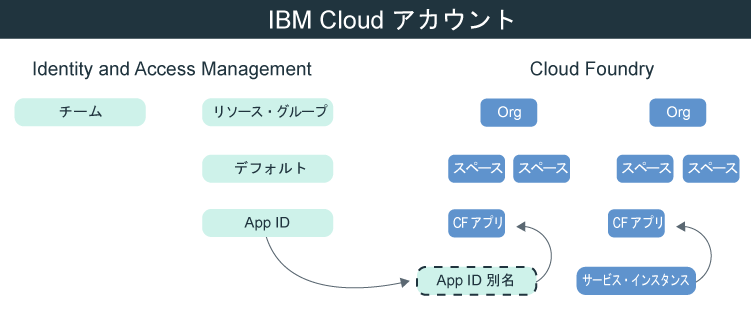

---

copyright:
  years: 2017, 2019
lastupdated: "2019-05-09"

keywords: authentication, authorization, identity, app security, secure, development, cloud foundry, access management, iam, java, node.js

subcollection: appid

---

{:new_window: target="_blank"}
{:shortdesc: .shortdesc}
{:screen: .screen}
{:pre: .pre}
{:table: .aria-labeledby="caption"}
{:codeblock: .codeblock}
{:tip: .tip}
{:note: .note}
{:important: .important}
{:deprecated: .deprecated}
{:download: .download}


# チュートリアル: {{site.data.keyword.appid_short_notm}} を使用するように Cloud Foundry を構成する
{: #cloud-foundry}

{{site.data.keyword.cloud_notm}} の使用時には、ID およびアクセス管理 (IAM) と Cloud Foundry の 2 種類のアクセス管理でアプリを保護できます。 デフォルトでは、{{site.data.keyword.appid_short_notm}} のすべての新しいインスタンスで IAM リソース・グループを使用してアクセスが管理されます。 Cloud Foundry を使用してアプリケーションを管理している場合は、サービス別名を作成し、サービスをアプリにバインドすることにより、管理モデルを橋渡しすることができます。
{: shortdesc}


## Cloud Foundry について
{: #cf-understand}

別名は、{{site.data.keyword.appid_short_notm}} などの IAM 管理サービスと Cloud Foundry アプリケーションとの間の接続を作成します。 アプリケーションのバインド時には、サービス資格情報が作成されて自動的にアプリに渡されます。 バインドは構成において必須のステップですが、以下の利点もあります。

* 自動化: VCAP_SERVICES 環境変数内に保管されているサービス資格情報が使用されるので、手動でアプリにサービス資格情報をコピーする必要はなくなります。 この操作は、すべて {{site.data.keyword.appid_short_notm}} SDK によって、裏でユーザーに代わって行われます。
* 安全性: 構成のプロセスが自動になるので、構成時のエラーが防止されます。
* セキュリティー: サービス資格情報は環境変数内だけに存在するので、アクセス権限関連の内容はアプリケーションに一切ハードコーディングされません。

Cloud Foundry アプリが別のプラットフォーム上でホストされていますか? 問題ありません。 サービスにバインドするようにアプリ内でアプリケーション資格情報を定義できます。 {{site.data.keyword.appid_short_notm}} ダッシュボードを使用するか、[/applications エンドポイント](https://us-south.appid.cloud.ibm.com/swagger-ui/#!/Applications/registerApplication)に対して要求を行って、アプリケーション資格情報を検出できます。
{: tip}

以下の図で、各モデルの関係を確認してください。



## 開始する前に
{: #cf-before}

開始する前に、以下の前提条件を満たしていることを確認してください。

* {{site.data.keyword.cloud_notm}} アカウント
* {{site.data.keyword.appid_short_notm}} のインスタンス
* [{{site.data.keyword.cloud_notm}} CLI](/docs/cli/reference/ibmcloud?topic=cloud-cli-ibmcloud-cli#ibmcloud-cli) がローカルにインストールされていること

## Node.js アプリのデプロイ
{: #cf-node}


1. {{site.data.keyword.appid_short_notm}} のインスタンスにナビゲートします。

2. サービス・ダッシュボードの**「概要」**タブ上の**「サンプルのダウンロード (Download Sample)」**をクリックします。

3. **「Node.js」**をクリックします。 サンプル・アプリをダウンロードして解凍します。

4. Node.js の前提条件をすべて満たしていることを確認します。

5. 端末を開き、サンプル・フォルダーに変更します。

6. {{site.data.keyword.cloud_notm}} CLI にログインします。 アカウントや地域を指定していない場合は、CLI により選択するよう求められます。

  ```
  ibmcloud login -a cloud.ibm.com -r <region>
  ```
  {: codeblock}

  <table>
    <tr>
      <th>地域</th>
      <th>エンドポイント</th>
    </tr>
    <tr>
      <td>ダラス</td>
      <td><code>us-south</code></td>
    </tr>
    <tr>
      <td>フランクフルト</td>
      <td><code>eu-de</code></td>
    </tr>
    <tr>
      <td>シドニー</td>
      <td><code>au-syd</code></td>
    </tr>
    <tr>
      <td>ロンドン</td>
      <td><code>eu-gb</code></td>
    </tr>
    <tr>
      <td>東京</td>
      <td><code> jp-tok </code></td>
    </tr>
  </table>

7. 作業しようとしている Cloud Foundry 組織とスペースをターゲットにして、プロンプトの指示に従い組織とスペースをターゲットとして指定します。

  ```
  ibmcloud target --cf
  ```
  {: codeblock}

8. {{site.data.keyword.appid_short_notm}} サービス・インスタンスの別名を作成します。

  ```
  ibmcloud resource service-alias-create {ALIAS_NAME} --instance-name {SERVICE_INSTANCE_NAME}
  ```
  {: codeblock}

9. 作成した別名を `manifest.yml` 内のサービスに追加します。

10. サンプル・アプリをデプロイして、`manifest.yml` ファイル内にリストされているサービスをバインドします。

  ```
  ibmcloud app push
  ```
  {: codeblock}

## Java アプリのデプロイ
{: #java}

1. {{site.data.keyword.appid_short_notm}} のインスタンスにナビゲートします。

2. サービス・ダッシュボードの**「概要」**タブ上の**「サンプルのダウンロード (Download Sample)」**をクリックします。

3. **「Java」**をクリックします。 サンプル・アプリをダウンロードして解凍します。

4. Java の前提条件をすべて満たしていることを確認します。

5. 端末を開き、サンプル・フォルダーに変更します。

6. `war` ファイルを生成してアップロードします。

  ```
  mvn clean install
  ```
  {: codeblock}

7. Liberty フォルダーに変更します。

8. {{site.data.keyword.cloud_notm}} CLI にログインします。 アカウントや地域を指定していない場合は、CLI により選択するよう求められます。

  ```
  ibmcloud login -a cloud.ibm.com -r <region>
  ```
  {: codeblock}

8. 作業しようとしている Cloud Foundry 組織とスペースをターゲットにして、プロンプトの指示に従い組織とスペースをターゲットとして指定します。

  ```
  ibmcloud target --cf
  ```
  {: codeblock}

10. {{site.data.keyword.appid_short_notm}} サービス・インスタンスの別名を作成します。

  ```
  ibmcloud resource service-alias-create {ALIAS_NAME} --instance-name {SERVICE_INSTANCE_NAME}
  ```
  {: codeblock}

11. 作成した別名を `manifest.yml` 内のサービスに追加します。

  例:
  ```
    applications:
  - name: ApplicationName
    memory: 512M
    services:
    - AppID-alias
  ```
  {: screen}

13. サンプル・アプリをデプロイして、`manifest.yml` ファイル内にリストされているサービスをバインドします。

  ```
  ibmcloud app push
  ```
  {: codeblock}

