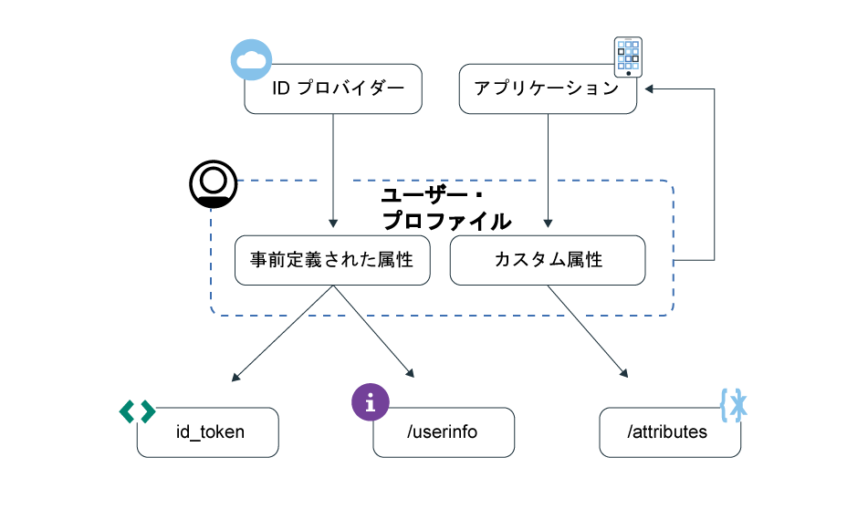

---

copyright:
  years: 2017, 2019
lastupdated: "2019-04-04"

keywords: authentication, authorization, identity, app security, secure, user profiles, personalized apps, attributes, 

subcollection: appid

---

{:new_window: target="_blank"}
{:shortdesc: .shortdesc}
{:screen: .screen}
{:pre: .pre}
{:table: .aria-labeledby="caption"}
{:codeblock: .codeblock}
{:tip: .tip}
{:note: .note}
{:important: .important}
{:deprecated: .deprecated}
{:download: .download}

# ユーザー・プロファイルの理解
{: #user-profile}

{{site.data.keyword.appid_full}} では、{{site.data.keyword.appid_short_notm}} によって保管されているユーザーに関する情報にアクセスすることによって、個別設定されたアプリ操作環境を構築できます。
{: shortdesc}

## 主要な概念
{: #profile-concepts}

**ユーザー・プロファイルとは**

ユーザー・プロファイルとは、{{site.data.keyword.appid_short_notm}} によって保管されている属性をまとめたものです。 属性とは、アプリと対話するユーザーに関する情報の特定の側面を示すそれぞれの部分のことです。 取得可能な属性には、`predefined` (事前定義) と `custom` (カスタム) の 2 つのタイプがあります。

**事前定義属性とは?**

事前定義属性は、ユーザーがアプリにサインインすると ID プロバイダーから返されます。 その属性には、ユーザー名、年齢、性別などが含まれる可能性があります。

**カスタム属性とは**

カスタム属性は、ユーザーがアプリと対話する際に学習される、ユーザーについての情報です。 カスタム属性は、ユーザーが初めてアプリにサインインする前に設定しておくこともできます。 例えば、好みのフォント・サイズやショッピング・カートに入れる品目などです。 カスタム属性は編集できます。 デフォルトを変更する前に、ユーザーが属性を編集できるようにすることで発生する可能性がある[セキュリティーの影響](/docs/services/appid?topic=appid-custom-attributes)を必ず確認してください。

## ユーザー属性へのアクセス
{: #profile-access}

[事前定義](/docs/services/appid?topic=appid-predefined-attributes)属性と[カスタム](/docs/services/appid?topic=appid-custom-attributes)属性には、いくつかの異なる方法でアクセスできます。 ユーザー認証が成功した後に、アプリはアクセス・トークンと識別トークンを受け取ります。 識別トークンには、ID プロバイダーによって返されるユーザー属性の正規化されたサブセットが格納されます。 ユーザー属性の完全なリストを取得するときには、OIDC [`/userinfo` エンドポイント](https://us-south.appid.cloud.ibm.com/swagger-ui/#/Authorization_Server_V4/userInfo)を使用できます。 カスタム属性を管理するときには、`REST API` を使用できます。 ユーザー情報エンドポイントとカスタム属性エンドポイントはどちらも、認証プロセスの最後に {{site.data.keyword.appid_short_notm}} によって生成されるアクセス・トークンによって保護されます。

識別トークンおよびアクセス・トークンについて詳しくは、[トークンについて](/docs/services/appid?topic=appid-tokens#tokens)または[トークンの検証](/docs/services/appid?topic=appid-token-validation)を参照してください。

図. ユーザー・プロファイル情報のフロー

カスタム属性を表示するには、<a href="https://us-south.appid.cloud.ibm.com/swagger-ui/#/Attributes" target="_blank">REST API </a> を使用できます。

