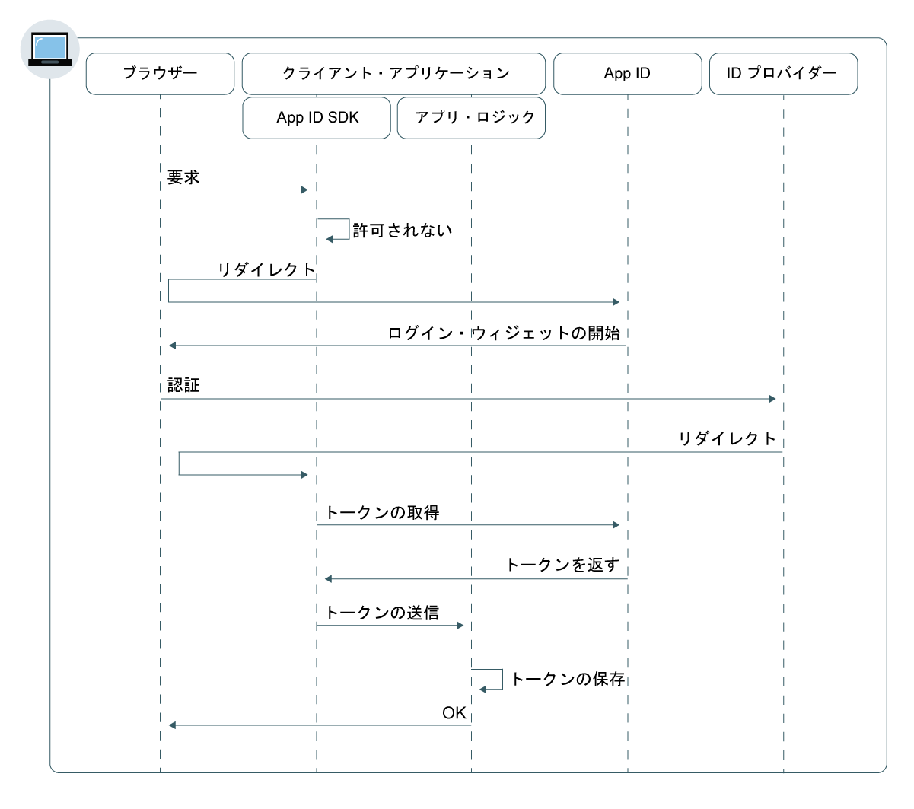

---

copyright:
  years: 2017, 2019
lastupdated: "2019-04-04"

keywords: authentication, authorization, identity, app security, secure, web apps, client, server

subcollection: appid

---

{:new_window: target="_blank"}
{:shortdesc: .shortdesc}
{:screen: .screen}
{:pre: .pre}
{:table: .aria-labeledby="caption"}
{:codeblock: .codeblock}
{:tip: .tip}
{:note: .note}
{:important: .important}
{:deprecated: .deprecated}
{:download: .download}


# Web アプリ
{: #web-apps}

{{site.data.keyword.appid_full}} を使用すると、Web アプリケーション用に認証レイヤーを素早く構成できます。
{: shortdesc}

## フローについて
{: #web-understanding}

**このフローが役立つ状況**

Web アプリケーションを開発する際に、{{site.data.keyword.appid_short_notm}} Web フローを使用して、ユーザーを安全に認証できます。 これによりユーザーは、Web アプリ内にあるサーバー・サイドの保護コンテンツにアクセスできるようになります。

**このフローの技術基盤**

Web アプリでは、保護コンテンツにアクセスするために、しばしばユーザーの認証を要求します。 {{site.data.keyword.appid_short_notm}} は OIDC 許可コード・フローを使用してユーザーを安全に認証します。 このフローでは、ユーザーが認証されると、アプリは許可コードを受け取ります。 次いでそのコードは、アクセス・トークン、識別トークン、およびリフレッシュ・トークンに交換されます。 コードの交換ステップで、トークンは常にアプリと OIDC サーバー間のセキュア・バックチャネルを介して送信されます。 このようにセキュリティー層の厚みが増すので、攻撃者がトークンを傍受することができません。 これらのトークンは、ユーザー認証のために、アプリケーションをホストしている Web サーバーに直接送信できます。

**このフローはどのように機能しますか?**



1. ユーザーは、{{site.data.keyword.appid_short_notm}} SDK または API を介して `/authorization` エンドポイントに要求を送信することにより、許可フローを開始します。

2. ユーザーが許可されていない場合、{{site.data.keyword.appid_short_notm}} へのリダイレクトによって認証フローが開始します。

3. ユーザーの `/authorization` 要求パラメーターまたは ID プロバイダー構成に応じて、ユーザーのブラウザー内でログイン・ウィジェットが起動します。

4. ユーザーは、認証を行うための ID プロバイダーを選択し、サインイン・プロセスを実行します。

5. ID プロバイダーは、許可コードと共にクライアント・アプリにリダイレクトします。

6. {{site.data.keyword.appid_short_notm}} SDK は、許可コードを、{{site.data.keyword.appid_short_notm}} サービスからのアクセス・トークン、識別トークン、およびオプションのリフレッシュ・トークンに交換します。

7. それらのトークンが {{site.data.keyword.appid_short_notm}} SDK によって保存され、クライアント・アプリケーションへのリダイレクトが行われます。

8. ユーザーはアプリへのアクセス権限を付与されます。


## Node.js SDK の構成
{: #web-configuring-nodejs}

{{site.data.keyword.appid_short_notm}} で、Node.js Web アプリケーションを操作するための構成を行います。
{: shortdesc}

**始める前に**

以下の前提条件を満たしている必要があります。

* {{site.data.keyword.appid_short_notm}} サービスのインスタンス
* サービス資格情報のセット
* NPM バージョン 4 以上
* Node バージョン 6 以上
* {{site.data.keyword.appid_short_notm}} サービス・ダッシュボードで設定されたリダイレクト URI


### Node.js SDK のインストール
{: #web-nodejs-install}

1. コマンド・ラインを使用して、Node.js アプリが含まれているディレクトリーに移動します。

2. {{site.data.keyword.appid_short_notm}} サービスをインストールします。

  ```bash
  npm install --save ibmcloud-appid
  ```
  {: pre}

### Node.js SDK の初期化
{: #web-nodejs-initialize}

1. `server.js` ファイルに以下の `require` 定義を追加します。

  ```javascript
  const express = require('express');
    const session = require('express-session')
    const passport = require('passport');
    const WebAppStrategy = require("ibmcloud-appid").WebAppStrategy;
    const CALLBACK_URL = "/ibm/cloud/appid/callback";
  ```
  {: pre}

2. express-session ミドルウェアを使用するように Express アプリをセットアップする。

  ```javascript
  const app = express();
    app.use(session({
        secret: "123456",
        resave: true,
        saveUninitialized: true
        }));
    app.use(passport.initialize());
    app.use(passport.session());
  ```
  {: pre}

  ミドルウェアには、実稼働環境用の適切なセッション・ストレージを構成する必要があります。 詳細については、<a href="https://github.com/expressjs/session" target="_blank">express.js の資料 </a> を参照してください。
  {: note}

3. 次のいずれかの方法で資格情報を入手します。

  * {{site.data.keyword.appid_short_notm}} ダッシュボードの**「アプリケーション」**タブに移動します。リスト内にアプリケーションがない場合は、**「アプリケーションの追加 (Add application)」**をクリックして新しいアプリケーションを作成できます。

  * [`/management/v4/{tenantId}/applications` エンドポイント](https://us-south.appid.cloud.ibm.com/swagger-ui/#/Management%20API%20-%20Applications/mgmt.registerApplication)に対して POST 要求を行います。

    要求の形式:
    ```
    curl -X POST \  https://us-south.appid.cloud.ibm.com/management/v4/39a37f57-a227-4bfe-a044-93b6e6060b61/applications/ \
  -H 'Content-Type: application/json' \
  -H 'Authorization: Bearer IAM_TOKEN' \
  -d '{"name": "ApplicationName"}'
    ```
    {: pre}

    応答例:
    ```
    {
    "clientId": "111c22c3-38ea-4de8-b5d4-338744d83b0f",
    "tenantId": "39a37f57-a227-4bfe-a044-93b6e6060b61",
    "secret": "ZmE5ZDQ5ODctMmA1ZS00OGRiLWExZDMtZTA1MjkyZTc4MDB4",
    "name": "ApplicationName",
    "oAuthServerUrl": "https://us-south.appid.cloud.ibm.com/oauth/v4/39a37f57-a227-4bfe-a044-93b6e6060b61"
    }
    ```
    {: screen}

4. オプション: リダイレクト URI をフォーマットする方法を決めます。リダイレクトは、2 つの異なる方法でフォーマットすることができます。

  * 新しい `WebAppStrategy({redirectUri: "...."})` 内に手動で
  * `redirectUri` という名前の環境変数として

  いずれも指定されない場合、{{site.data.keyword.appid_short_notm}} SDK は、{{site.data.keyword.cloud_notm}} で実行されているアプリの `application_uri` の取得を試行して、デフォルトのサフィックス `/ibm/cloud/appid/callback` を追加します。

5. 前述のステップで入手した情報を使用して、SDK を初期化します。

  ```javascript
    passport.use(new WebAppStrategy({
    	  tenantId: "{tenant-id}",
   	    clientId: "{client-id}",
      	secret: "{secret}",
      	oauthServerUrl: "{oauth-server-url}",
      	redirectUri: "{app-url}" + CALLBACK_URL
      }));
  ```
  {: pre}

6. passport にシリアライゼーションとデシリアライゼーションを構成する。 この構成手順は、複数の HTTP 要求にわたって認証済みセッション・パーシスタンスを維持するために必要です。 詳細については、<a href="http://passportjs.org/docs" target="_blank">passport の資料 </a> を参照してください。

  ```javascript
  passport.serializeUser(function(user, cb) {
    cb(null, user);
    });

  passport.deserializeUser(function(obj, cb) {
    cb(null, obj);
    });
  ```
  {: pre}

5. `server.js` ファイルに以下のコードを追加して、サービス・リダイレクトを発行します。

   ```javascript
   app.get(CALLBACK_URL, passport.authenticate(WebAppStrategy.STRATEGY_NAME));
   ```
   {: pre}

6. 保護エンドポイントを登録します。

   ```javascript
   app.get(‘/protected’, passport.authenticate(WebAppStrategy.STRATEGY_NAME), function(req, res) {res.json(req.user); });
   ```
   {: pre}

詳細については、<a href="https://github.com/ibm-cloud-security/appid-serversdk-nodejs" target="_blank">{{site.data.keyword.appid_short_notm}}Node.js GitHub リポジトリー </a> を参照してください。


## Liberty for Java SDK の構成
{: #web-configuring-liberty}

{{site.data.keyword.appid_short_notm}} で、Liberty for Java Web アプリケーションを操作するための構成を行います。
{:shortdesc}

**始める前に**

以下の前提条件を満たしている必要があります。
* {{site.data.keyword.appid_short_notm}} サービスのインスタンス
* サービス資格情報のセット
* Apache Maven 3.5 以上
* Java 1.8
* Liberty for Java Web アプリケーション

### Liberty for Java SDK のインストール
{: #web-liberty-install}

1. OpenID Connect 機能を `server.xml` に追加します。

  ```xml
  <featureManager>
      <feature>ssl-1.0</feature>
      <feature>appSecurity-2.0</feature>
      <feature>openidConnectClient-1.0</feature>
  </featureManager>
  ```
  {: pre}

2. 次の 2 つの方法のいずれかで資格情報を入手します。

  * {{site.data.keyword.appid_short_notm}} ダッシュボードの**「アプリケーション」**タブに移動します。まだない場合は、**「アプリケーションの追加 (Add application)」**をクリックして新しいアプリケーションを作成できます。

  * [`/management/v4/{tenantId}/applications` エンドポイント](https://us-south.appid.cloud.ibm.com/swagger-ui/#!/Applications/registerApplication)に対して POST 要求を行います。

    要求の形式:
    ```
    curl -X POST \  https://us-south.appid.cloud.ibm.com/management/v4/39a37f57-a227-4bfe-a044-93b6e6060b61/applications/ \
  -H 'Content-Type: application/json' \
  -H 'Authorization: Bearer IAM_TOKEN' \
  -d '{"name": "ApplicationName"}'
    ```
    {: pre}

    応答例:
    ```
    {
    "clientId": "111c22c3-38ea-4de8-b5d4-338744d83b0f",
    "tenantId": "39a37f57-a227-4bfe-a044-93b6e6060b61",
    "secret": "ZmE5ZDQ5ODctMmA1ZS00OGRiLWExZDMtZTA1MjkyZTc4MDB4",
    "name": "ApplicationName",
    "oAuthServerUrl": "https://us-south.appid.cloud.ibm.com/oauth/v4/39a37f57-a227-4bfe-a044-93b6e6060b61"
    }
    ```
    {: screen}

3. Open ID Connect Client フィーチャーを作成し、以下のプレースホルダーを定義します。 サービス資格情報を使用してプレースホルダーに入力します。

  ```xml
  <openidConnectClient
    clientId='{{site.data.keyword.appid_short_notm}} client_ID'
    clientSecret='{{site.data.keyword.appid_short_notm}} Secret'
    authorizationEndpointUrl='oauthServerUrl/authorization'
    tokenEndpointUrl='oauthServerUrl/token'
    jwkEndpointUrl='oauthServerUrl/publickeys'
    issuerIdentifier='Changed according to the region'
    tokenEndpointAuthMethod="basic"
    signatureAlgorithm="RS256"
    authFilterid="myAuthFilter"
    trustAliasName="ibm.com"
  />
  ```
  {: pre}

  <table>
  <caption>表. Liberty for Java アプリケーションの OIDC 要素変数</caption>
    <tr>
      <th> コンポーネント </th>
      <th> 説明 </th>
    </tr>
    <tr>
    <td><code> clientID </code> </br> <code> secret </code> </br> <code> oauth-server-url </code> </br></td>
    <td>ステップ 2 を完了してサービス資格情報を入手します。</td>
    </tr>
    <tr>
      <td><code> authorizationEndpointURL </code></td>
      <td> <code>oauthServerURL</code> の最後に <code>/authorization</code> を追加します。</td>
    </tr>
    <tr>
      <td><code> tokenEndpointUrl </code></td>
      <td><code>oauthServerURL</code> の最後に <code>/token</code> を追加します。</td>
    </tr>
    <tr>
      <td><code> jwkEndpointUrl </code></td>
      <td><code>oauthServerURL</code> の最後に <code>/publickeys</code> を追加します。</td>
    </tr>
    <tr>
      <td><code> issuerIdentifier </code></td>
      <td>発行者 ID の形式は <code>&lt;region>&gt;.cloud.ibm.com</code> になります。地域オプションとしては、<code>au-syd</code>、<code>eu-de</code>、<code>eu-gb</code>、<code>jp-tok</code>、<code>us-south</code> があります。</td>
    </tr>
    <tr>
      <td><code> tokenEndpointAuthMethod </code></td>
      <td>"basic" を指定します。</td>
    </tr>
    <tr>
      <td><code> signatureAlgorithm </code></td>
      <td>"RS256" を指定します。</td>
    </tr>
    <tr>
      <td><code> authFilterid </code></td>
      <td>保護するリソースのリスト。</td>
    </tr>
    <tr>
      <td><code> trustAliasName </code></td>
      <td>トラストストア内の証明書の名前。</td>
    </tr>
  </table>

### Liberty for Java SDK の初期化
{: #web-liberty-initialize}

1. `server.xml` ファイルで、保護リソースを指定するための許可フィルターを定義します。 フィルターを<a href="https://www.ibm.com/support/knowledgecenter/en/SSD28V_8.5.5/com.ibm.websphere.wlp.core.doc/ae/rwlp_auth_filter.html" target="_blank">定義 </a> しない場合は、サービスによってすべてのリソースが保護されます。

  ```xml
  <authFilter id="myAuthFilter">
             <requestUrl id="myRequestUrl" urlPattern="/protected" matchType="contains"/>
    </authFilter>
  ```
  {: pre}

2. 特別なサブジェクト・タイプを `ALL_AUTHENTICATED_USERS` として定義します。

  ```xml
  <application type="war" id="ProtectedServlet" context-root="/appidSample" location="${server.config.dir}/apps/libertySample-1.0.0.war">
      <application-bnd>
          <security-role name="myrole">
              <special-subject type="ALL_AUTHENTICATED_USERS"/>
          </security-role>
      </application-bnd>
  </application>
  ```
  {: pre}

3. <a href="https://github.com/ibm-cloud-security/appid-sample-code-snippets/tree/master/liberty-for-java" target="_blank">GitHub </a> から `libertySample-1.0.0.war` ファイルをダウンロードし、サーバーの apps フォルダーに入れます。 例えば、サーバーの名前が `defaultServer` である場合、war ファイルは `target/liberty/wlp/usr/servers/defaultServer/apps/` に置かれます。

4. 以下の内容を `server.xml` ファイルに追加して、SSL を構成します。 トラストストアも作成する必要があります。

  ```xml
    <keyStore id="defaultKeyStore" password="myPassword"/>
  <keyStore id="appidtruststore" password="Liberty" location="${server.config.dir}/mytruststore.jks"/>
  <ssl id="defaultSSLConfig" keyStoreRef="defaultKeyStore" trustStoreRef="appidtruststore"/>
  ```
  {: pre}

デフォルトで、SSL 構成では、トラストストアを OpenID Connect 用に構成する必要があります。 <a href="https://www.ibm.com/support/knowledgecenter/en/SSEQTP_liberty/com.ibm.websphere.wlp.doc/ae/twlp_config_oidc_rp.html" target="_blank">Liberty での OpenID Connect クライアントの構成方法 </a> について学習してください
{: tip}


## Spring Boot for Java SDK の構成
{: #web-configuring-spring-boot}

Spring Boot アプリケーションと連携するように {{site.data.keyword.appid_short_notm}} を構成できます。
{:shortdesc}

**始める前に**

以下の前提条件を満たしている必要があります。

* {{site.data.keyword.appid_short_notm}} サービスのインスタンス
* サービス資格情報のセット
* Java + Maven プロジェクト
* Apache Maven 3.5 以上
* Java 1.8
* Spring Boot 2.0 および Security OAuth 2.0 以上


### Spring Boot フレームワークの初期化
{: #web-spring-boot-initialize}

1. 以下の内容を Maven `pom.xml` ファイル内の `<project> </project>` タグ間に追加します。

  ```xml
  <parent>
      <groupId>org.springframework.boot</groupId>
      <artifactId>spring-boot-starter-parent</artifactId>
      <version>2.0.2.RELEASE</version>
      <relativePath/>
  </parent>
  ```
  {: pre}

2. Maven `pom.xml` ファイルに以下の依存関係を追加します。

  ```xml
  <dependencies>
      <dependency>
          <groupId>org.springframework.boot</groupId>
          <artifactId>spring-boot-starter-web</artifactId>
      </dependency>
      <dependency>
          <groupId>org.springframework.boot</groupId>
          <artifactId>spring-boot-starter-security</artifactId>
      </dependency>
      <dependency>
          <groupId>org.springframework.security.oauth.boot</groupId>
          <artifactId>spring-security-oauth2-autoconfigure</artifactId>
          <version>2.0.0.RELEASE</version>
      </dependency>
  </dependencies>
  ```
  {: pre}

3. 同じファイル内に Maven プラグインを入れます。

  ```xml
  <plugin>
      <groupId>org.springframework.boot</groupId>
      <artifactId>spring-boot-maven-plugin</artifactId>
  </plugin>
  ```
  {: pre}

### OAuth2 の初期化
{: #web-oauth-initialize}

1. 以下のアノテーションを Java ファイルに追加します。

  ```java
  @SpringBootApplication
  @EnableOAuth2Sso
  ```
  {: pre}

2. `WebSecurityConfigurerAdapter` を使用してクラスを拡張します。
3. セキュリティー構成をオーバーライドし、保護エンドポイントを登録します。

  ```java
    @Override
    protected void configure(HttpSecurity http) throws Exception {
        http.authorizeRequests()
                .antMatchers("/protectedResource").authenticated()
                .and().logout().logoutSuccessUrl("/").permitAll();
    }
  ```
  {: pre}


### 資格情報の追加
{: #web-spring-boot-credentials}

1. 次のいずれかの方法で資格情報を入手します。

  * {{site.data.keyword.appid_short_notm}} ダッシュボードの**「アプリケーション」**タブに移動します。まだない場合は、**「アプリケーションの追加 (Add application)」**をクリックして新しいアプリケーションを作成できます。

  * [`/management/v4/{tenantId}/applications` エンドポイント](https://us-south.appid.cloud.ibm.com/swagger-ui/#!/Applications/registerApplication)に対して POST 要求を行います。

    要求の形式:
    ```
    curl -X POST \  https://us-south.appid.cloud.ibm.com/management/v4/39a37f57-a227-4bfe-a044-93b6e6060b61/applications/ \
  -H 'Content-Type: application/json' \
  -H 'Authorization: Bearer IAM_TOKEN' \
  -d '{"name": "ApplicationName"}'
    ```
    {: pre}

    応答例:
    ```
    {
    "clientId": "111c22c3-38ea-4de8-b5d4-338744d83b0f",
    "tenantId": "39a37f57-a227-4bfe-a044-93b6e6060b61",
    "secret": "ZmE5ZDQ5ODctMmA1ZS00OGRiLWExZDMtZTA1MjkyZTc4MDB4",
    "name": "ApplicationName",
    "oAuthServerUrl": "https://us-south.appid.cloud.ibm.com/oauth/v4/39a37f57-a227-4bfe-a044-93b6e6060b61"
    }
    ```
    {: screen}

2. `application.yml` 構成ファイルを `/springbootsample/src/main/resources/` ディレクトリーに追加します。 サービス資格情報からの情報を使用して、構成を完成させることができます。

  ```
  security:
  oauth2:
    client:
      clientId: {client ID}
      clientSecret: {client Secret}
      accessTokenUri: {oauthServerUrl}/token
      userAuthorizationUri: {oauthServerUrl}/authorization
    resource:
      userInfoUri: {oauthServerUrl}/userinfo
  ```
  {: pre}

ステップバイステップの例については、<a href="https://www.ibm.com/blogs/bluemix/2018/06/creating-spring-boot-applications-app-id/" target="_blank">このブログ</a>を参照してください。


## 他の言語での {{site.data.keyword.appid_short_notm}} の使用
{: #web-other-languages}

OIDC 準拠のクライアント SDK では、{{site.data.keyword.appid_short_notm}} を他の言語で使用できます。 詳しくは、<a href="https://openid.net/developers/certified/">認定ライブラリー</a>のリストを参照してください。

## 次のステップ
{: #web-next}

{{site.data.keyword.appid_short_notm}} がアプリケーションにインストールされたので、ユーザーの認証を開始する準備がほとんどできています。 次に、以下のいずれかの作業を行ってください。

* [ID プロバイダー](/docs/services/appid?topic=appid-social)を構成します
* [ログイン・ウィジェット](/docs/services/appid?topic=appid-login-widget)のカスタマイズと構成を行います
* <a href="https://github.com/ibm-cloud-security/appid-serversdk-nodejs" target="_blank">Node.js SDK </a> について学習します
