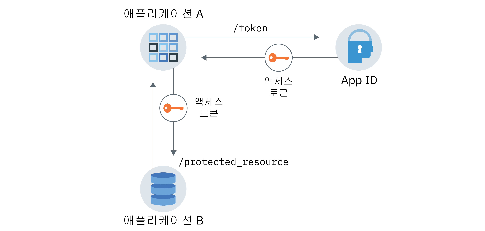

---

copyright:
  years: 2017, 2018
lastupdated: "2018-12-19"

---

{:new_window: target="_blank"}
{:shortdesc: .shortdesc}
{:screen: .screen}
{:codeblock: .codeblock}
{:tip: .tip}

# 애플리케이션 ID 및 권한
{: #app}

{{site.data.keyword.appid_short_notm}}를 사용하는 경우 OAuth2.0 기능을 활용하여 애플리케이션 ID 및 권한 플로우를 통해 애플리케이션에 보안을 설정할 수 있습니다.
{: shortdesc}

## 통신 플로우에 대한 정보
{: #understanding}

**어떤 경우에 이 플로우가 유용합니까?**

사용자 개입 없이 하나의 애플리케이션에서 다른 서비스 또는 앱과 통신하기를 원하는 몇 가지 이유가 있습니다. 예를 들어 해당 작업을 수행하기 위해 다른 애플리케이션에 액세스해야 하는 비대화식 앱이 있습니다. 이 앱에는 환경 변수를 모니터하고 업스트림 서버에 보고하는 CLI, 디먼 또는 IoT 디바이스가 포함될 수 있습니다. 특정 유스 케이스는 각 애플리케이션에 대해 고유하지만 기억해야 할 가장 중요한 내용은 일반 사용자가 아닌 앱을 대신하여 요청이 교환되며 인증 및 권한 부여되는 대상이 앱이라는 점입니다.

<a href="https://www.ibm.com/blogs/bluemix/2018/02/using-app-id-secure-docker-kubernetes-applications/" target="_blank">{{site.data.keyword.appid_short_notm}}를 사용하여 Docker 및 Kubernetes 애플리케이션에 보안 설정 </a>에서 해당 예제를 참조하십시오.

**애플리케이션 ID 및 권한 플로우는 어떻게 작동합니까?**

{{site.data.keyword.appid_short_notm}}의 경우 OAuth2.0 클라이언트 인증 정보 플로우를 활용하여 통신을 보호합니다. 앱이 {{site.data.keyword.appid_short_notm}}에 등록되면 해당 앱은 클라이언트 ID 및 시크릿을 얻게 됩니다. 앱은 이 정보를 통해 {{site.data.keyword.appid_short_notm}}의 액세스 토큰을 요청하고 보호된 리소스 또는 API에 액세스할 수 있는 권한을 부여받을 수 있습니다. 애플리케이션 ID 및 권한 플로우에서 애플리케이션에는 액세스 토큰만 부여됩니다. ID 토큰 또는 새로 고치기 토큰은 얻지 못합니다. 토큰에 대한 자세한 정보는 [토큰에 대한 정보](/docs/services/appid/authorization.html#tokens)를 참조하십시오.

이 워크플로우는 시크릿이 오용되거나 유출될 위험이 없는 신뢰할 수 있는 애플리케이션에서만 사용되어야 합니다. 애플리케이션의 경우 항상 클라이언트 시크릿을 보유하고 있습니다. 모바일 앱에서는 작동하지 않습니다.
{: tip}

**이 플로우의 형태는 어떻습니까?**

다음 이미지에서 서비스와 애플리케이션 간의 통신 방향을 확인할 수 있습니다.


그림. 애플리케이션 ID 및 권한 플로우

1. 애플리케이션 A는 {{site.data.keyword.appid_short_notm}}에 등록되어 클라이언트 ID 및 시크릿을 얻습니다.
2. 애플리케이션 A는 이전 단계에서 검색된 인증 정보를 전송하여 {{site.data.keyword.appid_short_notm}}에 대한 요청을 작성합니다.
3. {{site.data.keyword.appid_short_notm}}에서 요청을 유효성 검증하고 앱을 인증한 후 애플리케이션 A에 액세스 토큰이 포함된 응답을 리턴합니다.
4. 이제 애플리케이션 A에서 액세스 토큰을 사용하여 애플리케이션 B(예: 보호된 리소스)에 요청을 전송할 수 있습니다.

## 앱 등록
{: #registering}

**GUI를 사용하여 앱 등록**

1. {{site.data.keyword.appid_short_notm}} 대시보드의 **애플리케이션** 탭에서 **애플리케이션 추가**를 클릭하십시오.
2. 애플리케이션을 이름을 추가한 후 **저장**을 클릭하여 등록된 앱 목록으로 돌아가십시오. 애플리케이션 이름은 50자를 초과할 수 없습니다.
3. 등록된 앱 목록에서 이전 단계에 추가한 애플리케이션을 선택하십시오. 해당 행이 펼쳐지면서 인증 정보가 표시됩니다.

**API를 사용하여 앱 등록**

1. [`/management/v4/{tenantId}/applications` 엔드포인트](https://appid-management.ng.bluemix.net/swagger-ui/#!/Applications/registerApplication)에 대한 POST 요청을 작성하십시오.

  요청:
  ```
  curl -X POST \  https://appid-management.ng.bluemix.net/management/v4/39a37f57-a227-4bfe-a044-93b6e6060b61/applications/ \
  -H 'Content-Type: application/json' \
  -H 'Authorization: Bearer IAM_TOKEN' \
  -d '{"name": "ApplicationName"}'
  ```
  {: codeblock}

  응답 예제:
  ```
  {
  "clientId": "111c22c3-38ea-4de8-b5d4-338744d83b0f",
   "tenantId": "39a37f57-a227-4bfe-a044-93b6e6060b61",
  "secret": "ZmE5ZDQ5ODctMmA1ZS00OGRiLWExZDMtZTA1MjkyZTc4MDB4",
  "name": "ApplicationName",
   "oAuthServerUrl": "https://appid-oauth.eu-gb.bluemix.net/oauth/v3/39a37f57-a227-4bfe-a044-93b6e6060b61"
   }
  ```
  {: codeblock}


## 액세스 토큰 얻기
{: #obtain-token}

앱이 {{site.data.keyword.appid_short_notm}}에 등록되어 인증 정보를 얻은 후에는 액세스 토큰을 가져오기 위해 {{site.data.keyword.appid_short_notm}} 권한 서버에 대한 요청을 작성할 수 있습니다.

1. [`/oauth/v3/{tenantId}/token` 엔드포인트](https://appid-oauth.ng.bluemix.net/swagger-ui/#!/Authorization_Server_V3/token)에 대한 HTTP POST 요청을 작성하십시오. 해당 요청에 대한 권한은 클라이언트 ID 및 시크릿이 base64 인코딩된 사용자 이름 및 비밀번호로 사용되는 `기본 인증`입니다.

  요청: 
  ```
  curl -X POST \
    http://localhost:6002/oauth/v3/39a37f57-a227-4bfe-a044-93b6e6060b61/token \
    -H 'Authorization: Basic base64Encoded{clientId:secret}' \
    -H 'Content-Type: application/x-www-form-urlencoded' \
    -d grant_type=client_credentials
  ```
  {: codeblock}

  응답 예제:
  ```
  {
  "access_token": "eyJhbGciOiJS...F9A",
  "expires_in": "3600",
  "token_type": "Bearer"
  }
  ```
  {: codeblock}


## 튜토리얼: Node.js SDK와 관련된 엔드 투 엔드 플로우
{: tutorial-node}

1. 다음 방법 중 하나를 사용하여 [액세스 토큰](/docs/services/appid/authorization.html#tokens)을 얻으십시오.

  * {{site.data.keyword.appid_short_notm}} [Node.js 서버 SDK](https://github.com/ibm-cloud-security/appid-serversdk-nodejs)에서 토큰 관리자를 사용하여 다음 작업을 수행하십시오. 앱 인증 정보를 사용하여 토큰 관리자를 초기화한 후 `getApplicationIdentityToken()` 메소드에 대한 호출을 작성하여 토큰을 얻으십시오.

    ```
    const TokenManager = require('ibmcloud-appid').TokenManager;
    const config = {
     clientId: "29a19759-aafb-41c7-9ef7-ee7b0ca88818",
     tenantId: "39a37f57-a227-4bfe-a044-93b6e6060b61",
     secret: "ZTEzZTA2MDAtMjljZS00MWNlLTk5NTktZDliMjY3YzUxZTYx",
     oauthServerUrl: "https://appid-oauth.eu-gb.bluemix.net/oauth/v3/39a37f57-a227-4bfe-a044-93b6e6060b61"
    };

    const tokenManager = new TokenManager(config);

    tokenManager.getApplicationIdentityToken().then((appIdAuthContext) => {
     console.log(' Access tokens from SDK : ' + JSON.stringify(appIdAuthContext));
    }).catch((err) => {
     //console.error('Error retrieving tokens : ' + err);
    });
    ```
    {: codeblock}

  * {{site.data.keyword.appid_short_notm}} 권한 서버에서 다음 작업을 수행하십시오. **참고**: 요청에 있는 `oauthServerUrl`은 애플리케이션을 등록할 때 얻게 됩니다. 관리 API를 사용하여 앱을 등록한 경우 서버 URL은 응답 본문에 있습니다. IBM Cloud 콘솔에 바인딩하여 앱을 등록한 경우 VCAP_SERVICES JSON 오브젝트에서 또는 Kubernetes 시크릿을 통해 해당 URL을 찾을 수 있습니다.

    ```
    var request = require('request');

    function getAccessToken() {
      let options = {
          method: 'POST',
          url: oauthServerUrl + '/token',
          headers: { 'content-type': 'application/x-www-form-urlencoded',
              'Authorization': 'Basic ' +Buffer.from('clientId: secret').toString('base64')
          },
          form: {
              grant_type: 'client_credentials'
          }
      };

      return new Promise((resolve, reject) => {
          request(options, function (error, response, body) {
              if (error) {
                  return reject(error);
              }

              let data = JSON.parse(body);
              if(data.access_token) {
                  resolve(data.access_token);
              } else {
                  reject(data);
              }
          })
      });
    }
    ```
    {: codeblock}

2. 이전 단계에서 얻은 액세스 토큰을 사용하여 보호된 리소스에 대한 요청을 작성하십시오.

  ```
  let options = {
      method: 'GET',
      url: 'http://localhost:8081/protected_resource',
      headers: { authorization : 'Bearer ' + accessToken}
  }

  request(options, function (error, response, body) {
      if (error) {
       console.log(error)
      } else {
          res.status(response.statusCode).send({
      console.log(JSON.stringify(body));
          });
      }
  });
  ```
  {: codeblock}

3. {{site.data.keyword.appid_short_notm}} Node.js SDK에서 API 전략을 사용하여 보호된 리소스에 보안을 설정하십시오.

  ```
  const express = require('express'),
    passport = require('passport');

  var app = express();
  app.use(passport.initialize());

  passport.use(new APIStrategy({
      oauthServerUrl: "https://appid-oauth.eu-gb.bluemix.net/oauth/v3/398ec248-5e93-48b8-a122-ccabc714fe85",
      tenantId:"398ec248-5e93-48b8-a122-ccabc714fe85"
  }));

  app.get('/protected_resource',
      passport.authenticate(APIStrategy.STRATEGY_NAME, {session: false}),
      (req, res) => {
          res.send("Hello from protected resource");
  });
  ```
  {: codeblock}
