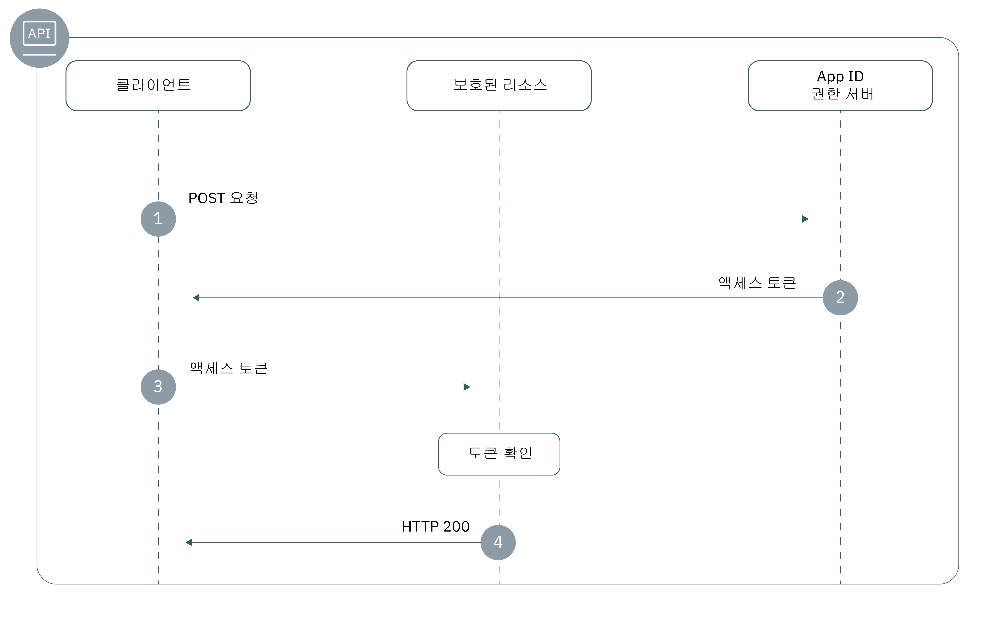

---

copyright:
  years: 2017, 2018
lastupdated: "2018-12-19"

---

{:new_window: target="_blank"}
{:shortdesc: .shortdesc}
{:pre: .pre}
{:tip: .tip}
{:screen: .screen}

# 백엔드 앱
{: #adding-backend}

{{site.data.keyword.appid_full}} SDK 및 API를 사용하여 백엔드 애플리케이션 엔드포인트 및 API를 보호할 수 있습니다.
{: shortdesc}


## 플로우에 대한 정보
{: #understanding}

**어떤 경우에 이 플로우가 유용합니까?**

백엔드 앱을 개발하는 중에 권한이 없는 액세스로부터 API가 보호되는지 확인하게 됩니다. {{site.data.keyword.appid_short_notm}} SDK는 쉽게 API 엔드포인트를 보호하고 앱의 보안을 유지할 수 있도록 해줍니다.

**이 플로우의 기술적 기반은 무엇입니까?**

{{site.data.keyword.appid_short_notm}}는 인증 및 권한 부여를 위해 전달자 토큰을 사용하는 [OAuth2](https://tools.ietf.org/html/rfc6749) 및 OIDC 스펙을 구현합니다. 이러한 토큰은 디지털 방식으로 서명되며 인증할 대상 및 ID 제공자에 대해 설명하는 청구가 포함된 [JSON 웹 토큰](https://tools.ietf.org/html/rfc7519)으로 형식화됩니다. 애플리케이션의 API는 액세스 및 ID 토큰을 통해 보호됩니다. API에 액세스해야 하는 클라이언트는 이러한 토큰과 교환하여 {{site.data.keyword.appid_short_notm}}를 통해 ID 제공자로 인증할 수 있습니다. 보호된 API에 대한 액세스 권한을 부여하기 위해서는 토큰에 있는 청구를 유효성 검증해야 합니다.

{{site.data.keyword.appid_short_notm}}에서 토큰을 사용하는 방법에 대한 자세한 정보는 [토큰에 대한 정보](/docs/services/appid/authorization.html#tokens)를 참조하십시오.
{: tip}

**이 플로우의 형태는 어떻습니까?**



1. 클라이언트는 액세스 토큰을 얻기 위해 {{site.data.keyword.appid_short_notm}} 권한 서버에 대한 POST 요청을 작성합니다. POST 요청의 양식은 일반적으로 다음과 같습니다.

  ```
  POST/oauth/v3/{tenantId}/token HTTP/1.1
  Content_type: application/x-www-form-urlencoded
  Authorization header = "Basic" + base64encode({clientId}:{secret})
  FormData = {grant_type}
  ```
  {: screen}

2. 클라이언트가 자격을 충족하는 경우 권한 서버에서 액세스 토큰을 리턴합니다.

3. 클라이언트는 보호된 리소스에 대한 요청을 전송합니다.

4. 보호된 리소스 또는 API에서 토큰을 유효성 검증합니다. 토큰이 유효한 경우 해당 클라이언트에 리소스에 대한 액세스 권한이 부여됩니다. 토큰을 유효성 검증할 수 없는 경우 액세스가 거부됩니다.


## Node.js SDK를 사용하여 리소스 보호
{: #secure-node}

{{site.data.keyword.appid_short_notm}} 서버 SDK는 [패스포트 프레임워크](http://www.passportjs.org/)를 사용하여 인증 및 권한을 적용합니다. `ApiStrategy`를 사용하는 경우 요청 중에 권한 헤더에서 액세스 및 ID 토큰을 유효성 검증하도록 요구하여 백엔드 리소스에 보안을 설정할 수 있습니다.
{: shortdesc}

**시작하기 전에**

시작하기 전에 다음과 같은 전제조건이 준비되어 있어야 합니다.
 * {{site.data.keyword.appid_short_notm}}의 인스턴스
 * NPM 버전 4 이상
 * 노드 버전 6 이상

**SDK 설치**

1. {{site.data.keyword.appid_short_notm}} Node.js SDK를 앱의 `package.json` 파일에 추가하십시오.

  ```
  "dependencies": {
      "ibmcloud-appid": "^4.0.0"
  }
  ```
  {: codeblock}

2. 다음 명령을 실행하십시오.

  ```
  npm install
  ```
  {: codeblock}

**SDK 초기화**

`oauth server url`을 사용하여 SDK를 초기화할 수 있습니다.

1. `oauth server url`을 가져오십시오.
  1. {{site.data.keyword.appid_short_notm}} 대시보드의 **서비스 인증 정보** 탭으로 이동하십시오.
  2. 아직 인증 정보 세트가 없는 경우 **새 인증 정보**를 클릭한 후 **추가**를 클릭하여 새 세트를 작성하십시오. 인증 정보 세트가 있는 경우에는 이 단계를 건너뛰십시오.
  3. **인증 정보 보기** 토글을 클릭하여 정보를 확인하십시오.
  4. 다음 단계에서 사용하기 위해 `oauth server url`을 복사하십시오.

2. 다음 예제와 같이 {{site.data.keyword.appid_short_notm}} 패스포트 전략을 초기화하십시오.

  ```javascript
  var express = require('express'); 
  var passport = require('passport');
  var APIStrategy = require('ibmcloud-appid').APIStrategy; 
  passport.use(new APIStrategy({ oauthServerUrl: "{oauth-server-url}" })); 
  var app = express();
  app.use(passport.initialize());
  ```
  {: codeblock}


Node.js 앱이 {{site.data.keyword.Bluemix_notm}}에서 실행되고 {{site.data.keyword.appid_short_notm}}의 인스턴스에 바인드되어 있는 경우 API 전략 구성을 제공할 필요가 없습니다. {{site.data.keyword.appid_short_notm}} 구성은 VCAP_SERVICES 환경 변수를 사용하여 정보를 가져옵니다.
{: tip}

**API에 보안 설정**

다음 스니펫은 Express 앱에서 `ApiStrategy`를 사용하여 `/protected` GET API를 보호하는 방법을 보여줍니다.

  ```javascript
 app.get('/protected', passport.authenticate('APIStrategy.STRATEGY_NAME', { session: false }), function(request, response){
      console.log("Security context", request.appIdAuthorizationContext);
      response.send(200, "Success!");
      }
   );
   ```
  {: codeblock}

토큰이 유효한 경우 요청 체인에 있는 다음 미들웨어가 호출되고 요청 오브젝트에 `appIdAuthorizationContext` 특성이 추가됩니다. 이 특성에는 원래 액세스 및 ID 토큰과 함께 각 토큰의 디코딩된 페이로드 정보도 포함되어 있습니다.


## Swift SDK로 리소스 보호
{: #secure-swift}

{{site.data.keyword.appid_short_notm}}를 사용하여 Swift SDK를 통해 서버 측 리소스를 보호할 수 있습니다.
{: shortdesc}

{{site.data.keyword.appid_short_notm}} [Swift 서버 SDK](https://github.com/ibm-cloud-security/appid-serversdk-swift)는 백엔드 앱을 보호하기 위해 사용되는 API 보호 미들웨어 플러그인을 제공합니다. API를 미들웨어와 연관시킴으로써 무단 액세스로부터 앱을 보호할 수 있습니다. API가 보호된 후에 미들웨어는 {{site.data.keyword.appid_short_notm}}에 의해 생성된 토큰이 유효성 검증되는지 확인합니다. 그리고 유효성 검증 결과에 따라 API의 작동을 수정할 수 있습니다.

`/protectedendpoint` API를 보호하는 방법의 예제는 다음의 코드 스니펫을 참조하십시오.

```Swift
import Foundation
import Kitura              // server
import Credentials         // middleware
import IBMCloudAppID       // SDK

// setup routes
let router = Router()

// mandatory option to be passed in if app not deployed on IBM Cloud
let options = [
    "oauthServerUrl": "https://appid-oauth.ng.bluemix.net/oauth/v3/d8438de6-c325-4956-ad34-abd49194affd",
]
let apiCreds = Credentials()

// Minimum macOS version required
if #available(OSX 10.12, *) {

    // setup API protection
    let apiKituraCredentialsPlugin = APIKituraCredentialsPlugin(options: options)
    apiCreds.register(plugin: apiKituraCredentialsPlugin)

    // associate route with API protection
    router.all(middleware: apiCreds)

    // create protected API
    router.get("/protectedendpoint") { request, response, next in

        response.headers["Content-Type"] = "text/html; charset=utf-8"
        do {
            if let userProfile = request.userProfile  {
                try response.status(.OK).send(
                    "<!DOCTYPE html><html><body>" +
                        "Welcome " + userProfile.displayName  +
                        "! You are logged in with " + userProfile.provider + ".
" +
                    "</body></html>\n\n").end()
                next()
                return
            }
            try response.status(.unauthorized).send(
                "<!DOCTYPE html><html><body>” + “You are not authorized!" +
                "</body></html>\n\n").end()
        }
        catch {}
        next()
    }

    // Start server
    Kitura.addHTTPServer(onPort: 8090, with: router)

    Kitura.run()  
}
```
{: codeblock}

## 수동으로 리소스 보호
{: secure-api}

백엔드 앱 및 보호된 리소스에 보안을 적용하는 작업에는 토큰을 유효성 검증하는 작업이 포함되어 있습니다. 여러 가지 방법으로 {{site.data.keyword.appid_short_notm}} 액세스 및 ID 토큰을 유효성 검증할 수 있습니다. 토큰을 유효성 검증하는 방법에 대한 도움말은 [토큰 유효성 검증](/docs/services/appid/tokens.html)을 참조하십시오.


## 다음 단계
{: #next}

애플리케이션에 {{site.data.keyword.appid_short_notm}}가 설치되면 사용자 인증을 시작할 준비가 거의 된 것입니다! 이제 다음 활동 중 하나를 수행하십시오.

* [ID 제공자](/docs/services/appid/identity-providers.html) 구성
* [로그인 위젯](/docs/services/appid/login-widget.html) 사용자 정의 및 구성
* <a href="https://github.com/ibm-cloud-security/appid-serversdk-nodejs" target="_blank">Node.js SDK</a>에 대한 정보 확인
* <a href="https://github.com/ibm-cloud-security/appid-serversdk-swift" target="_blank">Swift SDK</a>에 대한 정보 확인
