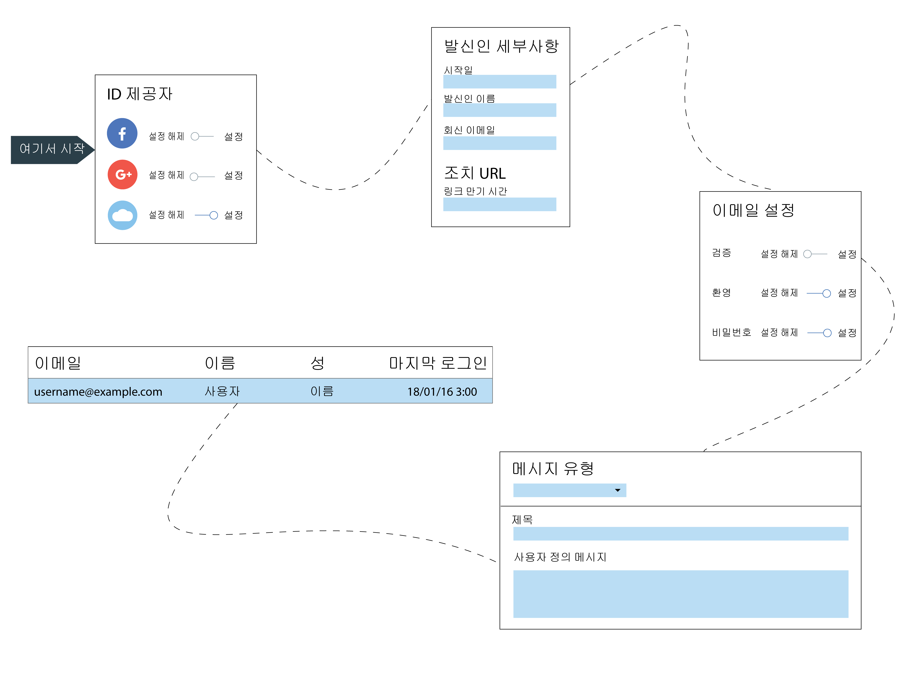

---

copyright:
  years: 2017, 2018
lastupdated: "2018-12-19"

---

{:new_window: target="_blank"}
{:shortdesc: .shortdesc}
{:screen: .screen}
{:codeblock: .codeblock}
{:pre: .pre}
{:tip: .tip}

# 클라우드 디렉토리
{: #cd}

{{site.data.keyword.appid_full}}를 사용하는 경우 사용자는 이메일 또는 사용자 이름 및 비밀번호를 통해 모바일 및 웹 앱에 등록하고 사인인할 수 있습니다. 클라우드 디렉토리는 클라우드에서 유지보수되는 사용자 레지스트리입니다. 사용자가 앱에 등록할 때 해당 사용자가 사용자의 디렉토리에 추가됩니다. 이 기능을 사용하여 사용자는 앱 내에서 자신의 계정을 자유롭게 관리할 수 있습니다.
{: shortdesc}

</br>

## 디렉토리 설정 관리
{: #cd-settings}

앱에 대한 알림 및 사용자 제어의 레벨을 관리할 수 있습니다. 다음 이미지에 표시된 것처럼 신속하게 클라우드 디렉토리 설정을 수행할 수 있습니다. 이러한 설정은 서비스 대시보드에서 언제든 업데이트할 수 있습니다.
{: shortdesc}



그림. 클라우드 디렉토리 구성 과정

1. {{site.data.keyword.appid_short_notm}} 대시보드의 **관리** 탭에서 클라우드 디렉토리가 **켜기**로 설정되어 있는지 확인하십시오.

2. 일반 설정을 구성하십시오.
  1. 사용자 이름을 작성할 것인지 또는 사용자가 사인인할 때 이메일을 사용할 것인지 여부를 결정하십시오. 양쪽 옵션 모두 비밀번호가 필요합니다. 사용자가 디렉토리에 추가된 후에는 더 이상 옵션 사이에서 전환할 수 없습니다.
  2. 비밀번호 기준 행에서 **편집**을 클릭하여 적용할 요구사항을 지정하십시오. 비밀번호 기준은 정규식으로 제공됩니다. 보안 등급을 판별하거나 일반적인 예제를 확인하려면 [비밀번호 보안 등급 관리](#strength)를 참조하십시오. **저장**을 클릭하여 요구사항을 적용하십시오.
  3. **사용자가 앱에 등록할 수 있도록 허용**을 **예**로 설정하십시오. **아니오**로 설정된 경우에도 여전히 콘솔을 통해 사용자를 추가할 수 있습니다. 하지만 개발 용도인 경우에만 콘솔을 통해 사용자를 추가해야 합니다.
  4. 사용자가 비밀번호를 재설정하거나, 비밀번호를 변경하거나, 해당 세부사항을 재설정할 수 있도록 하려면 **사용자가 앱에서 계정을 관리할 수 있도록 허용**을 **예**로 설정하십시오. 사용자의 셀프 서비스를 제한하려면 이 값을 **아니오**로 설정하십시오.
  5. **발신인 세부사항** 행에서 **편집**을 클릭하여 이메일 설정을 업데이트하십시오. 이메일 설정은 {{site.data.keyword.appid_short_notm}}를 통해 발송되는 모든 통신에 적용됩니다. 이메일을 발송해야 하는 이메일 주소 및 해당 이름을 지정하고 사용자가 응답을 발송할 별도의 이메일을 남겨 두십시오.
  6. 비밀번호에 대한 제한사항 및 시간 요구사항을 작성하려면 **고급 비밀번호 정책**을 사용으로 설정하십시오. 이 기능을 사용하려면 추가적인 청구가 필요합니다. 옵션에 대한 자세한 정보는 [고급 비밀번호 정책](#advanced-password)을 참조하십시오.
  6. **저장**을 클릭하십시오.

3. 검증 이메일 설정을 구성하십시오.
  1. 사용자가 해당 이메일 주소를 확인하도록 하려면 **이메일 검증**을 **켜기**로 설정하십시오. 사용자가 애플리케이션에 등록하면 해당 앱에 등록했는지 확인을 요청하는 이메일을 수신하게 됩니다.
  2. 사용자가 해당 이메일을 확인하도록 결정한 경우 다음 의사결정은 사용자가 이메일 주소를 확인하기 전에 애플리케이션에 진입하도록 허용할 것인지 여부입니다. 환경 설정에 따라 **사용자가 먼저 해당 이메일 주소를 확인하지 않고 앱에 사인인할 수 있도록 허용**을 **예** 또는 **아니오**로 설정하십시오.
  3. 컨텐츠를 사용자 정의하고 메시지의 모양을 디자인하십시오. 메시지를 위한 템플리트가 존재하지만 고유한 메시지로 텍스트를 업데이트할 수 있습니다. 영어 이외의 [언어](/docs/services/appid/cloud-directory.html#languages)를 사용할 수 있지만 텍스트의 번역에 대한 책임은 사용자에게 있습니다. 다른 언어를 선택하려면 <a href="https://appid-management.ng.bluemix.net/swagger-ui/#!/Config/updateLocalization" target="_blank">언어 관리 API </a>를 사용하십시오.
  4. 확인 URL에 분 단위로 지정되는 만기 시간 제한을 제공하십시오. 여기에서 이 시간을 설정하면 비밀번호 재설정 링크가 유효한 기간에도 영향을 미칩니다.
  5. 사용자가 링크를 클릭할 때 표시되도록 하려는 특정 페이지가 있는 경우 고유한 검증 페이지 URL을 입력하십시오. **사용자 정의 검증 페이지 URL** 필드를 공백으로 두는 경우 {{site.data.keyword.appid_short_notm}}에서 기본 검증 페이지가 제공됩니다.
  6. **저장**을 클릭하십시오.

4. 환영 이메일 설정을 구성하십시오.
  1. 사용자가 앱에 등록할 때 이메일을 통해 환영하려면 **환영 이메일**을 **켜기**로 설정하십시오.
  2. 컨텐츠를 사용자 정의하고 메시지의 모양을 디자인하십시오. 사용 가능한 예제 메시지가 존재하지만 고유한 메시지로 텍스트를 업데이트할 수 있습니다. 영어 이외의 [언어](#languages)를 사용할 수 있지만 텍스트의 번역에 대한 책임은 사용자에게 있습니다. 다른 언어를 선택하려면 <a href="https://appid-management.ng.bluemix.net/swagger-ui/#!/Config/updateLocalization" target="_blank">언어 관리 API </a>를 사용하십시오.
  3. **저장**을 클릭하십시오.

5. 비밀번호 재설정 설정을 구성하십시오.
  1. 사용자가 비밀번호 재설정을 요청할 수 있도록 허용하려면 **비밀번호 찾기 이메일**을 **켜기**로 설정하십시오. **참고**: 사용자는 비밀번호를 재설정하기 전에 해당 이메일을 유효성 검증해야 합니다. 즉, 비밀번호 재설정을 허용하려면 이메일 검증이 필요합니다.
  2. 컨텐츠를 사용자 정의하고 메시지의 모양을 디자인하십시오. 사용 가능한 예제 메시지가 존재하지만 고유한 메시지로 텍스트를 업데이트할 수 있습니다. 영어 이외의 [언어](#languages)를 사용할 수 있지만 텍스트의 번역에 대한 책임은 사용자에게 있습니다. 다른 언어를 선택하려면 <a href="https://appid-management.ng.bluemix.net/swagger-ui/#!/Config/updateLocalization" target="_blank">언어 관리 API </a>를 사용하십시오.
  3. 비밀번호 재설정 URL에 분 단위로 지정되는 만기 시간 제한을 제공하십시오. 여기에서 이 시간을 설정하면 이메일 검증 링크가 유효한 기간에도 영향을 미칩니다.
  4. 사용자가 링크를 클릭할 때 표시되도록 하려는 특정 페이지가 있는 경우 고유한 비밀번호 재설정 URL을 입력하십시오. **비밀번호 재설정 페이지 URL** 필드를 공백으로 두는 경우 {{site.data.keyword.appid_short_notm}}에서 기본 비밀번호 재설정 페이지가 제공됩니다.
  5. **저장**을 클릭하십시오.

6. 비밀번호 변경 설정을 구성하십시오.
  1. 사용자에게 비밀번호 변경사항에 대해 통지하려면 **비밀번호 변경 이메일**을 **켜기**로 설정하십시오.
  2. 컨텐츠를 사용자 정의하고 메시지의 모양을 디자인하십시오. 사용 가능한 예제 메시지가 존재하지만 고유한 메시지로 텍스트를 업데이트할 수 있습니다. 영어 이외의 [언어](#languages)를 사용할 수 있지만 텍스트의 번역에 대한 책임은 사용자에게 있습니다. 다른 언어를 선택하려면 <a href="https://appid-management.ng.bluemix.net/swagger-ui/#!/Config/updateLocalization" target="_blank">언어 관리 API </a>를 사용하십시오.
  3. **저장**을 클릭하십시오.

7. 다단계 인증을 구성하십시오.
  1. 사용자가 사인인할 때 다단계 인증을 요구하려면 **이메일 다단계 인증 사용**을 **켜기**로 설정하십시오.
  2. 아래의 템플리트를 사용하여 이메일의 컨텐츠와 디자인을 사용자 정의하십시오. 영어 이외의 [언어](#languages)를 사용할 수 있지만 텍스트의 번역에 대한 책임은 사용자에게 있습니다. 다른 언어를 선택하려면 <a href="https://appid-management.ng.bluemix.net/swagger-ui/#!/Config/updateLocalization" target="_blank">언어 관리 API </a>를 사용하십시오.
  3. **저장**을 클릭하십시오.

8. **사용자** 탭에서 앱에 등록한 사용자를 확인할 수 있습니다. 참고: 단일 사용자가 60초 내에 최대 5번의 사인인을 시도할 수 있습니다. 여섯 번째 시도하면 오류가 표시됩니다.

</br>
</br>

## 메시지 유형
{: #types}

다양한 유형의 메시지를 사용자에게 발송할 수 있습니다. 서비스에서 제공되는 예제 메시지를 발송하도록 선택하거나 더 개인적인 앱 경험을 위해 컨텐츠를 사용자 정의할 수 있습니다. {{site.data.keyword.appid_short_notm}}는 <a href="https://www.sendgrid.com" target="_blank">SendGrid </a>를 메일 전달 서비스로 사용합니다. 모든 이메일은 단일 SendGrid 계정으로 발송됩니다.
{: shortdesc}

사용자가 해당 매개변수를 통해 가져오는 정보를 제공하지 않을 경우 공백으로 표시됩니다.
{: tip}

<dl>
  <dt>환영</dt>
    <dd><p>사용자가 등록을 마치면 애플리케이션을 이용하는 사용자를 이메일을 통해 환영할 수 있습니다. 사용자를 환영하거나 보류하려면 최대한 메시지를 관련시키십시오.</p>
    <table>
      <thead>
        <th colspan=2> 모든 메시지 매개변수 </th>
      </thead>
      <tbody>
        <tr>
          <td><code>%{display.logo}</code></td>
          <td> 로그인 위젯에 대해 구성한 이미지를 표시합니다. </td>
        </tr>
        <tr>
          <td><code>%{user.displayName}</code></td>
          <td> 사용자가 앱과 상호작용할 때 사용하도록 선택한 화면 이름을 표시합니다. </td>
        </tr>
        <tr>
          <td><code>%{user.email}</code></td>
          <td> 사용자의 등록된 이메일 주소를 표시합니다. </td>
        </tr>
        <tr>
          <td><code>%{user.username}</code></td>
          <td> 인증 방법이 사용자 이름 및 비밀번호로 설정된 경우 사용자의 지정된 사용자 이름을 표시합니다. </td>
        </tr>
        <tr>
          <td><code>%{user.firstName}</code></td>
          <td> 사용자의 지정된 이름을 표시합니다. </td>
        </tr>
        <tr>
          <td><code>%{user.formattedName}</code></td>
          <td> 사용자의 전체 이름을 표시합니다. </td>
        </tr>
        <tr>
          <td><code>%{user.lastName}</code></td>
          <td> 사용자의 지정된 성을 표시합니다. </td>
        </tr>
      </tbody>
    </table></dd>
  <dt>비밀번호 찾기</dt>
    <dd><p>비밀번호를 잊었거나 어떤 이유로든 이의 업데이트가 필요한 경우, 사용자는 비밀번호 재설정을 요청할 수 있습니다. 요청에 대한 이메일 응답을 사용자 정의할 수 있습니다. 사용자가 변경을 요청한 경우 이메일의 링크를 클릭할 때까지 비밀번호는 변경되지 않습니다.</p>
    <table>
      <tr>
        <th colspan=2> 비밀번호 찾기 매개변수 </th>
      </tr>
      <tr>
        <td><code>%{linkExpiration.hours}</code></td>
        <td> 링크가 유효한 기간(시)을 표시합니다.</td>
      </tr>
      <tr>
        <td><code>%{linkExpiration.minutes}</code></td>
        <td>링크가 유효한 기간(분)을 표시합니다.</td>
      </tr>
      <tr>
        <td><code>%{resetPassword.code}</code></td>
        <td> URL의 일부로 일회성 패스코드를 표시합니다. 이는 각 개인이 서로 다른 코드를 보유함을 의미합니다. 예: <code>https://appid.cloud.ibm.com/wfm/verify/6574839563478</code> </td>
      </tr>
      <tr>
        <td><code>%{resetPassword.link}</code></td>
        <td> 비밀번호를 재설정하기 위해 사용자가 클릭하는 링크를 표시합니다. </td>
      </tr>
     </tbody>
  </table></dd>
  <dt>검증</dt>
    <dd><p>사용자가 이메일을 통해 검증하도록 요청할 수 있습니다. 검증을 요청하여 앱에 등록할 수 있는 허위 계정의 수를 제한할 수 있습니다. 사용자가 이메일을 검증할 때까지 앱에 대한 액세스를 제한하거나 프로파일을 작성하는 사용자를 관리하는 방법으로 이를 사용할 수 있습니다. {{site.data.keyword.appid_short_notm}} 대시보드 또는 사용자 작성 API를 통해 수동으로 추가된 사용자의 경우 이 이메일을 자동으로 수신하지 않습니다.</p>
    <table>
      <thead>
        <th colspan=2> 메시지 매개변수 검증 </th>
      </thead>
      <tbody>
        <tr>
          <td><code>%{linkExpiration.hours}</code></td>
          <td> 링크가 유효한 기간(시)을 표시합니다. </td>
        </tr>
        <tr>
          <td><code>%{linkExpiration.minutes}</code></td>
          <td> 링크가 유효한 기간(분)을 표시합니다. </td>
        </tr>
        <tr>
          <td><code>%{verify.code}</code></td>
          <td> 일회성 확인 URL을 표시합니다. </td>
        </tr>
        <tr>
          <td><code>%{verify.link}</code></td>
          <td> 설정에 지정한 조치 URL을 표시합니다. </td>
        </tr>
      </tbody>
    </table></dd>
  <dt>비밀번호 변경</dt>
    <dd><p>비밀번호가 업데이트될 때 사용자에게 알릴 수 있습니다. 이는 사용자가 비밀번호 변경을 요청하지 않은 경우에 유용합니다. 사용자는 적절한 단계를 수행하여 계정을 재차 보호할 수 있습니다.</p>
    <table>
      <thead>
        <th colspan=2> 비밀번호 변경 매개변수</th>
      </thead>
      <tbody>
        <tr>
          <td><code>%{passwordChangeInfo.time}</code></td>
          <td> 새 비밀번호가 적용된 시간을 표시합니다. </td>
        </tr>
        <tr>
          <td><code>%{passwordChangeInfo.ipAddress}</code></td>
          <td> 비밀번호 변경이 요청된 IP 주소를 표시합니다. </td>
        </tr>
      </tbody>
    </table></dd>
    </dd>
    <dt>MFA 검증 코드</dt>
      <dd><p>다단계 인증이 사용으로 설정된 경우 사용자는 보조 인증 방법으로 인증 확인 코드를 수신합니다.</p>
      <table>
        <thead>
          <th colspan=2> 모든 메시지 매개변수 </th>
        </thead>
        <tbody>
          <tr>
            <td><code>%{mfa.code}</code></td>
            <td> 일회성 MFA 검증 코드를 표시합니다. </td>
          </tr>
        </tbody>
      </table></dd></dl>

</br>
</br>

## 비밀번호 보안 등급 관리
{: #strength}

클라우드 디렉토리에 사용할 수 있는 비밀번호에 대한 요구사항을 설정할 수 있습니다.
{: shortdesc}

보안 등급이 높은 비밀번호를 사용하는 경우 다른 사용자가 수동 또는 자동화된 방법으로 비밀번호를 추측하기 어렵거나 거의 불가능하게 만들 수 있습니다. 비밀번호 보안 등급은 정규식 문자열로 설정됩니다.

몇 가지 공통 비밀번호 보안 등급 예는 다음과 같습니다.

- 8자 이상이어야 합니다. 정규식 예: `^.{8,}$`
- 하나의 숫자, 하나의 소문자 및 하나의 대문자를 포함시켜야 합니다. 정규식 예제: `^(?:(?=.*\d)(?=.*[a-z])(?=.*[A-Z]).*)$`
- 영문자 및 숫자만 포함해야 합니다. 정규식 예: `^[A-Za-z0-9]*$`
- 1자 이상의 고유 문자여야 합니다. 정규식 예: `^(\w)\w*?(?!\1)\w+$`

비밀번호 보안 등급은 App ID 콘솔의 클라우드 디렉토리 설정 페이지에서 설정하거나 <a href="https://appid-management.ng.bluemix.net/swagger-ui/#!/Config/set_cloud_directory_password_regex" target="_blank">관리 API </a>를 사용하여 설정할 수 있습니다.

</br>


## 고급 비밀번호 정책
{: #advanced-password}


추가적인 비밀번호 제한조건을 적용하여 애플리케이션의 보안을 강화할 수 있습니다.
{: shortdesc}


고급 비밀번호 정책은 각각 별도로 전환할 수 있는 5가지 기능으로 구성되어 있습니다.

 - 잘못된 인증 정보가 반복된 후 잠금
 - 비밀번호 재사용 방지
 - 비밀번호 만기
 - 비밀번호 변경 사이의 최소 기간
 - 비밀번호에 사용자 이름을 포함시킬 수 없도록 함


 이 기능을 사용으로 설정하는 경우 고급 보안 기능에 대한 추가적인 청구가 활성화됩니다. 자세한 정보는 [가격 계산기](faq.html#pricing)를 참조하십시오.

</br>

### 비밀번호 재사용 방지
{: #avoid-reuse}

사용자가 비밀번호를 변경할 때 최근에 사용된 비밀번호를 선택하지 못하도록 차단할 수 있습니다.
{: shortdesc}

GUI 또는 API를 사용하여 이전에 사용된 비밀번호를 반복하기 전에 사용자에게 필요한 비밀번호의 수를 선택할 수 있습니다. 1 - 10 사이의 모든 값을 선택할 수 있습니다.

이 옵션이 켜진 상태에서 사용자 중 한 명이 비밀번호를 최근에 사용된 비밀번호로 설정하려고 시도하는 경우 기본 사인인 위젯 UI에 오류가 표시되고 다른 비밀번호를 입력하도록 요청하는 프롬프트가 표시됩니다.

이전 비밀번호는 사용자의 현재 비밀번호가 저장되는 것과 동일한 방식으로 안전하게 저장됩니다.

</br>

### 잘못된 인증 정보가 반복된 후 잠금
{: #lockout}

의심스러운 동작(예: 올바르지 않은 비밀번호를 사용한 사인인이 연속적으로 여러 번 시도됨)이 발견되는 경우 임시로 사인인 기능을 차단하여 사용자의 계정을 보호할 수 있습니다. 이 방법은 악의적인 단체에서 사용자의 비밀번호를 추측하여 사용자의 계정에 대한 액세스 권한을 획득하지 못하게 차단할 수 있도록 해줍니다.
{: shortdesc}

GUI 또는 API를 사용하여 해당 계정이 임시로 잠기기 전에 사용자가 시도할 수 있는 실패한 사인인의 최대 횟수를 설정할 수 있습니다. 계정이 잠기는 기간도 설정할 수 있습니다. 다음과 같은 옵션이 제공됩니다.

* 시도 횟수: 1 - 10 사이의 모든 값
* 잠금 기간: 1분 - 24시간 사이의 모든 값(분)

계정이 잠기는 경우 사용자는 지정된 잠금 기간이 경과할 때까지 사인인하거나 비밀번호를 변경하는 등의 다른 셀프 서비스 오퍼레이션을 수행할 수 없습니다. 잠금 기간이 종료되면 사용자가 자동으로 잠금 해제됩니다.

잠금 기간이 끝나기 전에 사용자를 잠금 해제할 수 있습니다. 해당 사용자가 잠금 상태인지 확인하려면 `active` 필드가 `false`로 설정되어 있는지 확인하십시오. 서비스 대시보드의 **사용자** 탭에서 해당 상태가 `disabled`로 설정되어 있는지 확인할 수도 있습니다. 사용자를 잠금 해제하려면 [API](https://appid-management.ng.bluemix.net/swagger-ui/#!/Cloud_Directory_Users/updateCloudDirectoryUser)를 사용하여 `active` 필드를 `true`로 설정해야 합니다.

</br>

### 비밀번호 변경 사이의 최소 기간
{: #minimum-time}

사용자가 비밀번호 변경 사이에 대기해야 하는 최소 기간을 설정하여 사용자가 신속하게 비밀번호 사이에서 전환하지 못하도록 차단할 수 있습니다.
{: shortdesc}

이 기능은 "비밀번호 재사용 방지" 정책과 함께 사용하는 경우에 특히 유용합니다. 이 제한사항이 없을 경우 사용자는 단순히 신속하게 연속적으로 여러 번 비밀번호를 변경하여 최근 비밀번호 재사용에 대한 제한사항을 회피할 수 있습니다. 1시간 - 30일 사이의 값(시간)을 선택할 수 있습니다.

</br>

### 비밀번호 만기
{: #expiration}

보안 상의 이유로 사용자가 일정 기간이 지나면 비밀번호를 변경해야 하도록 비밀번호 순환 정책을 적용할 수 있습니다.
{: shortdesc}

GUI 또는 API를 사용하여 사용자의 비밀번호가 유효한 상태로 유지되는 기간을 설정할 수 있습니다. 사용자의 비밀번호가 만료되면 다음 번에 사인인할 때 비밀번호를 재설정하도록 강제됩니다. 1 - 90 사이의 전체 일 수를 선택할 수 있습니다.

이 서비스에서는 로그인 위젯을 통해 즉시 사용할 수 있는 기본 GUI 및 경험을 제공합니다. 사인인이 완료되기 전에 사용자에게 새 비밀번호를 제공하도록 지시합니다.

사용자 정의 사인인 경험을 사용하는 경우 사용자가 만료된 비밀번호를 사용하여 사인인하려고 시도하면 오류가 트리거됩니다. 애플리케이션에서 필요한 사용자 경험을 제공하도록 구성하는 것은 사용자의 책임입니다. 비밀번호 변경 API를 호출하여 새 비밀번호를 설정할 수 있습니다.

토큰 엔드포인트 응답은 다음과 유사합니다.

```javascript
{
  "error" : "invalid_grant",
  "error_description" : "Password expired",
  "user_id" : "356e065e-49da-45f6-afa3-091a7b464f51"
}
```
{: screen}

이 옵션이 먼저 켜기로 설정된 경우 기존 사용자 비밀번호에 만기 날짜가 없습니다. 만기 기간은 비밀번호가 변경되는 시점에 해당 사용자의 비밀번호에 대해 시작됩니다. 이 기능을 켜기로 설정한 후 사용자에게 비밀번호를 업데이트하도록 독려할 수 있습니다.
{: note}

</br>

### 비밀번호에 사용자 이름을 포함시킬 수 없도록 함
{: #no-username}

비밀번호를 더 강화하기 위해 사용자가 해당 사용자 이름 또는 해당 이메일 주소의 첫 번째 파트를 포함시키지 못하도록 차단할 수 있습니다.
{: shortdesc}

이 제한조건은 대소문자를 구분하지 않으며, 이는 사용자가 개인 정보를 사용하기 위해 일부 문자 또는 전체 문자의 대소문자를 변경할 수 없음을 의미합니다. 이 옵션을 구성하려면 스위치를 **켜기**로 전환하십시오.

</br>

## 사용자 정의 이메일 발신인 사용
{: #custom-email}

{{site.data.keyword.appid_short_notm}}를 사용하는 경우 사용자 정의 확장점을 정의하여 클라우드 디렉토리 이메일 메시지를 발송할 수 있습니다. 확장점을 정의하여 이메일이 발송되는 방법을 완전히 제어하고 고유한 도메인 이름을 사용할 수 있습니다.
 {: shortdesc}

**사용자 정의 이메일 발신인을 사용하는 이유가 무엇입니까?**

기본적으로 {{site.data.keyword.appid_short_notm}}는 SendGrid를 사용하여 사용자 대신 메시지를 전달합니다. 고유한 사용자 정의 이메일 발신인을 구성하여 앱 사용자에 대한 브랜드 경험을 추가적으로 향상시킬 수 있습니다.

몇 가지 추가적인 특정 예제:
- **개인화된 도메인**
사용자 정의 이메일 디스패처를 사용하여 이메일 메시지가 발송되는 방법을 완전히 제어할 수 있습니다. 여기에는 이메일이 스팸으로 필터링될 확률을 추가적으로 감소시켜 줄 수 있는 이메일 도메인의 사용자 정의가 포함되어 있습니다.
- **인사이트 및 문제점 해결**
이메일 제공자로부터 이메일을 연 사용자 수 또는 전달되지 않은 메시지 등의 인사이트를 얻을 수 있습니다. 개별 메시지를 추적하고 전체적인 통계를 확인할 수 있기 때문에 이 인사이트를 통해 문제를 해결할 수 있습니다.

</br>

**작동 방식**

확장점이 구성되면 이메일 메시지를 발송해야 할 때마다 {{site.data.keyword.appid_short_notm}}에서 해당 확장점을 호출합니다. 확장점에는 이메일 본문의 최종 컨텐츠를 포함하여 메시지에 대한 모든 정보가 포함되어 있습니다.

</br>

**사용자 정의 이메일 발신인을 작성하려면 다음 작업을 수행하십시오.**

1. 사용자 정의 디스패처를 사용하도록 {{site.data.keyword.appid_short_notm}} 인스턴스를 구성하려면 <a href="https://appid-management.ng.bluemix.net/swagger-ui/#!/Config/set_cloud_directory_email_dispatcher" target="_blank">관리 API</a>를 사용하십시오.</br>
URL을 제공해야 합니다. 추가적으로 권한 정보를 제공할 수 있습니다. 지원되는 권한 유형은 `기본 권한` 또는 `상수 권한 헤더 값`입니다.

  올바른 구성 예제는 다음과 같습니다.
  ```
  {
    "custom": {
      "url": "https://example.com/send_mail"
    }
  }
  ```
  {: screen}

  ```
  {
    "custom": {
      "url": "https://example.com/send_mail",
      "authorization": {
        "type": "basic",
        "username": "username",
        "password": "password"
      }
    }
  }
  ```
  {: screen}

  ```
  {
    "custom": {
      "url": "https://example.com/send_mail",
      "authorization": {
        "type": "value",
        "value": "myApiKey"
      }
    }
  }
  ```
  {: screen}

2. 요청을 게시하기 위해 청취할 수 있는 확장점을 구성하십시오. 이 엔드포인트에서는 {{site.data.keyword.appid_short_notm}}로부터 수신되는 페이로드를 읽어들이고 사용자 정의 이메일 발신인을 사용하여 이메일을 발송할 수 있어야 합니다.

3. {{site.data.keyword.appid_short_notm}}에서 발송되는 본문의 형식은 `{"jws": "jws-format-string"}`입니다. </br> 페이로드를 디코딩 및 확인한 후에는 해당 컨텐츠가 JSON 문자열이 됩니다.</br>
  ```
    {
      "tenant": "tenant-id",
      "iss" : "appid-oauth.ng.bluemix.net",
      "iat": 1539173126,
      "jti": "uniq-id",
      "message": {
          "to": "your@mail.com",
          "from": {
              "name": "My Awesome Service",
              "address": "no-reply@company.com"
          },
          "replyTo": {
              "name": "My Awesome Service",
              "address": "yes-reply@company.com"
          },
          "subject": "Welcome to My Awesome Service",
          "body": "<p>Hello<p><br/><p>Thanks for signing up John Doe</p>"
      }
    }
  ```
  {: screen}

  - tenant: App ID 인스턴스 tenantId
  - iat: 메시지가 발송된 시간소인
  - iss: JWS가 실행된 프린시펄 식별
  - jti: 고유 트랜잭션 ID
  - message: 발송할 메시지, 다음과 같은 필드로 구성되어 있음
    - to: 수신인 이메일 주소
    - from: 발신인 정보, 다음과 같은 필드로 구성되어 있음
      - name: 선택사항, 발신인 이름
      - address: 발신인 주소
    - reply to: 선택사항, 다음과 같은 필드로 구성되어 있음
      - name: 선택사항, 발신인 이름
      - address: 선택사항, 발신인 주소
    - subject: 이메일 제목
    - body: 이메일 본문, HTML 형식

  응답 상태 코드를 검사하여 요청이 정상적으로 완료되었는지 확인할 수 있습니다. 200 - 299 범위의 값은 성공으로 간주됩니다. 다른 응답을 수신하는 경우 다시 요청을 시도하십시오.
  {: tip}

4. {{site.data.keyword.appid_short_notm}}에서 발송되는 모든 HTTP 페이로드는 비대칭 키 쌍을 사용하여 JWS 표준에 따라 자동으로 서명됩니다.
모든 {{site.data.keyword.appid_short_notm}} 인스턴스에 대해 다른 인스턴스에서 공유되지 않는 개인 및 공개 키가 생성됩니다. 개인 키는 HTTP 페이로드에 서명하기 위해 사용되며, 공개 키를 사용하여 해당 페이로드가 {{site.data.keyword.appid_short_notm}}에서 생성되고 서드파티에 의해 변경되지 않았는지 확인할 수 있습니다(<a href="https://us-south.appid.cloud.ibm.com/swagger-ui/#!/Authorization_Server_V3/publicKeys" target="_blank">공개 키 엔드포인트</a>).

5. 확장점 예제 코드(JavaScript)
  ```
  const sgMail = require('@sendgrid/mail');
  const {promisify} = require('bluebird');
  const request = promisify(require('request'));
  const jwtVerify = promisify(require('jsonwebtoken').verify);
  const jwtDecode = require('jsonwebtoken').decode;
  const jwkToPem = require('jwk-to-pem');

  async function obtainPublicKeys() {
  	// Your App ID instance tenant ID
  	const tenantId = '<TENANT-ID>';

  	// Send request to App ID's public keys endpoint
  	const keysOptions = {
  		method: 'GET',
  		url: `https://appid-oauth.<REGION>.bluemix.net/oauth/v3/${tenantId}/publickeys`
  	};
  	const keysResponse = await request(keysOptions);
  	return JSON.parse(keysResponse.body).keys;
  }

  async function verifySignature(keysArray, kid, jws) {
  	const keyJson = keysArray.find(key => key.kid === kid);
  	if (keyJson) {
  		const pem = jwkToPem(keyJson);
  		await jwtVerify(jws, pem);
  		return;
  	}
  	throw new Error ("Unable to verify signature");
  }

  async function verifyAndSendMail(jws) {
  	// The API key for Sendgrid
  	const sgApiKey = '<SENDGRID-API-KEY>';

  	// Init Sendgrind
  	sgMail.setApiKey(sgApiKey);

  	// Decode message to get information
  	const data = jwtDecode(jws, {complete: true});

  	// Extract kid from header
  	const kid = data.header.kid;

  	const keysArray = await obtainPublicKeys();

  	// Verify the signature of the payload with the public keys
  	await verifySignature(keysArray, kid ,jws);

  	// Send the email with Your Sendgrid account
  	const message = data.payload.message;
  	const msg = {
  		to: message.to,
  		from: message.from.address,
  		subject: message.subject,
  		html: message.body,
  	};
  	console.log(`Sending email to ${message.to}`);
  	let sendgridResponse = await sgMail.send(msg);

  	return {result : 'email_sent',sendgridResponse};
  }
  ```
  {: codeblock}

6. 이메일 디스패처를 테스트하여 구성이 올바르게 설정되었는지 확인하십시오. <a href="https://appid-management.ng.bluemix.net/swagger-ui/#!/Config/post_email_dispatcher_test" target="_blank">테스트 API</a>를 사용하여 구성된 사용자 정의 이메일 발신인에 대한 요청을 트리거하십시오.

완전하게 작동하는 예제는 <a href="https://www.ibm.com/blogs/bluemix/2018/10/use-ibm-cloud-app-id-and-your-email-provider-to-brand-mails-sent-to-app-users/" target="_blank">{{site.data.keyword.appid_full}}를 통해 발송되는 메일에 대해 고유한 제공자 사용</a>을 참조하십시오.

</br>
</br>


## 사용자 마이그레이션
{: #user-migration}

{{site.data.keyword.appid_short_notm}}의 새 인스턴스를 설정해야 하는 경우도 있습니다. 클라우드 디렉토리를 사용하는 경우 이 설정은 사용자를 새 인스턴스로 마이그레이션해야 함을 의미합니다. 관리 API를 사용하여 마이그레이션을 지원할 수 있습니다.
{: shortdesc}

### 시작하기 전에

{{site.data.keyword.appid_short_notm}}의 양쪽 인스턴스 모두에 대해 `관리자` [IAM 역할](/docs/iam/quickstart.html)이 지정되어 있어야 합니다.

</br>

**내보내기**

새 인스턴스에 사용자를 추가하려면 먼저 현재 인스턴스에서 해당 사용자를 내보내야 합니다. 이 작업을 위해 <a href="https://appid-management.ng.bluemix.net/swagger-ui/#!/Cloud_Directory_Users/cloudDirectoryExport" target="_blank">내보내기 관리 API </a>를 사용할 수 있습니다.

cURL 명령 예제:

```
curl -X GET --header ‘Accept: application/json’ --header ‘Authorization: Bearer <iam-token>’ ’https://eu-gb.appid.cloud.ibm.com/management/v4/111c9bj3-xxxx-4b5b-zzzz-24ad9440k8j9/cloud_directory/export?encryption_secret=myCoolSecret'
```
{: codeblock}

<table>
  <tr>
    <th>변수</th>
    <th>설명</th>
  </tr>
  <tr>
    <td><code>encryption_secret</code></td>
    <td>사용자 해시 비밀번호를 암호화 및 복호화하기 위해 사용되는 사용자 정의 문자열입니다.</td>
  </tr>
  <tr>
    <td><code> tenantID </code></td>
    <td>서비스 인증 정보에서 찾을 수 있는 서비스 테넌트 ID입니다. App ID 대시보드에서 서비스 인증 정보를 찾을 수 있습니다.</td>
  </tr>
</table>

클라우드 디렉토리 사용자 및 해당 프로파일만 리턴됩니다. 다른 ID 제공자의 사용자는 리턴되지 않습니다.
{: note}

</br>

**가져오기**

사용자가 이동할 준비가 되었기 때문에 해당 정보를 새 인스턴스로 가져올 수 있습니다. 이 작업을 위해 <a href="https://appid-management.ng.bluemix.net/swagger-ui/#!/Cloud_Directory_Users/cloudDirectoryImport" target="_blank">가져오기 관리 API </a>를 사용할 수 있습니다.

cURL 명령 예제:

```
curl -X POST --header ‘Content-Type: application/json’ --header ‘Accept: application/json’ --header ‘Authorization: Bearer <iam-token>’ -d ‘{“users”: [
    {
      “scimUser”: {
        “originalId”: “3f3f6779-7978-4383-926f-a43aef3b724b”,
        “name”: {
          “givenName”: “<first-name>”,
          “familyName”: “<last-name>”,
          “formatted”: “<first-name> <last-name>”
        },
        “displayName”: “<first-name>”,
        “emails”: [
          {
            “value”: “<user>@gmail.com”,
            “primary”: true
          }
        ],
        “status”: “PENDING”
      },
      “passwordHash”: “<password hash here>“,
      “passwordHashAlg”: “<password hash algorithm>",
      “profile”: {
        “attributes”: {}
      }
    }
]}’ ‘https://eu-gb.appid.cloud.ibm.com/management/v4/111c9bj3-xxxx-4b5b-zzzz-24ad9440k8j9/cloud_directory/import?encryption_secret=myCoolSecret’
```
{: codeblock}

</br>

### 마이그레이션 스크립트 사용

{{site.data.keyword.appid_short_notm}}에서는 CLI를 통해 사용할 수 있으며 마이그레이션 프로세스를 가속화하는 마이그레이션 스크립트를 제공합니다.

시작하기 전에 다음과 같은 매개변수 정보가 있는지 확인하십시오.

<table>
  <tr>
    <th>매개변수</th>
    <th>설명</th>
  </tr>
  <tr>
    <td><code>sourceTenantId</code></td>
    <td>사용자를 내보내려는 {{site.data.keyword.appid_short_notm}} 인스턴스의 테넌트 ID입니다.</td>
  </tr>
  <tr>
    <td><code>destinationTenantId</code></td>
    <td>사용자를 가져오려는 {{site.data.keyword.appid_short_notm}} 인스턴스의 테넌트 ID입니다.</td>
  </tr>
  <tr>
    <td>Region</td>
    <td>현재 옵션에는 미국 남부: <code>ng</code>, 런던: <code>eu-gb</code>, 시드니: <code>au-syd</code>, 워싱턴: <code>us-east</code> 및 독일: <code>eu-de</code> 등이 있습니다.</td>
  </tr>
  <tr>
    <td>IAM token</td>
    <td>토큰을 얻으려면 먼저 <code>관리자</code> 권한이 있는지 확인하십시오. IAM 토큰을 얻는 방법에 대한 도움말은 <a href="https://console.bluemix.net/docs/iam/apikey_iamtoken.html#iamtoken_from_apikey" target="_blank">이 문서 </a>를 참조하십시오.</td>
  </tr>
</table>

스크립트를 실행하려면 다음 작업을 수행하십시오.

1. <a href="https://github.com/ibm-cloud-security/appid-sample-code-snippets/tree/master/export-import-cloud-directory-users" target="_blank">저장소 </a>를 복제하십시오.
2. 터미널을 열고 저장소를 복제한 폴더로 이동하십시오.
3. 다음 명령을 실행하십시오.

  ```
  npm install
  ```
  {: codeblock}

4. 해당 매개변수를 사용하여 다음 명령을 실행하십시오.

  ```
  users_export_import 'sourceTenantId' 'destinationTenantId' 'region' 'iamToken'
  ```
  {: codeblock}

  명령 예제:

  ```
  users_export_import e00a0366-53c5-4fcf-8fef-ab3e66b2ced8 73321c2b-d35a-497a-9845-15c580fdf58c ng eyJraWQiOiIyMDE3MTAyNS0xNjoyNzoxMCIsImFsZyI6IlJTMjU2In0.eyJpYW1faWQiOiJJQk1pZC0zMTAwMDBUNkZTIiwiaWQiOiJJQk1pZC0zMTAwMDBUNkZTIiwicmVhbG1pZCI6IklCTWlkIiwiaWRlbnRpZmllciI6IjMxMDAwMFQ2RlMiLCJnaXZlbl9uYW1lIjoiUm90ZW0iLCJmYW1pbHlfbmFtZSI6IkJyb3NoIiwibmFtZSI6IlJvdGVtIEJyb3NoIiwiZW1haWwiOiJyb3RlbWJyQGlsLmlibS5jb20iLCJzdWIiOiJyb3RlbWJyQGlsLmlibS5jb20iLCJhY2NvdW50Ijp7ImJzcyI6ImQ3OWM5YTk5NjJkYzc2Y2JkMDZlYTVhNzhjMjY0YzE5In0sImlhdCI6MTUzNzE3Mjg4NCwiZXhwIjoxNTM3MTc2NDg0LCJpc3MiOiJodHRwczovL2lhbS5zdGFnZTEuYmx1ZW1peC5uZXQvaWRlbnRpdHkiLCJncmFudF90eXBlIjoidXJuOmlibTpwYXJhbXM6b2F1dGg6Z3JhbnQtdHlwZTpwYXNzY29kZSIsInNjb3BlIjoiaWJtIG9wZW5pZCIsImNsaWVudF9pZCI6ImJ4IiwiYWNyIjoxLCJhbXIiOlsicHdkIl19.c4vLPzhvvNZLjaLy7znDa37qV4o-yuGmSKmJoQKrEQNZU8IC0NIjxwSo7W9kb0pDi3Yf_03_9ufTTGNfjtltzNWycSXjkNgoL-b9_nU61oHdgn0stY1KmNicqyBWfgUU--4xa904QN_QjRHBaUBeJf3XWEphPIMoF7mZeOxEZLnCMcQXSz9pImCMiP4SNT38cHLiI90Yx01rM7hpteepWULh5MYh-B2V03Gkgxfqvv951HF1LDg6eT4Q9in11laTQKtKuomripUju_4GIIjORVYw9NaAVKIJ9lKrPX0SKPhStsa59qGsC_7Uersms5EY1W1VbZVqOZPJbtp6tVf-Lw
  ```
  {: codeblock}

</br>
</br>


## 지원되는 언어
{: #languages}

<a href="https://appid-management.ng.bluemix.net/swagger-ui/#!/Config/updateLocalization" target="_blank">언어 관리 API </a>를 사용하여 사용자 통신이 작성될 수 있는 언어를 설정할 수 있습니다. 그러나 영어만 즉시 사용할 수 있습니다. 사용자는 메시지를 번역할 책임이 있습니다. API를 사용하여 구성을 설정한 후 템플리트 텍스트를 변경할 수 있도록 GUI가 업데이트됩니다.
{: shortdesc}

<table>
  <col width="20%">
  <col width="25%">
  <col width="35%">
  <tr>
    <th>코드</th>
    <th>언어</th>
    <th>지역</th>
  </tr>
  <tr>
    <td><code>af-ZA</code></td>
    <td>아프리칸스어</td>
    <td>남아프리카</td>
  </tr>
  <tr>
    <td><code>sq-AL</code></td>
    <td>알바니아어</td>
    <td>알바니아</td>
  </tr>
  <tr>
    <td><code>am-ET</code></td>
    <td>암하라어</td>
    <td>에티오피아</td>
  </tr>
  <tr>
    <td><code>ar-DZ</code></td>
    <td>아랍어</td>
    <td>알제리</td>
  </tr>
  <tr>
    <td><code>ar-BH</code></td>
    <td>아랍어</td>
    <td>바레인</td>
  </tr>
  <tr>
    <td><code>ar-EG</code></td>
    <td>아랍어</td>
    <td>이집트</td>
  </tr>
  <tr>
    <td><code>ar-IQ</code></td>
    <td>아랍어</td>
    <td>이라크</td>
  </tr>
  <tr>
    <td><code>ar-JO</code></td>
    <td>아랍어</td>
    <td>요르단</td>
  </tr>
  <tr>
    <td><code>ar-KW</code></td>
    <td>아랍어</td>
    <td>쿠웨이트</td>
  </tr>
  <tr>
    <td><code>ar-LB</code></td>
    <td>아랍어</td>
    <td>레바논</td>
  </tr>
  <tr>
    <td><code>ar-LY</code></td>
    <td>아랍어</td>
    <td>리비아</td>
  </tr>
  <tr>
    <td><code>ar-MR</code></td>
    <td>아랍어</td>
    <td>모리타니아</td>
  </tr>
  <tr>
    <td><code>ar-MA</code></td>
    <td>아랍어</td>
    <td>모로코</td>
  </tr>
  <tr>
    <td><code>ar-OM</code></td>
    <td>아랍어</td>
    <td>오만</td>
  </tr>
  <tr>
    <td><code>ar-QA</code></td>
    <td>아랍어</td>
    <td>카타르</td>
  </tr>
  <tr>
    <td><code>ar-SA</code></td>
    <td>아랍어</td>
    <td>사우디아라비아</td>
  </tr>
  <tr>
    <td><code>ar-SY</code></td>
    <td>아랍어</td>
    <td>시리아</td>
  </tr>
  <tr>
    <td><code>ar-YE</code></td>
    <td>아랍어</td>
    <td>튀니지</td>
  </tr>
  <tr>
    <td><code>ar-AE</code></td>
    <td>아랍어</td>
    <td>아랍에미리트</td>
  </tr>
  <tr>
    <td><code>ar-YE</code></td>
    <td>아랍어</td>
    <td>예멘</td>
  </tr>
  <tr>
    <td><code>hy-AM</code></td>
    <td>아르메니아어</td>
    <td>아르메니아</td>
  </tr>
  <tr>
    <td><code>as-IN</code></td>
    <td>아삼어</td>
    <td>인도</td>
  </tr>
  <tr>
    <td><code>az-AZ</code></td>
    <td>아제르바이잔어</td>
    <td>아제르바이잔</td>
  </tr>
  <tr>
    <td><code>eu-ES</code></td>
    <td>바스크어</td>
    <td>스페인</td>
  </tr>
  <tr>
    <td><code>be-BY</code></td>
    <td>벨라루스어</td>
    <td>벨라루스</td>
  </tr>
  <tr>
    <td><code>bn-BD</code></td>
    <td>벵골어</td>
    <td>방글라데시</td>
  </tr>
  <tr>
    <td><code>be-BY</code></td>
    <td>벨라루스어</td>
    <td>벨라루스</td>
  </tr>
  <tr>
    <td><code>bn-BD</code></td>
    <td>벵골어</td>
    <td>방글라데시</td>
  </tr>
  <tr>
    <td><code>bn-IN</code></td>
    <td>벵골어</td>
    <td>인도</td>
  </tr>
  <tr>
    <td><code>bs-Latn-BA</code></td>
    <td>보스니아어</td>
    <td>보스니아</td>
  </tr>
  <tr>
    <td><code>bg-BG</code></td>
    <td>불가리아어</td>
    <td>불가리아</td>
  </tr>
  <tr>
    <td><code>my-MM</code></td>
    <td>버마어</td>
    <td>미얀마</td>
  </tr>
  <tr>
    <td><code>ca-ES</code></td>
    <td>카탈로니아어</td>
    <td>스페인</td>
  </tr>
  <tr>
    <td><code>zh-Hans-CN</code></td>
    <td>중국어</td>
    <td>중국</td>
  </tr>
  <tr>
    <td><code>zh-Hans-SG</code></td>
    <td>중국어</td>
    <td>싱가포르</td>
  </tr>
  <tr>
    <td><code>zh-Hant-HK</code></td>
    <td>대만어</td>
    <td>홍콩 특별 행정구</td>
  </tr>
  <tr>
    <td><code>zh-Hant-MO</code></td>
    <td>대만어</td>
    <td>마카오</td>
  </tr>
  <tr>
    <td><code>zh-Hant-TW</code></td>
    <td>대만어</td>
    <td>대만</td>
  </tr>
  <tr>
    <td><code>hr-HR</code></td>
    <td>크로아티아어</td>
    <td>크로아티아</td>
  </tr>
  <tr>
    <td><code>cs-CZ</code></td>
    <td>체코어</td>
    <td>체코 공화국</td>
  </tr>
  <tr>
    <td><code>da-DK</code></td>
    <td>덴마크어</td>
    <td>덴마크</td>
  </tr>
  <tr>
    <td><code>nl-BE</code></td>
    <td>네덜란드어</td>
    <td>벨기에</td>
  </tr>
  <tr>
    <td><code>nl-NL</code></td>
    <td>네덜란드어</td>
    <td>네덜란드</td>
  </tr>
  <tr>
    <td><code>en-AU</code></td>
    <td>영어</td>
    <td>오스트레일리아</td>
  </tr>
  <tr>
    <td><code>eu-BE</code></td>
    <td>영어</td>
    <td>벨기에</td>
  </tr>
  <tr>
    <td><code>en-CM</code></td>
    <td>영어</td>
    <td>카메룬</td>
  </tr>
  <tr>
    <td><code>eu-CA</code></td>
    <td>영어</td>
    <td>캐나다</td>
  </tr>
  <tr>
    <td><code>en-GH</code></td>
    <td>영어</td>
    <td>가나</td>
  </tr>
  <tr>
    <td><code>eu-HK</code></td>
    <td>영어</td>
    <td>홍콩 특별 행정구</td>
  </tr>
  <tr>
    <td><code>en-IN</code></td>
    <td>영어</td>
    <td>인도</td>
  </tr>
  <tr>
    <td><code>en-IE</code></td>
    <td>영어</td>
    <td>아일랜드</td>
  </tr>
  <tr>
    <td><code>en-KE</code></td>
    <td>영어</td>
    <td>케냐</td>
  </tr>
  <tr>
    <td><code>en-MU</code></td>
    <td>영어</td>
    <td>모리셔스</td>
  </tr>
  <tr>
    <td><code>en-NZ</code></td>
    <td>영어</td>
    <td>뉴질랜드</td>
  </tr>
  <tr>
    <td><code>en-NG</code></td>
    <td>영어</td>
    <td>나이지리아</td>
  </tr>
  <tr>
    <td><code>en-PH</code></td>
    <td>영어</td>
    <td>필리핀</td>
  </tr>
  <tr>
    <td><code>en-SG</code></td>
    <td>영어</td>
    <td>싱가포르</td>
  </tr>
  <tr>
    <td><code>en-ZA</code></td>
    <td>영어</td>
    <td>남아프리카</td>
  </tr>
  <tr>
    <td><code>en-TZ</code></td>
    <td>영어</td>
    <td>탄자니아</td>
  </tr>
  <tr>
    <td><code>en-GB</code></td>
    <td>영어</td>
    <td>영국</td>
  </tr>
  <tr>
    <td><code>en-US</code></td>
    <td>영어</td>
    <td>미국</td>
  </tr>
  <tr>
    <td><code>en-ZM</code></td>
    <td>영어</td>
    <td>잠비아</td>
  </tr>
  <tr>
    <td><code>en</code></td>
    <td>영어</td>
    <td> </td>
  </tr>
  <tr>
    <td><code>et-EE</code></td>
    <td>에스토니아어</td>
    <td>에스토니아</td>
  </tr>
  <tr>
    <td><code>fil-PH</code></td>
    <td>필리핀어</td>
    <td>필리핀</td>
  </tr>
  <tr>
    <td><code>fi-FI</code></td>
    <td>핀란드어</td>
    <td>핀란드</td>
  </tr>
  <tr>
    <td><code>fr-DZ</code></td>
    <td>프랑스어</td>
    <td>알제리</td>
  </tr>
  <tr>
    <td><code>fr-CM</code></td>
    <td>프랑스어</td>
    <td>카메룬</td>
  </tr>
  <tr>
    <td><code>fr-CD</code></td>
    <td>프랑스어</td>
    <td>콩고민주공화국</td>
  </tr>
  <tr>
    <td><code>fr-BE</code></td>
    <td>프랑스어</td>
    <td>벨기에</td>
  </tr>
  <tr>
    <td><code>fr-CA</code></td>
    <td>프랑스어</td>
    <td>캐나다</td>
  </tr>
  <tr>
    <td><code>fr-FR</code></td>
    <td>프랑스어</td>
    <td>프랑스</td>
  </tr>
  <tr>
    <td><code>fr-CI</code></td>
    <td>프랑스어</td>
    <td>코트디부아르</td>
  </tr>
  <tr>
    <td><code>fr-LU</code></td>
    <td>프랑스어</td>
    <td>룩셈부르크</td>
  </tr>
  <tr>
    <td><code>fr-MR</code></td>
    <td>프랑스어</td>
    <td>모리타니아</td>
  </tr>
  <tr>
    <td><code>fr-MU</code></td>
    <td>프랑스어</td>
    <td>모리셔스</td>
  </tr>
  <tr>
    <td><code>fr-MA</code></td>
    <td>프랑스어</td>
    <td>모로코</td>
  </tr>
  <tr>
    <td><code>fr-SN</code></td>
    <td>프랑스어</td>
    <td>세네갈</td>
  </tr>
  <tr>
    <td><code>fr-CH</code></td>
    <td>프랑스어</td>
    <td>스위스</td>
  </tr>
  <tr>
    <td><code>fr-TN</code></td>
    <td>프랑스어</td>
    <td>튀니지</td>
  </tr>
  <tr>
    <td><code>gl-ES</code></td>
    <td>갈리시아어</td>
    <td>스페인</td>
  </tr>
  <tr>
    <td><code>lg-UG</code></td>
    <td>간다어</td>
    <td>우간다</td>
  </tr>
  <tr>
    <td><code>ka-GE</code></td>
    <td>그루지야어</td>
    <td>조지아</td>
  </tr>
  <tr>
    <td><code>de-AT</code></td>
    <td>독일어</td>
    <td>오스트리아</td>
  </tr>
  <tr>
    <td><code>de-DE</code></td>
    <td>독일어</td>
    <td>독일</td>
  </tr>
  <tr>
    <td><code>de-LU</code></td>
    <td>독일어</td>
    <td>룩셈부르크</td>
  </tr>
  <tr>
    <td><code>de-CH</code></td>
    <td>독일어</td>
    <td>스위스</td>
  </tr>
  <tr>
    <td><code>el-GR</code></td>
    <td>그리스어</td>
    <td>그리스</td>
  </tr>
  <tr>
    <td><code>gu-IN</code></td>
    <td>구자라트어</td>
    <td>인도</td>
  </tr>
  <tr>
    <td><code>ha-NG</code></td>
    <td>하우사어</td>
    <td>나이지리아</td>
  </tr>
  <tr>
    <td><code>he-IL</code></td>
    <td>히브리어</td>
    <td>이스라엘</td>
  </tr>
  <tr>
    <td><code>hi-IN</code></td>
    <td>힌디어</td>
    <td>인도</td>
  </tr>
  <tr>
    <td><code>hu-HU</code></td>
    <td>헝가리어</td>
    <td>헝가리</td>
  </tr>
  <tr>
    <td><code>is-IS</code></td>
    <td>아이슬란드어</td>
    <td>아이슬란드</td>
  </tr>
  <tr>
    <td><code>ig-NG</code></td>
    <td>이그보어</td>
    <td>나이지리아</td>
  </tr>
  <tr>
    <td><code>id-ID</code></td>
    <td>인도네시아어</td>
    <td>인도네시아</td>
  </tr>
  <tr>
    <td><code>it-IT</code></td>
    <td>이탈리아어</td>
    <td>이탈리아</td>
  </tr>
  <tr>
    <td><code>it-CH</code></td>
    <td>이탈리아어</td>
    <td>스위스</td>
  </tr>
  <tr>
    <td><code>ja-JP</code></td>
    <td>일본어</td>
    <td>일본</td>
  </tr>
  <tr>
    <td><code>kn-IN</code></td>
    <td>칸나다어</td>
    <td>인도</td>
  </tr>
  <tr>
    <td><code>kk-KZ</code></td>
    <td>카자흐어</td>
    <td>카자흐스탄</td>
  </tr>
  <tr>
    <td><code>km-KH</code></td>
    <td>크메르어</td>
    <td>캄보디아</td>
  </tr>
  <tr>
    <td><code>rw-RW</code></td>
    <td>킨야르완다어</td>
    <td>르완다</td>
  </tr>
  <tr>
    <td><code>kok-IN</code></td>
    <td>콩카니어</td>
    <td>인도</td>
  </tr>
  <tr>
    <td><code>ko-KR</code></td>
    <td>한국어</td>
    <td>대한민국</td>
  </tr>
  <tr>
    <td><code>lo-LA</code></td>
    <td>리투아니아어</td>
    <td>리투아니아</td>
  </tr>
  <tr>
    <td><code>lv-LV</code></td>
    <td>라트비아어</td>
    <td>라트비아</td>
  </tr>
  <tr>
    <td><code>lt-LT</code></td>
    <td>크메르어</td>
    <td>캄보디아</td>
  </tr>
  <tr>
    <td><code>mk-MK</code></td>
    <td>마케도니아어</td>
    <td>마케도니아</td>
  </tr>
  <tr>
    <td><code>ms-Latn-MY</code></td>
    <td>말레이어(라틴)</td>
    <td>말레이시아</td>
  </tr>
  <tr>
    <td><code>ml-IN</code></td>
    <td>말라얄람어</td>
    <td>인도</td>
  </tr>
  <tr>
    <td><code>mt-MT</code></td>
    <td>몰타어</td>
    <td>몰타</td>
  </tr>
  <tr>
    <td><code>mr-IN</code></td>
    <td>마라티어</td>
    <td>인도</td>
  </tr>
  <tr>
    <td><code>mn-Cyrl-MN</code></td>
    <td>몽골어(키릴)</td>
    <td>몽고</td>
  </tr>
  <tr>
    <td><code>ne-IN</code></td>
    <td>네팔어</td>
    <td>인도</td>
  </tr>
  <tr>
    <td><code>ne-NP</code></td>
    <td>네팔어</td>
    <td>네팔</td>
  </tr>
  <tr>
    <td><code>nb-NO</code></td>
    <td>노르웨이어(복말)</td>
    <td>노르웨이</td>
  </tr>
  <tr>
    <td><code>nn-NO</code></td>
    <td>노르웨이어(니노르스크)</td>
    <td>노르웨이</td>
  </tr>
  <tr>
    <td><code>or-IN</code></td>
    <td>오리야어(오디아어)</td>
    <td>인도</td>
  </tr>
  <tr>
    <td><code>om-ET</code></td>
    <td>오로모어</td>
    <td>에티오피아</td>
  </tr>
  <tr>
    <td><code>pl-PL</code></td>
    <td>폴란드어</td>
    <td>폴란드</td>
  </tr>
  <tr>
    <td><code>pt-AO</code></td>
    <td>포르투갈어</td>
    <td>앙골라</td>
  </tr>
  <tr>
    <td><code>pt-BR</code></td>
    <td>포르투갈어</td>
    <td>브라질</td>
  </tr>
  <tr>
    <td><code>pt-MO</code></td>
    <td>포르투갈어</td>
    <td>마카오</td>
  </tr>
  <tr>
    <td><code>pt-MZ</code></td>
    <td>포르투갈어</td>
    <td>모잠비크</td>
  </tr>
  <tr>
    <td><code>pt-PT</code></td>
    <td>포르투갈어</td>
    <td>포르투갈</td>
  </tr>
  <tr>
    <td><code>pa-IN</code></td>
    <td>펀잡어</td>
    <td>인도</td>
  </tr>
  <tr>
    <td><code>ro-RO</code></td>
    <td>루마니아어</td>
    <td>루마니아</td>
  </tr>
  <tr>
    <td><code>ru-RU</code></td>
    <td>러시아어</td>
    <td>러시아</td>
  </tr>
  <tr>
    <td><code>sr-Cyrl-RS</code></td>
    <td>세르비아어(키릴)</td>
    <td>세르비아</td>
  </tr>
  <tr>
    <td><code>sr-Latn-ME</code></td>
    <td>세르비아어(라틴)</td>
    <td>몬테네그로</td>
  </tr>
  <tr>
    <td><code>sr-Latn-RS</code></td>
    <td>세르비아어(라틴)</td>
    <td>세르비아</td>
  </tr>
  <tr>
    <td><code>si-LK</code></td>
    <td>싱헐리즈어</td>
    <td>스리랑카</td>
  </tr>
  <tr>
    <td><code>sk-SK</code></td>
    <td>슬로바키아어</td>
    <td>슬로바키아</td>
  </tr>
  <tr>
    <td><code>sl-SI</code></td>
    <td>슬로베니아어</td>
    <td>슬로베니아</td>
  </tr>
  <tr>
    <td><code>es-AR</code></td>
    <td>스페인어</td>
    <td>아르헨티나</td>
  </tr>
  <tr>
    <td><code>es-BO</code></td>
    <td>스페인어</td>
    <td>볼리비아</td>
  </tr>
  <tr>
    <td><code>es-CL</code></td>
    <td>스페인어</td>
    <td>칠레</td>
  </tr>
  <tr>
    <td><code>es-CO</code></td>
    <td>스페인어</td>
    <td>콜롬비아</td>
  </tr>
  <tr>
    <td><code>es-CR</code></td>
    <td>스페인어</td>
    <td>코스타리카</td>
  </tr>
  <tr>
    <td><code>es-DO</code></td>
    <td>스페인어</td>
    <td>도미니카 공화국</td>
  </tr>
  <tr>
    <td><code>es-EC</code></td>
    <td>스페인어</td>
    <td>에콰도르</td>
  </tr>
  <tr>
    <td><code>es-SV</code></td>
    <td>스페인어</td>
    <td>엘살바도르</td>
  </tr>
  <tr>
    <td><code>es-GT</code></td>
    <td>스페인어</td>
    <td>과테말라</td>
  </tr>
  <tr>
    <td><code>es-HN</code></td>
    <td>스페인어</td>
    <td>온두라스</td>
  </tr>
  <tr>
    <td><code>es-MX</code></td>
    <td>스페인어</td>
    <td>멕시코</td>
  </tr>
  <tr>
    <td><code>es-NI</code></td>
    <td>스페인어</td>
    <td>니카라과</td>
  </tr>
  <tr>
    <td><code>es-PA</code></td>
    <td>스페인어</td>
    <td>파나마</td>
  </tr>
  <tr>
    <td><code>es-PY</code></td>
    <td>스페인어</td>
    <td>파라과이</td>
  </tr>
  <tr>
    <td><code>es-PE</code></td>
    <td>스페인어</td>
    <td>페루</td>
  </tr>
  <tr>
    <td><code>es-PR</code></td>
    <td>스페인어</td>
    <td>푸에토리코</td>
  </tr>
  <tr>
    <td><code>es-ES</code></td>
    <td>스페인어</td>
    <td>스페인</td>
  </tr>
  <tr>
    <td><code>es-US</code></td>
    <td>스페인어</td>
    <td>미국</td>
  </tr>
  <tr>
    <td><code>es-UY</code></td>
    <td>스페인어</td>
    <td>우루과이</td>
  </tr>
  <tr>
    <td><code>es-VE</code></td>
    <td>스페인어</td>
    <td>베네수엘라</td>
  </tr>
  <tr>
    <td><code>sw-KE</code></td>
    <td>스와힐리어</td>
    <td>케냐</td>
  </tr>
  <tr>
    <td><code>sw-TZ</code></td>
    <td>스와힐리어</td>
    <td>탄자니아</td>
  </tr>
  <tr>
    <td><code>sv-SE</code></td>
    <td>스웨덴어</td>
    <td>스웨덴</td>
  </tr>
  <tr>
    <td><code>ta-IN</code></td>
    <td>타밀어</td>
    <td>인도</td>
  </tr>
  <tr>
    <td><code>te-IN</code></td>
    <td>텔루구어</td>
    <td>인도</td>
  </tr>
  <tr>
    <td><code>th-TH</code></td>
    <td>태국어</td>
    <td>태국</td>
  </tr>
  <tr>
    <td><code>tr-TR</code></td>
    <td>터키어</td>
    <td>터키</td>
  </tr>
  <tr>
    <td><code>uk-UA</code></td>
    <td>우크라이나어</td>
    <td>우크라이나</td>
  </tr>
  <tr>
    <td><code>ur-IN</code></td>
    <td>우르두어</td>
    <td>인도</td>
  </tr>
  <tr>
    <td><code>ur-PK</code></td>
    <td>우르두어</td>
    <td>파키스탄</td>
  </tr>
  <tr>
    <td><code>uz-Cyrl-UZ</code></td>
    <td>우즈베크어(키릴)</td>
    <td>우즈베키스탄</td>
  </tr>
  <tr>
    <td><code>uz-Latn-UZ</code></td>
    <td>우즈베크어(라틴)</td>
    <td>우즈베키스탄</td>
  </tr>
  <tr>
    <td><code>vi-VN</code></td>
    <td>베트남어</td>
    <td>베트남</td>
  </tr>
  <tr>
    <td><code>cy-GB</code></td>
    <td>웨일즈어</td>
    <td>영국</td>
  </tr>
  <tr>
    <td><code>yo-NG</code></td>
    <td>요루바어</td>
    <td>나이지리아</td>
  </tr>
  <tr>
    <td><code>zu-ZA</code></td>
    <td>줄루어</td>
    <td>남아프리카</td>
  </tr>
</table>
