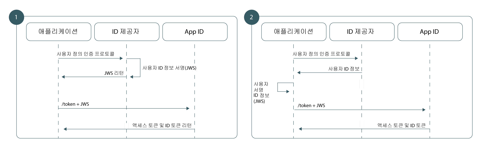

---

copyright:
  years: 2017, 2019
lastupdated: "2019-07-09"

keywords: Authentication, authorization, identity, app security, secure, custom, proprietary, 

subcollection: appid

---

{:external: target="_blank" .external}
{:shortdesc: .shortdesc}
{:screen: .screen}
{:pre: .pre}
{:table: .aria-labeledby="caption"}
{:codeblock: .codeblock}
{:tip: .tip}
{:note: .note}
{:important: .important}
{:deprecated: .deprecated}
{:download: .download}

# 사용자 정의 ID
{: #custom-auth}

인증 시 고유한 사용자 정의 ID 제공자를 사용할 수 있습니다. ID 제공자는 소유권 또는 레거시를 포함하여 {{site.data.keyword.appid_full}}에서 지원되는 메커니즘으로 대체되는 인증 메커니즘을 준수할 수 있습니다.
{: shortdesc}

## 개요
{: #custom-auth-overview}

고유한 ID 제공자를 가져옴으로써 고유한 프로토콜을 사용하는 사용자 정의 인증 플로우를 작성할 수 있습니다. 공유하려는 정보 또는 저장되는 정보 등을 더 효율적으로 제어할 수 있게 됩니다.
{: shortdesc}

애플리케이션에 추가하기 전에 [사용자 정의 제공자를 구성](/docs/services/appid?topic=appid-custom-identity)해야 합니다.
{: tip}

### 어떤 경우에 이 플로우를 사용합니까?
{: #custom-auth-when}

{{site.data.keyword.appid_short_notm}}에서 특정 ID 제공자에 대한 직접 지원을 제공하지 않을 경우 사용자 정의 ID 플로우를 사용하여 인증 프로토콜을 {{site.data.keyword.appid_short_notm}}의 기존 인증 플로우에 브릿징할 수 있습니다. 예를 들어 사용자가 사인인할 수 있도록 허용하기 위해 GitHub 또는 LinkedIn을 사용할 수 있습니다. {{site.data.keyword.appid_short_notm}}를 통해 사용자 인증 정보를 패키징 및 교환하기 전에 ID 제공자의 기존 SDK를 사용하여 해당 사용자 인증 정보를 활용할 수 있습니다.

다른 인증 플로우가 필요한 다양한 시나리오가 존재합니다.

 - 소유권, 사내 ID 제공자 
 - 서드파티 ID 제공자 
 - 소유권 다단계 메커니즘을 포함시킬 수 있는 복잡한 인증 플로우 

레거시 제공자가 고유한 사용자 정의 인증 프로토콜을 사용할 수 있는 경우도 있습니다. 사용자 정의 ID 플로우의 경우 인증을 권한과 완전히 분리하기 때문에 원하는 인증 메커니즘을 채택한 후 결과 인증 정보를 {{site.data.keyword.appid_short_notm}}에 제공할 수 있습니다. 모두 사용자 인증 정보가 노출되지 않습니다.

</br>

### 이 플로우는 기술적으로 어떻게 작동합니까?
{: #custom-auth-tech}

사용자 정의 ID 플로우는 OAuth 2.0 권한 부여를 위한 어설션 프레임워크 [[RFC7521]](https://tools.ietf.org/html/rfc7523#section-2.1)에 정의되어 있는 JWT-Bearer 확장 권한 부여 유형을 기반으로 빌드됩니다. {{site.data.keyword.appid_short_notm}} 토큰에 대한 사용자 정보를 교환하기 위해 인증 아키텍처는 비대칭 RSA 키 쌍을 사용하여 {{site.data.keyword.appid_short_notm}}와의 신뢰 관계를 작성합니다. 신뢰가 설정되면 JWT-Bearer 권한 부여 유형을 사용하여 {{site.data.keyword.appid_short_notm}} 토큰에 대해 서명된 JWT 내에 있는 확인된 사용자 정보를 교환할 수 있습니다.

### 이 플로우의 형태는 어떻습니까?
{: #custom-auth-flow}

모든 인증 플로우와 마찬가지로 사용자 정의 ID의 경우에도 ID 제공자 사용자 정보의 무결성을 위해 애플리케이션에서 {{site.data.keyword.appid_short_notm}}와 일정 수준의 신뢰를 설정할 수 있어야 합니다. 사용자 정의 ID는 비대칭 RSA 공개 및 개인 키 쌍을 사용하여 신뢰 관계를 설정합니다. 아키텍처의 요구사항에 따라 사용자 정의 ID는 스토리지 위치 및 개인 키의 사용법에서만 차이가 있는 두 가지 신뢰 모델을 지원합니다.


그림. 사용자 정의 인증을 위한 요청 플로우

<dl>
  <dt>1. ID 제공자에 서명됨</dt>
    <dd>기존 OAuth 2.0 플로우와 마찬가지로 가장 높은 보안 신뢰 모델에서 ID 제공자와 권한 서버 간의 관계를 직접 작성합니다(이 경우 {{site.data.keyword.appid_short_notm}}). 이 모델에서는 ID 제공자가 개인 키를 저장하고 JWT 어설션에 서명하는 역할을 담당합니다. {{site.data.keyword.appid_short_notm}}로 전달될 때 일치하는 공개 키를 통해 이러한 어설션을 유효성 검증하여 전송 중에 ID 제공자의 사용자 정보가 악의적으로 변경되지 않았는지 확인합니다.</dd>
  <dt>2. 애플리케이션에 서명됨</dt>
    <dd>또는 앱과 {{site.data.keyword.appid_short_notm}} 간의 관계를 기반으로 신뢰 모델을 구축할 수 있습니다. 이 워크플로우에서는 개인 키가 서버 측 애플리케이션에 저장됩니다. 정상적으로 인증되면 앱에서 {{site.data.keyword.appid_short_notm}}로 토큰을 전송하기 전에 ID 제공자 응답을 JWT로 변환하고 개인 키를 사용하여 서명하는 역할을 담당합니다. 이 ID 제공자에는 {{site.data.keyword.appid_short_notm}}와의 관계가 없기 때문에 이 아키텍처에서는 더 약한 신뢰 모델을 작성합니다. {{site.data.keyword.appid_short_notm}}의 경우 서버 측 애플리케이션에서 전송하는 정보를 신뢰할 수 있지만 해당 데이터가 ID 제공자에서 전송하는 원본인지는 확신할 수 없습니다.</dd>
</dl>


## JSON 웹 토큰 생성
{: #generating-jwts}

<a href="https://tools.ietf.org/html/rfc7515" target="blank">JSON 웹 토큰 </a>을 생성하여 확인된 사용자 데이터를 사용자 정의 ID JWT로 변환할 수 있습니다. 이 토큰은 사전 구성된 공개 키와 일치하는 개인 키로 서명해야 합니다. 
토큰 서명 라이브러리 목록은 <a href="https://jwt.io/" target="blank">https://jwt.io/ </a>를 참조하십시오.
{: shortdesc}

### JWT 형식 예제
{: #jwts-example}

토큰 헤더:
  ```
  {
  "alg": "RS256",
  "typ": "JOSE"
  }
  ```
  {: screen}

토큰 페이로드:
  ```
  {
    // Required
    iss: String, // Should reference your identity provider
    aud: String, // Must be the OAuth server URL name
    exp: Int,    // Should be a value with a short lifespan
    sub: String, // Must be the unique user ID provided by your identity provider

    // Normalized claims (optional)
    name: String
    email: String
    locale: String
    picture: String
    gender: String

    // Custom Scopes to add to access token (optional)
    scope="custom_scope1 custom_scope2"

    // Other custom claims (optional)
    role="admin"
  }
  ```
  {: screen}

  <table>
  <thead>
    <th colspan=2> JWS 필드</th>
  </thead>
  <tbody>
    <tr>
      <td><code> iss </code></td>
      <td>ID 제공자에 대한 참조가 포함되어 있어야 합니다.</td>
    </tr>
    <tr>
      <td><code> aud </code></td>
      <td>OAuth 서버 URL입니다. 형식: `https://{region}.appid.cloud.ibm.com/oauth/v4/{tenantId}`</td>
    </tr>
    <tr>
      <td><code> exp </code></td>
      <td>토큰이 유효한 기간입니다. 보안 상의 이유로 수명이 짧고 특정해야 합니다.</td>
    </tr>
    <tr>
      <td><code> sub </code></td>
      <td>ID 제공자에서 제공하는 고유한 사용자 ID입니다.</td>
    </tr>
    <tr>
      <td>Normalized claims</td>
      <td>모든 [정규화된 청구](/docs/services/appid?topic=appid-tokens)는 이 요청에 대한 응답으로 리턴되는 ID 토큰에서 제공됩니다. [`/userinfo` 엔드포인트](/docs/services/appid?topic=appid-profiles)를 사용하여 추가적인 사용자 정의 청구를 찾을 수 있습니다.</td>
    </tr>
    <tr>
      <td>Scope</td>
      <td>기본적으로 모든 {{site.data.keyword.appid_short_notm}} 토큰에는 사전 설정된 범위 그룹이 포함되어 있습니다. 다음 작업 중 하나를 수행하여 추가적인 범위를 요청할 수 있습니다.<ul><li> JWS 토큰의 범위 필드에서 범위를 지정합니다.</li> <li>`/token` 요청의 URL 양식 범위 매개변수를 통해 범위를 지정합니다.</li></ul></td>
    </tr>
  </tbody>
  </table>

## {{site.data.keyword.appid_short_notm}} 토큰 검색
{: #exchanging-jwts}

사용자 정의 제공자와 {{site.data.keyword.appid_short_notm}} 사이에 브릿지를 작성하려면 {{site.data.keyword.appid_short_notm}} 토큰이 있어야 합니다. 서비스 토큰을 얻으려면 [`/token` 엔드포인트](https://us-south.appid.cloud.ibm.com/swagger-ui/#/Authorization_Server_V4/token)를 사용하여 확인된 사용자 정보를 교환하십시오.
{: shortdesc}

  ```
  Post /token
  Content-Type: application/x-www-from-urlencoded
  grant_type=urn:ietf:params:oauth:grant-type:jwt-bearer
  assertion=<payload>
  scope="<space separated scope array>"
  ```
  {: codeblock}
  <table>
    <thead>
      <th colspan=2> 요청 구현</th>
    </thead>
    <tbody>
      <tr>
        <td>Content-type</td>
        <td><code>applications/x-www-from-urlencoded</code></td>
      </tr>
      <tr>
        <td>grant_type</td>
        <td><code>urn:ietf:params:oauth:grant-type:jwt-bearer</code></td>
      </tr>
      <tr>
        <td>assertion</td>
        <td>JWS 페이로드 문자열입니다.</td>
      </tr>
      <tr>
        <td>scope</td>
        <td>공백으로 구분된 사용자 정의 범위 목록입니다.</td>
      </tr>
    </tbody>
  </table>
