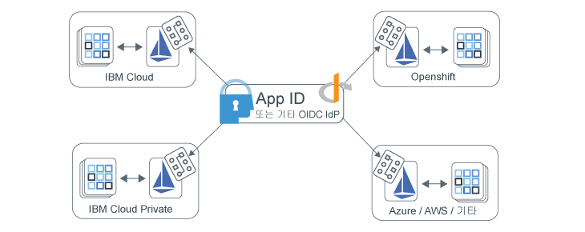

---

copyright:
  years: 2017, 2019
lastupdated: "2019-07-11"

keywords: Authentication, authorization, identity, app security, access, secure, development, any kube, kubernetes, icp, openshift, iks

subcollection: appid

---

{:external: target="_blank" .external}
{:shortdesc: .shortdesc}
{:screen: .screen}
{:pre: .pre}
{:table: .aria-labeledby="caption"}
{:codeblock: .codeblock}
{:tip: .tip}
{:note: .note}
{:important: .important}
{:deprecated: .deprecated}
{:download: .download}

# Istio로 멀티클라우드 앱 보안
{: #istio-adapter}

앱 ID와 액세스 어댑터를 사용하여 단일 위치에서 중앙 집중식으로 모든 ID를 관리할 수 있습니다. 엔터프라이즈에서 여러 제공자의 클라우드나 온프레미스 및 오프프레미스 솔루션을 조합하여 사용하므로 이기종 배치 모델을 통해 기존 인프라를 유지하고 공급업체 잠금을 방지합니다. 어댑터는 프론트 엔드와 백엔드 애플리케이션 등의 모든 환경에서 인증 및 권한 부여 정책을 제어할 수 있는 {{site.data.keyword.appid_short_notm}} 등의 OIDC 준수 ID 제공자와 함께 작동하도록 구성할 수 있습니다. **이 모두는 코드를 변경하거나 애플리케이션을 재배치하지 않고 수행할 수 있습니다**.
{: shortdesc}


## 멀티 클라우드 아키텍처
{: #istio-multicloud}

멀티 클라우드 컴퓨팅 환경에서는 여러 클라우드 및/또는 사설 컴퓨팅 환경을 단일 네트워크 아키텍처로 결합합니다. 여러 환경에 워크로드를 분배하면 복원성과 유연성이 향상되고 비용 효율성이 높아질 수 있습니다. 이점을 얻으려면 Kubernetes와 같은 오케스트레이션 계층과 컨테이너 기반 애플리케이션을 사용하는 것이 일반적입니다.


그림. 멀티 클라우드 배치 - 앱 ID 및 액세스 어댑터로 달성


## Istio 및 어댑터 이해
{: #istio-architecure}

[Istio](https://istio.io)는 Kubernetes와 통합할 수 있는 기존 분산 애플리케이션에 투명하게 계층화되는 오픈 소스 서비스 메시입니다. 배치의 복잡도를 줄이기 위해 Istio에서는 서비스 메시 전체에 대한 동작 인사이트와 운영 제어를 제공합니다. App ID를 Istio와 결합하면 사용자 정의 애플리케이션 코드 변경이 필요하지 않은 멀티 클라우드 아키텍처의 확장 가능한 통합 ID 솔루션이 됩니다. 자세한 정보는 ["Istio의 개념](https://www.ibm.com/cloud/learn/istio?cm_mmc=OSocial_Youtube-_-Hybrid+Cloud_Cloud+Platform+Digital-_-WW_WW-_-IstioYTDescription&cm_mmca1=000023UA&cm_mmca2=10010608){: external}을 확인하십시오.

Istio에서는 Envoy 프록시 사이드카를 사용하여 서비스 메시의 모든 서비스에 대한 인바운드 및 아웃바운드 트래픽을 모두 중재합니다. Istio에서는 프록시를 사용하여 정책 의사결정을 적용하기 위해 Mixer라는 Istio 컴포넌트에 전송되는 텔레메트리라고도 하는 트래픽에 관한 정보를 추출합니다. 앱 ID 및 액세스 어댑터에서는 서비스 메시 전체에서 ID 및 액세스 관리를 제어하기 위해 사용자 정의 정책과 비교하여 텔레메트리(속성)를 분석하여 Mixer 기능을 확장합니다. 액세스 관리 정책은 특정 Kubernetes 서비스에 링크되며 특정 서비스 엔드포인트에 맞게 미세하게 조정할 수 있습니다. 정책 및 텔레메트리에 관한 자세한 정보는 [Istio 문서](https://istio.io/docs/concepts/observability/){: external}를 참조하십시오. 

Istio 제한사항 때문에 앱 ID 및 액세스 어댑터에서는 현재 사용자 세션 정보를 내부에 저장하며 복제본 또는 장애 복구 구성에 정보를 유지하지 *않습니다*. 어댑터를 사용할 때 제한사항이 해결될 때까지 워크로드를 단일 복제본으로 제한하십시오.
{: note}

### 프론트 엔드 앱 보호
{: #istio-frontend}

브라우저 기반 애플리케이션을 사용하는 경우 [OIDC(Open ID Connect)](https://openid.net/specs/openid-connect-core-1_0.html){: external} / OAuth 2.0 `authorization_grant` 플로우를 사용하여 사용자를 인증할 수 있습니다. 인증되지 않은 사용자를 발견하면 인증 페이지로 경로가 자동으로 재지정됩니다. 인증이 완료되면 어댑터가 요청을 가로채는 내재적 `/oidc/callback` 엔드포인트로 브라우저의 경로가 재지정됩니다. 이때 어댑터에서 ID 제공자로부터 토큰을 얻어 원래 요청된 URL로 사용자의 경로를 다시 재지정합니다.

세션 토큰 등의 사용자 세션 정보를 보려면 `Authorization` 헤더를 확인할 수 있습니다.

```
Authorization: Bearer <access_token> <id_token>
```
{: screen}

인증된 사용자를 로그아웃할 수도 있습니다. 인증된 사용자가 다음 예제에 표시된 대로 `oidc/logout`이 추가된 상태로 보호된 엔드포인트에 액세스하면 로그아웃됩니다.

```
https://myhost/path/oidc/logout
```
{: screen}

필요한 경우 새로 고치기 토큰을 사용하면 사용자가 재인증하지 않고 새로운 액세스 및 ID 토큰을 자동으로 얻을 수 있습니다. 구성된 ID 제공자가 새로 고치기 토큰을 리턴하면 세션에서 해당 토큰을 유지하며 ID 토큰이 만기될 때 새 토큰을 검색하는 데 사용합니다.


### 백엔드 앱 보호
{: #istio-backend}

어댑터는 JWT Bearer 토큰의 유효성을 검증하여 서비스 API를 보호하기 위해 OAuth 2.0 [JWT Bearer 플로우](https://tools.ietf.org/html/rfc6750){: external}와 함께 사용할 수 있습니다. Bearer 권한 플로우에서는 올바른 액세스 토큰과 선택적 ID 토큰이 있는 Authorization 헤더가 요청에 포함될 것으로 예상합니다. 예쌍 헤더 구조는 `Authorization=Bearer {access_token} [{id_token}]`입니다. 인증되지 않은 클라이언트에 권한을 얻는 데 필요한 범위 목록과 함께 HTTP 401 응답 상태가 리턴됩니다. 토큰이 올바르지 않거나 만료된 경우 API 전략에서 `Www-Authenticate=Bearer scope="{scope}" error="{error}"`라는 선택적 오류 컴포넌트와 HTTP 401 응답을 리턴합니다.


토큰과 토큰 사용 방법에 관한 자세한 정보는 [토큰 이해](/docs/services/appid?topic=appid-tokens)를 참조하십시오.


## 시작하기 전에
{: #istio-before}

시작하기 전에 다음과 같은 전제조건이 설치되었는지 확인하십시오.

- [Kubernetes 클러스터](https://kubernetes.io/){: external}
- [Helm](https://helm.sh/){: external}
- [Istio v1.1+](https://istio.io/docs/setup/kubernetes/install/){: external}
  
  [IBM Cloud Kubernetes Service Managed Istio](/docs/containers?topic=containers-istio)도 사용할 수 있습니다.
  {: note}


## 어댑터 설치
{: #istio-install-adapter}

차트를 설치하려면 클러스터에서 Helm을 초기화하고 사용할 옵션을 정의한 다음 설치 명령을 실행하십시오.

1. IBM Cloud Kubernetes 서비스에 대해 작업 중인 경우 로그인한 다음 클러스터의 컨텍스트를 설정하십시오.

2. 클러스터에 Helm을 설치하십시오.

    ```bash
    helm init
    ```
    {: codeblock}

    `--tls` 모드를 사용하도록 Helm을 구성할 수 있습니다. TLS 사용에 관한 도움말은 [Helm 저장소](https://github.com/helm/helm/blob/master/docs/tiller_ssl.md){: external}를 참조하십시오. TLS를 사용하는 경우 실행하는 모든 Helm 명령에 `--tls`를 추가하십시오. IBM Cloud Kubernetes Service와 Helm을 사용하는 데 관한 자세한 정보는 [Helm 차트를 사용하여 서비스 추가](/docs/containers?topic=containers-helm#public_helm_install)를 참조하십시오.
    {: tip}

3. 차트를 설치하십시오.

    ```bash
    helm install ./helm/appidentityandaccessadapter --name appidentityandaccessadapter
    ```
    {: codeblock}

## 권한 및 인증 정책 적용
{: #istio-apply-policy}

인증 및 권한 정책은 요청에서 리소스 액세스에 액세스하기 위해 충족해야 하는 조건 세트입니다. 특정 플로우를 사용해야 하는 경우를 간략하게 설명하는 ID 제공자의 서비스 구성과 정책을 정의하여 서비스 메시의 모든 자원에 대한 액세스를 제어할 수 있습니다. 예제 CRD를 보려면 [샘플 디렉토리](https://github.com/ibm-cloud-security/app-identity-and-access-adapter/tree/master/samples/crds){: external}를 참조하십시오.

정책을 작성하려면 다음을 수행하십시오. 

1. 구성을 정의하십시오.
2. 엔드포인트를 등록하십시오.

### 구성 정의
{: #istio-apply-define}

보호하는 애플리케이션(프론트 엔드 또는 백엔드)에 따라 다음 옵션 중 하나를 사용하여 정책 구성을 작성하십시오.

* 프론트 엔드 애플리케이션의 경우: 사용자 인증이 필요한 브라우저 기반 애플리케이션은 OIDC / OAuth 2.0 인증 플로우를 사용하도록 구성할 수 있습니다. ID 제공자를 사용하여 인증 플로우를 용이하게 하는 데 사용하는 클라이언트를 포함하는 `OidcConfig` CRD를 정의하려면 다음 예를 안내서로 사용하십시오.

    ```yaml
    apiVersion: "security.cloud.ibm.com/v1"
    kind: OidcConfig
    metadata:
        name:      oidc-provider-config
        namespace: sample-namespace
    spec:
        discoveryUrl: https://us-south.appid.cloud.ibm.com/oauth/v4/<tenant-ID>/oidc-discovery/.well-known
        clientId:     <client-ID>
        clientSecret: <randomlyGeneratedClientSecret>
        clientSecretRef:
            name: <name-of-my-kube-secret>
            key: <key-in-my-kube-secret>
    ```
    {: screen}

    <table>
        <thead>
        <tr>
            <th>필드</th>
            <th style="text-align:center">유형</th>
            <th style="text-align:center">필수</th>
            <th style="text-align:center">설명</th>
        </tr>
        </thead>
        <tbody>
        <tr>
            <td><code>discoveryUrl</code></td>
            <td style="text-align:center">문자열</td>
            <td style="text-align:center">예</td>
            <td style="text-align:center">OIDC/OAuth 2.0 구성 정보의 JSON 문서를 제공하는 잘 알려진 엔드포인트입니다.</td>
        </tr>
        <tr>
            <td><code>clientId</code></td>
            <td style="text-align:center">문자열</td>
            <td style="text-align:center">예</td>
            <td style="text-align:center">인증에 사용하는 클라이언트의 ID입니다.</td>
        </tr>
        <tr>
            <td><code>clientSecret</code></td>
            <td style="text-align:center">문자열</td>
            <td style="text-align:center">*No</td>
            <td style="text-align:center">클라이언트를 인증하는 데 사용하는 일반 텍스트 시크릿입니다. 제공하지 않으면 <code>clientSecretRef</code>가 있어야 합니다.</td>
        </tr>
        <tr>
            <td><code>clientSecretRef</code></td>
            <td style="text-align:center">오브젝트</td>
            <td style="text-align:center">아니오</td>
            <td style="text-align:center">클라이언트를 인증하는 데 사용하는 참조 시크릿입니다. 참조는 <code>clientSecret</code> 대신 사용할 수 있습니다.</td>
        </tr>
        <tr>
            <td><code>clientSecretRef.name</code></td>
            <td style="text-align:center">문자열</td>
            <td style="text-align:center">예</td>
            <td style="text-align:center"><code>clientSecret</code>를 포함하는 Kubernetes 시크릿의 이름입니다.</td>
        </tr>
        <tr>
            <td><code>clientSecretRef.key</code></td>
            <td style="text-align:center">문자열</td>
            <td style="text-align:center">예</td>
            <td style="text-align:center"><code>clientSecret</code>를 보유하는 Kubernetes 시크릿의 필드입니다.</td>
        </tr>
        </tbody>
    </table>

* 백엔드 애플리케이션의 경우: OAuth 2.0 Bearer 토큰 사양에서는 [JWT(JSON Web Token)](https://tools.ietf.org/html/rfc7519.html){: external}를 사용하여 API를 보호하는 패턴을 정의합니다. 다음 구성을 예제로 사용하여 토큰 서명의 유효성을 검증하는 데 사용하는 공개 키 리소스를 포함하는 `JwtConfig` CRD를 정의하십시오.

    ```yaml
    apiVersion: "security.cloud.ibm.com/v1"
    kind: JwtConfig
    metadata:
      name:      jwt-config
      namespace: sample-app
    spec:
        jwksUrl: https://us-south.appid.cloud.ibm.com/oauth/v4/<tenant-ID>/publickeys
    ```
    {: screen}

### 애플리케이션 엔드포인트 등록
{: #istio-register-endpoints}

`Policy` CRD에 애플리케이션 엔드포인트를 등록하여 수신 요청의 유효성을 검증하고 인증 규칙을 적용하십시오. 각 `Policy`는 오브젝트가 있는 Kubernetes 네임스페이스에 독점적으로 적용되며 보호할 서비스, 경로 및 메소드를 지정할 수 있습니다.

```yaml
apiVersion: "security.cloud.ibm.com/v1"
kind: Policy
metadata:
  name:      samplepolicy
  namespace: sample-app
spec:
  targets:
    -
      serviceName: <svc-sample-app>
      paths:
        - exact: /web/home
          method: ALL
          policies:
            - policyType: oidc
              config: <oidc-provider-config>
              rules:
                - claim: scope
                  match: ALL
                  source: access_token
                  values:
                    - appid_default
                    - openid
                - claim: amr
                  match: ANY
                  source: id_token
                  values:
                    - cloud_directory
                    - google

        - exact: /web/user
          method: GET
          policies:
            - policyType: oidc
              config: <oidc-provider-config>
              redirectUri: https://github.com/ibm-cloud-security/app-identity-and-access-adapter
        - prefix: /
          method: ALL
          policies:
            -
              policyType: jwt
              config: <jwt-config>
```
{: screen}


| 서비스 오브젝트 |유형 |필수 |설명   |
|:----------------:|:----:|:--------:| :-----------: |
| `service` | `string` |예 | 보호할 정책 네임스페이스에 있는 Kubernetes 서비스의 이름입니다. |
| `paths` | `array[Path Object]` |예 | 보호할 엔드포인트를 정의하는 경로 오브젝트의 목록입니다. 비어 있는 경우 모든 경로를 보호합니다. |
{: class="simple-tab-table"}
{: caption="표 1. 서비스 오브젝트 컴포넌트 이해" caption-side="top"}
{: #service-object}
{: tab-title="Service object"}
{: tab-group="objects"}

| 경로 오브젝트  |유형 |필수 |설명   |
|:----------------:|:----:|:--------:|:-----------:|
| `exact or prefix` | `string` |예 | 정책을 적용할 경로입니다. 옵션에는 `exact`와 `prefix`가 포함됩니다. `exact`는 마지막 `/`가 잘린 제공된 엔드포인트와 정확하게 일치합니다. `prefix`는 사용자가 제공하는 접두부로 시작하는 엔드포인트와 일치합니다.|
| `method` | `enum` |아니오 | 보호된 HTTP 메소드입니다. 올바른 옵션은 ALL, GET, PUT, POST, DELETE, PATCH임 - 기본값은 ALL입니다.  |
| `policies` | `array[Policy]` |아니오 | 적용할 OIDC/JWT 정책입니다. |
{: class="simple-tab-table"}
{: caption="표 2. 경로 오브젝트 컴포넌트 이해" caption-side="top"}
{: #path-object}
{: tab-title="Path object"}
{: tab-group="objects"}

| 정책 오브젝트 |유형 |필수 |설명   |
|:----------------:|:----:|:--------:| :-----------: |
| `policyType` | `enum` |예 | OIDC 정책의 유형입니다. 옵션에는 `jwt` 또는 `oidc`가 포함됩니다. |
| `config` | `string` |예 | 사용할 제공자 구성의 이름입니다. |
| `redirectUri` | `string` |아니오 | 성공적으로 인증한 다음 사용자의 경로를 재지정할 URL입니다. 기본값은 원래 요청 URL입니다. |
| `rules` | `array[Rule]` |아니오 | 토큰 유효성 검증에 사용할 규칙 세트입니다. |
{: class="simple-tab-table"}
{: caption="표 3. 정책 오브젝트 컴포넌트 이해" caption-side="top"}
{: #policy-object}
{: tab-title="Policy object"}
{: tab-group="objects"}

| 규칙 오브젝트 |유형 |필수 |설명   |
|:----------------:|:----:|:--------:| :-----------: |
| `claim` | `string` |예 | 유효성 검증할 청구입니다. |
| `match` | `enum` |아니오 | 청구 유효성 검증에 필요한 기준입니다. 옵션에는 `ALL`, `ANY` 또는 `NOT`이 포함됩니다. 기본값은 `ALL`로 설정됩니다. |
| `source` | `enum` |아니오 | 규칙을 적용할 토큰입니다. 옵션에는 `access_token` 또는 `id_token`이 포함됩니다. 기본값은 `access_token`으로 설정됩니다. |
| `values` | `array[string]` |예 | 유효성 검증에 필요한 값 세트입니다. |
{: class="simple-tab-table"}
{: caption="표 4. 정책 오브젝트 컴포넌트 이해" caption-side="top"}
{: #rule-object}
{: tab-title="Rule object"}
{: tab-group="objects"}


## 어댑터 삭제
{: #istio-remove}

어댑터 및 관련된 모든 CRD을 제거하려면 Helm 차트와 관련 서명 및 암호화 키를 삭제해야 합니다.

```bash
helm delete --purge appidentityandaccessadapter
kubectl delete secret appidentityandaccessadapter-keys -n istio-system
```
{: codeblock}


## FAQ 및 문제점 해결
{: #istio-faq}

앱 ID 및 액세스 어댑터에 대해 작업하는 동안 문제가 발생하면 다음 FAQ 및 문제점 해결 기술을 고려하십시오. 자세한 정보를 보려면 포럼에 질문하거나 지원 티켓을 열 수 있습니다. 포럼을 사용하여 질문하는 경우 {{site.data.keyword.appid_short_notm}} 개발 팀이 볼 수 있도록 질문에 태그를 지정하십시오.

  * {{site.data.keyword.appid_short_notm}}에 대한 기술적 질문이 있으면 <a href="https://stackoverflow.com/" target="_blank">Stack Overflow </a>에 질문을 게시하고 질문에 "ibm-appid" 태그를 지정하십시오.
  * 서비스 및 시작하기 지시사항에 대한 질문이 있는 경우, <a href="https://developer.ibm.com/" target="_blank"> developerWorks dW Answers </a> 포럼을 사용하십시오. `appid` 태그를 포함하십시오.

지원을 받는 방법에 대한 자세한 정보는 [필요한 지원을 받는 방법은 무엇입니까?](/docs/get-support?topic=get-support-getting-customer-support#getting-customer-support)를 참조하십시오.


### 문제점 해결: 로그 작성
{: #istio-logging}

기본적으로 로그는 외부 로깅 시스템과 쉽게 통합될 수 있도록 JSON으로 스타일이 지정되며 `info` 가시성 레벨에서 제공됩니다. 로깅 구성을 업데이트하려면 Helm 차트를 사용할 수 있습니다. 지원되는 로깅 레벨에는 Zap 코어에 표시된 대로 [-1, 7] 범위가 포함됩니다. 레벨에 관한 자세한 정보는 [Zap 코어 문서](https://godoc.org/go.uber.org/zap/zapcore#Level)를 참조하십시오.

JSON 로그를 수동으로 볼 때 [`jq`](https://brewinstall.org/install-jq-on-mac-with-brew/)를 사용하여 로그를 추적하고 "pretty print"할 수 있습니다.
{: note}

**어댑터**

어댑터 로그를 보려면 `kubectl`을 사용하거나 Kubernetes 콘솔의 `appidentityandaccessadapter` 팟(Pod)에서 팟(Pod)에 액세스할 수 있습니다.

```bash
$ alias adapter_logs="kubectl -n istio-system logs -f $(kubectl -n istio-system get pods -lapp=appidentityandaccessadapter -o jsonpath='{.items[0].metadata.name}')"
$ adapter_logs | jq
```
{: codeblock}

**Mixer**

어댑터가 요청을 받지 못하는 것으로 보이면 Mixer 로그를 확인하여 어댑터에 제대로 연결되었는지 확인하십시오.

```bash
$ alias mixer_logs="kubectl -n istio-system logs -f $(kubectl -n istio-system get pods -lapp=telemetry -o jsonpath='{.items[0].metadata.name}') -c mixer"
$ mixer_logs | jq
```
{: codeblock}

