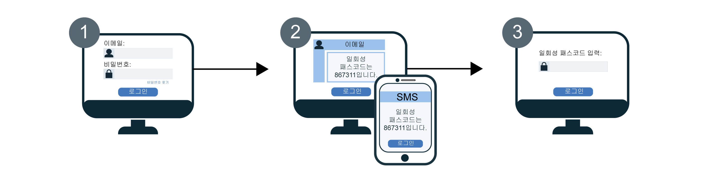

---

copyright:
  years: 2017, 2019
lastupdated: "2019-05-09"

keywords: authentication, authorization, identity, app security, secure, development, two factor, mfa 

subcollection: appid

---

{:new_window: target="_blank"}
{:shortdesc: .shortdesc}
{:screen: .screen}
{:pre: .pre}
{:table: .aria-labeledby="caption"}
{:codeblock: .codeblock}
{:tip: .tip}
{:note: .note}
{:important: .important}
{:deprecated: .deprecated}
{:download: .download}


# 다단계 인증(MFA)
{: #cd-mfa}


사인인 중에 복수의 요소를 요구하여 앱에 대한 사용자 인증의 보안을 강화할 수 있습니다. Cloud Directory for {{site.data.keyword.appid_full}}를 사용하는 경우 첫 번째 요소는 사인인할 때 일반적으로 사용하는 Cloud Directory 사용자의 비밀번호입니다. 두 번째 인증 요소는 {{site.data.keyword.appid_short_notm}}에서 사용자에게 SMS 또는 이메일로 전송하는 일회성 코드입니다. {{site.data.keyword.appid_short_notm}}의 경우 두 가지 요소의 조합을 사용하여 사용자의 ID를 확인합니다.
{: shortdesc}

{{site.data.keyword.appid_short_notm}} MFA는 로그인 위젯을 통해 Cloud Directory 사용자에 대한 OAuth 2.0 권한 코드 플로우의 일부로 지원됩니다. SAML 2.0 또는 소셜 로그인을 통한 엔터프라이즈 사인인을 사용하는 경우
해당 ID 제공자를 통해 MFA를 사용으로 설정할 수 있습니다.
{: note}

MFA가 사용으로 설정되면 사용자가 사인인하려고 시도할 때마다 {{site.data.keyword.appid_short_notm}} 로그인 위젯에서 두 번째 검증 양식(두 번째 인증 요소)을 요구합니다. 사용자가 정상적으로 인증 정보를 입력하면 해당 계정에 등록된 이메일 또는 전화번호로 일회성 코드가 전송됩니다.

MFA 플로우가 작동하는 방법을 확인하려면 다음 다이어그램을 참조하십시오.



1. 사용자에게 {{site.data.keyword.appid_short_notm}}의 로그인 위젯이 표시되고 사용자가 해당 Cloud Directory 사용자 인증 정보를 입력합니다. 인증 정보는 이메일 또는 사용자 이름 및 비밀번호가 될 수 있습니다. Cloud Directory 사용자 인증 정보는 첫 번째 인증 요소를 구성합니다.

2. 인증 정보가 유효성 검증된 후 두 번째 요소 검증을 위한 MFA 화면이 리턴됩니다. 사용자는 두 번째 요소 구성에 따라 일회성 코드가 포함된 이메일 또는 SMS를 수신하여 검증 화면에 입력합니다.

3. MFA 코드가 유효성 검증되면 사용자가 다시 애플리케이션으로 경로 재지정되고 사인인됩니다.


## MFA에 대한 정보
{: #cd-mfa-understanding}


MFA는 사용자가 누구인지 증명하기 위해 복수의 요소를 사용하도록 요구하여 사용자의 ID를 확인하는 방법입니다. 이러한 요소는 사용자가 알고 있거나 나타내는 것뿐만 아니라 보유하고 있는 것이 될 수도 있습니다.
{: shortdesc}

MFA가 처음으로 사용으로 설정되는 경우 기본적으로 이메일을 사용하도록 설정됩니다. SMS를 사용하도록 설정을 변경할 수 있지만 동시에 둘 다 구성할 수는 없습니다. 이메일 및 SMS의 경우 모두 사용자를 위해 구성되어 있는 몇 가지 설정이 존재하며 이를 변경할 수 없습니다.


<table>
  <tr>
    <th>설정</th>
    <th>설명</th>
  </tr>
  <tr>
    <td>코드 문자</td>
    <td>6자의 숫자</td>
  </tr>
  <tr>
    <td>코드 만기</td>
    <td>15분 <br> 사용자가 15분 내에 해당 코드를 유효성 검증하지 않을 경우 인증 세션이 만기되지 않은 한 다른 코드를 전송하도록 요청할 수 있습니다. 인증 세션 내에는 코드를 여러 번 전송할 수 있습니다. 인증 세션이 만료되면 사용자는 로그인 프로세스를 처음부터 반복해야 합니다.</td>
  </tr>
</table>

<p>SCIM에 <a href="https://tools.ietf.org/html/rfc7643#section-2.4" target="_blank">다중 값 속성 </a>으로 정의된 경우 Cloud Directory 사용자의 이메일 또는 전화번호에 다음과 같은 항목이 포함될 수 있습니다.
<ul>
  <li>값: 이메일 주소 또는 전화번호 등의 실제 속성 값입니다.</li>
  <li>기본: 속성에 대해 선호하는 값을 나타내는 부울 값입니다. 기본 속성 값 <code>true</code>는 오직 한 번만 사용할 수 있습니다. 지정하지 않을 경우 <code>primary</code>의 값이 <code>false</code>인 것으로 가정합니다.</li>
</ul>자세한 정보는 [Cloud Directory 문서](/docs/services/appid?topic=appid-cloud-directory#cloud-directory)를 참조하십시오.</p>


## MFA 이메일 채널 구성
{: #cd-mfa-configure-email}

이메일을 통해 사용자에게 MFA 코드를 발송하도록 {{site.data.keyword.appid_short_notm}}를 구성할 수 있습니다.
{: shortdesc} 

MFA를 처음으로 사용으로 설정하는 경우 다음과 같은 두 가지 상황이 발생합니다.

- 기본적으로 이메일 채널이 선택됩니다. [SMS 채널](/docs/services/appid?topic=appid-cd-mfa#cd-mfa-configure-sms)로 전환할 수 있습니다.
- {{site.data.keyword.appid_short_notm}}에서 Cloud Directory 사용자의 프로파일에 첨부된 기본 이메일을 자동으로 등록합니다.

사용자의 이메일이 아직 확인되지 않은 경우 등록 시 [관리 API](https://us-south.appid.cloud.ibm.com/swagger-ui/#/) 또는 이메일 검증을 통해 MFA 코드를 정상적으로 검증할 때 확인됩니다.

시작하기 전에 {{site.data.keyword.appid_short_notm}}의 인스턴스에 [누진 계층 가격 플랜](/docs/services/appid?topic=appid-faq#faq-pricing)이 적용되어 있는지 확인하십시오.
{: note}

### GUI 사용
{: #cd-mfa-configure-email-gui}

GUI를 통해 MFA 이메일 채널을 구성할 수 있습니다.

1. {{site.data.keyword.appid_short_notm}} 대시보드의 **Cloud Directory > 다단계 인증** 탭으로 이동하십시오.

2. **설정 탭**의 **다단계 인증 사용** 상자에서 MFA를 **사용**으로 전환하십시오. MFA는 [고급 보안 이벤트](/docs/services/appid?topic=appid-faq#faq-pricing)로 청구된다는 점을 이해하고 있어야 합니다. 기본적으로 **이메일**이 **인증 방법**으로 선택되어 있습니다.

3. **이메일 채널** 탭에서 **이메일 템플리트**를 검토하십시오. 제공된 문장을 사용하거나 고유한 메시지를 작성하여 템플리트를 발송하도록 선택할 수 있습니다. 올바른 HTML 태그 지정을 사용해야 합니다. GUI에서 매개변수를 추가하고 이미지를 삽입할 수 있습니다. 메시지의 [언어](/docs/services/appid?topic=appid-cd-messages#cd-languages)를 변경하기 위해 <a href="https://us-south.appid.cloud.ibm.com/swagger-ui/#/Management%20API%20-%20Config/mgmt.updateLocalization" target="_blank">API </a>를 사용하여 언어를 설정할 수 있습니다. 하지만 메시지의 컨텐츠 및 번역은 사용자의 책임입니다. 메시지에서 사용할 수 있는 표의 목록 및 발송할 수 있는 기타 모든 메시지를 확인하려면 다음 표를 참조하십시오. 사용자가 해당 매개변수를 통해 가져오는 정보를 제공하지 않을 경우 공백으로 표시됩니다.

  <table>
    <thead>
      <tr>
        <th colspan=2> MFA 메시지 매개변수</th>
      </tr>
    </thead>
    <tbody>
      <tr>
        <td><code>%{display.logo}</code></td>
        <td> 로그인 위젯에 대해 구성한 이미지를 표시합니다. </td>
      </tr>
      <tr>
        <td><code>%{user.displayName}</code></td>
        <td> 사용자가 앱과 상호작용할 때 사용하도록 선택한 화면 이름을 표시합니다. </td>
      </tr>
      <tr>
        <td><code>%{user.email}</code></td>
        <td> 사용자의 등록된 이메일 주소를 표시합니다. </td>
      </tr>
      <tr>
        <td><code>%{user.username}</code></td>
        <td> 인증 방법이 사용자 이름 및 비밀번호로 설정된 경우 사용자의 지정된 사용자 이름을 표시합니다. </td>
      </tr>
      <tr>
        <td><code>%{user.firstName}</code></td>
        <td> 사용자의 지정된 이름을 표시합니다. </td>
      </tr>
      <tr>
        <td><code>%{user.formattedName}</code></td>
        <td> 사용자의 전체 이름을 표시합니다. </td>
      </tr>
      <tr>
        <td><code>%{user.lastName}</code></td>
        <td> 사용자의 지정된 성을 표시합니다. </td>
      </tr>
      <tr>
        <td><code>%{mfa.code}</code></td>
        <td> 일회성 MFA 검증 코드를 표시합니다. </td>
      </tr>
    </tbody>
  </table>

  사용자가 해당 매개변수를 통해 가져오는 정보를 제공하지 않을 경우 공백으로 표시됩니다.
  {: tip}


### API 사용
{: #cd-mfa-configure-email-apis}

**시작하기 전에**

다음과 같은 전제조건이 준비되어 있어야 합니다.

* {{site.data.keyword.appid_short_notm}} 인스턴스의 테넌트 ID. 이 ID는 대시보드의 **서비스 인증 정보** 섹션에서 찾을 수 있습니다.
* IAM(Identity and Access Management) 토큰. IAM 토큰을 얻는 방법에 대한 도움말은 [IAM 문서](/docs/iam?topic=iam-iamtoken_from_apikey#iamtoken_from_apikey)를 참조하십시오.


1. MFA 구성이 포함된 `/config/mfa` 엔드포인트에 대한 PUT 요청을 작성하여 `isActive`를 `true`로 설정함으로써 MFA를 사용으로 설정하십시오.

  헤더:
  ```
  PUT {management-url}/management/v4/{tenantId}/config/mfa
       Host: <management-server-url>
       Authorization: Bearer <IAM_TOKEN>
       Content-Type: application/json
  ```
  {: codeblock}

  본문:
  ```
   {
       "isActive": true
   }
  ```
  {: codeblock}

  요청 예제:
  ```
  $ curl -X PUT
    --header 'Content-Type: application/json'
    --header 'Accept: application/json'
    --header 'Authorization: Bearer <IAM_TOKEN>'
    -d '{
          "isActive": true
      }'
    }'
    '{management-url}/management/v4/{tenantId}/config/mfa'
  ```
  {: screen}

2. MFA 구성이 포함된 `/mfa/channels/{channel}` 엔드포인트에 대한 PUT 요청을 작성하여 MFA 채널을 사용으로 설정하십시오. `isActive`를 `true`로 설정하면 MFA 채널이 사용으로 설정됩니다.

  헤더:
  ```
  PUT /management/v4/{tenantId}/mfa/channels/{channel}
       Host: <management-server-url>
       Authorization: Bearer <IAM_TOKEN>
       Content-Type: application/json
  ```
  {: codeblock}

  본문:
  ```
   {
       "isActive": true
   }
  ```
  {: codeblock}

  요청 예제:

  ```
  $ curl -X PUT
    --header 'Content-Type: application/json'
    --header 'Accept: application/json'
    --header 'Authorization: Bearer <IAM_TOKEN>'
    -d '{
          "isActive": true
      }'
    }'
    '{management-url}/management/v4/{tenantId}/mfa/channels/email'
  ```
  {: screen}

사용자 정의 이메일 디스패처에서 작동하도록 {{site.data.keyword.appid_short_notm}} Cloud Directory 인스턴스가 구성되어 있는 경우 MFA에서 동일한 동일한 디스패처를 사용하여 일회성 코드를 전송합니다. 사용자 정의 디스패처를 설정하는 방법에 대한 자세한 정보는 [Cloud Directory](/docs/services/appid?topic=appid-cd-messages#cd-custom-email) 문서를 참조하십시오.
{: note}


## SMS에서 작동하도록 MFA 구성
{: #cd-mfa-configure-sms}

두 번째 검증 양식으로 사용자에게 SMS 메시지를 전송할 수 있습니다. SMS를 사용으로 설정하면 {{site.data.keyword.appid_short_notm}}에서 자동으로 Cloud Directory 사용자의 프로파일에 있는 [유효한](https://en.wikipedia.org/wiki/E.164) 첫 번째 기본 전화번호를 등록하려고 시도합니다. 번호가 올바르지 않거나 사용자의 프로파일에서 전화번호를 찾을 수 없는 경우 사용자가 번호를 추가할 수 있는 등록 위젯이 표시됩니다. 그런 다음 해당 번호가 사용자 프로파일에 포함되고 유효성 검증이 완료되면 MFA에 사용되는 기본 번호가 됩니다.
{: shortdesc}

**시작하기 전에**

{{site.data.keyword.appid_short_notm}}의 경우 [Nexmo](https://www.nexmo.com/products/sms)를 사용하여 MFA SMS 일회성 코드를 전송합니다. 시작하기 전에 {{site.data.keyword.appid_short_notm}}의 인스턴스에 [누진 계층 가격 플랜](/docs/services/appid?topic=appid-faq#faq-pricing)이 적용되어 있으며 다음과 같은 Nexmo 정보가 있는지 확인하십시오.

 - Nexmo API 키 및 시크릿을 얻으십시오. Nexmo API 키 및 시크릿은 Nexmo 대시보드의 계정 설정에서 찾을 수 있습니다. 인증 정보를 얻는 방법에 대한 자세한 정보는 [Nexmo 문서](https://developer.nexmo.com/concepts/guides/authentication#api-key-and-secret)를 참조하십시오.

 - Nexmo에 발신인 ID 또는 `from` 번호를 등록하십시오. 이 `from` 번호는 SMS의 발신인이 누구인지 표시하기 위해 사용자의 전화에 표시되는 번호입니다. 일부 국가의 경우 Nexmo에서 영숫자 발신인 ID를 지원합니다. {{site.data.keyword.appid_short_notm}}에서는 Nexmo의 발신인 ID로 입력한 값이 사용됩니다. 따라서 Nexmo에서 지원하는 경우 {{site.data.keyword.appid_short_notm}}에서 해당 ID를 사용할 수 있습니다. 자세한 정보는 [Nexmo 문서](https://help.nexmo.com/hc/en-us/articles/217571017-What-is-a-Sender-ID)를 참조하십시오.


### GUI 사용
{: #cd-mfa-configure-sms-gui}

GUI를 사용하여 MFA를 구성하려면 [Cloud Directory](/docs/services/appid?topic=appid-cloud-directory)를 참조하십시오.
{: note}

1. {{site.data.keyword.appid_short_notm}} 대시보드의 **Cloud Directory > 다단계 인증** 탭으로 이동하십시오.

2. **설정 탭**의 **다단계 인증 사용** 상자에서 MFA를 **사용**으로 전환하십시오. MFA는 [고급 보안 이벤트](/docs/services/appid?topic=appid-faq#faq-pricing)로 청구된다는 점을 이해하고 있어야 합니다.

3. **인증 방법**으로 **SMS**를 선택하십시오.

4. **SMS 채널** 탭에서 Nexmo 계정 정보를 구성하십시오.

    1. 아직 Nexmo 계정이 없는 경우 계정을 작성하십시오.

    2. Nexmo 대시보드에서 **SMS**를 클릭하십시오.

    3. **직접 코딩** 섹션에서 API 키를 복사하여 {{site.data.keyword.appid_short_notm}} 대시보드의 **키** 상자에 붙여넣으십시오.

    4. Nexmo 대시보드에서 **API 시크릿**을 복사하여 {{site.data.keyword.appid_short_notm}} 대시보드의 **시크릿** 상자에 붙여넣으십시오.

    5. 메시지를 전송할 송신 [ID](https://help.nexmo.com/hc/en-us/articles/217571017-What-is-a-Sender-ID)를 입력하십시오. 올바른 번호 형식은 [E.164 국제 번호 지정 형식](https://en.wikipedia.org/wiki/E.164)을 따릅니다. 예를 들어 미국 번호의 경우 `+1 999 888 7777 ` 형식을 사용합니다. `+` 기호로 시작되는 국가 코드 및 국제 가입자 번호를 둘 다 지정해야 합니다. 일부 국가의 경우 Nexmo에서 영숫자 발신인 ID를 지원합니다. {{site.data.keyword.appid_short_notm}}에서는 Nexmo의 발신인 ID로 입력한 값이 사용됩니다. 따라서 Nexmo에서 지원하는 경우 {{site.data.keyword.appid_short_notm}}에서 해당 ID를 사용할 수 있습니다.


### API 사용
{: #cd-mfa-configure-sms-api}

**시작하기 전에**

다음과 같은 전제조건이 준비되어 있어야 합니다.

* {{site.data.keyword.appid_short_notm}} 인스턴스의 테넌트 ID. 이 ID는 대시보드의 **서비스 인증 정보** 섹션에서 찾을 수 있습니다.
* IAM(Identity and Access Management) 토큰. IAM 토큰을 얻는 방법에 대한 도움말은 [IAM 문서](/docs/iam?topic=iam-iamtoken_from_apikey)를 참조하십시오.


1. MFA 구성이 포함된 `/config/mfa` 엔드포인트에 대한 PUT 요청을 작성하여 `isActive`를 `true`로 설정함으로써 MFA를 사용으로 설정하십시오.

헤더:

  ```
  PUT {management-url}/management/v4/{tenantId}/config/mfa
    Host: <management-server-url>
    Authorization: Bearer <IAM_TOKEN>
    Content-Type: application/json
  ```
  {: codeblock}

본문:

  ```
  {
   "isActive": true
  }
  ```
  {: codeblock}


요청 예제:

  ```
  $ curl -X PUT
  --header 'Content-Type: application/json'
  --header 'Accept: application/json'
  --header 'Authorization: Bearer <IAM_TOKEN>'
  -d '{
    "isActive": true
  }'
  '{management-url}/management/v4/{tenantId}/config/mfa'
  ```
  {: screen}

2. MFA 구성이 포함된 `/mfa/channels/{channel}` 엔드포인트에 대한 PUT 요청을 작성하여 MFA 채널을 사용으로 설정하십시오. `isActive`를 `true`로 설정하면 MFA 채널이 사용으로 설정됩니다.
`config`의 경우 `from` 번호는 물론 Nexmo API 키 및 시크릿도 사용합니다.

헤더:

  ```
  PUT /management/v4/{tenantId}/mfa/channels/{channel}
      Host: <management-server-url>
      Authorization: Bearer <IAM_TOKEN>
      Content-Type: application/json
  ```
  {: codeblock}

본문:

  ```
  {
      "isActive": true,
      "config": {
        "key": "nexmo key",
        "secret": "nexmo secret",
        "from": sender-phoneNumber
      }
  }
  ```
  {: codeblock}

요청 예제:

  ```
  $ curl -X PUT
   --header 'Content-Type: application/json'
   --header 'Accept: application/json'
   --header 'Authorization: Bearer <IAM_TOKEN>'
   -d '{
         "isActive": true,
         "config": {
          "key": "key",
          "secret": "secret",
          "from": 12345678900
        }
     }'
   '{management-url}/management/v4/{tenantId}/mfa/channels/nexmo'
  ```
  {: screen}


3. 채널이 정상적으로 구성되면 UI의 테스트 단추를 사용하거나 관리 API를 사용하여
Nexmo 구성 및 연결이 올바르게 설정되었는지 확인하십시오.

헤더:

  ```
  POST /management/v4/{tenantId}/config/cloud_directory/sms_dispatcher/test
     Host: <management-server-url>
     Authorization: Bearer <IAM_TOKEN>
     Content-Type: application/json
  ```
  {: codeblock}

본문:

  ```
  {
    "phone_number": "phoneNumber-receives-test-message"
  }
  ```
  {: codeblock}

요청 예제:

  ```
  $ curl -X POST
  --header 'Content-Type: application/json'
  --header 'Accept: application/json'
  --header 'Authorization: Bearer <IAM_TOKEN>'
  -d '{
        "phone_number": "+1 999 999 9999"
      }'
  '{management-url}/management/v4/{tenantId}/config/cloud_directory/sms_dispatcher/test'
  ```
  {: screen}

  </br>
