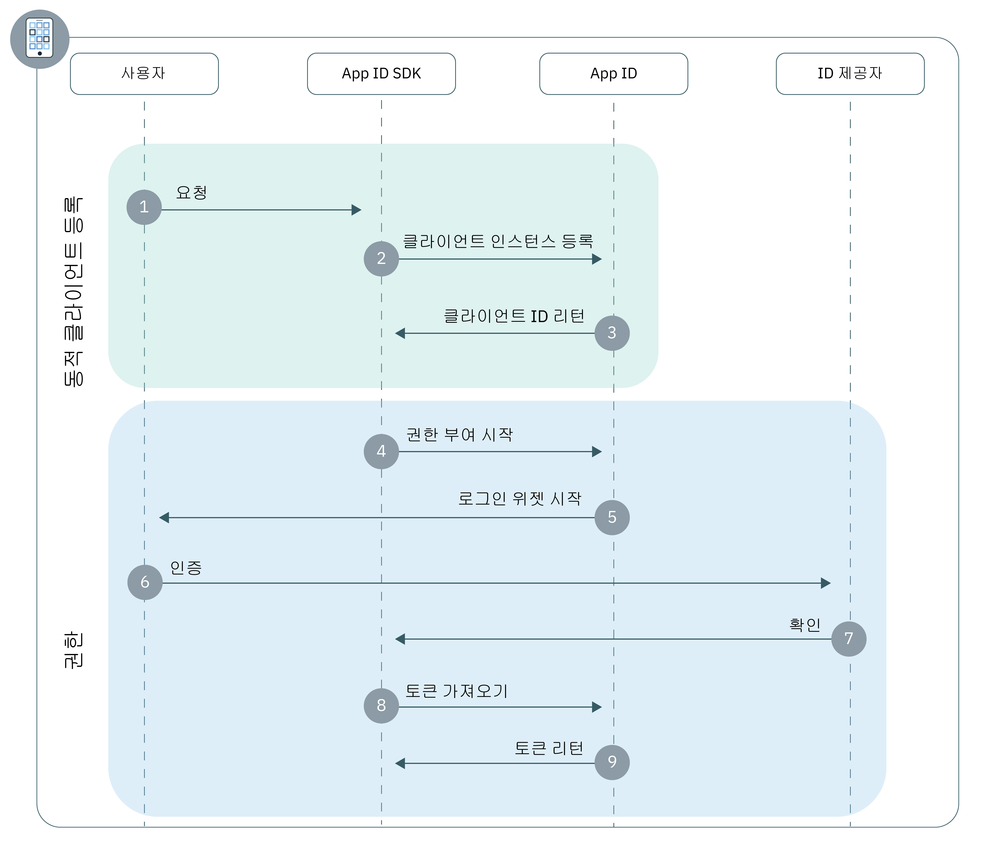

---

copyright:
  years: 2017, 2018
lastupdated: "2018-11-14"

---

{:new_window: target="_blank"}
{:shortdesc: .shortdesc}
{:pre: .pre}
{:tip: .tip}
{:screen: .screen}

# 모바일 앱
{: #adding-mobile}

{{site.data.keyword.appid_full}}를 사용하여 신속하게 원시 또는 하이브리드 모바일 앱에 대한 인증 계층을 생성할 수 있습니다.
{: shortdesc}

## 플로우에 대한 정보
{: #understanding}

**어떤 경우에 이 플로우가 유용합니까?**

모바일 플로우는 사용자의 디바이스에 설치할 앱(원시 애플리케이션)을 개발하는 경우에 유용합니다. 이 플로우를 사용하여 전체 디바이스에서 개인화된 사용자 경험을 제공하기 위해 앱에서 안전하게 사용자를 인증할 수 있습니다.

**이 플로우의 기술적 기반은 무엇입니까?**

원시 애플리케이션은 사용자의 디바이스에 직접 설치되기 때문에 서드파티에서 상대적으로 쉽게 개인 사용자 정보 및 애플리케이션 인증 정보를 추출할 수 있습니다. 기본적으로 이러한 유형의 애플리케이션은 글로벌 인증 정보 또는 사용자 새로 고치기 토큰을 저장할 수 없기 때문에 신뢰할 수 없는 클라이언트로 간주됩니다. 따라서 신뢰할 수 없는 클라이언트를 사용하려면 사용자가 액세스 토큰이 만료될 때마다 해당 인증 정보를 입력해야 합니다.

애플리케이션을 신뢰할 수 있는 클라이언트로 변환하기 위해 {{site.data.keyword.appid_short}}는 [동적 클라이언트 등록](https://tools.ietf.org/html/rfc7591)을 사용합니다. 애플리케이션 인스턴스는 사용자 인증을 시작하기 전에 먼저 {{site.data.keyword.appid_short}}에 OAuth2 클라이언트로 등록됩니다. 클라이언트가 등록되면 애플리케이션에서 디지털 방식으로 서명할 수 있으며 {{site.data.keyword.appid_short}}를 통해 요청에 권한을 부여하기 위해 사용되는 설치 특정 클라이언트 ID를 수신합니다. {{site.data.keyword.appid_short}}의 경우 애플리케이션의 해당 공개 키를 저장하기 때문에 애플리케이션이 기밀 클라이언트로 표시될 수 있도록 허용하는 요청 서명을 유효성 검증할 수 있습니다. 이 프로세스는 애플리케이션에서 인증 정보가 무기한 노출되는 위험을 최소화하고 자동 토큰 새로 고치기를 허용하여 사용자 경험을 개선합니다.

등록 후에는 사용자가 OAuth2 `권한 코드` 또는 `리소스 소유자 비밀번호` [권한 부여](https://tools.ietf.org/html/rfc6749#section-1.3) 플로우를 사용하여 사용자를 인증합니다.

**이 플로우의 형태는 어떻습니까?**



**동적 클라이언트 등록**

1. 사용자는 {{site.data.keyword.appid_short}} SDK에 대한 클라이언트 애플리케이션의 요청을 트리거하는 조치를 수행합니다.
2. 앱이 아직 모바일 클라이언트로 등록되지 않은 경우 SDK에서 동적 등록 플로우를 시작합니다.
3. 정상적으로 등록되면 {{site.data.keyword.appid_short}}에서 설치 특정 클라이언트 ID를 리턴합니다.

**권한 부여 플로우**

1. {{site.data.keyword.appid_short}} SDK는 {{site.data.keyword.appid_short_notm}} `/authorization` 엔드포인트를 사용하여 권한 부여 프로세스를 시작합니다.
2. 로그인 위젯이 사용자에게 표시됩니다.
3. 사용자는 구성된 ID 제공자 중 하나를 사용하여 인증합니다.
4. {{site.data.keyword.appid_short}}에서 권한 부여를 리턴합니다.
5. 권한 부여는 {{site.data.keyword.appid_short_notm}} `/token` 엔드포인트의 액세스, ID 및 새로 고치기 토큰으로 교환됩니다.


## {{site.data.keyword.appid_short}} SDK를 사용하여 모바일 앱 구성
{: #configuring}

SDK를 사용하여 {{site.data.keyword.appid_short}}를 시작하십시오.
{: shortdesc}

**시작하기 전에**

다음 정보가 필요합니다.

* {{site.data.keyword.appid_short_notm}} 인스턴스

* 인스턴스의 테넌트 ID. 이 ID는 서비스 대시보드의 **서비스 인증 정보** 탭에서 찾을 수 있습니다.

* 인스턴스의 배치 {{site.data.keyword.Bluemix}} 지역. 콘솔을 보고 지역을 찾을 수 있습니다.

  <table><caption> 표 1. {{site.data.keyword.Bluemix_notm}} 지역 및 해당 SDK 값</caption>
  <tr>
    <th>{{site.data.keyword.Bluemix}} 지역</th>
    <th>SDK 값</th>
  </tr>
  <tr>
    <td>미국 남부</td>
    <td><code>AppID.REGION_US_SOUTH</code> </td>
  </tr>
  <tr>
    <td>시드니</td>
    <td><code>AppID.REGION_SYDNEY</code></td>
  </tr>
  <tr>
    <td>영국</td>
    <td><code>AppID.REGION_UK</code></td>
  </tr>
  <tr>
    <td>독일</td>
    <td><code>AppID.REGION_GERMANY</code></td>
  </tr>
</table>

## Android SDK로 인증
{: #android-setup}

**시작하기 전에**

시작하기 전에 다음과 같은 전제조건이 준비되어 있어야 합니다.

  * API 27 이상
  * Java 8.x
  * Android SDK 도구 26.1.1+
  * Android SDK 플랫폼 도구 27.0.1+
  * Android 빌드 도구 버전 27.0.0+

</br>

**SDK 설치**

1. Android Studio 프로젝트를 작성하거나 기존 프로젝트를 여십시오.

2. 루트 `build.gradle` 파일에 JitPack 저장소를 추가하십시오.

  ```gradle
    allprojects {
	    repositories {
		    ...
		    maven { url 'https://jitpack.io' }
	    }
    }
  ```
  {: codeblock}

3. 애플리케이션의 `build.gradle` 파일을 찾으십시오. **참고**: 프로젝트 `build.gradle` 파일이 아니라, 반드시 사용자의 앱에 대한 파일을 여십시오.

  1. 종속 항목 섹션에 {{site.data.keyword.appid_short_notm}} 클라이언트 SDK를 추가하십시오.

    ```gradle
    dependencies {
       compile group: 'com.github.ibm-cloud-security:appid-clientsdk-android:4.+'
    }
    ```
    {: codeblock}

  2. `defaultConfig` 섹션에서 경로 재지정 스킴을 구성하십시오.

    ```gradle
    defaultConfig {
      ...
      manifestPlaceholders = ['appIdRedirectScheme': android.defaultConfig.applicationId]
    }
    ```
    {: codeblock}

6. 프로젝트를 Gradle과 동기화하십시오. **도구 > Android > Gradle 파일과 프로젝트 동기화**를 클릭하십시오.

</br>

**SDK 초기화**


1. SDK를 구성하기 위한 초기화 메소드에 컨텍스트, 테넌트 ID 및 지역 매개변수를 전달하십시오.

    필수는 아니지만 일반적으로 초기화 코드를 넣는 위치는 Android 애플리케이션에서 기본 활동의 onCreate 메소드에 있습니다.
    {: tip}

    ```java
    AppID.getInstance().initialize(getApplicationContext(), <tenantId>, <region>);
    ```
    {: codeblock}

</br>
</br>

## iOS Swift SDK로 인증
{: #ios-setup}

{{site.data.keyword.appid_short}} 클라이언트 SDK를 사용하여 모바일 애플리케이션을 보호하십시오.
{:shortdesc}

</br>
**시작하기 전에**

시작하기 전에 다음과 같은 전제조건이 준비되어 있어야 합니다.

  * Xcode 9.0 이상
  * CocoaPods 1.1.0 이상
  * iOS 10.0 이상

</br>

**SDK 설치**

{{site.data.keyword.appid_short_notm}} 클라이언트 SDK는 Swift 및 Objective-C Cocoa 프로젝트의 종속성 관리자인 CocoaPods를 사용하여 분배됩니다. CocoaPods는 아티팩트를 다운로드하고 프로젝트에서 아티팩트를 사용할 수 있게 합니다.

1. Xcode 프로젝트를 작성하거나 기존 프로젝트를 여십시오.

2. 프로젝트 디렉토리에서 기존 `Podfile`을 열거나 새로 작성하십시오.

3. 대상의 종속 항목에 `IBMCloudAppID` 팟(Pod) 및 `use_frameworks!` 명령을 추가하십시오.

  ```swift
  target '<yourTarget>' do
     use_frameworks!
     pod 'IBMCloudAppID'
  end
  ```
  {: codeblock}

4. 프로젝트 디렉토리 내의 명령행에서 종속 항목을 설치하십시오.

  ```swift
  $ pod install --repo-update
  ```
  {: codeblock}

5. 설치가 완료되면 Xcode 프로젝트 및 링크된 종속 항목이 포함된 `<your app>.xcworkspace` 파일을 여십시오.

6. Xcode 프로젝트에서 키 체인 공유를 사용으로 설정하십시오. **프로젝트 설정 > 기능 > 키 체인 공유**로 이동하고 **키 체인 공유 사용**을 선택하십시오.

7. **프로젝트 설정 > 정보 > URL 유형**을 열고 **URL 유형**을 추가하십시오. **Identifier** 및 **URL 스킴** 텍스트 상자 모두에 다음 값을 배치하십시오.

  ```
  $(PRODUCT_BUNDLE_IDENTIFIER)
  ```
  {: codeblock}

</br>

**SDK 초기화**

1. initialize 메소드에 테넌트 ID 및 지역 매개변수를 전달하여 클라이언트 SDK를 초기화하십시오.

  ```swift
    AppID.sharedInstance.initialize(tenantId: <tenantId>, region: <region>)
  ```
  {: codeblock}

  필수는 아니지만 일반적으로 초기화 코드를 배치하는 위치는 Swift 애플리케이션에서 AppDelegate 파일의 `application:didFinishLaunchingWithOptions` 메소드에 있습니다.
  {: tip}

2. {{site.data.keyword.appid_short}} SDK를 `AppDelegate` 파일로 가져오십시오.

  ```swift
  import IBMCloudAppID
  ```
  {: codeblock}

3. {{site.data.keyword.appid_short}}를 통해 경로 재지정을 처리하도록 애플리케이션을 구성하십시오.

  ```swift
  func application(application: UIApplication, open url: URL, options :[UIApplicationOpenURLOptionsKey: Any]) -> Bool {
      return AppID.sharedInstance.application(application, open: url, options: options)
  }
  ```
  {: codeblock}

</br>
</br>

## 보호된 API에 액세스
{: #accessing-protected-apis}

로그인 플로우가 정상적으로 완료되면 액세스 및 ID 토큰을 사용하여 SDK를 사용하는 보호된 백엔드 리소스 또는 원하는 네트워크 라이브러리를 호출할 수 있습니다.

</br>

### Swift SDK를 사용하여 보호된 API에 액세스

1.  보호된 리소스 요청을 호출하려는 파일에 다음 가져오기를 추가하십시오.

  ```swift
  import BMSCore
  import IBMCloudAppID
  ```
  {: codeblock}

2. 보호된 리소스를 호출하십시오.

   ```swift
  BMSClient.sharedInstance.initialize(region: <region>)
  BMSClient.sharedInstance.authorizationManager = AppIDAuthorizationManager(appid: AppID.sharedInstance)

  let request =  Request(url: "<your protected resource url>")

  request.send { (response: Response?, error: Error?) in

      guard let response = response, error == null else {
          print("An error occurred invoking a protected resources", error?.localizedDescription ?? "No response was received")
          return;
      }
      // use your response object
  })
  ```
  {: codeblock}

</br>

### Android SDK를 사용하여 보호된 API에 액세스

1. 보호된 리소스 요청을 호출하려는 파일에 다음 가져오기를 추가하십시오.

  ```java
  import com.ibm.mobilefirstplatform.clientsdk.android.core.api.BMSClient;
  import com.ibm.cloud.appid.android.api.AppIDAuthorizationManager;
  ```

2. 보호된 리소스를 호출하십시오.

   ```java
   BMSClient bmsClient = BMSClient.getInstance();
   bmsClient.initialize(getApplicationContext(), <region>);

   AppIDAuthorizationManager appIdAuthMgr = new AppIDAuthorizationManager(AppID.getInstance())
   bmsClient.setAuthorizationManager(appIdAuthMgr);

   Request request = new Request("<your protected resource url>", Request.GET);
   request.send(this, new ResponseListener() {

   @Override
   public void onSuccess (Response response) {
       Log.d("My app", "onSuccess :: " + response.getResponseText());
   }

   @Override
   public void onFailure (Response response, Throwable t, JSONObject extendedInfo) {
       if (null != t) {
           Log.d("My app", "onFailure :: " + t.getMessage());
       } else if (null != extendedInfo) {
           Log.d("My app", "onFailure :: " + extendedInfo.toString());
       } else {
           Log.d("My app", "onFailure :: " + response.getResponseText());
           }
       }
   });
  ```
  {: codeblock}

</br>

### SDK를 사용하지 않고 보호된 API에 액세스

원하는 라이브러리를 사용하여 `권한` 요청 헤더에서 `전달자` 인증 스킴을 사용하여 액세스 토큰을 전송하도록 설정하십시오.

요청 형식 예제:

  ```
  GET /resource HTTP/1.1
  Host: server.example.com
  Authorization: Bearer <access token> <optional identity token>
  ```
  {: screen}

</br>
</br>

## 다음 단계
{: #next}

애플리케이션에 {{site.data.keyword.appid_short}}가 설치되면 사용자 인증을 시작할 준비가 거의 된 것입니다! 이제 다음 활동 중 하나를 수행하십시오.

* [ID 제공자] 구성(/docs/services/appid/identity-providers.html)
* [로그인 위젯] 사용자 정의 및 구성(/docs/services/appid/login-widget.html)
* <a href="https://github.com/ibm-cloud-security/appid-clientsdk-android" target="_blank">Android SDK</a>에 대한 정보 확인
* <a href="https://github.com/ibm-cloud-security/appid-clientsdk-swift" target="_blank">iOS SDK</a>에 대한 정보 확인
