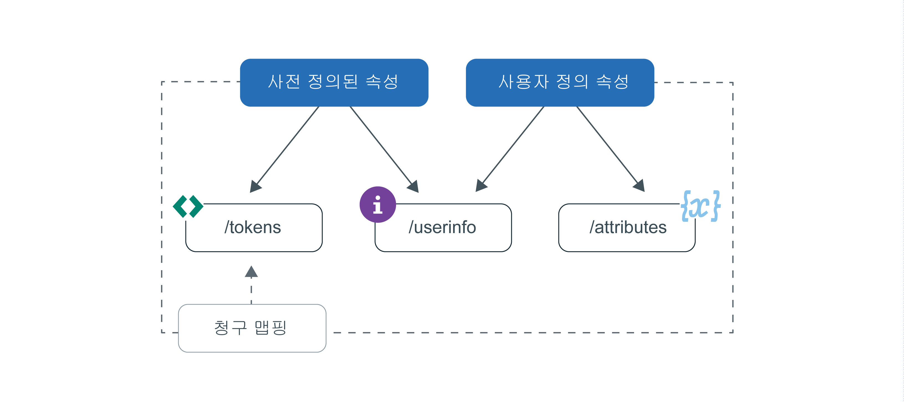

---

copyright:
  years: 2017, 2019
lastupdated: "2019-06-06"

keywords: Authentication, authorization, identity, app security, secure, attributes, user information, storing, accessing

subcollection: appid

---

{:new_window: target="_blank"}
{:shortdesc: .shortdesc}
{:screen: .screen}
{:pre: .pre}
{:table: .aria-labeledby="caption"}
{:codeblock: .codeblock}
{:tip: .tip}
{:note: .note}
{:important: .important}
{:deprecated: .deprecated}
{:download: .download}
{:java: .ph data-hd-programlang='java'}
{:javascript: .ph data-hd-programlang='javascript'}
{:swift: .ph data-hd-programlang='swift'}
{:curl: .ph data-hd-programlang='curl'}


# 프로파일 저장 및 액세스
{: #profiles}

사용자 프로파일은 특정 사용자에 대해 알려진 모든 정보로서, 하나의 오브젝트로 컴파일되고 {{site.data.keyword.appid_full}}에 의해 저장됩니다. 이 정보는 앱과 상호작용하는 사용자에 대해 사전 정의되거나 지정되거나 학습된 정보일 수 있습니다. 프로파일 기능을 활용하여 사용자별로 개별화된 앱 환경을 구축할 수 있습니다.
{: shortdesc}


Cloud Directory 사용자에 대한 정보를 찾고 있습니까? [사용자 관리](/docs/services/appid?topic=appid-cd-users)를 확인하십시오.
{: tip}

App ID에서 획득하여 저장할 수 있는 두 가지 유형의 정보는 사전 정의된 속성과 사용자 정의 속성입니다. 사전 정의된 속성은 사용자 ID로 국한되며, 사용자가 앱에 사인인할 때 ID 제공자에 의해 리턴되고, 사용자 이름 및 연령 등의 정보를 포함할 수 있습니다. 사용자 정의 속성은 사용자에 대한 추가 정보를 저장하는 데 사용됩니다. 이 속성은 본인이 직접 설정하거나 사용자가 앱과 상호작용할 때 해당 사용자에 대해 학습될 수 있습니다. 사용자 정의 속성에는 지정된 역할, 음식 선호도 또는 비행기에서 선호하는 통로 좌석 등이 포함될 수 있습니다. 


그림. 사용자 프로파일 정보 플로우


각각의 사용자에 대해 100KB의 정보를 저장할 수 있습니다.
{: note}


## 사용자 프로파일 액세스
{: #profile-access}

여러 가지 방법으로 속성에 액세스할 수 있습니다. 사용자 인증이 정상적으로 완료되면 앱은 {{site.data.keyword.appid_short_notm}}로부터 액세스 및 ID 토큰을 받습니다. 사용자 정보 및 사용자 정의 속성 엔드포인트는 모두 인증 프로세스의 끝 부분에 {{site.data.keyword.appid_short_notm}}에서 생성되는 액세스 토큰으로 보호됩니다. ID 토큰에는 ID 제공자가 리턴하는 사용자 속성(정보)의 정규화된 서브세트가 포함되어 있습니다. 사용자 속성에 대한 전체 목록을 가져오려는 경우 OIDC [`/userinfo` 엔드포인트](https://us-south.appid.cloud.ibm.com/swagger-ui/#/Authorization_Server_V4/userInfo)를 사용할 수 있습니다. 
{: shortdesc}


ID 및 액세스 토큰에 대한 자세한 정보는 [토큰에 대한 정보](/docs/services/appid?topic=appid-tokens#tokens) 및 [토큰 유효성 검증](/docs/services/appid?topic=appid-token-validation)을 참조하십시오. 


사용자 정보를 얻을 수 있는 여러 가지 방법을 확인하려면 다음 이미지를 검토하십시오. 


그림. 사용자 프로파일 액세스 옵션


App ID는 속성의 서브세트를 사용자의 액세스 및 ID 토큰에 자동으로 삽입합니다. 사용자는 사용자 정의 청구 맵핑을 활용하여 다른 사전 정의된 청구와 사용자 정의 청구를 토큰에 맵핑할 수 있습니다. 사용자 정보에 액세스할 때 권장되는 방법에 대한 자세한 정보는 [토큰 사용자 정의](/docs/services/appid?topic=appid-customizing-tokens)를 참조하십시오.
{: note}


### SDK로 /userinfo 엔드포인트 액세스
{: #profile-predefined-access}

구성된 ID 제공자가 제공하는 사용자 정보를 확인하기 위해 사전 정의된 속성에 액세스할 수 있습니다.
{: shortdesc}

**iOS Swift**
{: ph data-hd-programlang='swift'}

새 토큰이 SDK에 명시적으로 전달되지 않으면 {{site.data.keyword.appid_short_notm}}에서 마지막으로 수신된 토큰을 사용하여 응답을 검색하고 유효성을 검증합니다. 예를 들어, 인증에 성공한 후 다음 코드를 실행할 수 있습니다. 그러면 SDK에서 사용자에 대한 추가 정보를 검색합니다.
{: ph data-hd-programlang='swift'}

```
AppID.sharedInstance.userProfileManager.getUserInfo { (error: Error?, userInfo: [String: Any]?) in
	guard let userInfo = userInfo, err == nil {
		return // an error has occurred
	}
	// retrieved user info successfully
}
```
{: codeblock}
{: ph data-hd-programlang='swift'}

또는 액세스 및 ID 토큰을 명시적으로 전달할 수 있습니다. ID 토큰은 선택사항이지만 전달된 경우 사용자 정보 응답의 유효성을 검증하는 데 사용됩니다.
{: ph data-hd-programlang='swift'}

```
AppID.sharedInstance.userProfileManager.getUserInfo(accessToken: String, identityToken: String?) { (error: Error?, userInfo: [String: Any]?) in
	guard let userInfo = userInfo, err == nil {
		return // an error has occurred
	}
	// retrieved user info successfully
}
```
{: codeblock}
{: ph data-hd-programlang='swift'}

**Java**
{: ph data-hd-programlang='java'}

새 토큰이 SDK에 명시적으로 전달되지 않으면 {{site.data.keyword.appid_short_notm}}에서 마지막으로 수신된 토큰을 사용하여 응답을 검색하고 유효성을 검증합니다. 예를 들어, 인증에 성공한 후 다음 코드를 실행할 수 있습니다. 그러면 SDK에서 사용자에 대한 추가 정보를 검색합니다.
{: ph data-hd-programlang='java'}

```
AppID appId = AppID.getInstance();

appId.getUserProfileManager().getUserInfo(new UserProfileResponseListener() {
	@Override
	public void onSuccess(JSONObject userInfo) {
		// retrieved user info successfully
	}

	@Override
	public void onFailure(UserInfoException e) {
		// exception occurred
	}
});
```
{: codeblock}
{: ph data-hd-programlang='java'}

또는 액세스 및 ID 토큰을 명시적으로 전달할 수 있습니다. ID 토큰은 선택사항입니다. 전달된 경우 응답의 유효성을 검증하는 데 사용됩니다.
{: ph data-hd-programlang='java'}

```
AppID appId = AppID.getInstance();

appId.getUserProfileManager().getUserInfo(accessToken, identityToken, new UserProfileResponseListener() {
	@Override
	public void onSuccess(JSONObject userInfo) {
		// retrieved attribute "name" successfully
	}

	@Override
	public void onFailure(UserInfoException e) {
		// exception occurred
	}
});
```
{: codeblock}
{: ph data-hd-programlang='java'}

**Node.js**
{: ph data-hd-programlang='javascript'}

서버 측 SDK를 사용하여 사용자에 대한 추가 정보를 검색할 수 있습니다. 저장된 액세스 및 ID 토큰을 사용하여 다음 메소드를 호출할 수 있습니다. 또는 명시적으로 토큰을 전달할 수 있습니다. ID 토큰은 선택사항이지만 전달된 경우 사용자 정보 응답의 유효성을 검증하는 데 사용됩니다.
{: ph data-hd-programlang='javascript'}

```javascript
let userProfileManager = UserProfileManager(options: options)

let accessToken = req.session[WebAppStrategy.AUTH_CONTEXT].accessToken;
let identityToken = req.session[WebAppStrategy.AUTH_CONTEXT].identityToken;


// Retrieve user info and validate against the given identity token
userProfileManager.getUserInfo(accessToken, identityToken).then(function (profile) {
	// retrieved user info successfully
});

// Retrieve user info without validation
userProfileManager.getUserInfo(accessToken).then(function (profile) {
	// retrieved user info successfully
});
```
{: codeblock}
{: ph data-hd-programlang='javascript'}


**서버 측 Swift**
{: ph data-hd-programlang='swift'}

서버 측 SDK를 사용하여 사용자에 대한 추가 정보를 검색할 수 있습니다. 저장된 액세스 및 ID 토큰을 사용하여 다음 메소드를 호출할 수 있습니다. 또는 명시적으로 토큰을 전달할 수 있습니다. ID 토큰은 선택사항이지만 전달된 경우 사용자 정보 응답의 유효성을 검증하는 데 사용됩니다.
{: ph data-hd-programlang='swift'}


```swift
let userProfileManager = UserProfileManager(options: options)

let accessToken = "<access token>"
let identityToken = "<identity token>"

// If identity token is provided (recommended approach), response is validated against the identity token
userProfileManager.getUserInfo(accessToken: accessToken, identityToken: identityToken) { (err, userInfo) in
	guard let userInfo = userInfo, err == nil {
		return // an error has occurred
	}
	// retrieved user info successfully
}

// Retrieve the UserInfo without any validation
userProfileManager.getUserInfo(accessToken: accessToken) { (err, userInfo) in
	guard let userInfo = userInfo, err == nil {
		return // an error has occurred
	}
	// retrieved user info successfully
}
```
{: codeblock}
{: ph data-hd-programlang='swift'}


### API로 /userinfo 엔드포인트 액세스
{: #profile-predefined-api}


`/userinfo` 엔드포인트를 통해 추가 정보를 볼 수 있습니다.

1. `openid` 범위를 사용하여 올바른 액세스 토큰이 있는지 확인하십시오. `/introspect` 엔드포인트를 사용하여 토큰이 올바른지 확인할 수 있습니다.

2. [`/userinfo` 엔드포인트](https://us-south.appid.cloud.ibm.com/swagger-ui/#/Authorization_Server_V4/userInfo)에 대한 요청을 작성하십시오.
  ```
  GET [POST] https://{oauth-server-endpoint}/userinfo
  Authorization: 'Bearer {ACCESS_TOKEN}'
  ```
  {: codeblock}

  출력 예:
  ```
  "sub": "cad9f1d4-e23b-3683-b81b-d1c4c4fd7d4c",
  "name": "John Doe",
  "email": "john.doe@gmail.com",
  "picture": "https://lh3.googleusercontent.com/-XdUIqdbhg/AAAAAAAAI/AAAAAAA/42rbcbv5M/photo.jpg",
  "gender": "male",
  "locale": "en",
  "identities": [
      {
          "provider": "google",
          "id": "104560903311317789798",
          "profile": {
              "id": "104560903311317789798",
              "email": "john.doe@gmail.com",
              "verified_email": true,
              "name": "John Doe",
              "given_name": "John",
              "family_name": "Doe",
              "link": "https://plus.google.com/104560903311317789798",
              "picture": "https://lh3.googleusercontent.com/-XdUIqdbhg/AAAAAAAAI/AAAAAAA/42rbcbv5M/photo.jpg",
              "gender": "male",
              "locale": "en",
              "idpType": "google"
          }
      }
  ]
  ```
  {: screen}

3. `sub` 청구가 ID 토큰의 `sub` 청구와 정확히 일치하는지 확인하십시오. 일치하지 않는 경우 리턴된 정보를 사용하지 마십시오. 토큰 대체에 대해 자세히 알아보려면 <a href="https://openid.net/specs/openid-connect-core-1_0.html#TokenSubstitution" target="__blank">OIDC 스펙 </a>을 참조하십시오.

외부 ID 제공자가 변경사항을 작성한 경우 사용자가 다시 로그인할 때 업데이트된 정보를 가져올 수 있습니다. 새 토큰이 최신 데이터를 검색합니다.
{: tip}


### `/attributes` 엔드포인트 액세스
{: #profile-attributes-access}

구성에 따라 속성은 사용자가 애플리케이션과 상호작용할 때 암호화되어 사용자 프로파일의 일부로 저장됩니다. 이 상호작용은 사용자의 사인인 또는 앱의 환경 설정이 될 수 있습니다. 속성에 액세스하려면 API 메소드를 통해 액세스 토큰을 전달하십시오.
{: shortdesc}

**iOS Swift**
{: ph data-hd-programlang='swift'}

  ```
  func setAttribute(key: String, value: String, completionHandler: @escaping(Error?, [String:Any]?) -> Void)
  func setAttribute(key: String, value: String, accessTokenString: String, completionHandler: @escaping(Error?, [String:Any]?) -> Void)

  func getAttribute(key: String, completionHandler: @escaping(Error?, [String:Any]?) -> Void)
  func getAttribute(key: String, accessTokenString: String, completionHandler: @escaping(Error?, [String:Any]?) -> Void)

  func getAttributes(completionHandler: @escaping(Error?, [String:Any]?) -> Void)
  func getAttributes(accessTokenString: String, completionHandler: @escaping(Error?, [String:Any]?) -> Void)

  func deleteAttribute(key: String, completionHandler: @escaping(Error?, [String:Any]?) -> Void)
  func deleteAttribute(key: String, accessTokenString: String, completionHandler: @escaping(Error?, [String:Any]?) -> Void)
  ```
  {: codeblock}
  {: ph data-hd-programlang='swift'}

  **Java**
  {: ph data-hd-programlang='java'}

  ```
void setAttribute(@NonNull String name, @NonNull String value, UserAttributeResponseListener listener);
void setAttribute(@NonNull String name, @NonNull String value, @NonNull AccessToken accessToken, UserAttributeResponseListener listener);

  void getAttribute(@NonNull String name, UserAttributeResponseListener listener);
void getAttribute(@NonNull String name, @NonNull AccessToken accessToken, UserAttributeResponseListener listener);

  void deleteAttribute(@NonNull String name, UserAttributeResponseListener listener);
void deleteAttribute(@NonNull String name, @NonNull AccessToken accessToken, UserAttributeResponseListener listener);

  void getAllAttributes(@NonNull UserAttributeResponseListener listener);
void getAllAttributes(@NonNull AccessToken accessToken, @NonNull UserAttributeResponseListener listener);
  ```
  {: codeblock}
  {: ph data-hd-programlang='java'}

  **Node.js**
  {: ph data-hd-programlang='javascript'}

  ```
function getAllAttributes(accessTokenString) {}
	function getAttribute(accessTokenString, key) {}
	function setAttribute(accessTokenString, key, value) {}
	function deleteAttribute(accessTokenString, name) {}
  ```
  {: codeblock}
  {: ph data-hd-programlang='javascript'}

  **서버 측 Swift**
  {: ph data-hd-programlang='swift'}

  ```
  func getAllAttributes(accessToken: String, completionHandler: (Swift.Error?, [String: Any]?) -> Void)
  func getAttribute(accessToken: String, attributeName: String, completionHandler: (Swift.Error?, [String: Any]?) -> Void)
  func setAttribute(accessToken: String, attributeName: String, attributeValue : "abc", completionHandler: (Swift.Error?, [String: Any]?) -> Void)
  func deleteAllAttributes(accessToken: String, completionHandler: (Swift.Error?, [String: Any]?) -> Void)
  ```
  {: codeblock}
  {: ph data-hd-programlang='swift'}


## 사용자 정의 속성 설정
{: #profile-set-custom}

사용자 정의 속성을 설정하여 사용자 정보(예: 역할 또는 선호도)를 사용자 프로파일에 추가할 수 있습니다.
{: shortdesc}

기본적으로 사용자 정의 속성은 수정 가능하며 클라이언트 애플리케이션의 App ID 액세스 토큰을 사용하여 업데이트할 수 있습니다. 즉, 액세스 토큰에 대한 액세스 권한이 있을 경우 적절한 예방조치를 수행하지 않고 첫 번째 사용자 사인인 이후 즉시 사용자 또는 애플리케이션이 사용자 정의 속성을 업데이트할 수 있습니다. 이로 인해 잠재적으로 의도하지 않은 결과가 발생할 수 있습니다. 예를 들어 사용자가 해당 역할을 사용자에서 관리자로 변경하여 악성 사용자에게 관리 권한을 노출시킬 수 있습니다.
{: important}

1. App ID 대시보드의 **프로파일** 탭으로 이동한 후 사용자 정의 속성을 **사용**으로 전환하십시오. 
2. [액세스 토큰을 얻으십시오](/docs/services/appid?topic=appid-obtain-tokens). 앱에 대한 수신 요청에는 모두 `access_token`이 포함된 권한 헤더가 있습니다. 
3. [속성 API](https://us-south.appid.cloud.ibm.com/swagger-ui/#/Attributes)를 요청하거나, 제공된 SDK 중 하나를 사용하려면 다음 스니펫 중 하나를 코드에 추가하십시오. 

  **iOS Swift**
  {: ph data-hd-programlang='swift'}

  ```
	AppID.sharedInstance.userProfileManager?.setAttribute("key", "value") { (error, result) in
		guard let result = result, error == nil else {
	  		return // an error has occurred
		}
		// attributes recieved as a Dictionary
	})
  ```
  {: codeblock}
  {: ph data-hd-programlang='swift'}

  **Java**
  {: ph data-hd-programlang='java'}

  ```
  appId.getUserProfileManager().setAttribute(name, value, useThisToken, new UserProfileResponseListener() {
  	@Override
  	public void onSuccess(JSONObject attributes) {
  		// attributes received in JSON format on successful response
  	}

  	@Override
  	public void onFailure(UserAttributesException e) {
  		// exception occurred
  	}
  });
  ```
  {: codeblock}
  {: ph data-hd-programlang='java'}

  **Node.js**
  {: ph data-hd-programlang='javascript'}

  ```
	const userProfileManager = require("ibmcloud-appid").UserProfileManager;
	userProfileManager.init();

	var accessToken = req.session[WebAppStrategy.AUTH_CONTEXT].accessToken;

	userProfileManager.setAttribute(accessToken, name, value).then(function (attributes) {
		// attributes returned as dictionary
	});
  ```
  {: codeblock}
  {: ph data-hd-programlang='javascript'}

**서버 측 Swift**
{: ph data-hd-programlang='swift'}

  ```
  let userProfileManager = UserProfileManager(options: options)
  let accesstoken = "access token"

  userProfileManager.setAttribute(accessToken: accessToken, attributeName: "name", attributeValue : "abc") { (error, response) in
    guard let response = response, error == error else {
      return // an error has occurred
    }
    // attributes received as a Dictionary
  }
  ```
  {: codeblock}
  {: ph data-hd-programlang='swift'}


## 다음 단계
{: #next-custom-attributes}

특정 언어 SDK 관련 작업을 수행하는 방법에 대한 자세한 정보는 다음 GitHub 저장소를 참조하십시오.

* <a href="https://github.com/ibm-cloud-security/appid-clientsdk-android" target="_blank">Android SDK </a>
* <a href="https://github.com/ibm-cloud-security/appid-clientsdk-swift" target="_blank">iOS Swift SDK </a>
* <a href="https://github.com/ibm-cloud-security/appid-serversdk-nodejs" target="_blank">Node.js SDK </a>
* <a href="https://github.com/ibm-cloud-security/appid-serversdk-swift" target="_blank">서버 Swift SDK </a>

