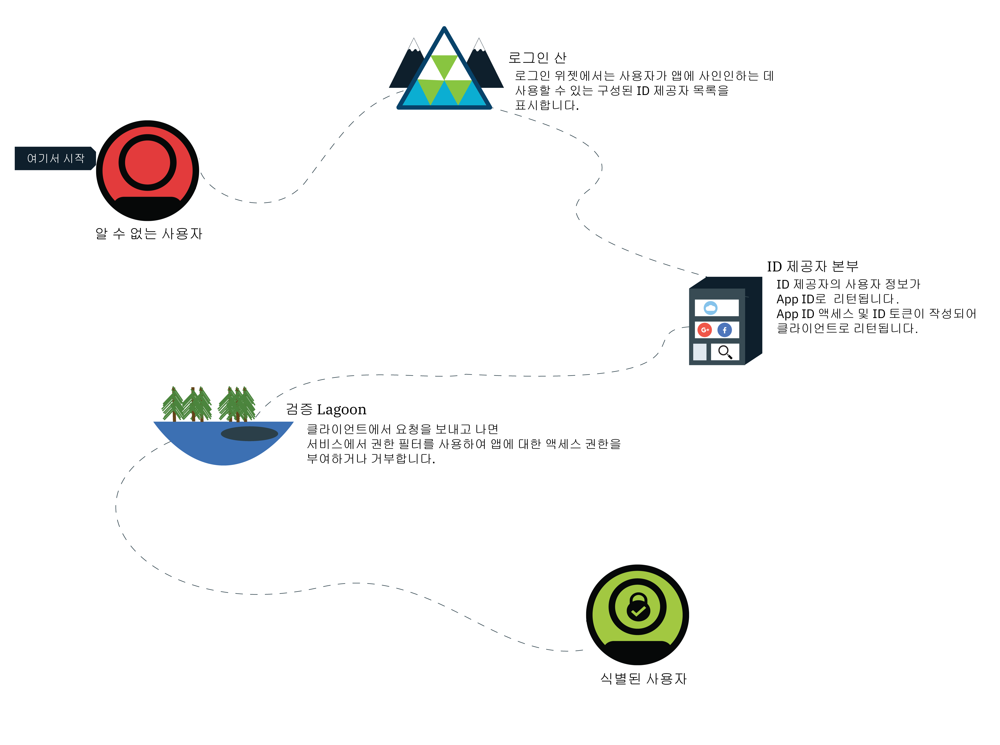
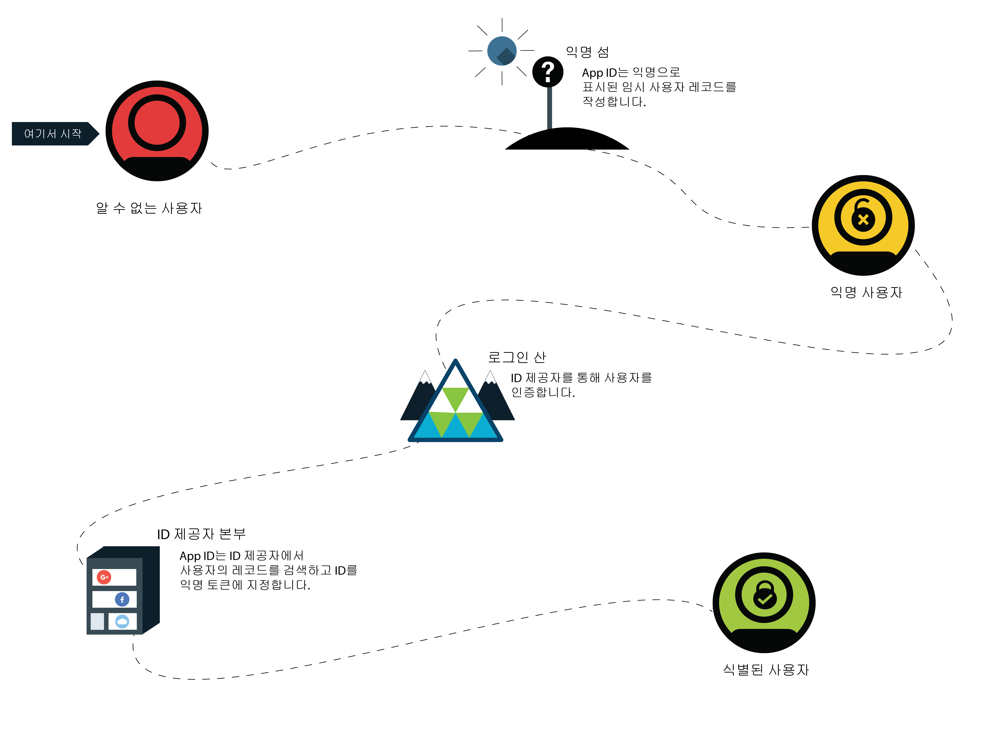

---

copyright:
  years: 2017, 2019
lastupdated: "2019-03-06"

keywords: authentication, authorization, identity, app security, secure, anonymous, progressive, profiles, sign in

subcollection: appid

---

{:new_window: target="_blank"}
{:shortdesc: .shortdesc}
{:screen: .screen}
{:pre: .pre}
{:table: .aria-labeledby="caption"}
{:codeblock: .codeblock}
{:tip: .tip}
{:note: .note}
{:important: .important}
{:deprecated: .deprecated}
{:download: .download}

# 익명 인증
{: #anonymous}

앱을 개발할 때 가장 중요한 문제 중 하나는 보안입니다. 올바른 액세스 권한이 있는 사용자만 앱을 사용할 수 있도록 보장하는 방법은 무엇입니까? 권한 프로세스를 사용해야 합니다. 대부분의 프로세스에서는 권한 부여와 인증이 함께 결합되어 있으므로 보안 정책과 ID 제공자의 변경이 복잡해질 수 있습니다. {{site.data.keyword.appid_full}}에서는 권한 부여와 인증이 개별 프로세스입니다.
{: shortdesc}

사용자가 정상적으로 사인인하면 해당 사용자는 식별된 사용자가 됩니다. ID 제공자는 {{site.data.keyword.appid_short}}에 해당 사용자에 대한 정보가 포함된 액세스 및 ID 토큰을 리턴합니다. 이 서비스에서는 제공된 토큰을 사용하고 사용자가 앱에 액세스하는 데 적절한 권한이 있는지 판별합니다. 토큰이 유효성 검증되면 서비스는 앱에 대한 사용자 액세스 권한을 부여합니다. 인증 정보는 권한이 부여된 후 사용자의 프로파일과 연관됩니다. 프로파일 및 해당 속성은 동일한 ID 제공자로 인증하는 모든 클라이언트에서 다시 액세스할 수 있습니다.

## 점진적 인증
{: #progressive}

{{site.data.keyword.appid_short_notm}}에서는 익명의 사용자가 식별된 사용자가 되도록 선택할 수 있습니다.

사용자가 즉시 사인인하지 않도록 선택하면 익명의 사용자로 간주됩니다. 예를 들어 사용자는 사인인하지 않고 즉시 장바구니에 항목을 추가하기 시작할 수 있습니다. 익명 사용자의 경우 {{site.data.keyword.appid_short_notm}}에서 임시 사용자 프로파일을 작성한 후 익명 액세스 및 ID 토큰을 리턴하는 OAuth 로그인 API를 호출합니다. 앱은 이러한 토큰을 사용하여 사용자 프로파일에 저장되는 속성을 작성, 읽기, 업데이트 및 삭제할 수 있습니다.

익명의 사용자가 사인인하면 해당 액세스 토큰이 로그인 API에 전달됩니다. 서비스가 ID 제공자로 호출을 인증합니다. 이 서비스는 액세스 토큰을 사용하여 익명 프로파일을 찾은 후 사용자의 ID를 해당 프로파일에 연결합니다. 새 액세스 및 ID 토큰에는 ID 제공자가 공유한 공용 정보가 포함됩니다. 사용자가 식별된 후에 익명 토큰은 무효화됩니다. 그러나 새 액세스 토큰으로 속성에 액세스할 수 있으므로 사용자가 계속해서 속성에 액세스할 수 있습니다.

ID가 아직 다른 사용자에게 지정되지 않은 경우에만 익명 프로파일에 지정할 수 있습니다.
{: tip}

ID가 다른 {{site.data.keyword.appid_short_notm}} 사용자와 이미 연관된 경우 토큰에 해당 사용자 프로파일의 정보가 포함되며 해당 속성에 대한 액세스를 제공합니다. 이전 익명 사용자의 속성은 새 토큰을 통해 액세스할 수 없습니다. 토큰이 만료될 때까지는 익명 액세스 토큰을 통해 정보에 계속 액세스할 수 있습니다. 앱을 개발하는 중에 익명 속성을 알려진 사용자와 병합하는 방법을 선택할 수 있습니다.
