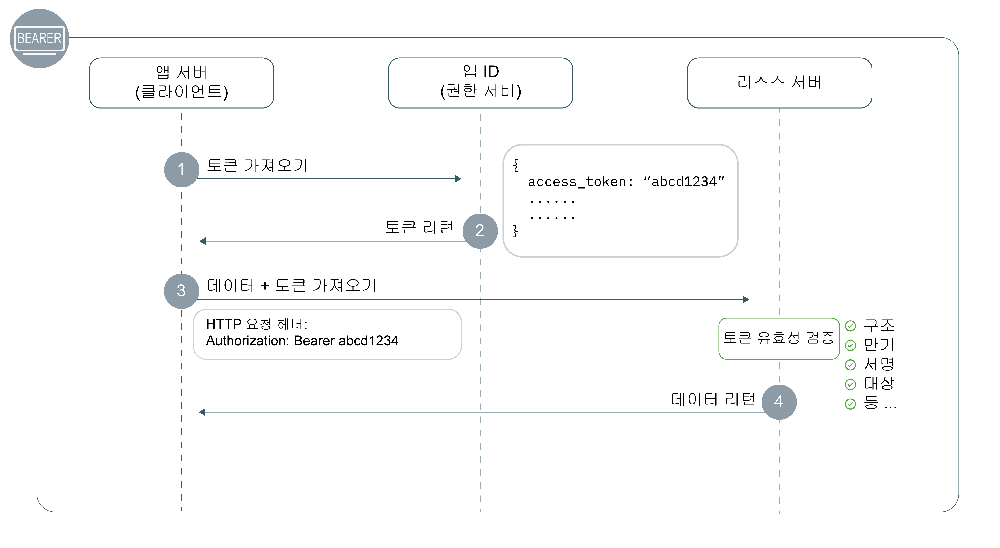

---

copyright:
  years: 2017, 2019
lastupdated: "2019-07-11"

keywords: Authentication, authorization, identity, app security, secure, development, access management, liberty, backend, java, token

subcollection: appid

---

{:external: target="_blank" .external}
{:shortdesc: .shortdesc}
{:screen: .screen}
{:pre: .pre}
{:table: .aria-labeledby="caption"}
{:codeblock: .codeblock}
{:tip: .tip}
{:note: .note}
{:important: .important}
{:deprecated: .deprecated}
{:download: .download}


# 백엔드: Liberty for Java
{: #backend-liberty}

{{site.data.keyword.appid_short_notm}}를 사용하면 API 엔드포인트를 쉽게 보호하고 Liberty for Java 백엔드 애플리케이션의 보안을 유지할 수 있습니다. 이 안내서를 사용하면 20분 이내에 간단한 인증 플로우를 신속하게 시작하고 실행할 수 있습니다.
{: shortdesc}




1. 보호된 자원을 요청하려면 클라이언트에 액세스 토큰이 있어야 합니다. 1단계에서 클라이언트가 {{site.data.keyword.appid_short_notm}}에 토큰을 요청합니다. 액세스 토큰을 얻는 데 관한 자세한 정보는 [토큰 확보](/docs/services/appid?topic=appid-obtain-tokens)를 참조하십시오.
2. {{site.data.keyword.appid_short_notm}}에서 토큰을 리턴합니다.
3. 클라이언트에서 액세스 토큰을 사용하여 보호된 자원에 대한 액세스를 요청합니다.
4. 리소스에서 구조, 만기, 서명, 대상 및 기타 존재하는 필드를 포함하여 토큰의 유효성을 검증합니다. 토큰이 올바르지 않으면 리소스 서버에서 액세스를 거부합니다. 토큰 유효성 검증에 성공하면 데이터를 리턴합니다.


## 동영상 튜토리얼
{: #backend-liberty-video}

{{site.data.keyword.appid_short_notm}}를 사용하여 단순 Liberty for Java 애플리케이션을 보호하는 방법을 보려면 다음 동영상을 확인하십시오. 이 동영상에 포함된 모든 정보는 이 페이지에서 서면으로도 확인할 수 있습니다.

<iframe class="embed-responsive-item" id="appid-liberty-backend-app" title="{{site.data.keyword.appid_short_notm}} 정보" type="text/html" width="640" height="390" src="//www.youtube.com/embed/QA6DY2qqLaw?rel=0" frameborder="0" webkitallowfullscreen mozallowfullscreen allowfullscreen></iframe>

플로우를 사용해 볼 수 있는 앱이 없습니까? 걱정하지 마십시오! {{site.data.keyword.appid_short_notm}}에서 [단순 Liberty for Java 샘플 앱](https://github.com/ibm-cloud-security/appid-video-tutorials/tree/master/02d-simple-liberty-backend-app)을 제공합니다.


## 시작하기 전에
{: #liberty-before}

Liberty for Java 백엔드 애플리케이션에서 {{site.data.keyword.appid_short_notm}}를 시작하기 전에 다음 필수 소프트웨어가 있어야 합니다.

* [{{site.data.keyword.appid_short_notm}} 서비스](https://cloud.ibm.com/catalog/services/app-id){: external} 인스턴스
* [IBM Cloud CLI](/docs/cli?topic=cloud-cli-getting-started)
* [Apache Maven 3.5+](https://maven.apache.org/download.cgi){: external}
* [Java 8+](https://www.java.com/download/){: external}
* 테스트용 [{{site.data.keyword.appid_short_notm}} Postman 콜렉션](https://github.com/ibm-cloud-security/appid-postman){: external}

## 1단계: 인증 정보 얻기
{: #liberty-obtain-credentials}

다음 두 가지 방법 중 하나로 인증 정보를 얻을 수 있습니다.


  * {{site.data.keyword.appid_short_notm}} 대시보드의 **애플리케이션** 탭으로 이동하십시오. 애플리케이션이 없는 경우 **애플리케이션 추가**를 클릭하여 새 애플리케이션을 작성하십시오.

  * [`/management/v4/{tenantId}/applications` 엔드포인트](https://us-south.appid.cloud.ibm.com/swagger-ui/#!/Applications/registerApplication){: external}에 대한 POST 요청을 작성하십시오.

    요청 형식:
    ```
    curl -X POST \  https://us-south.appid.cloud.ibm.com/management/v4/<tenantID>/applications/ \
    -H 'Content-Type: application/json' \
    -H 'Authorization: Bearer IAM_TOKEN' \
    -d '{"name": "ApplicationName"}'
    ```
    {: codeblock}

    응답 예제:
    ```
    {
      "clientId": "xxxxx-34a4-4c5e-b34d-d12cc811c86d",
      "tenantId": "xxxxx-9b1f-433e-9d46-0a5521f2b1c4",
      "secret": "ZDk5YWZkYmYt*******",
      "name": "app1",
      "oAuthServerUrl": "https://us-south.appid.cloud.ibm.com/oauth/v4/xxxxx-9b1f-433e-9d46-0a5521f2b1c4",
      "profilesUrl": "https://us-south.appid.cloud.ibm.com",
      "discoveryEndpoint": "https://us-south.appid.cloud.ibm.com/oauth/v4/xxxxxx-9b1f-433e-9d46-0a5521f2b1c4/.well-known/openid-configuration"
    }
    ```
    {: screen}


## 2단계: `server.xml` 파일 구성
{: #liberty-configure-server}
 
1. `server.xml` 파일을 여십시오.
2. `featureManager` 섹션에 다음 기능을 추가하십시오. 일부 기능은 Liberty와 함께 기본 제공될 수 있습니다. 서버를 실행할 때 오류가 표시되면 Liberty 설치의 bin 디렉토리에서 `.installUtility install <name_of_server>`을 실행하여 설치할 수 있습니다.

    ```xml
    <featureManager>
        <feature>appSecurity-2.0</feature>
        <feature>openidConnectClient-1.0</feature>
        <feature>ssl-1.0</feature>
        <feature>servlet-3.1</feature>
    </featureManager>
    ```
    {: codeblock}

3. `server.xml` 파일에 다음 코드를 추가하여 SSL을 구성하십시오. 

    ```xml
    <keyStore id="defaultKeyStore" password="{password}"/>
    <keyStore id="RootCA" password="{password}" location="${server.config.dir}/resources/security/{myTrustStore}"/>
    <ssl id="{sslID}" keyStoreRef="defaultKeyStore" trustStoreRef="{truststore-ref}"/>
    ```
    {: codeblock}

4. Open ID Connect 클라이언트 기능을 작성한 후 다음과 같은 플레이스홀더를 정의하십시오. 사용자가 얻은 인증 정보를 사용하여 플레이스홀더를 채우십시오.

    ```xml
    <openidConnectClient 
        id="oidc-client-simple-liberty-backend-app" 		
        inboundPropagation="required"
        jwkEndpointUrl="{region}.appid.cloud.ibm.com/oauth/v4/{tenantID}/publickeys"
        issuerIdentifier="{region).appid.cloud.ibm.com/oauth/v4/{tenantID}"
        signatureAlgorithm="RS256"
        audiences="{client-id}"
        sslRef="oidcClientSSL"
    /> 	
    ```
    {: codeblock}

    <table>
    <caption>표. Liberty for Java 앱에 대한 OIDC 요소 변수</caption>
        <tr>
            <th colspan="2"> OIDC 요소 변수 이해 </th>
        </tr>
        <tr>
            <td><code>id</code></td>
            <td>애플리케이션 이름입니다.</td>
        </tr>
        <tr>
            <td><code>inboundPropagation</code></td>
            <td>토큰에서 받은 정보를 전파하려면 값을 "필수"로 설정해야 합니다.</td>
        </tr>
        <tr>
            <td><code> jwkEndpointUrl </code></td>
            <td>토큰의 유효성을 검증하기 위해 키를 얻는 데 사용하는 엔드포인트입니다. 지역 옵션에는 <code>au-syd</code>, <code>eu-de</code>, <code>eu-gb</code>, <code>jp-tok</code> 및 <code>us-south</code>가 있습니다. 이전에 작성한 인증 정보에서 테넌트 ID를 찾을 수 있습니다.</td>
        </tr>
        <tr>
            <td><code> issuerIdentifier </code></td>
            <td>발행자 ID를 통해 권한 서버를 정의합니다. 지역 옵션에는 <code>au-syd</code>, <code>eu-de</code>, <code>eu-gb</code>, <code>jp-tok</code> 및 <code>us-south</code>가 있습니다. 이전에 작성한 인증 정보에서 테넌트 ID를 찾을 수 있습니다.</td>
        </tr>
        <tr>
            <td><code> signatureAlgorithm </code></td>
            <td>"RS256"으로 지정됩니다.</td>
        </tr>
        <tr>
            <td><code>audiences</code></td>
            <td>기본적으로 토큰은 애플리케이션 인증 정보에서 찾을 수 있는 {{site.data.keyword.appid_short_notm}} 클라이언트 ID에 대해 발행됩니다.</td>
        </tr>
        <tr>
            <td><code>sslRef</code></td>
            <td>사용할 SSL 구성의 이름입니다.</td>
        </tr>
    </table>

5. 특수 주제 유형을 `ALL_AUTHENTICATED_USERS`로 정의하십시오.

    ```xml
    <application 
        id="simple-liberty-backend-app" 
        location="location-of-your-war-file" 
        name="simple-liberty-backend-app" 
        type="war">

        <application-bnd>
            <security-role name="myrole">
                <special-subject type="ALL_AUTHENTICATED_USERS"/>
            </security-role>
        </application-bnd>
    </application>
    ```
    {: codeblock}


## 3단계: `web.xml` 파일 구성
{: #liberty-configure-web}

`web.xml` 파일에서 보호할 애플리케이션 영역을 정의하십시오.

1. 보안 역할을 정의하십시오. `server.xml` 파일에서 정의한 역할과 같아야 합니다.

    ```
    <security-role>
		<role-name>myrole</role-name>
	</security-role>
    ```
    {: codeblock}

2. 보안 제한조건을 정의하십시오.

    ```
	<security-constraint>
		<display-name>Security Constraints</display-name>
		<web-resource-collection>
			<web-resource-name>ProtectedArea</web-resource-name>
			<url-pattern>/api/*</url-pattern>
		</web-resource-collection>
		<auth-constraint>
			<role-name>myrole</role-name>
		</auth-constraint>
		<user-data-constraint>
			<transport-guarantee>NONE</transport-guarantee>
		</user-data-constraint>
	</security-constraint>
    ```
    {: codeblock}


## 4단계: 구성 테스트
{: #liberty-test}

이제 초기 설치를 완료했으므로 앱을 빌드하고 구성을 테스트하여 모두 제대로 작동하는지 확인하십시오.

1. 애플리케이션 디렉토리로 변경하십시오.

2. 애플리케이션을 빌드하십시오.

    ```
    server run
    ```
    {: codeblock}

3. 보호된 엔드포인트에 대한 요청을 작성하십시오. 오류가 리턴됩니다.

4. [액세스 토큰을 얻으십시오](/docs/services/appid?topic=appid-obtain-tokens).

5. 이전 단계에서 얻은 액세스 토큰을 사용하여 엔드포인트에 요청하십시오. 이제 보호된 엔드포인트에 액세스할 수 있어야 합니다. 응답에 예상 내용이 포함되었는지 확인하십시오.


## 다음 단계
{: #liberty-next}

인증 경험을 완성할 준비가 되셨습니까? [이 블로그](https://www.ibm.com/cloud/blog/perfecting-the-login-experience-with-liberty-oauth2-and-appid){: external}를 단계별로 수행하거나 [앱 간 통신](/docs/services/appid?topic=appid-app)에 관해 자세히 알아보십시오.


