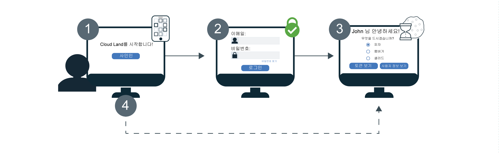

---

copyright:
  years: 2017, 2019
lastupdated: "2019-05-09"

keywords: authentication, authorization, identity, app security, secure, development, sso, directory, users, registry, multiple apps

subcollection: appid

---

{:new_window: target="_blank"}
{:shortdesc: .shortdesc}
{:screen: .screen}
{:pre: .pre}
{:table: .aria-labeledby="caption"}
{:codeblock: .codeblock}
{:tip: .tip}
{:note: .note}
{:important: .important}
{:deprecated: .deprecated}
{:download: .download}


# 싱글 사인온(SSO)
{: #cd-sso}

Cloud Directory에서 싱글 사인온(SSO)을 사용하는 경우 여러 웹 앱 간에 원활한 인증 환경(experience)을 제공할 수 있습니다. 사용자가 처음 로그인할 때 SSO가 켜져 있는 경우 다음 번에 사인인할 때 인증 정보를 다시 입력할 필요가 없습니다. 대신 동일한 {{site.data.keyword.appid_short_notm}} 인스턴스로 보호되는 모든 앱에 자동으로 사인인됩니다.


## 작동 방식
{: #cd-sso-how-it-works}

작동 중인 SSO를 확인하려면 다음 다이어그램을 참조하십시오.



1. Cloud Directory 사용자가 처음으로 앱에 사인인합니다.
2. 사용자 이름 또는 이메일 및 비밀번호를 제공하여 인증하도록 요청받습니다.
3. 인증 정보가 올바른 경우 사용자가 앱에 사인인됩니다. 동시에 {{site.data.keyword.appid_short_notm}}에서 세션을 작성하고 사용자의 브라우저에 쿠키를 설정합니다.
4. 사용자가 다른 애플리케이션 중 하나에 사인인하려고 시도하는 경우 {{site.data.keyword.appid_short_notm}}에서 세션 쿠키를 발견하여 자동으로 사용자를 앱에 사인인합니다. {{site.data.keyword.appid_short_notm}} 세션 쿠키는 인스턴스별로 고유하며 해당 인스턴스의 고유 개인 키로 서명됩니다.

Cloud Directory 뿐만 아니라 SAML 또는 Facebook 등의 ID 제공자를 사용하도록 인스턴스가 구성되어 있는 경우 로그인 위젯이 계속 표시됩니다. 올바른 SSO 세션이 포함되어 있는 경우에도 사용자에게 Cloud Directory 인증 정보를 입력하거나 다른 제공자 중 하나를 선택하도록 요청하는 프롬프트가 표시됩니다.
{: note}


## SSO 구성
{: #cd-sso-configure}

{{site.data.keyword.appid_short_notm}} 대시보드를 사용하거나 API를 사용하여 싱글 사인온을 구성할 수 있습니다.
{: shortdesc}


### GUI 사용
{: #cd-sso-configure-gui}


GUI를 통해 SSO를 구성할 수 있습니다.

1. {{site.data.keyword.appid_short_notm}} 대시보드의 **Cloud Directory > 싱글 사인온** 탭으로 이동하십시오.

2. **싱글 사인온 사용** 상자에서 SSO를 **사용**으로 전환하십시오.

3. SSO 세션이 만료되기 전까지 사용자가 활동하지 않고 머무를 수 있는 시간을 설정하십시오. 세션이 만료되면 다시 사인인해야 합니다. 시간은 분 단위로 지정되며 허용되는 최대 비활동 시간은 10,080분(7일)입니다. 기본 시간은 1일에 해당되는 1440분입니다.

4. **로그아웃 경로 재지정 URI** 상자에 경로 재지정 URI를 추가한 후 **+** 부호를 클릭하십시오. 신뢰할 수 있는 애플리케이션만 등록해야 합니다. URI를 등록하는 경우 {{site.data.keyword.appid_short_notm}}에 해당 URI를 권한 워크플로우에 포함시킬 권한을 부여하게 됩니다.

5. **저장**을 클릭하십시오.


### API 사용
{: #cd-sso-configure-api}

세 가지 설정을 정의하는 SSO 구성 관리 API를 사용하여 기능을 켤 수 있습니다.

호출 예제:

```json
{
  "isActive": true,
  "inactivityTimeoutSeconds": 86400,
  "logoutRedirectUris": [
    "http://my-first-app.com/after_logout",
    "http://my-second-app.com/after_logout"
  ]
}
```
{: screen}

<table>
  <tr>
    <th>설정</th>
    <th>정의</th>
  </tr>
  <tr>
    <td><code>isActive</code></td>
    <td>SSO를 사용하려면 이 값을 <code>true</code>로 설정하십시오. 기본 설정은 <code>false</code>입니다.</td>
  </tr>
  <tr>
    <td><code>inactivityTimeoutSeconds</code></td>
    <td>사용자에게 인증 정보를 다시 입력하도록 요청할 때까지 사용자 활동 없이 보낼 수 있는 최대 시간입니다. 이 값은 초 단위로 지정되며 최대값은 <code>604800 seconds</code>(7일)입니다. 기본 설정은 <code>86400 seconds</code>(1일)입니다.</td>
  </tr>
  <tr>
    <td><code>logoutRedirectUris</code></td>
    <td>{{site.data.keyword.appid_short_notm}}에서 사인아웃한 후 사용자를 경로 재지정할 수 있도록 허용되는 쉼표로 구분된 URI 목록입니다.</td>
  </tr>
</table>


## 로그아웃 구성
{: #cd-sso-log-out}

{{site.data.keyword.appid_short_notm}}를 사용하는 경우 현재 브라우저에 대한 사용자의 SSO 세션을 종료할 수 있습니다. 사용자의 브라우저에서 API 엔드포인트에 액세스하는 경우 해당 세션이 종료되고 사용자가 다음 번에 모든 앱에 대해 해당 브라우저에서 사인인하려고 시도할 때 해당 사용자에게 인증 정보를 입력하도록 요청하는 프롬프트가 표시됩니다.
{: shortdesc}


비밀번호 변경, 재설정 또는 갱신 플로우 중 하나가 시작되면 모든 클라이언트에서 해당 사용자에 대한 세션이 자동으로 종료됩니다.
{: note}


### API 사용
{: #cd-sso-log-out-api}

사용자를 사인아웃하려면 다음 API 호출을 완료하기 위한 정보를 사용하여 해당 브라우저를 경로 재지정하십시오.

```
https://<region>.appid.cloud.ibm.com/oauth/v4/<tenant-id>/cloud_directory/sso/logout?redirect_uri=<redirect_uri>&client_id=<clientId>
```
{: codeblock}

<table>
  <tr>
    <th>변수</th>
    <th>값</th>
  </tr>
  <tr>
    <td><code>지역</code></td>
    <td>{{site.data.keyword.appid_short_notm}} 인스턴스가 프로비저닝되는 지역입니다. 옵션에는 <code>au-syd</code>, <code>eu-de</code>, <code>eu-gb</code>, <code>jp-tok</code> 및 <code>us-south</code>가 있습니다.</td>
  </tr>
  <tr>
    <td><code>tenant-id</code></td>
    <td>{{site.data.keyword.appid_short_notm}} 인스턴스의 고유 ID입니다. 이 값은 {{site.data.keyword.appid_short_notm}} 대시보드의 <em>서비스 인증 정보</em> 탭에서 찾을 수 있습니다. 서비스 인증 정보 세트가 없는 경우 서비스 인증 정보 세트를 작성하여 해당 세트의 값을 사용할 수 있습니다.</td>
  </tr>
  <tr>
    <td><code>redirect_uri</code></td>
    <td>{{site.data.keyword.appid_short_notm}} 대시보드를 통해 SSO 구성에서 지정한 URI입니다. 보안 상의 이유로 값 경로 재지정을 지정하지 않을 경우 오류가 표시됩니다.</td>
  </tr>
</table>

SSO 세션이 종료된 경우에도 해당 토큰이 만료될 때까지 해당 세션에 저장된 유효한 액세스 토큰이 있는 사용자는 인증 정보를 다시 입력하지 않아도 됩니다. 기본적으로 토큰은 1시간 후에 만료됩니다.
{: note}


### Node.JS 서버 SDK 사용
{: #cd-sso-log-out-nodejs}

{{site.data.keyword.appid_short_notm}} Node.js 서버 SDK를 사용하여 경로 재지정을 자동으로 처리할 수도 있습니다.

    예:

```javascript
app.get('/logoutSSO', (req, res) => {
  res.clearCookie("refreshToken");
  webAppStrategy.logoutSSO(req,res, { "redirect_uri": "https://my-app.com/after_logout" });
  });
```
{: screen}


## 사용자의 모든 세션 종료
{: cd-sso-ending-all-sessions}

관리자의 경우 {{site.data.keyword.appid_short_notm}} 관리 API를 사용하여 지정된 사용자에 대한 모든 SSO 세션을 종료할 수 있습니다. 이 API는 Cloud IAM 토큰으로 보호됩니다.

API 요청 예제:

```
POST https://<region>.appid.cloud.ibm.com/management/v4/{tenant-id}/cloud_directory/Users/{user-id}/sso/logout
Headers:
Authorization: <IAM TOKEN>
```
{: codeblock}

<table>
  <tr>
    <th>변수</th>
    <th>값</th>
  </tr>
  <tr>
    <td><code>지역</code></td>
    <td>{{site.data.keyword.appid_short_notm}} 인스턴스가 프로비저닝되는 지역입니다. 옵션에는 <code>us-south</code>, <code>eu-gb</code> 및 <code>eu-de</code>가 있습니다.</td>
  </tr>
  <tr>
    <td><code>tenant-id</code></td>
    <td>{{site.data.keyword.appid_short_notm}} 인스턴스의 고유 ID입니다. 이 값은 {{site.data.keyword.appid_short_notm}} 대시보드의 <em>서비스 인증 정보</em> 탭에서 찾을 수 있습니다. 서비스 인증 정보 세트가 없는 경우 서비스 인증 정보 세트를 작성하여 해당 세트의 값을 사용할 수 있습니다.</td>
  </tr>
  <tr>
    <td><code>user-id</code></td>
    <td>Cloud Directory 사용자의 고유 ID입니다. 이 ID는 [Cloud Directory 사용자 API](https://us-south.appid.cloud.ibm.com/swagger-ui/#/)를 사용하거나 사용자의 ID 토큰을 확인하여 얻을 수 있습니다.</td>
  </tr>
</table>

이 API를 호출하면 지정된 사용자의 모든 SSO 세션이 무효화됩니다. 즉, 사용자가 다음 번에 임의의 디바이스 또는 브라우저에서 임의의 앱에 사인인하려고 시도할 때 인증 정보를 다시 입력해야 합니다.

