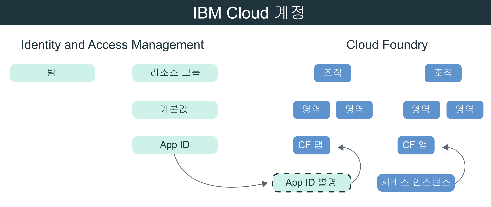

---

copyright:
  years: 2017, 2019
lastupdated: "2019-05-09"

keywords: authentication, authorization, identity, app security, secure, development, cloud foundry, access management, iam, java, node.js

subcollection: appid

---

{:new_window: target="_blank"}
{:shortdesc: .shortdesc}
{:screen: .screen}
{:pre: .pre}
{:table: .aria-labeledby="caption"}
{:codeblock: .codeblock}
{:tip: .tip}
{:note: .note}
{:important: .important}
{:deprecated: .deprecated}
{:download: .download}


# 튜토리얼: {{site.data.keyword.appid_short_notm}}를 사용하도록 Cloud Foundry 구성
{: #cloud-foundry}

{{site.data.keyword.cloud_notm}}를 사용하는 경우 두 가지 서로 다른 유형의 액세스 관리인 IAM(Identity and Access Management) 및 Cloud Foundry를 통해 앱을 보호할 수 있습니다. 기본적으로 {{site.data.keyword.appid_short_notm}}의 모든 새 인스턴스는 IAM 리소스 그룹을 사용하여 액세스를 관리합니다. Cloud Foundry를 사용하여 애플리케이션을 관리하는 경우 서비스 별명을 작성하여 해당 서비스를 앱에 바인딩함으로써 관리 모델을 브릿지할 수 있습니다.
{: shortdesc}


## Cloud Foundry에 대한 정보
{: #cf-understand}

별명은 IAM 관리 서비스(예: {{site.data.keyword.appid_short_notm}} 및 Cloud Foundry 애플리케이션) 간의 연결을 작성합니다. 애플리케이션을 바인딩하는 경우 서비스 인증 정보가 작성되어 자동으로 앱에 전달됩니다. 바인딩은 구성의 필수 단계이지만 다음과 같은 이점이 있습니다.

* 자동화: 서비스 인증 정보가 VCAP_SERVICES 환경 변수에 저장되는 경우 더 이상 수동으로 해당 서비스 인증 정보를 앱에 복사할 필요가 없습니다. 해당 작업은 사용자를 대신하여 {{site.data.keyword.appid_short_notm}} SDK를 통해 백그라운드에서 수행됩니다.
* 안전: 프로세스가 자동이므로 구성 시 오류가 발생하지 않습니다.
* 보안: 서비스 인증 정보가 환경 변수에만 존재하므로 액세스와 관련하여 어떠한 사항도 애플리케이션에 하드 코딩되지 않습니다. 

Cloud Foundry 앱이 다른 플랫폼에서 호스팅되고 있습니까? 문제 없습니다. 앱에서 애플리케이션 인증 정보를 정의하여 서비스에 바인딩할 수 있습니다. 애플리케이션 인증 정보는 {{site.data.keyword.appid_short_notm}} 대시보드를 통해 또는 [/applications 엔드포인트](https://us-south.appid.cloud.ibm.com/swagger-ui/#!/Applications/registerApplication)에 대한 요청을 작성하여 찾을 수 있습니다.
{: tip}

다음 다이어그램에서 모델을 서로 맞추는 방법을 참조하십시오.



## 시작하기 전에
{: #cf-before}

시작하기 전에 다음과 같은 전제조건이 충족되는지 확인하십시오.

* {{site.data.keyword.cloud_notm}} 계정
* {{site.data.keyword.appid_short_notm}}의 인스턴스
* [{{site.data.keyword.cloud_notm}} CLI](/docs/cli/reference/ibmcloud?topic=cloud-cli-ibmcloud-cli#ibmcloud-cli)가 로컬로 설치되어 있음

## Node.js 앱 배치
{: #cf-node}


1. {{site.data.keyword.appid_short_notm}}의 인스턴스로 이동하십시오.

2. 서비스 대시보드의 **개요** 탭에서 **샘플 다운로드**를 클릭하십시오.

3. **Node.js**를 클릭하십시오. 샘플 앱을 다운로드한 후 압축을 푸십시오.

4. 모든 Node.js 전제조건을 충족하는지 확인하십시오.

5. 터미널을 열고 샘플 폴더로 변경하십시오.

6. {{site.data.keyword.cloud_notm}} CLI에 로그인하십시오. 계정 및 지역을 지정하지 않을 경우 CLI에서 계정 및 지역을 선택하도록 요청하는 프롬프트를 표시합니다.

  ```
  ibmcloud login -a cloud.ibm.com -r <region>
  ```
  {: codeblock}

  <table>
    <tr>
      <th>Region</th>
      <th>엔드포인트</th>
    </tr>
    <tr>
      <td>Dallas</td>
      <td><code>us-south</code></td>
    </tr>
    <tr>
      <td>프랑크푸르트</td>
      <td><code>eu-de</code></td>
    </tr>
    <tr>
      <td>시드니</td>
      <td><code>au-syd</code></td>
    </tr>
    <tr>
      <td>런던</td>
      <td><code>eu-gb</code></td>
    </tr>
    <tr>
      <td>토쿄</td>
      <td><code>jp-tok</code></td>
    </tr>
  </table>

7. 작업을 수행할 Cloud Foundry 조직 및 영역을 대상으로 지정한 후 프롬프트의 지시에 따라 조직 및 영역을 대상으로 지정하십시오.

  ```
  ibmcloud target --cf
  ```
  {: codeblock}

8. {{site.data.keyword.appid_short_notm}} 서비스 인스턴스의 별명을 작성하십시오.

  ```
  ibmcloud resource service-alias-create {ALIAS_NAME} --instance-name {SERVICE_INSTANCE_NAME}
  ```
  {: codeblock}

9. 작성한 별명을 `manifest.yml`의 서비스에 추가하십시오. 

10. 샘플 앱을 배치하여 `manifest.yml` 파일에 나열된 서비스를 바인딩하십시오.

  ```
  ibmcloud app push
  ```
  {: codeblock}

## Java 앱 배치
{: #java}

1. {{site.data.keyword.appid_short_notm}}의 인스턴스로 이동하십시오.

2. 서비스 대시보드의 **개요** 탭에서 **샘플 다운로드**를 클릭하십시오.

3. **Java**를 클릭하십시오. 샘플 앱을 다운로드한 후 압축을 푸십시오.

4. 모든 Java 전제조건을 충족하는지 확인하십시오.

5. 터미널을 열고 샘플 폴더로 변경하십시오.

6. `war` 파일을 생성하여 업로드하십시오.

  ```
  mvn clean install
  ```
  {: codeblock}

7. Liberty 폴더로 변경하십시오.

8. {{site.data.keyword.cloud_notm}} CLI에 로그인하십시오. 계정 및 지역을 지정하지 않을 경우 CLI에서 계정 및 지역을 선택하도록 요청하는 프롬프트를 표시합니다.

  ```
  ibmcloud login -a cloud.ibm.com -r <region>
  ```
  {: codeblock}

8. 작업을 수행할 Cloud Foundry 조직 및 영역을 대상으로 지정한 후 프롬프트의 지시에 따라 조직 및 영역을 대상으로 지정하십시오.

  ```
  ibmcloud target --cf
  ```
  {: codeblock}

10. {{site.data.keyword.appid_short_notm}} 서비스 인스턴스의 별명을 작성하십시오.

  ```
  ibmcloud resource service-alias-create {ALIAS_NAME} --instance-name {SERVICE_INSTANCE_NAME}
  ```
  {: codeblock}

11. 작성한 별명을 `manifest.yml`의 서비스에 추가하십시오. 

      예:
  ```
    applications:
  - name: ApplicationName
    memory: 512M
    services:
    - AppID-alias
  ```
  {: screen}

13. 샘플 앱을 배치하여 `manifest.yml` 파일에 나열된 서비스를 바인딩하십시오.

  ```
  ibmcloud app push
  ```
  {: codeblock}

