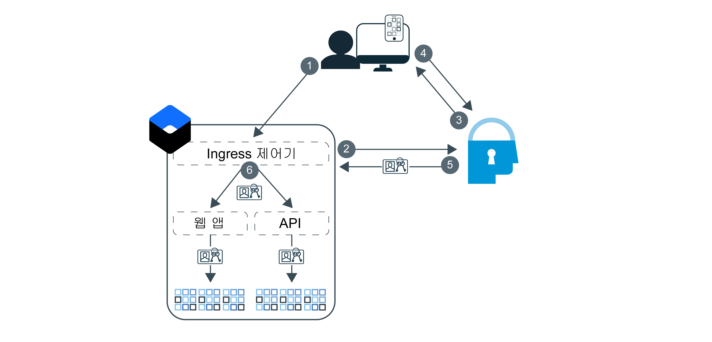

---

copyright:
  years: 2017, 2019
lastupdated: "2019-03-21"

keywords: authentication, authorization, identity, app security, secure, development, ingress, policy, networking, containers, kubernetes

subcollection: appid

---

{:new_window: target="_blank"}
{:shortdesc: .shortdesc}
{:screen: .screen}
{:pre: .pre}
{:table: .aria-labeledby="caption"}
{:codeblock: .codeblock}
{:tip: .tip}
{:note: .note}
{:important: .important}
{:deprecated: .deprecated}
{:download: .download}


# 튜토리얼: {{site.data.keyword.appid_short_notm}}를 사용하도록 Ingress 구성
{: #kube-auth}

{{site.data.keyword.containerlong}}에서 Ingress 네트워크 기능을 사용하여 지속적으로 정책 기반 보안을 적용할 수 있습니다. 이 접근법을 통해 앱 코드를 전혀 변경하지 않고도 동시에 클러스터에 있는 모든 애플리케이션에 대한 권한 및 인증을 사용으로 설정할 수 있습니다! 이 단계별 안내서를 통해 {{site.data.keyword.appid_short_notm}}를 사용하도록 Ingress 제어기를 구성하는 방법에 대해 학습할 수 있습니다.
{: shortdesc}

인증 플로우를 확인하려면 다음 다이어그램을 참조하십시오.



1. 사용자가 애플리케이션을 열고 웹 앱 또는 API에 대한 요청을 트리거합니다.
2. API 플로우의 경우 Ingress 제어기에서 제공된 토큰을 유효성 검증하려고 시도합니다. 웹 플로우가 사용되는 경우 삼각 OIDC 인증 프로세스를 시작합니다.
3. {{site.data.keyword.appid_short_notm}}에서 로그인 위젯을 표시하여 인증 프로세스를 시작합니다.
4. 사용자가 사용자 이름 또는 이메일 및 비밀번호를 제공합니다.
5. Ingress 제어기가 권한을 위해 {{site.data.keyword.appid_short_notm}}로부터 액세스 및 ID 토큰을 획득합니다.
6. Ingress 제어기에서 유효성 검증하여 앱으로 전달하는 모든 요청에는 해당 토큰이 포함된 권한 헤더가 포함되어 있습니다.

{{site.data.keyword.appid_short_notm}}와의 Ingress 제어기 통합에서는 현재 새로 고치기 토큰이 지원되지 않습니다. 액세스 및 ID 토큰이 만료되면 사용자가 재인증해야 합니다.
{: note}


## 시작하기 전에
{: #kube-prereqs}

시작하기 전에 다음과 같은 전제조건이 충족되는지 확인하십시오.
{: shortdesc}

보안 상의 이유로 {{site.data.keyword.appid_short_notm}} 인증에서는 TLS/SSL이 사용으로 설정된 백엔드만 지원됩니다.
{: note}

* 앱 또는 샘플 앱 
* 구역당 두 개 이상의 작업자 노드가 포함된 표준 Kubernetes 클러스터. 다중 구역 클러스터에서 Ingress를 사용 중인 경우 [Kubernetes Service 문서](/docs/containers?topic=containers-ingress#config_prereqs)에서 추가적인 전제조건을 검토하십시오.
* 클러스터가 배치된 것과 동일한 지역에 있는 {{site.data.keyword.appid_short_notm}} 인스턴스. 서비스 이름에 공백이 포함되어서는 안됩니다.

* 다음과 같은 [{{site.data.keyword.cloud_notm}} IAM 역할](/docs/containers?topic=containers-access_reference#access_reference):
  * 클러스터: 관리자 플랫폼 역할
  * Kubernetes 네임스페이스: 관리자 서비스 역할

* 다음과 같은 CLI:

  * [{{site.data.keyword.cloud_notm}}](/docs/cli/reference/ibmcloud/cloud-cli-install_use?topic=cloud-cli-ibmcloud-cli#ibmcloud-cli)
  * [Kubernetes](https://kubernetes.io/docs/tasks/tools/install-kubectl/)
  * [Docker](https://www.docker.com/products/docker-engine#/download)

* 다음과 같은 [{{site.data.keyword.cloud_notm}} CLI 플러그인](/docs/cli/reference/ibmcloud?topic=cloud-cli-plug-ins#plug-ins):

  * Kubernetes Service
  * Container Registry

CLI 및 플러그인을 다운로드하고 Kubernetes Service 환경을 구성하기 위해 [Kubernetes 클러스터 작성](/docs/containers?topic=containers-cs_cluster_tutorial#cs_cluster_tutorial_lesson1) 튜토리얼을 참조하십시오.
{: tip}

시작합니다!

## 1단계: {{site.data.keyword.appid_short_notm}}를 클러스터에 바인딩
{: #kube-create-appid}

클러스터에 배치된 앱의 모든 인스턴스를 사용할 수 있도록 {{site.data.keyword.appid_short_notm}}의 인스턴스를 클러스터에 바인딩할 수 있습니다. 서비스 인스턴스를 클러스터에 바인딩하는 경우 애플리케이션이 Kubernetes 시크릿으로 시작되는 즉시 {{site.data.keyword.appid_short_notm}} 메타데이터 및 인증 정보를 사용할 수 있습니다.
{: shortdesc}


1. {{site.data.keyword.cloud_notm}} CLI에 로그인하십시오. CLI의 프롬프트에 따라 로그인을 완료하십시오.

  ```
  ibmcloud login -a cloud.ibm.com -r <region>
  ```
  {: codeblock}

  <table>
    <tr>
      <th>Region</th>
      <th>엔드포인트</th>
    </tr>
    <tr>
      <td>Dallas</td>
      <td><code>us-south</code></td>
    </tr>
    <tr>
      <td>프랑크푸르트</td>
      <td><code>eu-de</code></td>
    </tr>
    <tr>
      <td>시드니</td>
      <td><code>au-syd</code></td>
    </tr>
    <tr>
      <td>런던</td>
      <td><code>eu-gb</code></td>
    </tr>
    <tr>
      <td>토쿄</td>
      <td><code>jp-tok</code></td>
    </tr>
  </table>

2. 클러스터에 대한 컨텍스트를 설정하십시오.

  1. 환경 변수를 설정하고 Kubernetes 구성 파일을 다운로드하는 명령을 사용하십시오.

    ```
    ibmcloud ks cluster-config <cluster_name_or_ID>
    ```
    {: codeblock}

  2. `KUBECONFIG` 환경 변수를 설정하기 위해 `export`로 시작되는 출력을 복사하여 터미널에 붙여넣으십시오.

3. 기본 네임스페이스에 이미 Ingress 제어기가 포함되어 있는지 확인하십시오. IBM Cloud Kubernetes Service의 경우 네임스페이스당 하나의 Ingress를 지원합니다. 이미 포함되어 있는 경우 기존 Ingress 구성을 업데이트하거나 다른 네임스페이스를 사용할 수 있습니다.

  ```
  kubectl get ingress
  ```
  {: pre}

4. {{site.data.keyword.appid_short_notm}}의 인스턴스를 바인드하십시오. 바인딩하면 서비스 인스턴스에 대한 서비스 키가 작성됩니다. `-key` 플래그를 사용하여 기존 서비스 키를 지정할 수 있습니다.

  ```
  ibmcloud ks cluster-service-bind --cluster <cluster_name_or_ID> --namespace <namespace> --service <App-ID_instance_name> [--key <service_instance_key>]
  ```
  {: pre}

  네임스페이스를 지정하지 않을 경우 `default` 네임스페이스에 시크릿이 작성됩니다.
  {: tip}

  출력 예:

  ```
  ibmcloud ks cluster-service-bind --cluster mycluster --namespace default --service appid1
  Binding service instance to namespace...
  OK
  Namespace:    default
  Secret name:  binding-appid1
  ```
  {: screen}

수고하셨습니다!

## 2단계: 앱을 Container Registry에 푸시
{: #kube-registry}

Kubernetes에서 앱이 실행되도록 하려면 레지스트리에서 해당 앱을 호스팅해야 합니다.
{: shortdesc}


1. Container Registry CLI 플러그인에 사인인하십시오.

  ```
  ibmcloud cr login
  ```
  {: pre}

2. Container Registry 네임스페이스를 작성하십시오.

  ```
  ibmcloud cr namespace-add <my_namespace>
  ```
  {: pre}

3. 앱을 Container Registry의 네임스페이스에 이미지로 빌드, 태그 지정 및 푸시하십시오. 명령의 끝 부분에 마침표(.)가 포함되어야 합니다.

  ```
  ibmcloud cr build -t registry.<region>.bluemix.net/<namespace>/<app-name>:<tag> .
  ```
  {: pre}

수고하셨습니다! 배치할 준비가 거의 완료되었습니다.

## 3단계: Ingress 구성
{: kube-ingress}

클러스터 작성 중에 개인용 및 공용 Ingress ALB가 둘 다 작성됩니다. 애플리케이션을 배치하여 Ingress 제어기를 활용하려면 배치 스크립트를 작성하십시오.
{: shortdesc}

1. {{site.data.keyword.appid_short_notm}}를 클러스터에 바인딩할 때 클러스터 네임스페이스에 작성된 시크릿을 가져오십시오. 참고: Container Registry 네임스페이스가 **아닙니다**.

  ```
  kubectl get secrets --namespace=<namespace>
  ```
  {: pre}

  출력 예:

  ```
  NAME                       TYPE                                  DATA      AGE
  binding-appid1             Opaque                                1         1m
  bluemix-default-secret     kubernetes.io/dockercfg               1         1h
  default-token-kf97z        kubernetes.io/service-account-token   3         1h
  ```
  {: screen}

2. 다음 예제 `yaml` 파일을 사용하여 Ingress 구성을 작성하십시오. 나머지 배치를 정의하기 위해 [CLI를 사용하여 앱 배치](/docs/containers?topic=containers-app#app_cli)를 참조하십시오.

  ```
  apiVersion: extensions/v1beta1
  kind: Ingress
  metadata:
    name: myingress
    annotations:
      ingress.bluemix.net/appid-auth: "bindSecret=<bind_secret> namespace=<namespace> requestType=<request_type> serviceName=<myservice> [idToken=false]"
  spec:
    tls:
    - hosts:
      - mydomain
      secretName: mytlssecret
    rules:
    - host: mydomain
      http:
        paths:
        - path: /
          backend:
            serviceName: myservice
            servicePort: 8080
  ```
  {: screen}

  <table>
    <tr>
      <th>변수</th>
      <th>설명</th>
    </tr>
    <tr>
      <td><code>bindSecret</code></td>
      <td>{{site.data.keyword.appid_short_notm}} 서비스 인스턴스를 클러스터에 바인딩할 때 작성된 Kubernetes 시크릿입니다.</td>
    </tr>
    <tr>
      <td><code>namespace</code></td>
      <td><code>bindSecret</code>이 작성된 네임스페이스입니다. 네임스페이스를 지정하지 않을 경우 <code>default</code> 네임스페이스가 사용됩니다.</td>
    </tr>
    <tr>
      <td><code>requestType</code></td>
      <td><p>{{site.data.keyword.appid_short_notm}}로 전송할 요청의 유형입니다. 옵션에는 <code>web</code> 및 <code>api</code>가 있습니다. 요청 유형을 <code>web</code>으로 설정하는 경우 {{site.data.keyword.appid_short_notm}} 액세스 토큰이 포함된 웹 요청을 유효성 검증합니다. 토큰 유효성 검증에 실패하는 경우 웹 요청이 거부됩니다. 요청에 액세스 토큰이 포함되어 있지 않은 경우 해당 요청은 {{site.data.keyword.appid_short_notm}} 로그인 페이지로 경로 재지정됩니다. {{site.data.keyword.appid_short_notm}} 웹 인증이 작동하려면 사용자의 브라우저에서 쿠키가 사용으로 설정되어 있어야 합니다.</p><p>요청 유형을 <code>api</code>로 설정하는 경우 {{site.data.keyword.appid_short_notm}} 액세스 토큰이 포함된 API 요청을 유효성 검증합니다. 요청에 액세스 토큰이 포함되어 있지 않은 경우 사용자에게 <code>401: Unauthorized</code> 오류 메시지가 리턴됩니다.</p></td>
    </tr>
    <tr>
      <td><code>serviceName</code></td>
      <td><p>필수: 앱을 위해 작성한 Kubernetes 서비스의 이름입니다. 서비스 이름이 포함되어 있지 않은 경우 모든 서비스에 대한 어노테이션이 사용으로 설정됩니다.</p> <p>동일한 클러스터에서 복수의 요청 유형을 사용하려면 <code>web</code>을 사용하도록 {{site.data.keyword.appid_short_notm}}의 인스턴스를 구성하고 <code>api</code>를 사용하도록 다른 인스턴스를 구성하십시오.</p></td>
    </tr>
    <tr>
      <td><code>idToken</code></td>
      <td>선택사항: Liberty OIDC 클라이언트에서는 액세스 및 ID 토큰을 동시에 둘 다 구문 분석할 수 없습니다. Liberty에서 작업하는 경우 ID 토큰이 Liberty 서버로 전송되지 않도록 이 값을 <code>false</code>로 설정하십시오.</td>
    </tr>
    <tr>
      <td><code>secretName</code></td>
      <td>TLS 인증서와 연관된 TLS 시크릿입니다. 인증서가 IBM Cloud Certificate Manager에서 호스팅되는 경우 <code>ibmcloud ks alb-cert-deploy --secret-name <secret_name> --cluster <cluster_name_or_ID> --cert-crn <certificate_crn></code>을 실행하여 해당 인증서를 클러스터에 배치할 수 있습니다. 인증서가 없는 경우 [Ingress를 사용하여 앱을 노출](/docs/containers?topic=containers-ingress#ingress_expose_public)하는 3단계를 완료하십시오.</td>
    </tr>
  </table>

3. 구성 파일을 실행하십시오.

  ```
  kubectl apply -f <file-name>.yaml
  ```
  {: pre}

수고하셨습니다!


## 4단계: 경로 재지정 URL 추가
{: #kube-add-redirect}

경로 재지정 URL은 {{site.data.keyword.appid_short_notm}}에서 인증이 정상적으로 완료된 후 사용자를 전송할 사이트의 URL입니다.
{: shortdesc}

1. {{site.data.keyword.cloud_notm}} GUI로 이동하여 {{site.data.keyword.appid_short_notm}} 대시보드를 여십시오.

2. **ID 제공자 > 관리**에서 사용할 제공자를 **켜기**로 설정하십시오. 제공자를 사용할 수 없는 경우 사용자에게 앱에 대한 익명 액세스 권한을 제공하는 액세스 토큰이 발행됩니다.

3. **인증 설정**을 클릭하십시오.

4. **웹 경로 재지정 URL 추가** 상자에서 **+** 기호를 클릭하십시오.

  * 사용자 정의 도메인:

    사용자 정의 도메인에 등록된 URL의 형식은 `http://mydomain.net/myapp2path/appid_callback`과 유사합니다. 노출하려는 앱이 동일한 클러스터 내에 있지만 서로 다른 네임스페이스에 있는 경우 와일드카드를 사용하여 클러스터에 있는 모든 앱을 한 번에 지정할 수 있습니다. 이 기능은 배치 중에 유용할 수도 있지만 프로덕션에서 와일드카드를 사용하는 경우에는 주의해야 합니다. 예: `https://custom_domain.net/*`

  * Ingress 하위 도메인:

    앱이 IBM Ingress 하위 도메인에 등록된 경우 콜백 URL의 형식은 `https://mycluster.us-south.containers.appdomain.cloud/myapp1path/appid_callback`과 유사합니다.

{{site.data.keyword.appid_short_notm}}에서는 로그아웃 함수를 제공합니다. {{site.data.keyword.appid_short_notm}} 경로에 `/logout`이 존재하는 경우 쿠키가 제거되고 사용자는 다시 로그인 페이지로 전송됩니다. 이 함수를 사용하려면 도메인에 `https://mycluster.us-south.containers.appdomain.cloud/myapp1path/appid_logout` 형식으로 `/appid_logout`을 추가하여 경로 재지정 URL에 포함하십시오.
{: note}


수고하셨습니다! 이제 Ingress 하위 도메인 또는 사용자 정의 도메인으로 이동하여 사용해 봄으로써 배치가 정상적으로 완료되었는지 확인할 수 있습니다.


## 다음 단계
{: #kube-next}

애플리케이션이 Kubernetes 클러스터에서 실행 중이고 Ingress가 구성되어 있으므로 다음 작업을 시도할 수 있습니다.

* 사용자 정의 속성을 사용하여 [역할 설정](/docs/services/appid?topic=appid-tutorial-roles)
* [다단계 인증(MFA)](/docs/services/appid?topic=appid-cd-mfa) 구성
* [로그인 위젯](/docs/services/appid?topic=appid-login-widget) 사용자 정의


