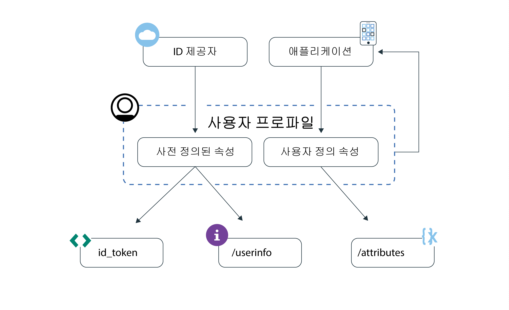

---

copyright:
  years: 2017, 2018
lastupdated: "2018-11-19"

---

{:new_window: target="_blank"}
{:shortdesc: .shortdesc}
{:pre: .pre}
{:tip: .tip}
{:screen: .screen}

# 사용자 프로파일 이해
{: #user-profile}

{{site.data.keyword.appid_full}}를 사용하면 {{site.data.keyword.appid_short_notm}}에서 저장되는 사용자에 대한 정보에 액세스하여 개인화된 앱 환경을 빌드할 수 있습니다.
{: shortdesc}

## 핵심 개념
{: #key-concepts}

**사용자 프로파일은 무엇입니까?**

사용자 프로파일은 {{site.data.keyword.appid_short_notm}}에서 저장된 속성의 콜렉션입니다. 속성은 앱과 상호작용하는 사용자에 대한 정보입니다. `사전 정의` 및 `사용자 정의`라는 두 가지 유형의 속성을 얻을 수 있습니다.

 

**사전 정의된 속성은 무엇입니까?**

사전 정의된 속성은 앱에 사인인할 때 ID 제공자에서 리턴됩니다. 이 속성에는 사용자 이름, 나이 또는 성별이 포함될 수 있습니다.

 

**사용자 정의 속성은 무엇입니까?**

사용자가 앱과 상호작용할 때 사용자에 대한 사용자 정의 속성이 알려집니다. 사용자 정의 속성은 사용자가 처음으로 앱에 사인인하기 전에 설정할 수도 있습니다. 예를 들면 선호하는 글꼴 크기 또는 장바구니에 담은 항목이 될 수 있습니다. 사용자 정의 속성을 편집할 수 있습니다. 기본값을 변경하기 전에 사용자가 해당 속성을 편집할 수 있도록 허용함으로써 발생할 수 있는 [보안 영향](custom-attributes.html)을 참조하십시오.

 
 

## 사용자 속성 액세스
{: #access}

[사전 정의](predefined.html) 및 [사용자 정의](custom-attributes.html) 속성에 액세스할 수 있는 여러 가지 방법이 있습니다. 사용자 인증이 정상적으로 완료되면 앱에서 액세스 및 ID 토큰을 받습니다. ID 토큰에는 ID 제공자가 리턴하는 사용자 속성의 정규화된 서브세트가 포함되어 있습니다. 사용자 속성에 대한 전체 목록을 가져오려는 경우 OIDC [`/userinfo` 엔드포인트](https://appid-oauth.ng.bluemix.net/swagger-ui/#!/Authorization_Server_V3/userInfo)를 사용할 수 있습니다. `REST API`를 사용하여 사용자 정의 속성을 관리할 수 있습니다. 사용자 정보 및 사용자 정의 속성 엔드포인트는 모두 인증 프로세스의 끝 부분에 {{site.data.keyword.appid_short_notm}}에서 생성되는 액세스 토큰으로 보호됩니다.

ID 및 액세스 토큰에 대한 자세한 정보는 [토큰에 대한 정보](/docs/services/appid/authorization.html#tokens) 또는 [토큰 유효성 검증](/docs/services/appid/tokens.html)을 참조하십시오.

그림. 사용자 프로파일 정보 플로우

<a href="https://appid-profiles.ng.bluemix.net/swagger-ui/index.html#/Attributes" target="_blank">REST API </a>를 사용하여 사용자 정의 속성을 볼 수 있습니다.

 
 
