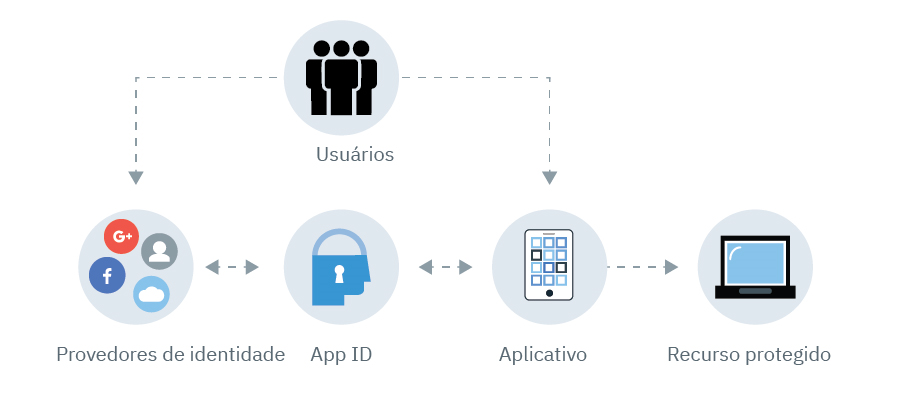

---

copyright:
  years: 2017, 2019
lastupdated: "2019-06-18"

keywords: Authentication, authorization, identity, app security, secure, compliance, high availability, ha, disaster recover, dr, protocols, oauth, oidc

subcollection: appid

---

{:external: target="_blank" .external}
{:shortdesc: .shortdesc}
{:screen: .screen}
{:pre: .pre}
{:table: .aria-labeledby="caption"}
{:codeblock: .codeblock}
{:tip: .tip}
{:note: .note}
{:important: .important}
{:deprecated: .deprecated}
{:download: .download}

# Sobre {{site.data.keyword.appid_short_notm}}
{: #about}

A segurança do aplicativo pode ser muito complicada. Para a maioria dos desenvolvedores, é uma das partes mais difíceis da criação de um app. Como você pode garantir que está protegendo as informações do usuário? Ao integrar o {{site.data.keyword.appid_full}} em seus apps, é possível proteger recursos e incluir autenticação, mesmo quando você não tem muita experiência em segurança.
{: shortdesc}

## Razões para usar o serviço
{: #about-reasons}

O {{site.data.keyword.appid_short_notm}} ajuda os desenvolvedores a incluir facilmente a autenticação nos aplicativos móveis e da web com poucas linhas de código e a proteger os aplicativos e os serviços nativos de nuvem no {{site.data.keyword.cloud_notm}}. Ao requerer que os usuários se conectem ao seu aplicativo, é possível armazenar os dados do usuário, como as preferências do aplicativo ou as informações de perfis sociais públicos e, então, aproveitar esses dados para customizar a experiência de cada usuário dentro do aplicativo. O {{site.data.keyword.appid_short_notm}} fornece uma estrutura de login para você, mas também é possível trazer suas próprias telas de marca para usar com o Cloud Directory.
{: shortdesc}

O que o Cloud Directory pode fazer por você? Consulte este vídeo para saber mais sobre as diferentes maneiras de usar o serviço e, em seguida, leia mais na tabela a seguir sobre outros cenários.

<iframe class="embed-responsive-item" id="about-appid" title="Sobre o {{site.data.keyword.appid_short_notm}}" type="text/html" width="640" height="390" src="//www.youtube.com/embed/XlrCjHdK43Q?rel=0" frameborder="0" webkitallowfullscreen mozallowfullscreen allowfullscreen> </iframe>

<table>
  <tr>
    <th>Cenário</th>
    <th>Solução</th>
  </tr>
  <tr>
    <td>É necessário incluir [autorização e autenticação](/docs/services/appid?topic=appid-key-concepts) em seus apps móveis e da web, mas não há um plano de fundo de segurança.</td>
    <td>O {{site.data.keyword.appid_short_notm}} facilita a inclusão de uma etapa de autenticação em seus apps. É possível incluir e-mail ou nome de usuário, conexão social ou corporativa em seus apps com APIs, SDKs, IUs pré-construídas ou suas próprias IUs com marca.</td>
  </tr>
  <tr>
    <td>Você deseja limitar o acesso aos seus apps e recursos de backend.</td>
    <td>É possível proteger seus apps, recursos de back-end e APIs facilmente usando a autenticação baseada em padrões fornecida pelo {{site.data.keyword.appid_short_notm}}.</td>
  </tr>
  <tr>
    <td>Você deseja construir experiências de app personalizadas para seus usuários.</td>
    <td>Com o {{site.data.keyword.appid_short_notm}}, é possível [armazenar dados do usuário](/docs/services/appid?topic=appid-profiles) como preferências de app ou informações de seus perfis sociais públicos e, em seguida, usar esses dados para customizar cada experiência de seu app.</td>
  </tr>
  <tr>
    <td>Você deseja gerenciar os usuários de uma maneira escalável.</td>
    <td> Com o {{site.data.keyword.appid_short_notm}}, é possível criar um [Cloud Directory](/docs/services/appid?topic=appid-cloud-directory), o que torna possível incluir a conexão do usuário e a conexão com seus apps. O Cloud Directory fornece a estrutura para manter um registro do usuário que pode escalar com a sua base de usuários. Com a funcionalidade pré-construída para autoatendimento, como verificação de e-mail e reconfigurações de senha, é possível ter certeza que seu app está autenticando usuários com segurança.</td>
  </tr>
</table>

## Como funciona
{: #about-how-it-works}

Com o {{site.data.keyword.appid_short_notm}}, é possível incluir um nível de segurança em seus apps requerendo que os usuários se conectem. Também é possível usar o SDK ou as APIs do servidor para proteger os recursos de backend.
{: shortdesc}

<dl>
  <dt>Aplicativo</dt>
    <dd><strong>SDK do servidor</strong>: é possível proteger seus recursos de backend que estão hospedados no {{site.data.keyword.cloud_notm}} e seus apps da web usando o SDK do servidor. Ele extrai o token de acesso de uma solicitação e valida-o com {{site.data.keyword.appid_short_notm}}. 
    <strong>SDK do cliente</strong>: é possível proteger seus apps móveis com o SDK do cliente Android ou iOS. O SDK cliente se comunica com seus recursos em nuvem para iniciar o processo de autenticação quando ele detecta um desafio de autorização.</dd>
  <dt>{{site.data.keyword.cloud_notm}}</dt>
    <dd><strong>{{site.data.keyword.appid_short_notm}}</strong>: Após autenticação bem-sucedida, {{site.data.keyword.appid_short_notm}}retorna o acesso e os tokens de identidade para seu app. 
    <strong>Cloud Directory</strong>: os usuários podem se inscrever para seu serviço com seu e-mail e uma senha. É possível, então, gerenciar seus usuários em uma visualização de lista por meio da UI. Com o Cloud Directory, o {{site.data.keyword.appid_short_notm}} funciona como seu provedor de identidade.</dd>
  <dt>Externo (terceiro)</dt>
    <dd><strong>Provedores de identidade social e corporativa</strong>: o {{site.data.keyword.appid_short_notm}} suporta o Facebook, o Google+ e a Federação SAML 2.0 como as opções de provedor de identidade. O serviço determina um redirecionamento para o provedor de identidade e verifica os tokens de autenticação retornados. Se os tokens forem válidos, o serviço concederá acesso a seu app sem ter acesso à passphrase real.</dd>
</dl>

## Integrações
{: #about-integrations}

É possível usar o {{site.data.keyword.appid_short_notm}} com outras ofertas do {{site.data.keyword.cloud_notm}}.
{:shortdesc}

<dl>
  <dt>{{site.data.keyword.containershort_notm}}</dt>
    <dd>Ao configurar o Ingress em um cluster padrão, é possível proteger seus aplicativos no nível do cluster. Confira a <a href="/docs/containers?topic=containers-ingress_annotation#appid-auth">anotação do Ingress de autenticação com o {{site.data.keyword.appid_short_notm}}</a> ou a postagem do blog <a href="https://www.ibm.com/cloud/blog/announcing-app-id-integration-ibm-cloud-kubernetes-service">Anunciando a integração do {{site.data.keyword.appid_short_notm}} ao {{site.data.keyword.containerlong_notm}} </a> para começar.</dd>
  <dt>{{site.data.keyword.openwhisk_short}} e {site.data.keyword.apiconnect_short}}</dt>
    <dd>Quando você cria suas APIs com o [{{site.data.keyword.openwhisk_short}}](/docs/openwhisk?topic=cloud-functions-getting-started) e o [API Connect](/docs/services/apiconnect?topic=apiconnect-getting-started), é possível proteger seus aplicativos no gateway em vez de em seu código de app. Para ver a integração em ação, veja <a href="https://www.youtube.com/watch?v=Fa9YD2NGZiE" target="_blank">Simple and fast social login OAuth with API Connect and {{site.data.keyword.appid_short_notm}} </a>.</dd>
  <dt>Cloud Foundry</dt>
    <dd>Experimente um dos nossos aplicativos de amostra do Cloud Foundry para ver como é possível integrar o
{{site.data.keyword.appid_short_notm}} em seus aplicativos.</dd>
  <dt>{{site.data.keyword.cloudaccesstrailshort}}</dt>
    <dd>É possível monitorar a atividade administrativa que é feita no {{site.data.keyword.appid_short_notm}}, como mudanças na configuração do painel, usando os [docs do {{site.data.keyword.cloudaccesstrailshort}}](/docs/services/cloud-activity-tracker?topic=cloud-activity-tracker-getting-started).</dd>
  <dt>Guia de Programação do iOS</dt>
    <dd>Você desenvolve apps para a Apple? Experimente o [guia de programação do iOS](/docs/swift?topic=swift-getting-started)para aprender, experimentar e aprimorar seus apps iOS existentes com o {{site.data.keyword.cloud_notm}}.</dd>
  <dt>Guia de programação do Node.js</dt>
    <dd>Você desenvolve apps em Node.js? Experimente o [Guia de programação do Node.js](/docs/node?topic=nodejs-getting-started) para aprender, experimentar e aprimorar os apps Node.js existentes com o {{site.data.keyword.cloud_notm}}.</dd>
</dl>

## Conformidade e normas
{: #about-compliance}

O {{site.data.keyword.appid_short_notm}} concluiu com êxito várias certificações, auditorias e normas. 
{: shortdesc}

O {{site.data.keyword.appid_short_notm}} é baseado em um conjunto de protocolos e especificações padrão do segmento de mercado bem conhecidos que são frequentemente localizados nos aplicativos voltados para a empresa e o consumidor, o OAuth 2.0 Authorization Framework e o Open ID Connect. O OAuth 2.0 é usado para obter e verificar a autorização para acessar recursos protegidos. Além disso, o Open ID Connect inclui uma camada de uma autenticação e proteção de identidade para seu aplicativo.

Consulte a seção 5.4 do relatório de compatibilidade do produto de software do {{site.data.keyword.appid_short_notm}} para revisar uma lista completa de [certificações](https://www.ibm.com/software/reports/compatibility/clarity-reports/report/html/softwareReqsForProduct?deliverableId=BF31C8008D7C11E59F9AD7336D7D0FFB){: external}. Além das certificações, o {{site.data.keyword.appid_short_notm}} também é compatível com as especificações a seguir: OAuth 2.0, OpenID Connect, JSON Web Token (JWT), JSON Web Signature (JWS), System for Cross-domain Identity Management (SCIM). 

## Alta disponibilidade regional
{: #ha-dr}

O {{site.data.keyword.appid_short_notm}} é um serviço regional altamente disponível que é executado em múltiplas zonas.
{: shortdesc}

Em cada região com múltiplas zonas suportada, cada zona tem seu próprio cluster do {{site.data.keyword.containerlong_notm}} com vários nós do trabalhador. Cada nó do trabalhador executa várias instâncias de componentes do {{site.data.keyword.appid_short_notm}}. Cada região é frontada por um balanceador de carga global e um firewall de aplicativo da web.

Os dados que são armazenados no {{site.data.keyword.appid_short_notm}} são criptografados e persistidos em um cluster de banco de dados que é distribuído entre zonas de disponibilidade. Os dados também passam por backup em um armazenamento de objeto criptografado separado.

Como o {{site.data.keyword.appid_short_notm}} é um serviço regional, ele não fornece failover regional cruzado automatizado ou recuperação de desastre regional cruzado. Entretanto, o {{site.data.keyword.appid_short_notm}} fornece uma [API extensiva](https://us-south.appid.cloud.ibm.com/swagger-ui/#/){: external} que desenvolvedores podem usar para sincronizar manualmente sua configuração de serviço com outra instância ou outras instâncias do {{site.data.keyword.appid_short_notm}}.

