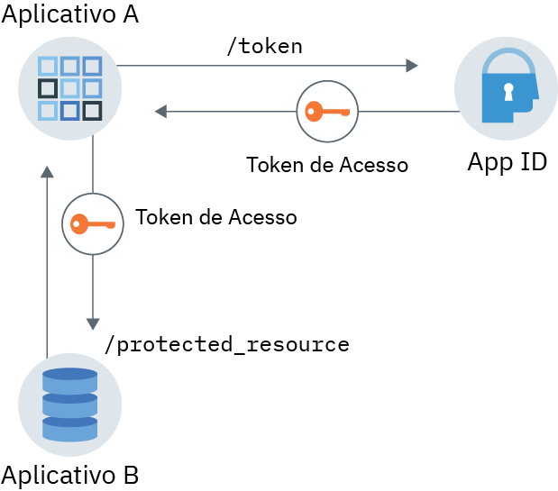

---

copyright:
  years: 2017, 2019
lastupdated: "2019-04-04"

keywords: authentication, authorization, identity, app security, secure, application identity, app to app, access token

subcollection: appid

---

{:new_window: target="_blank"}
{:shortdesc: .shortdesc}
{:screen: .screen}
{:pre: .pre}
{:table: .aria-labeledby="caption"}
{:codeblock: .codeblock}
{:tip: .tip}
{:note: .note}
{:important: .important}
{:deprecated: .deprecated}
{:download: .download}

# Identidade e autorização do aplicativo
{: #app}

Com o {{site.data.keyword.appid_short_notm}}, é possível proteger aplicativos usando o fluxo de identidade e
autorização do aplicativo aproveitando os recursos do OAuth2.0.
{: shortdesc}

## Entendendo o fluxo de comunicação
{: #app-understanding}

Há várias razões pelas quais você pode desejar que um aplicativo se comunique com outro serviço ou aplicativo sem nenhuma intervenção do usuário. Por exemplo, um aplicativo não interativo que precisa acessar outro aplicativo para executar seu trabalho. Isso pode incluir processos, CLIs, daemons ou um dispositivo IoT que monitora e relata variáveis de ambiente para um servidor de envio de dados. O
caso de uso específico é exclusivo para cada aplicativo, mas a coisa mais importante a ser lembrada é que as
solicitações são trocadas em nome do aplicativo, não em nome de um usuário final, e é o aplicativo que é autenticado e
autorizado.

Confira esse exemplo em <a href="https://www.ibm.com/blogs/bluemix/2018/02/using-app-id-secure-docker-kubernetes-applications/" target="_blank">Usando o {{site.data.keyword.appid_short_notm}} para proteger os aplicativos do Docker e do Kubernetes </a>.

### Como o fluxo funciona?
{: #app-flow-how}

O {{site.data.keyword.appid_short_notm}} aproveita o fluxo de credenciais do cliente OAuth2.0 para
proteger a comunicação. Depois que um aplicativo é registrado com o {{site.data.keyword.appid_short_notm}}, ele obtém um identificador de cliente e um segredo. Com
essas informações, o aplicativo pode solicitar um token de acesso por meio do
{{site.data.keyword.appid_short_notm}} e ser autorizado a acessar uma API ou um recurso protegido. No
fluxo de identidade e autorização do aplicativo, apenas um token de acesso é fornecido ao aplicativo. Ele não obtém um token de identidade ou um token de atualização. Para
obter mais informações sobre tokens, consulte [Entendendo os tokens](/docs/services/appid?topic=appid-tokens#tokens).

Esse fluxo de trabalho é destinado a ser usado apenas com aplicativos confiáveis em que não há risco de o segredo ser
usado indevidamente ou vazado. O aplicativo sempre mantém o segredo do cliente. Ele não funcionará para aplicativos móveis.
{: tip}

### Qual é a aparência desse fluxo?
{: #app-flow-what}

Na imagem a seguir, é possível ver a direção da comunicação entre o serviço e seu aplicativo.


Figura. Fluxo de autorização e identidade de aplicativo

1. O aplicativo A é registrado com o {{site.data.keyword.appid_short_notm}} para obter um identificador de cliente e um segredo.
2. O aplicativo A faz uma solicitação para o {{site.data.keyword.appid_short_notm}} enviando as credenciais recuperadas na etapa anterior.
3. O {{site.data.keyword.appid_short_notm}} valida a solicitação, autentica o aplicativo e retorna uma resposta ao Aplicativo A que contém um token de acesso.
4. O aplicativo A agora é capaz de usar o token de acesso para enviar solicitações ao Aplicativo B, tal como um recurso
protegido.

## Registrando seu aplicativo
{: #app-register}

### Com a GUI
{: #app-register-gui}

1. Na guia **Aplicativo** do painel do {{site.data.keyword.appid_short_notm}}, clique em **Incluir aplicativo**.
2. Inclua o nome do aplicativo e clique em **Salvar** para retornar a uma lista de seus aplicativos registrados. O nome de seu aplicativo não pode exceder 50 caracteres.
3. Na lista de apps registrados, selecione o aplicativo que você incluiu na etapa anterior. A linha se expande para mostrar suas credenciais.

### Com a API
{: #app-register-api}

1. Faça uma solicitação de POST para o terminal [`/management/v4/{tenantId}/applications`](https://us-south.appid.cloud.ibm.com/swagger-ui/#/Management%20API%20-%20Applications/mgmt.registerApplication).

  Solicitação:

  ```
  curl -X POST \  https://us-south.appid.cloud.ibm.com/management/v4/39a37f57-a227-4bfe-a044-93b6e6060b61/applications/ \
  -H 'Content-Type: application/json' \
  -H 'Authorization: Bearer IAM_TOKEN' \
  -d '{"name": "ApplicationName"}'
  ```
  {: pre}

  Resposta de exemplo:

  ```
  {
    "clientId": "c90830bf-11b0-4b44-bffe-9773f8703bad",
    "tenantId": "b42f7429-fc24-48fa-b4f9-616bcc31cfd5",
    "secret": "YWQyNjdkZjMtMGRhZC00ZWRkLThiOTQtN2E3ODEyZjhkOWQz",
    "name": "testing",
    "oAuthServerUrl": "https://us-south.appid.cloud.ibm.com/oauth/v4/b42f7429-fc24-48fa-b4f9-616bcb31cfd5",
    "profilesUrl": "https://us-south.appid.cloud.ibm.com",
    "discoveryEndpoint": "https://us-south.appid.cloud.ibm.com/oauth/v4/b42f7429-fc24-48fa-b4f9-616bcb31cfd5/.well-known/openid-configuration"
  }
  ```
  {: screen}

## Obtendo um token de acesso
{: #obtain-token}

Após o seu aplicativo ser registrado com o {{site.data.keyword.appid_short_notm}} e você obter suas credenciais,
será possível fazer uma solicitação para o servidor de autorizações {{site.data.keyword.appid_short_notm}} para obter um token de acesso.

1. Faça uma solicitação de HTTP POST para o terminal [`/token`](https://us-south.appid.cloud.ibm.com/swagger-ui/#/Authorization%20Server%20-%20Authorization%20Server%20V4/oauth-server.token). A
autorização para a solicitação é `Basic auth` com o identificador de cliente e o segredo sendo usado
como o nome de usuário e a senha que são codificados em Base64.

  Solicitação:
  ```
  curl -X POST \
    http://localhost:6002/oauth/v4/39a37f57-a227-4bfe-a044-93b6e6060b61/token \
    -H 'Authorization: Basic base64Encoded{clientId:secret}' \
    -H 'Content-Type: application/x-www-form-urlencoded' \
    -d grant_type=client_credentials
  ```
  {: pre}

  Resposta de exemplo:
  ```
  {
  "access_token": "eyJhbGciOiJS...F9A",
  "expires_in": "3600",
  "token_type": "Bearer"
  }
  ```
  {: pre}


## Tutorial: fluxo de ponta a ponta com o SDK Node.js
{: tutorial-node}

1. Obtenha um [token de acesso](/docs/services/appid?topic=appid-tokens#tokens) de uma das seguintes maneiras:

  * Por meio do [SDK do servidor Node.js](https://github.com/ibm-cloud-security/appid-serversdk-nodejs) do {{site.data.keyword.appid_short_notm}} usando o gerenciador de token. Inicialize o gerenciador de token com suas credenciais de aplicativo e faça uma chamada para o método `getApplicationIdentityToken()` para obter o token.

    ```
    const TokenManager = require('ibmcloud-appid').TokenManager;
    const config = {
     clientId: "29a19759-aafb-41c7-9ef7-ee7b0ca88818",
     tenantId: "39a37f57-a227-4bfe-a044-93b6e6060b61",
     secret: "ZTEzZTA2MDAtMjljZS00MWNlLTk5NTktZDliMjY3YzUxZTYx",
     oauthServerUrl: "https://eu-gb.appid.cloud.ibm.com/oauth/v4/39a37f57-a227-4bfe-a044-93b6e6060b61"
    };

    const tokenManager = new TokenManager(config);

    tokenManager.getApplicationIdentityToken().then((appIdAuthContext) => {
     console.log(' Access tokens from SDK : ' + JSON.stringify(appIdAuthContext));
    }).catch((err) => {
     //console.error('Error retrieving tokens : ' + err);
    });
    ```
    {: pre}

  * Por meio do servidor de autorizações do {{site.data.keyword.appid_short_notm}}.
  
    O `oauthServerUrl` na solicitação é obtido quando você registra seu aplicativo. Se você registrou seu aplicativo com as APIs de gerenciamento, a URL do servidor estará no corpo de resposta. Se
você registrou seu aplicativo ligando-o ao console do IBM Cloud, a URL poderá ser localizada em seu objeto JSON VCAP_SERVICES ou por meio de seus segredos do Kubernetes.
    {: note}

    ```
    var request = require('request');

    function getAccessToken() {
      let options = {
          method: 'POST',
          url: oauthServerUrl + '/token',
          headers: { 'content-type': 'application/x-www-form-urlencoded',
              'Authorization': 'Basic ' +Buffer.from('clientId: secret').toString('base64')
          },
          form: {
              grant_type: 'client_credentials'
          }
      };

      return new Promise((resolve, reject) => {
          request(options, function (error, response, body) {
              if (error) {
                  return reject(error);
              }

              let data = JSON.parse(body);
              if(data.access_token) {
                  resolve(data.access_token);
              } else {
                  reject(data);
              }
          })
      });
    }
    ```
    {: pre}

2. Faça uma solicitação para seu recurso protegido usando o token de acesso obtido na etapa anterior.

  ```
  let options = {
      method: 'GET',
      url: 'http://localhost:8081/protected_resource',
      headers: { authorization : 'Bearer ' + accessToken}
  }

  request(options, function (error, response, body) {
      if (error) {
       console.log(error)
      } else {
          res.status(response.statusCode).send({
      console.log(JSON.stringify(body));
          });
      }
  });
  ```
  {: pre}

3. Faça com que seus recursos protegidos fiquem seguros usando a estratégia de API por meio do SDK do Node.js do {{site.data.keyword.appid_short_notm}}.

  ```
  const express = require('express'),
    passport = require('passport');

  var app = express();
app.use(passport.initialize());

  passport.use(new APIStrategy({
      oauthServerUrl: "https://us-south.appid.cloud.ibm.com/oauth/v4/398ec248-5e93-48b8-a122-ccabc714fe85",
      tenantId:"398ec248-5e93-48b8-a122-ccabc714fe85"
  }));

  app.get('/protected_resource',
      passport.authenticate(APIStrategy.STRATEGY_NAME, {session: false}),
      (req, res) => {
          res.send("Hello from protected resource");
  });
  ```
  {: pre}
