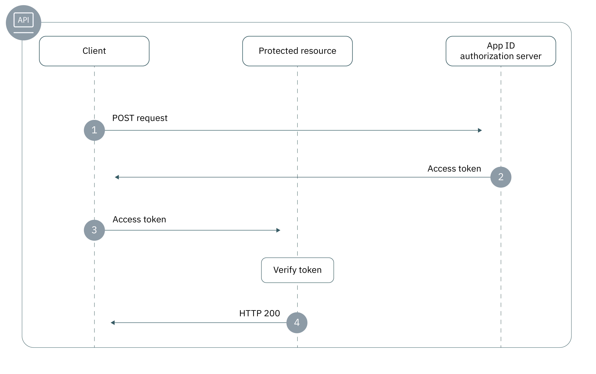

---

copyright:
  years: 2017, 2019
lastupdated: "2019-04-10"

keywords: authentication, authorization, identity, app security, secure, backend, back-end, oauth, 

subcollection: appid

---

{:new_window: target="_blank"}
{:shortdesc: .shortdesc}
{:screen: .screen}
{:pre: .pre}
{:table: .aria-labeledby="caption"}
{:codeblock: .codeblock}
{:tip: .tip}
{:note: .note}
{:important: .important}
{:deprecated: .deprecated}
{:download: .download}
{:java: .ph data-hd-programlang='java'}
{:javascript: .ph data-hd-programlang='javascript'}
{:swift: .ph data-hd-programlang='swift'}
{:curl: .ph data-hd-programlang='curl'}

# Apps de back-end
{: #backend}

É possível usar os SDKs e APIs do {{site.data.keyword.appid_full}} para proteger seus terminais e APIs de aplicativo de back-end.
{: shortdesc}


## Entendendo o fluxo
{: #backend-understanding}

Parte do desenvolvimento de apps de back-end é verificar se suas APIs estão protegidas contra acesso desautorizado. Os SDKs do {{site.data.keyword.appid_short_notm}} facilitam a proteção de seus terminais de API e garantem a segurança de seu aplicativo.


### Qual é a base técnica do fluxo?
{: #backend-technical-flow}

O {{site.data.keyword.appid_short_notm}} implementa o [OAuth 2.0](https://tools.ietf.org/html/rfc6749) e a especificação OIDC, que usa tokens de acesso para autenticação e autorização. Esses
tokens são formatados como [JSON Web Tokens](https://tools.ietf.org/html/rfc7519), que são assinados
digitalmente e contêm solicitações que descrevem o assunto que está sendo autenticado e o provedor de
identidade. As APIs de seu aplicativo são protegidas pelos tokens de acesso e de identidade. Clientes que precisam de
acesso às suas APIs podem se autenticar com o provedor de identidade por meio do {{site.data.keyword.appid_short_notm}} em troca desses tokens. As
solicitações nos tokens devem ser validadas para conceder acesso às APIs protegidas.

Para obter mais informações sobre como os tokens são usados no {{site.data.keyword.appid_short_notm}}, consulte [Entendendo os tokens](/docs/services/appid?topic=appid-tokens#tokens).
{: tip}


### Qual é a aparência desse fluxo?
{: #backend-flow}



1. Um cliente faz uma solicitação de POST para o servidor de autorizações do {{site.data.keyword.appid_short_notm}} para obter um token de acesso. Uma solicitação de POST geralmente tem o seguinte formato:

  ```
  POST/oauth/v4/{tenantId}/token HTTP/1.1
  Content_type: application/x-www-form-urlencoded
  Authorization header = "Basic" + base64encode({clientId}:{secret})
  FormData = {grant_type}
  ```
  {: screen}

2. Se o cliente atender às qualificações, o servidor de autorizações retornará um token de acesso.

3. O cliente envia uma solicitação para o recurso protegido. As solicitações podem ser enviadas de várias maneiras, dependendo de qual biblioteca do cliente HTTP você está usando, mas uma solicitação geralmente tem o formato a seguir:

  ```
  curl -H 'Authorization: Bearer {access_token}' {https://my-protected-resource.com}
  ```
  {: screen}

4. O recurso protegido ou a API valida o token. Se o token for válido, o acesso ao recurso será concedido para o cliente. Se o token não puder ser validado, o acesso será negado.


## Protegendo recursos usando um SDK
{: #backend-secure}

É possível usar os SDKs do {{site.data.keyword.appid_short_notm}} para impor a autenticação e a autorização para os aplicativos do lado do servidor. O `ApiStrategy` funciona para proteger os recursos de back-end requerendo que os tokens de acesso e de identidade sejam validados como parte da solicitação.
{: shortdesc}

O SDK Node.js do {{site.data.keyword.appid_short_notm}} funciona em conjunto com a estrutura do [Passaport](http://www.passportjs.org/).
{: ph data-hd-programlang='javascript'}

O {{site.data.keyword.appid_short_notm}}servidor Swift do lado do servidor fornece um plug-in de middleware de proteção de API que é usado para proteger seus aplicativos de backend. Associando suas APIs com o middleware, é possível proteger seu app de acesso desautorizado. Após a API ser protegida, o middleware assegura que os tokens gerados pelo {{site.data.keyword.appid_short_notm}} sejam validados. Em seguida, é possível modificar o comportamento da API dependendo dos resultados da validação.
{: ph data-hd-programlang='swift'}

Veja o fragmento de código a seguir para um exemplo de como proteger a API `/protectedendpoint`.
{: ph data-hd-programlang='swift'}

```Swift
import Foundation
import Kitura              // server
import Credentials         // middleware
import IBMCloudAppID       // SDK

// setup routes
let router = Router()

// mandatory option to be passed in if app not deployed on IBM Cloud
let options = [
    "oauthServerUrl": "https://us-south.appid.cloud.ibm.com/oauth/v4/d8438de6-c325-4956-ad34-abd49194affd",
]
let apiCreds = Credentials()

// Minimum macOS version required
if #available(OSX 10.12, *) {

    // setup API protection
    let apiKituraCredentialsPlugin = APIKituraCredentialsPlugin(options: options)
    apiCreds.register(plugin: apiKituraCredentialsPlugin)

    // associate route with API protection
    router.all(middleware: apiCreds)

    // create protected API
    router.get("/protectedendpoint") { request, response, next in

        response.headers["Content-Type"] = "text/html; charset=utf-8"
        do {
            if let userProfile = request.userProfile  {
                try response.status(.OK).send(
                    "<!DOCTYPE html><html><body>" +
                        "Welcome " + userProfile.displayName  +
                        "! You are logged in with " + userProfile.provider + "." +
                    "</body></html>\n\n").end()
                next()
                return
            }
            try response.status(.unauthorized).send(
                "<!DOCTYPE html><html><body>” + “You are not authorized!" +
                "</body></html>\n\n").end()
        }
        catch {}
        next()
    }

    // Start server
    Kitura.addHTTPServer(onPort: 8090, with: router)

    Kitura.run()  
}
```
{: pre}
{: ph data-hd-programlang='swift'}


### Antes de iniciar
{: #backend-secure-before}
{: ph data-hd-programlang='javascript'}

Antes de iniciar, deve-se ter os pré-requisitos a seguir.
{: ph data-hd-programlang='javascript'}
  * Uma instância do {{site.data.keyword.appid_short_notm}}
  * NPM versão 4 ou superior
  * Node versão 6 ou superior
  {: ph data-hd-programlang='javascript'}

### Instalando o SDK
{: #backend-secure-install}
{: ph data-hd-programlang='javascript'}

1. Inclua o SDK do Node.js do {{site.data.keyword.appid_short_notm}} no arquivo `package.json` do aplicativo.
{: ph data-hd-programlang='javascript'}
  ```
  "dependencies": {
      "ibmcloud-appid": "^6.0.0"
  }
  ```
  {: pre}
  {: ph data-hd-programlang='javascript'}

2. Execute o comando a seguir.
{: ph data-hd-programlang='javascript'}

  ```
  npm install
  ```
  {: pre}
  {: ph data-hd-programlang='javascript'}

### Inicializando o SDK
{: #backend-secure-initialize}
{: ph data-hd-programlang='javascript'}

1. Obtenha o seu `oauth server url`.
  1. Navegue para a guia **Credenciais de serviço** do painel do {{site.data.keyword.appid_short_notm}}.
  2. Se você ainda não tiver um conjunto de credenciais, clique em **Nova credencial** e, em seguida, clique em **Incluir** para criar um novo conjunto. Se
você fizer isso, ignore essa etapa.
  3. Clique na alternância **Visualizar credenciais** para ver suas informações.
  4. Copie o seu `oauth server url` para usar na próxima etapa.
  {: ph data-hd-programlang='javascript'}

2. Inicialize a estratégia de passaporte do {{site.data.keyword.appid_short_notm}}, conforme mostrado no exemplo a seguir.
{: ph data-hd-programlang='javascript'}
  ```javascript
  var express = require('express'); 
  var passport = require('passport');
  var APIStrategy = require('ibmcloud-appid').APIStrategy; 
  passport.use(new APIStrategy({ oauthServerUrl: "{oauth-server-url}" })); 
  var app = express();
  app.use(passport.initialize());
  ```
  {: pre}
  {: ph data-hd-programlang='javascript'}


Se o aplicativo Node.js for executado no {{site.data.keyword.cloud_notm}} e estiver ligado à sua instância do {{site.data.keyword.appid_short_notm}}, não será necessário fornecer a configuração de estratégia da API. A configuração {{site.data.keyword.appid_short_notm}} obtém as informações usando a variável de ambiente VCAP_SERVICES.
{: tip}
{: ph data-hd-programlang='javascript'}


### Protegendo a API
{: #backend-secure-api-strategy}
{: ph data-hd-programlang='javascript'}

O fragmento a seguir demonstra como usar o `ApiStrategy` em um aplicativo Express para proteger a API GET `/protected`.
{: ph data-hd-programlang='javascript'}

  ```javascript
   app.get('/protected', passport.authenticate('APIStrategy.STRATEGY_NAME', { session: false }), function(request, response){
      console.log("Security context", request.appIdAuthorizationContext);
      response.send(200, "Success!");
      }
   );
   ```
  {: pre}
  {: ph data-hd-programlang='javascript'}

Quando os tokens são válidos, o próximo middleware na cadeia de solicitação é chamado e a propriedade `appIdAuthorizationContext` é incluída no objeto de solicitação. A propriedade contém os tokens de acesso e de identidade originais e as informações de carga útil decodificadas dos tokens.
{: ph data-hd-programlang='javascript'}


## Protegendo recursos manualmente
{: #backend-secure-api}

Para assegurar seus apps de back-end e os recursos protegidos, é necessário validar um token. Quando um cliente envia uma solicitação para seu recurso, é possível verificar se o token atende às especificações definidas. O token pode incluir a identificação de informações, o escopo ou qualquer outra configuração que você tenha estabelecida. É possível validar os
tokens de identidade e de acesso do {{site.data.keyword.appid_short_notm}} de várias maneiras. Para obter ajuda, efetue o registro de saída de [Validação de tokens](/docs/services/appid?topic=appid-token-validation#token-validation).


## Próximas Etapas
{: #backend-next}

Com o {{site.data.keyword.appid_short_notm}} instalado em seu aplicativo, você está quase pronto para começar a autenticar os usuários! Tente executar uma das atividades a seguir em seguida:

* Configure os seus [provedores de identidade](/docs/services/appid?topic=appid-social)
* Customize e configure [o Widget de login](/docs/services/appid?topic=appid-login-widget)
* Saiba mais sobre o <a href="https://github.com/ibm-cloud-security/appid-serversdk-nodejs" target="_blank">SDK do Node.js</a>
* Saiba mais sobre o <a href="https://github.com/ibm-cloud-security/appid-serversdk-swift" target="_blank">SDK do Swift</a>
