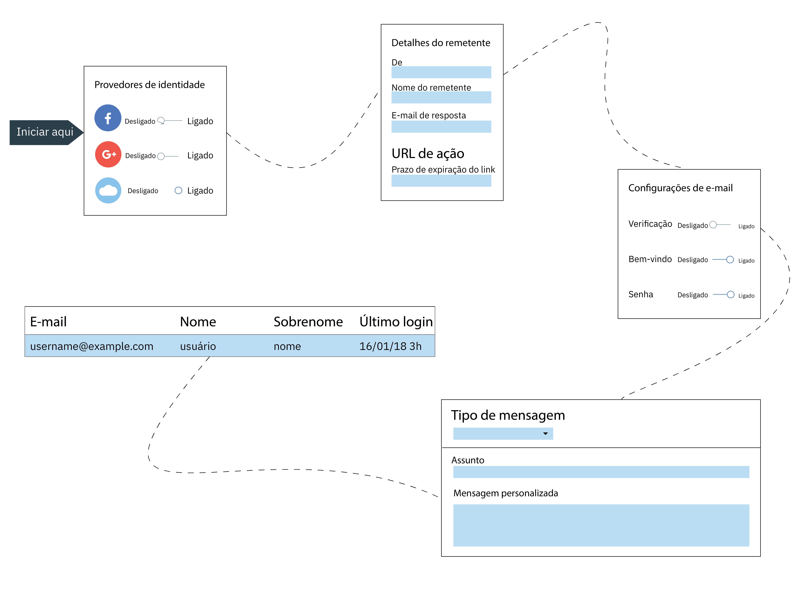

---

copyright:
  years: 2017, 2019
lastupdated: "2019-04-04"

keywords: authentication, authorization, identity, app security, secure, directory, registry, passwords, languages, lockout

subcollection: appid

---

{:new_window: target="_blank"}
{:shortdesc: .shortdesc}
{:screen: .screen}
{:pre: .pre}
{:table: .aria-labeledby="caption"}
{:codeblock: .codeblock}
{:tip: .tip}
{:note: .note}
{:important: .important}
{:deprecated: .deprecated}
{:download: .download}

# Configurando o Cloud Directory
{: #cloud-directory}

Com o {{site.data.keyword.appid_full}}, os usuários podem se inscrever e se conectar em seus
aplicativos móveis e da web usando um e-mail ou nome de usuário e uma senha. Um diretório da nuvem é um registro do usuário mantido na nuvem. Quando um usuário se inscreve no aplicativo, ele é incluído no seu diretório de usuários. Com esse recurso, os usuários têm a liberdade de gerenciar suas próprias contas dentro de seus apps.
{: shortdesc}

## Gerenciando configurações de diretório
{: #cd-settings}

É possível configurar as notificações e o nível de controle do usuário para seu app. A configuração do Cloud Directory pode ser feita rapidamente, conforme mostrado na imagem a seguir. Essas configurações podem ser atualizadas a qualquer momento a partir do painel de serviço e são refletidas em seu aplicativo sem qualquer mudança de código necessária.
{: shortdesc}

Figura. A jornada de configuração para o Cloud Directory

1. Navegue para a guia **Gerenciar autenticações** do painel do {{site.data.keyword.appid_short_notm}} e certifique-se de que o Cloud Directory esteja configurado como **Ativado**.

2. Na guia **Cloud Directory > Configurações**, configure **Permitir que os usuários se inscrevem e se conectem** para **E-mail e senha** ou **Nome do usuário e senha**. Os usuários podem se conectar com um e-mail que eles já têm ou criar um nome de usuário para usar ao interagir com seu aplicativo.

  É possível alternar entre as opções antes que os usuários sejam incluídos em seu diretório. Depois que o primeiro usuário for incluído, os usuários futuros também deverão usar a mesma configuração.
  {: note}

2. Decida se deseja que seus usuários criem um nome de usuário ou usem o e-mail ao se conectarem. Ambas as opções requerem uma senha. Depois que os usuários são incluídos em seu diretório, não é mais possível alternar entre as opções.

3. Clique em **Editar** na linha de critérios de senha para especificar quaisquer requisitos que você
deseja estabelecer. Os critérios de senha são fornecidos como expressão regular. Para ajudar a determinar a
força ou ver exemplos comuns, consulte [Gerenciando a força da senha](/docs/services/appid?topic=appid-cd-strength#cd-strength). Clique em **Salvar** para colocar seus requisitos em ação.

4. Configure **Permitir que os usuários se inscrevam em seu aplicativo** como **Sim**. Ainda é possível incluir usuários por meio do console se ele estiver configurado como **Não**. No entanto, é mais comum incluir usuários por meio do console para propósitos de desenvolvimento apenas.

5. Configure **Permitir que os usuários gerenciem suas contas por meio do aplicativo** para
**Sim** se você desejar que os usuários possam reconfigurar a senha, mudar a senha ou
reconfigurar os detalhes. Se você desejar limitar a capacidade de autoatendimento de seu usuário, configure o valor para **Não**.

6. Defina suas configurações de e-mail. Clique em **Editar** na linha **Detalhes do remetente** para atualizar suas
configurações de e-mail. As
configurações de e-mail se aplicam a todas as comunicações que são enviadas por meio do {{site.data.keyword.appid_short_notm}}.

    1. Especifique o endereço de e-mail que deve enviar o e-mail. Se você optar por mudar o padrão, o e-mail poderá ser enviado para a pasta de spam de um usuário.

    2. Inclua um nome para o remetente.

    3. Insira um e-mail que possa ser usado para enviar uma resposta.

    4. Clique em **Salvar**.
