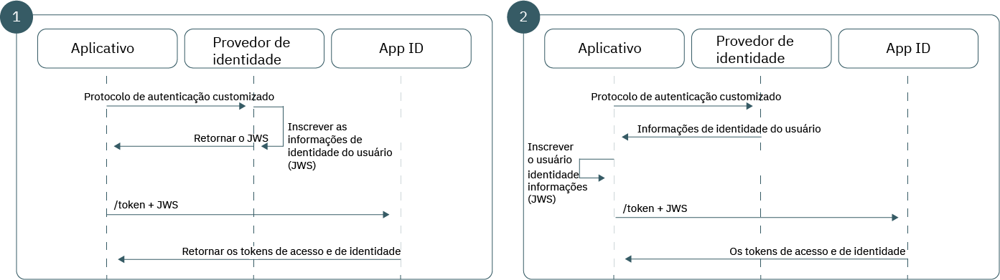

---

copyright:
  years: 2017, 2018
lastupdated: "2018-11-19"

---

{:new_window: target="_blank"}
{:shortdesc: .shortdesc}
{:pre: .pre}
{:tip: .tip}
{:screen: .screen}
{:codeblock: .codeblock}

# Usando identidade customizada em seu aplicativo
{: #custom-identity}

É possível usar seu próprio provedor de identidade customizado quando você está se autenticando. Seu provedor de identidade
pode estar em conformidade com qualquer mecanismo de autenticação alternativo àqueles suportados pelo
{{site.data.keyword.appid_full}}, incluindo proprietário ou anterior.
{: shortdesc}

## Visão geral
{: #overview}

Ao trazer seu próprio provedor de identidade, é possível criar um fluxo de autenticação customizado que usa seus
próprios protocolos. Você tem mais controle, como as informações que você deseja compartilhar ou as informações que estão
armazenadas.
{: shortdesc}

Certifique-se de [configurar seu provedor customizado](/docs/services/appid/custom.html) antes de
incluí-lo em seu aplicativo.
{: tip}

</br>

**Quando eu desejaria usar esse fluxo?**

Quando o {{site.data.keyword.appid_short_notm}} não fornece suporte direto para um provedor de identidade específico, é possível usar o fluxo de identidade customizado para fazer ponte com o protocolo de autenticação para o fluxo de autenticação existente do {{site.data.keyword.appid_short_notm}}. Por exemplo, você deseja usar GitHub ou LinkedIn para permitir que os seus usuários se conectem. É possível usar o SDK existente do provedor de identidade para facilitar as informações sobre autenticação do usuário antes de empacotar e trocando-o pelo {{site.data.keyword.appid_short_notm}}.

Há muitos cenários em que um fluxo de autenticação diferente é necessário:

 - Provedores de identidade proprietários internos 
 - Provedores de identidade de terceiro 
 - Fluxos de autenticação complicados que podem incluir mecanismos de diversos fatores proprietários 

Ocasionalmente, um provedor anterior pode usar seu próprio protocolo de autenticação customizado. Como o fluxo de
identidade customizado desacopla completamente a autenticação da autorização, é possível adotar qualquer mecanismo de
autenticação de sua escolha e, em seguida, fornecer as informações de autenticação resultantes para o {{site.data.keyword.appid_short_notm}}. Tudo
sem expor as credenciais do usuário.

</br>

**Qual é a sustentação técnica desse fluxo?**

O fluxo de trabalho de identidade customizada baseia-se no tipo de concessão de extensão JWT-Bearer definido na
Estrutura de asserção para concessões de autorização do OAuth 2.0
[[RFC7521]](https://tools.ietf.org/html/rfc7523#section-2.1). Para trocar informações sobre o usuário para os tokens do {{site.data.keyword.appid_short_notm}}, sua
arquitetura de autenticação cria um relacionamento confiável com o {{site.data.keyword.appid_short_notm}},
usando um par de chaves RSA assimétricas. Depois
que a confiança estiver estabelecida, será possível usar o tipo de concessão JWT-Bearer para trocar informações sobre o usuário verificadas em um JWT assinado para os tokens do {{site.data.keyword.appid_short_notm}}.

</br>

**Qual é o aspecto do fluxo?**

Como com todos os fluxos de autenticação, a identidade customizada requer que o aplicativo possa estabelecer um grau de
confiança com o {{site.data.keyword.appid_short_notm}} para assegurar a integridade das informações sobre o
usuário do provedor de identidade. A identidade customizada emprega um par de chaves pública e privada RSA assimétricas para
estabelecer seu relacionamento confiável. Dependendo de seus requisitos arquiteturais, a identidade customizada suporta
dois modelos de confiança que diferem apenas na localização de armazenamento e no uso da chave privada.



Figura. A solicitação flui para a autenticação customizada

<dl>
  <dt>1. Provedor de identidade assinado</dt>
    <dd>Assim como com os fluxos tradicionais do OAuth 2.0, o modelo de confiança mais seguro cria um relacionamento entre o
provedor de identidade e o servidor de autorizações; neste caso, o {{site.data.keyword.appid_short_notm}})
diretamente. Sob esse modelo, seu provedor de identidade é responsável por armazenar a chave privada e assinar as asserções
JWT. Quando transmitidas para o {{site.data.keyword.appid_short_notm}}, essas asserções são validadas com a chave
pública correspondente, o que assegura que as informações sobre o usuário de seu provedor de identidade não tenham sido
alteradas de forma maliciosa durante o transporte.</dd>
  <dt>2. Aplicativo assinado</dt>
    <dd>Como alternativa, é possível basear seu modelo de confiança no relacionamento entre seu aplicativo e o {{site.data.keyword.appid_short_notm}}. Nesse fluxo de trabalho, sua chave privada é armazenada em seu aplicativo do lado do servidor. Após uma autenticação
bem-sucedida, seu aplicativo é responsável por converter a resposta dos provedores de identidade em um JWT e assiná-la
com sua chave privada antes que o aplicativo envie o token para o {{site.data.keyword.appid_short_notm}}. Como esse provedor de
identidade não tem nenhum relacionamento com o {{site.data.keyword.appid_short_notm}}, essa arquitetura cria um
modelo de confiança mais fraco. Embora o {{site.data.keyword.appid_short_notm}} possa confiar nas informações
que são enviadas pelo aplicativo do lado do servidor, não é possível ter certeza de que os dados foram os originais
enviados pelo provedor de identidade.</dd>
</dl>

</br>

## Gerando um JSON web token
{: #creating-jwts}

É possível converter os dados do usuário verificados em um JWT de identidade customizado gerando um
<a href="https://tools.ietf.org/html/rfc7515" target="blank">JSON web token
</a>. O token deve ser assinado com a chave privada
que corresponde à chave pública pré-configurada. Para obter uma lista de bibliotecas de assinatura de token, consulte <a href="https://jwt.io/" target="blank">jwt.io
</a>.
{: shortdesc}

### Exemplo de formato JWT

Cabeçalho do token:
  ```
  {
  "alg": "RS256",
  "typ": "JOSE"
  }
  ```
  {: screen}

Carga útil do token:
  ```
  {
    // Required
    iss: String, // Should reference your identity provider
    aud: String, // Must be the OAuth server host name
    exp: Int,    // Should be a value with a short lifespan
    sub: String, // Must be the unique user ID provided by your identity provider

    // Normalized claims (optional)
    name: String
    email: String
    locale: String
    picture: String
    gender: String

    // Custom Scopes to add to access token (optional)
    scope="custom_scope1 custom_scope2"

    // Other custom claims (optional)
    role="admin"
  }
  ```
  {: screen}

  <table>
  <thead>
    <th colspan=2> Campos do JWS</th>
  </thead>
  <tbody>
    <tr>
      <td><code> iss </code></td>
      <td>Deve conter uma referência ao seu provedor de identidade.</td>
    </tr>
    <tr>
      <td><code> aud </code></td>
      <td>O host do servidor OAuth.</td>
    </tr>
    <tr>
      <td><code> exp </code></td>
      <td>A duração de tempo em que o token é válido. Por razões de segurança, ele deve ter um curto período de vida e ser
específico.</td>
    </tr>
    <tr>
      <td><code> sub </code></td>
      <td>O ID do usuário exclusivo que é fornecido pelo provedor de identidade.</td>
    </tr>
    <tr>
      <td>Solicitações normalizadas</td>
      <td>Todas as [solicitações normalizadas](/docs/services/appid/authorization.html#tokens) são fornecidas no token de identidade que é retornado em resposta a essa solicitação. Mais
solicitações customizadas podem ser localizadas usando o
[terminal de informações sobre o usuário](/docs/services/appid/custom-attributes.html).</td>
    </tr>
    <tr>
      <td>Escopo</td>
      <td>Por padrão, todos os tokens do {{site.data.keyword.appid_short_notm}} contêm um grupo de escopos
pré-configurados. É possível solicitar escopos extras, executando um dos seguintes procedimentos:<ul><li> Especifique o escopo
no campo de escopo de seu token JWS.</li> <li>Especifique o escopo por meio do parâmetro de escopos de formulário da URL da
solicitação `/token`.</li></ul></td>
    </tr>
  </tbody>
  </table>

## Recuperando os tokens do {{site.data.keyword.appid_short_notm}}
{: #exchanging-jwts}

Para criar a ponte entre o provedor customizado e o {{site.data.keyword.appid_short_notm}}, é necessário ter
tokens do {{site.data.keyword.appid_short_notm}}. Para obter os tokens de serviço, troque suas informações sobre
o usuário verificadas usando o [terminal `/token`](https://appid-oauth.ng.bluemix.net/swagger-ui/#!/Authorization_Server_V3/token).
{: shortdesc}

  ```
  Post /token
  Content-Type: application/x-www-from-urlencoded
  grant_type=urn:ietf:params:oauth:grant-type:jwt-bearer
  assertion=<payload>
  scope="<space separated scope array>"
  ```
  {: codeblock}
  <table>
    <thead>
      <th colspan=2> Construção de solicitação</th>
    </thead>
    <tbody>
      <tr>
        <td>Tipo de conteúdo</td>
        <td><code>applications/x-www-from-urlencoded</code></td>
      </tr>
      <tr>
        <td>grant_type</td>
        <td><code>urn:ietf:params:oauth:grant-type:jwt-bearer</code></td>
      </tr>
      <tr>
        <td>asserção</td>
        <td>Uma sequência de carga útil JWS.</td>
      </tr>
      <tr>
        <td>escopo</td>
        <td>Uma lista separada por espaços em branco de seus escopos customizados.</td>
      </tr>
    </tbody>
  </table>
